

# 🧰 شناسنامه و مستندات جامع سخت‌افزارهای آزمایشگاه آردوینو و الکترونیک

> **مرجع جامع مشخصات فنی، نیازمندی‌های اتصال، پین‌اوت، شماتیک مفهومی و دیتاشیت کلیه قطعات و ماژول‌های خریداری‌شده**

---

## 📖 درباره این مستند

این مستند به عنوان یک پایگاه دانش و راهنمای مهندسی جامع برای کلیه سخت‌افزارها، بردها، ماژول‌های ارتباطی، سنسورها، عملگرها و منابع تغذیه تهیه شده است که در فازهای مختلف پروژه از فروشگاه‌های تخصصی **ECA** و **کافه ربات (The Cafe Robot)** خریداری شده‌اند.

برای هر قطعه، اطلاعات زیر به شکل استاندارد و مدون ارائه شده است:
- 📷 **تصویر باکیفیت محصول** از صفحه رسمی کالا
- ⚙️ **ویژگی‌های کلیدی و کاربردهای متداول در پروژه‌های امبدد**
- 📊 **مشخصات فنی الکتریکی و فیزیکی (ولتاژ، جریان، چیپ اصلی، فرکانس، ابعاد)**
- 🔌 **نیازمندی‌های اتصال و جدول پین‌اوت (نحوه سیم‌بندی با آردوینو و میکروکنترلرها)**
- ⚠️ **نکات حیاتی راه‌اندازی (سطوح ولتاژ ۳.۳V/۵V، خازن‌های فیلتر، هیت‌سینک و حفاظت)**
- 📚 **کتابخانه‌های پیشنهادی در پلتفرم آردوینو**
- 🌐 **دیتاشیت رسمی سازنده و لینک صفحه خرید کالا**

---

## 📑 فهرست دسته‌بندی‌شده سخت‌افزارها

### [💻 ۱. بردهای میکروکنترلر و توسعه (Microcontrollers & Dev Boards)](#cat_1_mcu)

1. [برد آردوینو پرومینی مدل 3.3 ولت - Arduino Pro Mini](#hw-ard-01-049) `(تعداد: 43 عدد | Cafe Robot)`
2. [برد توسعه NodeMcu دارای هسته وای فای ESP8266 و مبدل CH340](#hw-com-03-009) `(تعداد: 2 عدد | Cafe Robot)`
3. [برد آردوینو Arduino UNO CH340](#hw-ard-01-027) `(تعداد: 1 عدد | Cafe Robot)`
4. [برد آردوینو Arduino Uno R4 Minima (غیر اصل)](#hw-ard-01-064) `(تعداد: 2 عدد | Cafe Robot)`

### [📡 ۲. ماژول‌های ارتباطی، وایرلس و مخابراتی (Wireless & Communication)](#cat_2_comm)

1. [تگ RFID سکه ای 13.56MHZ برچسب دار قطر 25mm](#hw-22408) `(تعداد: 2 عدد | ECA)`
2. [تگ RFID سکه ای 125KHZ برچسب دار قطر 25mm](#hw-23103) `(تعداد: 2 عدد | ECA)`
3. [ریموت 4 کانال بلوتوثی Duplicator طرح مدادی 315MHz مارک HFY مدل HFY614D](#hw-19142) `(تعداد: 2 عدد | ECA)`
4. [ماژول مبدل USB به سریال TTL تراشه CH340](#hw-com-05-007) `(تعداد: 3 عدد | Cafe Robot)`
5. [مبدل یو اس بی به سریال PL2303 - تبدیل USB به TTL Serial - ماژول USB-TTL - پروگرامر STC](#hw-com-05-031) `(تعداد: 1 عدد | Cafe Robot)`
6. [ماژول NRF24L01+PA+LNA - فرستنده و گيرنده راديويي با برد 1 کیلومتر](#hw-com-09-030) `(تعداد: 41 عدد | Cafe Robot)`
7. [ماژول GSM چهار باند SIM800L با قابلیت GPRS / GSM / SMS](#hw-com-08-003) `(تعداد: 2 عدد | Cafe Robot)`
8. [ماژول RC522 RFID با قابلیت خواندن و نوشتن فرکانس 13.56Mhz](#hw-rfid-01-003-wt) `(تعداد: 4 عدد | Cafe Robot)`

### [🖥️ ۳. نمایشگرها و اندیکاتورهای نوری (Displays & Visual Indicators)](#cat_3_display)

1. [LED بارگراف 10 بیتی 4 رنگ](#hw-22350) `(تعداد: 3 عدد | ECA)`
2. [LED بارگراف 10 بیتی قرمز](#hw-1335) `(تعداد: 3 عدد | ECA)`
3. [سون سگمنت تکی 0.56 اینچ سبز کاتد مشترک](#hw-21585) `(تعداد: 10 عدد | ECA)`
4. [LED بارگراف 35 بیتی دو ردیف دو رنگ سبز نارنجی](#hw-19491) `(تعداد: 1 عدد | ECA)`
5. [سگمنت نمایشگر مدل باتری چهار رنگ](#hw-4726) `(تعداد: 2 عدد | ECA)`
6. [نشانگر - LED مربعی سبز 10x10mm مارک LITE-ON کد LTL-2855G](#hw-18840) `(تعداد: 20 عدد | ECA)`
7. [سون سگمنت 4 دیجیت ساعتی 0.36 اینچ قرمز آند مشترک](#hw-13690) `(تعداد: 3 عدد | ECA)`
8. [سون سگمنت 4 دیجیت 0.36 اینچ قرمز مالتی پلکس کاتد مشترک](#hw-2429) `(تعداد: 3 عدد | ECA)`
9. [دات ماتریس 8x8 سبز 60x60mm](#hw-20518) `(تعداد: 1 عدد | ECA)`
10. [سون سگمنت مالتی پلکس 2 دیجیت 0.4 اینچ قرمز آند مشترک کد 482H](#hw-5051) `(تعداد: 4 عدد | ECA)`
11. [سون سگمنت 4 دیجیت 0.52 اینچ سبز کاتد مشترک مارک LITE-ON کد LTD-5337G](#hw-18838) `(تعداد: 1 عدد | ECA)`
12. [ماژول نمایشگر TFT تمام رنگ 3.5 اینچ دارای ارتباط SPI و چیپ درایور ILI9486L](#hw-lcd-01-180) `(تعداد: 2 عدد | Cafe Robot)`
13. [نمایشگر OLED تک رنگ سفید 0.96 اینچ دارای ارتباط SPI/IIC و چیپ درایور SSD1312 با کابل فلت 13 پین](#hw-lcd-01-214) `(تعداد: 4 عدد | Cafe Robot)`
14. [نمایشگر OLED دو رنگ زرد و آبی 0.96 اینچ دارای ارتباط SPI/IIC و چیپ درایور SSD1315 با کابل فلت 30 پین](#hw-lcd-01-211) `(تعداد: 4 عدد | Cafe Robot)`
15. [نمایشگر TFT تمام رنگ 7 اینچ Innolux مدل AT070TN92 رزولوشن 800x480 با کابل فلت 50 پین Plug In](#hw-lcd-01-264) `(تعداد: 1 عدد | Cafe Robot)`
16. [نمایشگر 3.5 اینچ IPS لمسی مقاومتی تایپ B مناسب رزبری پای تولید Waveshare](#hw-lcd-01-083) `(تعداد: 1 عدد | Cafe Robot)`
17. [ماژول نمایشگر 2.8 اینچ TFT لمسی تمام رنگ دارای ارتباط SPI ورژن 1.2](#hw-lcd-01-280) `(تعداد: 2 عدد | Cafe Robot)`
18. [نمایشگر TFT تمام رنگ 1.44 اینچ دارای ارتباط SPI و چیپ درایور ST7735 با کابل فلت 14 پین](#hw-lcd-01-155) `(تعداد: 4 عدد | Cafe Robot)`

### [🎛️ ۴. سنسورها، ورودی‌ها و ابزارهای سنجش (Sensors, Inputs & Measurement)](#cat_4_sensor)

1. [پتانسیومتر 100 اهم ایستاده ژاپنی](#hw-22973) `(تعداد: 20 عدد | ECA)`
2. [پتانسیومتر 200 اهم خوابیده](#hw-16016) `(تعداد: 20 عدد | ECA)`
3. [ولوم 500 اهم شفت بلند مدل R160](#hw-23185) `(تعداد: 5 عدد | ECA)`
4. [کیپد 5x4 فلت دار ماتریسی](#hw-8421) `(تعداد: 1 عدد | ECA)`
5. [پک فرستنده و گیرنده مادون قرمز TCRT5000](#hw-772) `(تعداد: 10 عدد | ECA)`
6. [فتوسل LDR 12mm](#hw-1116) `(تعداد: 5 عدد | ECA)`
7. [فتوسل LDR 5mm](#hw-1081) `(تعداد: 10 عدد | ECA)`
8. [دوربین آندوسکوپی فنری 1.3 مگاپیکسل لنز 7mm کابل 5 متر ارتباط USB](#hw-25277) `(تعداد: 1 عدد | ECA)`
9. [ماژول سنسور لرزش و ویبره SW-18010P](#hw-5332) `(تعداد: 2 عدد | ECA)`
10. [ترموسوئیچ 5 آمپر KSD9700 مدل Normally Open (NO)](#hw-sen-10-091) `(تعداد: 5 عدد | Cafe Robot)`
11. [ترموسوئیچ 5 آمپر KSD9700 مدل Normally Open (NO)](#hw-sen-10-090) `(تعداد: 5 عدد | Cafe Robot)`
12. [ماژول ژیروسکوپ و شتاب سنج 3 محوره GY-521 MPU6050](#hw-sen-03-004) `(تعداد: 4 عدد | Cafe Robot)`
13. [ماژول جوی استیک دو محوره Dual-axis XY Joystick](#hw-kpd-01-003) `(تعداد: 4 عدد | Cafe Robot)`
14. [ماژول فاصله سنج التراسونیک SRF04](#hw-sen-07-009-n) `(تعداد: 4 عدد | Cafe Robot)`
15. [براکت نصب سنسور التراسونیک HC-SR04 برند EasyIOT](#hw-eiot-051-1) `(تعداد: 1 عدد | Cafe Robot)`
16. [براکت نصب سنسور التراسونیک HC-SR04 برند EasyIOT](#hw-eiot-051-3) `(تعداد: 1 عدد | Cafe Robot)`
17. [براکت نصب سنسور التراسونیک HC-SR04 برند EasyIOT](#hw-eiot-051-4) `(تعداد: 1 عدد | Cafe Robot)`
18. [براکت نصب سنسور التراسونیک HC-SR04 برند EasyIOT](#hw-eiot-051-5) `(تعداد: 1 عدد | Cafe Robot)`
19. [براکت نصب سنسور التراسونیک HC-SR04 برند EasyIOT](#hw-eiot-051-6) `(تعداد: 1 عدد | Cafe Robot)`
20. [شیلد جوی استیک آردوینو (دو محوره)](#hw-kpd-01-001) `(تعداد: 4 عدد | Cafe Robot)`
21. [کی پد فلت 1 در 4 - صفحه کلید](#hw-kpd-01-013) `(تعداد: 4 عدد | Cafe Robot)`
22. [کلید لمسی (تاچ) خازنی مدل TTP223](#hw-kpd-01-009) `(تعداد: 25 عدد | Cafe Robot)`
23. [کلید فشاری (شاسی) 12 میلی متری مدل DS-427](#hw-elc-14-066) `(تعداد: 2 عدد | Cafe Robot)`
24. [کلید فشاری (شاسی) 12 میلی متری مدل DS-427](#hw-elc-14-065) `(تعداد: 2 عدد | Cafe Robot)`
25. [ماژول سنسور ضربه و ارتعاش KY-031](#hw-sen-13-046) `(تعداد: 6 عدد | Cafe Robot)`
26. [پتانسیومتر فیدر اسلایدر کشویی دو کاناله 10 کیلو اهم B103](#hw-misc-04-036) `(تعداد: 4 عدد | Cafe Robot)`

### [⚙️ ۵. درایورها، موتورها و قطعات مکانیکی (Motors, Drivers & Mechanics)](#cat_5_motor)

1. [سازه پارو پلاستیکی 8 پر سایز 70mm](#hw-19626) `(تعداد: 1 عدد | ECA)`
2. [ملخ 4 پر سایز 80mm](#hw-16073) `(تعداد: 1 عدد | ECA)`
3. [ملخ 4 پر سایز 60mm](#hw-16074) `(تعداد: 1 عدد | ECA)`
4. [ملخ جفت پولر و پوشر مدل 1045 طول 254mm](#hw-16636) `(تعداد: 1 عدد | ECA)`
5. [شاسی ربات پلاستیکی دو شاخ 145x177mm](#hw-18114) `(تعداد: 1 عدد | ECA)`
6. [شاسی پلاستیکی خم 2 تیکه](#hw-18112) `(تعداد: 1 عدد | ECA)`
7. [ماژول کنترلر دور موتور 10 آمپر PWM DC 10A](#hw-5504) `(تعداد: 3 عدد | ECA)`
8. [اسپیندل موتور DC 12-36V مارک جانسون مدل 775](#hw-16614) `(تعداد: 2 عدد | ECA)`
9. [ماژول درایور موتور دو کاناله TB6612FNG](#hw-mtr-08-022) `(تعداد: 2 عدد | Cafe Robot)`
10. [ماژول درایور موتور 160W DC دو کاناله 7 آمپر جایگزین آمپر بالا برای L298](#hw-mtr-08-023) `(تعداد: 2 عدد | Cafe Robot)`
11. [ماژول درایور موتور DC و استپر موتور دو کاناله L298N](#hw-mtr-09-003) `(تعداد: 2 عدد | Cafe Robot)`
12. [ماژول درایور موتور DC و استپر موتور Bipolar دو کاناله L298N](#hw-mtr-09-001) `(تعداد: 4 عدد | Cafe Robot)`
13. [موتور گیربکس 6 ولت مدل 500](#hw-mtr-02-047) `(تعداد: 2 عدد | Cafe Robot)`
14. [ماژول درایور موتور دو کاناله DRV8833](#hw-mtr-08-017) `(تعداد: 4 عدد | Cafe Robot)`
15. [درایور موتور DC و استپر موتور 1.5 آمپر دو کاناله MX1508](#hw-mtr-09-017) `(تعداد: 4 عدد | Cafe Robot)`

### [🔊 ۶. ماژول‌های صوتی، آمپلی‌فایرها و میکروفون‌ها (Audio Amplifiers & Microphones)](#cat_6_audio)

1. [ماژول بلوتوث صوتی MH-M38 دارای 2 خروجی آمپلی فایر 5W](#hw-9647) `(تعداد: 1 عدد | ECA)`
2. [ماژول بلوتوث صوتی مدل JDY-68A](#hw-16869) `(تعداد: 2 عدد | ECA)`
3. [ماژول آمپلی فایر صوتی بلوتوث دار 2x3 وات مدل HW-332B](#hw-20250) `(تعداد: 1 عدد | ECA)`
4. [برد آمپلی فایر حرفه ای 2x50W+100W XH-M139](#hw-7122) `(تعداد: 1 عدد | ECA)`
5. [ماژول آمپلی فایر 2X100W وات استریو XH-M510](#hw-10964) `(تعداد: 1 عدد | ECA)`
6. [ماژول آمپلی فایر تک کاناله 100 وات XH-542](#hw-17644) `(تعداد: 1 عدد | ECA)`
7. [برد پری آمپلی فایر و تون کنترل حرفه ای NE5532](#hw-10240) `(تعداد: 2 عدد | ECA)`
8. [ماژول آمپلی فایر 2X100W وات استریو XH-M190](#hw-6744) `(تعداد: 1 عدد | ECA)`
9. [ماژول گیرنده بلوتوث صوتی XY-WRBT دارای بلوتوث ورژن 5](#hw-20246) `(تعداد: 2 عدد | ECA)`
10. [ماژول میکروفون دارای پری آمپلی فایر MAX4466](#hw-17651) `(تعداد: 2 عدد | ECA)`
11. [ماژول میکروفون MEMS INMP441 با رابط I2S](#hw-24470) `(تعداد: 1 عدد | ECA)`
12. [میکروفن خازنی EPE 6x5](#hw-10482) `(تعداد: 2 عدد | ECA)`
13. [ماژول میکروفن ky-037](#hw-4968) `(تعداد: 2 عدد | ECA)`

### [🔋 ۷. منابع تغذیه، رگولاتورها و ماژول‌های شارژ (Power, Regulators & Chargers)](#cat_7_power)

1. [ماژول شارژ و دشارژ 2 آمپر TP4056 به همراه افزاینده با ورودی USB Type-C](#hw-24637) `(تعداد: 2 عدد | ECA)`
2. [ماژول شارژر باتری لیتیومی 1 آمپر TP4056 با ورودی USB TYPE-C مدل LX-LCBST](#hw-20253) `(تعداد: 4 عدد | ECA)`
3. [ماژول شارژر باتری لیتیومی 1 آمپر TP4056 دارای محافظ با ورودی USB TYPE-C](#hw-13687) `(تعداد: 4 عدد | ECA)`
4. [رگولاتور 3.3 ولت LN1134A332MR پکیج SOT-23-5](#hw-10046) `(تعداد: 40 عدد | ECA)`
5. [باتری کتابی 9 ولت لیتیوم یون قابل شارژ 1200mAh مارک Pujimax با ورودی Type-C](#hw-22027) `(تعداد: 2 عدد | ECA)`
6. [خازن الکترولیتی ایستاده 4700µF ولتاژ 35V سایز 30x18mm](#hw-p2-0045) `(تعداد: 8 عدد | Cafe Robot)`
7. [باتری لیتیوم یون 18650 شارژی 3.7 ولت 2600mAh برند Sony](#hw-bat-06-068) `(تعداد: 2 عدد | Cafe Robot)`
8. [باتری لیتیوم یون 18650 شارژی 3.7 ولت 3300mAh برند Samsung](#hw-bat-06-074) `(تعداد: 2 عدد | Cafe Robot)`
9. [ماژول پاور سوئیچینگ دارای خروجی 5 ولت 700 میلی آمپر](#hw-bat-02-068) `(تعداد: 10 عدد | Cafe Robot)`
10. [ماژول رگولاتور فوق کوچک DC به DC کاهنده 1.8 آمپر Mini-360](#hw-bat-02-048-m2) `(تعداد: 4 عدد | Cafe Robot)`
11. [ماژول رگولاتور افزاینده ولتاژ DC به DC با خروجی 5 ولت](#hw-bat-02-154) `(تعداد: 10 عدد | Cafe Robot)`
12. [ماژول رگولاتور DC به DC افزاینده 2 آمپر XL-3608](#hw-bat-02-164-5v) `(تعداد: 10 عدد | Cafe Robot)`

### [🔌 ۸. رله‌ها، مالتی‌پلکسرها و رابط‌های جانبی (Relays & Interface Modules)](#cat_8_relay)

1. [ماژول مالتی پلکسر 16 کاناله با تراشه CD74HC4067](#hw-17679) `(تعداد: 10 عدد | ECA)`
2. [ماژول کارتخوان میکرو SD - ماژول میکرو اس دی Micro-SD/TF](#hw-5136) `(تعداد: 4 عدد | ECA)`
3. [ماژول رله 12 ولت چهار کاناله دارای جامپر تعیین سطح تریگر](#hw-rel-01-023) `(تعداد: 2 عدد | Cafe Robot)`
4. [ماژول رله 5 ولت یک کاناله](#hw-rel-01-013) `(تعداد: 3 عدد | Cafe Robot)`

### [🧵 ۹. سیم‌ها، کابل‌ها، پین‌هدرها و تجهیزات اتصال (Wiring, Headers & Connectors)](#cat_9_wiring)

1. [ماژول تشخیص حرکت بدن HC-SR505 PIR](#hw-3616) `(تعداد: 1 عدد | ECA)`
2. [پین هدر 1x40 نری صاف سبز](#hw-7428) `(تعداد: 5 عدد | ECA)`
3. [پین هدر 1x40 نری صاف قرمز](#hw-7426) `(تعداد: 5 عدد | ECA)`
4. [پین هدر 1x40 نری رایت](#hw-592) `(تعداد: 5 عدد | ECA)`
5. [سیم برد بوردی آماده بسته 60 الی 65 تایی](#hw-643) `(تعداد: 2 عدد | ECA)`
6. [گیره سوسماری کوچک سفید](#hw-7149) `(تعداد: 5 عدد | ECA)`
7. [گیره سوسماری کوچک آبی](#hw-7150) `(تعداد: 5 عدد | ECA)`
8. [گیره سوسماری متوسط زرد](#hw-1790) `(تعداد: 5 عدد | ECA)`
9. [گیره سوسماری متوسط مشکی](#hw-1787) `(تعداد: 5 عدد | ECA)`
10. [سیم جامپر ماده به ماده 20cm فلت 40 رشته](#hw-2169) `(تعداد: 2 عدد | ECA)`
11. [سیم جامپر ماده به ماده 10cm فلت 40 رشته](#hw-13688) `(تعداد: 2 عدد | ECA)`
12. [سیم جامپر نر به ماده 10cm فلت 40 رشته](#hw-11028) `(تعداد: 1 عدد | ECA)`
13. [سیم جامپر ماده به ماده 30cm فلت 40 رشته](#hw-11030) `(تعداد: 2 عدد | ECA)`
14. [کابل فلت طوسی 40 رشته یک متر](#hw-1063) `(تعداد: 1 عدد | ECA)`
15. [سیم جامپر نر به ماده 30cm فلت 40 رشته](#hw-11027) `(تعداد: 2 عدد | ECA)`
16. [سیم جامپر مادگی به مادگی فلت 40 تایی - طول 30/20/10 سانتی متر](#hw-cab-01-129) `(تعداد: 1 عدد | Cafe Robot)`
17. [سیم جامپر مادگی به مادگی فلت 40 تایی - طول 30/20/10 سانتی متر](#hw-cab-01-007) `(تعداد: 1 عدد | Cafe Robot)`
18. [سیم جامپر مادگی به مادگی فلت 40 تایی - طول 30/20/10 سانتی متر](#hw-cab-01-010) `(تعداد: 1 عدد | Cafe Robot)`
19. [سیم جامپر نری به نری فلت 40 تایی - طول 30/20/10 سانتی متر](#hw-cab-01-012) `(تعداد: 1 عدد | Cafe Robot)`
20. [سیم جامپر نری به نری فلت 40 تایی - طول 30/20/10 سانتی متر](#hw-cab-01-009) `(تعداد: 1 عدد | Cafe Robot)`
21. [سیم جامپر نری به مادگی فلت 40 تایی - طول 30/20/10 سانتی متر](#hw-cab-01-008) `(تعداد: 1 عدد | Cafe Robot)`
22. [سیم جامپر نری به مادگی فلت 40 تایی - طول 30/20/10 سانتی متر](#hw-cab-01-011) `(تعداد: 1 عدد | Cafe Robot)`
23. [پین هدر نری رنگی فاصله پین 2.54mm](#hw-cab-01-115-blue) `(تعداد: 10 عدد | Cafe Robot)`
24. [پین هدر نری رنگی فاصله پین 2.54mm](#hw-cab-01-115-yellow) `(تعداد: 10 عدد | Cafe Robot)`
25. [پین هدر 2x40 نری مستقیم فاصله پین 2.54 میلی متر](#hw-cab-01-038) `(تعداد: 1 عدد | Cafe Robot)`
26. [پین هدر 1X40 نری مستقیم فاصله پین 2 میلی متر](#hw-cab-01-141) `(تعداد: 5 عدد | Cafe Robot)`
27. [پین هدر 1X40 مادگی مستقیم - فاصله پین 1.27 میلی متر](#hw-cab-01-142) `(تعداد: 2 عدد | Cafe Robot)`

---

## 📊 جدول خلاصه موجودی و ارجاع سریع

جهت مشاهده مشخصات فنی هر قطعه، بر روی نام آن در جدول زیر کلیک کنید:

| # | تصویر | نام سخت‌افزار | کد کالا / SKU | تعداد | تامین‌کننده | لینک پرش |
|:---:|:---:|:---|:---:|:---:|:---:|:---:|
| 1 | 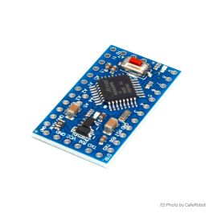 | 
**[برد آردوینو پرومینی مدل 3.3 ولت - Arduino Pro Mini](#hw-ard-01-049)**
 | `ARD-01-049` | **43** | Cafe Robot | [مشخصات 🔍](#hw-ard-01-049) |
| 2 | 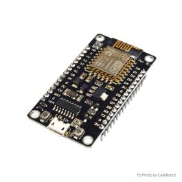 | 
**[برد توسعه NodeMcu دارای هسته وای فای ESP8266 و مبدل CH340](#hw-com-03-009)**
 | `COM-03-009` | **2** | Cafe Robot | [مشخصات 🔍](#hw-com-03-009) |
| 3 | 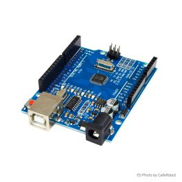 | 
**[برد آردوینو Arduino UNO CH340](#hw-ard-01-027)**
 | `ARD-01-027` | **1** | Cafe Robot | [مشخصات 🔍](#hw-ard-01-027) |
| 4 | 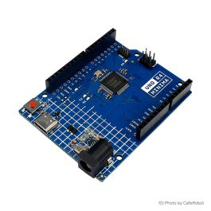 | 
**[برد آردوینو Arduino Uno R4 Minima (غیر اصل)](#hw-ard-01-064)**
 | `ARD-01-064` | **2** | Cafe Robot | [مشخصات 🔍](#hw-ard-01-064) |
| 5 |  | 
**[تگ RFID سکه ای 13.56MHZ برچسب دار قطر 25mm](#hw-22408)**
 | `22408` | **2** | ECA | [مشخصات 🔍](#hw-22408) |
| 6 | 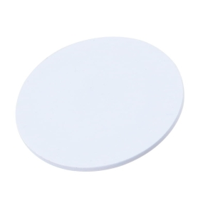 | 
**[تگ RFID سکه ای 125KHZ برچسب دار قطر 25mm](#hw-23103)**
 | `23103` | **2** | ECA | [مشخصات 🔍](#hw-23103) |
| 7 | 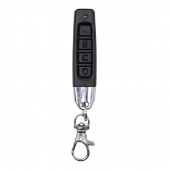 | 
**[ریموت 4 کانال بلوتوثی Duplicator طرح مدادی 315MHz مارک HFY مدل HFY614D](#hw-19142)**
 | `19142` | **2** | ECA | [مشخصات 🔍](#hw-19142) |
| 8 | 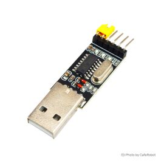 | 
**[ماژول مبدل USB به سریال TTL تراشه CH340](#hw-com-05-007)**
 | `COM-05-007` | **3** | Cafe Robot | [مشخصات 🔍](#hw-com-05-007) |
| 9 | 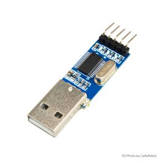 | 
**[مبدل یو اس بی به سریال PL2303 - تبدیل USB به TTL Serial - ماژول USB-TTL - پروگرامر STC](#hw-com-05-031)**
 | `COM-05-031` | **1** | Cafe Robot | [مشخصات 🔍](#hw-com-05-031) |
| 10 | 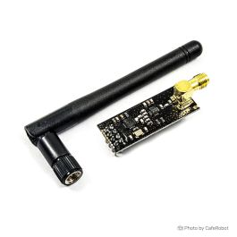 | 
**[ماژول NRF24L01+PA+LNA - فرستنده و گيرنده راديويي با برد 1 کیلومتر](#hw-com-09-030)**
 | `COM-09-030` | **41** | Cafe Robot | [مشخصات 🔍](#hw-com-09-030) |
| 11 | 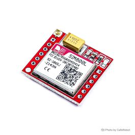 | 
**[ماژول GSM چهار باند SIM800L با قابلیت GPRS / GSM / SMS](#hw-com-08-003)**
 | `COM-08-003` | **2** | Cafe Robot | [مشخصات 🔍](#hw-com-08-003) |
| 12 | 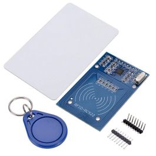 | 
**[ماژول RC522 RFID با قابلیت خواندن و نوشتن فرکانس 13.56Mhz](#hw-rfid-01-003-wt)**
 | `RFID-01-003-WT` | **4** | Cafe Robot | [مشخصات 🔍](#hw-rfid-01-003-wt) |
| 13 | 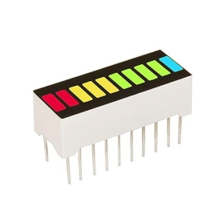 | 
**[LED بارگراف 10 بیتی 4 رنگ](#hw-22350)**
 | `22350` | **3** | ECA | [مشخصات 🔍](#hw-22350) |
| 14 | 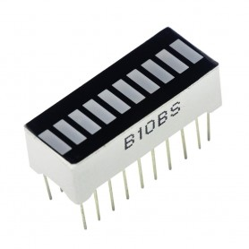 | 
**[LED بارگراف 10 بیتی قرمز](#hw-1335)**
 | `1335` | **3** | ECA | [مشخصات 🔍](#hw-1335) |
| 15 | 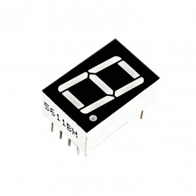 | 
**[سون سگمنت تکی 0.56 اینچ سبز کاتد مشترک](#hw-21585)**
 | `21585` | **10** | ECA | [مشخصات 🔍](#hw-21585) |
| 16 | 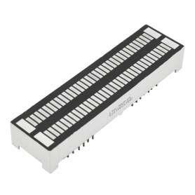 | 
**[LED بارگراف 35 بیتی دو ردیف دو رنگ سبز نارنجی](#hw-19491)**
 | `19491` | **1** | ECA | [مشخصات 🔍](#hw-19491) |
| 17 | 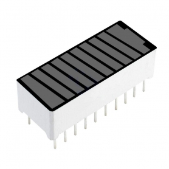 | 
**[سگمنت نمایشگر مدل باتری چهار رنگ](#hw-4726)**
 | `4726` | **2** | ECA | [مشخصات 🔍](#hw-4726) |
| 18 | 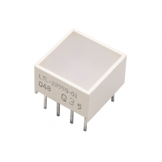 | 
**[نشانگر - LED مربعی سبز 10x10mm مارک LITE-ON کد LTL-2855G](#hw-18840)**
 | `18840` | **20** | ECA | [مشخصات 🔍](#hw-18840) |
| 19 | 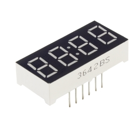 | 
**[سون سگمنت 4 دیجیت ساعتی 0.36 اینچ قرمز آند مشترک](#hw-13690)**
 | `13690` | **3** | ECA | [مشخصات 🔍](#hw-13690) |
| 20 | 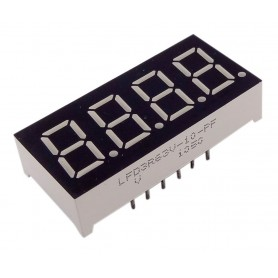 | 
**[سون سگمنت 4 دیجیت 0.36 اینچ قرمز مالتی پلکس کاتد مشترک](#hw-2429)**
 | `2429` | **3** | ECA | [مشخصات 🔍](#hw-2429) |
| 21 | 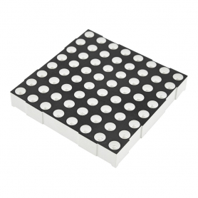 | 
**[دات ماتریس 8x8 سبز 60x60mm](#hw-20518)**
 | `20518` | **1** | ECA | [مشخصات 🔍](#hw-20518) |
| 22 | 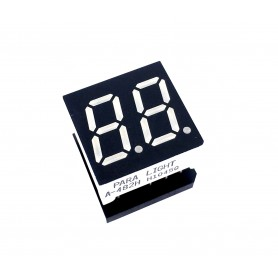 | 
**[سون سگمنت مالتی پلکس 2 دیجیت 0.4 اینچ قرمز آند مشترک کد 482H](#hw-5051)**
 | `5051` | **4** | ECA | [مشخصات 🔍](#hw-5051) |
| 23 | 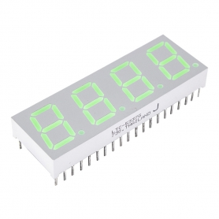 | 
**[سون سگمنت 4 دیجیت 0.52 اینچ سبز کاتد مشترک مارک LITE-ON کد LTD-5337G](#hw-18838)**
 | `18838` | **1** | ECA | [مشخصات 🔍](#hw-18838) |
| 24 | 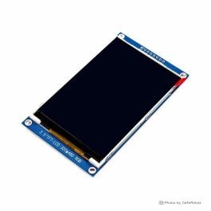 | 
**[ماژول نمایشگر TFT تمام رنگ 3.5 اینچ دارای ارتباط SPI و چیپ درایور ILI9486L](#hw-lcd-01-180)**
 | `LCD-01-180` | **2** | Cafe Robot | [مشخصات 🔍](#hw-lcd-01-180) |
| 25 | 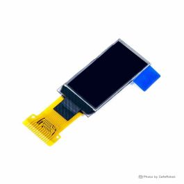 | 
**[نمایشگر OLED تک رنگ سفید 0.96 اینچ دارای ارتباط SPI/IIC و چیپ درایور SSD1312 با کابل فلت 13 پین](#hw-lcd-01-214)**
 | `LCD-01-214` | **4** | Cafe Robot | [مشخصات 🔍](#hw-lcd-01-214) |
| 26 | 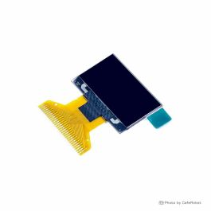 | 
**[نمایشگر OLED دو رنگ زرد و آبی 0.96 اینچ دارای ارتباط SPI/IIC و چیپ درایور SSD1315 با کابل فلت 30 پین](#hw-lcd-01-211)**
 | `LCD-01-211` | **4** | Cafe Robot | [مشخصات 🔍](#hw-lcd-01-211) |
| 27 | 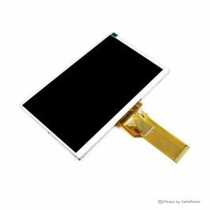 | 
**[نمایشگر TFT تمام رنگ 7 اینچ Innolux مدل AT070TN92 رزولوشن 800x480 با کابل فلت 50 پین Plug In](#hw-lcd-01-264)**
 | `LCD-01-264` | **1** | Cafe Robot | [مشخصات 🔍](#hw-lcd-01-264) |
| 28 | 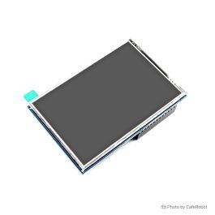 | 
**[نمایشگر 3.5 اینچ IPS لمسی مقاومتی تایپ B مناسب رزبری پای تولید Waveshare](#hw-lcd-01-083)**
 | `LCD-01-083` | **1** | Cafe Robot | [مشخصات 🔍](#hw-lcd-01-083) |
| 29 | 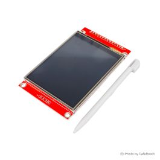 | 
**[ماژول نمایشگر 2.8 اینچ TFT لمسی تمام رنگ دارای ارتباط SPI ورژن 1.2](#hw-lcd-01-280)**
 | `LCD-01-280` | **2** | Cafe Robot | [مشخصات 🔍](#hw-lcd-01-280) |
| 30 | 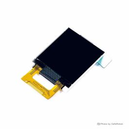 | 
**[نمایشگر TFT تمام رنگ 1.44 اینچ دارای ارتباط SPI و چیپ درایور ST7735 با کابل فلت 14 پین](#hw-lcd-01-155)**
 | `LCD-01-155` | **4** | Cafe Robot | [مشخصات 🔍](#hw-lcd-01-155) |
| 31 | 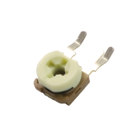 | 
**[پتانسیومتر 100 اهم ایستاده ژاپنی](#hw-22973)**
 | `22973` | **20** | ECA | [مشخصات 🔍](#hw-22973) |
| 32 | 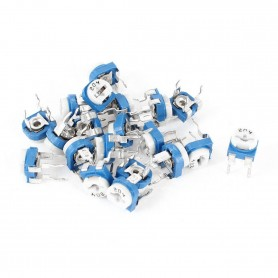 | 
**[پتانسیومتر 200 اهم خوابیده](#hw-16016)**
 | `16016` | **20** | ECA | [مشخصات 🔍](#hw-16016) |
| 33 | 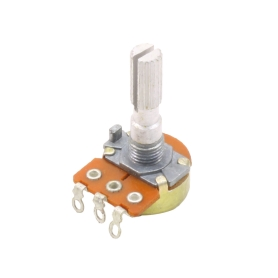 | 
**[ولوم 500 اهم شفت بلند مدل R160](#hw-23185)**
 | `23185` | **5** | ECA | [مشخصات 🔍](#hw-23185) |
| 34 | 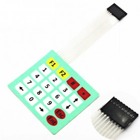 | 
**[کیپد 5x4 فلت دار ماتریسی](#hw-8421)**
 | `8421` | **1** | ECA | [مشخصات 🔍](#hw-8421) |
| 35 | 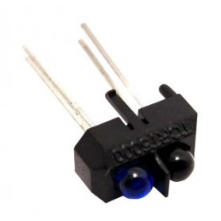 | 
**[پک فرستنده و گیرنده مادون قرمز TCRT5000](#hw-772)**
 | `772` | **10** | ECA | [مشخصات 🔍](#hw-772) |
| 36 | 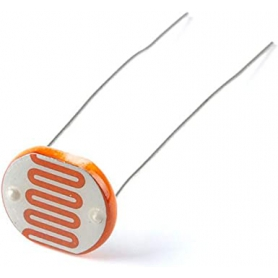 | 
**[فتوسل LDR 12mm](#hw-1116)**
 | `1116` | **5** | ECA | [مشخصات 🔍](#hw-1116) |
| 37 | 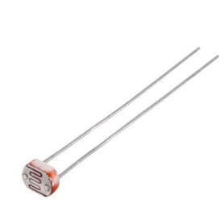 | 
**[فتوسل LDR 5mm](#hw-1081)**
 | `1081` | **10** | ECA | [مشخصات 🔍](#hw-1081) |
| 38 | 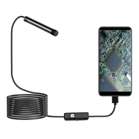 | 
**[دوربین آندوسکوپی فنری 1.3 مگاپیکسل لنز 7mm کابل 5 متر ارتباط USB](#hw-25277)**
 | `25277` | **1** | ECA | [مشخصات 🔍](#hw-25277) |
| 39 | 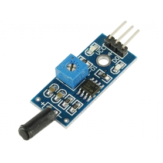 | 
**[ماژول سنسور لرزش و ویبره SW-18010P](#hw-5332)**
 | `5332` | **2** | ECA | [مشخصات 🔍](#hw-5332) |
| 40 | 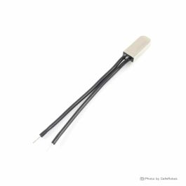 | 
**[ترموسوئیچ 5 آمپر KSD9700 مدل Normally Open (NO)](#hw-sen-10-091)**
 | `SEN-10-091` | **5** | Cafe Robot | [مشخصات 🔍](#hw-sen-10-091) |
| 41 |  | 
**[ترموسوئیچ 5 آمپر KSD9700 مدل Normally Open (NO)](#hw-sen-10-090)**
 | `SEN-10-090` | **5** | Cafe Robot | [مشخصات 🔍](#hw-sen-10-090) |
| 42 | 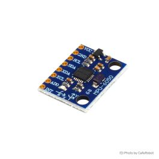 | 
**[ماژول ژیروسکوپ و شتاب سنج 3 محوره GY-521 MPU6050](#hw-sen-03-004)**
 | `SEN-03-004` | **4** | Cafe Robot | [مشخصات 🔍](#hw-sen-03-004) |
| 43 | 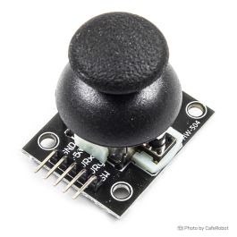 | 
**[ماژول جوی استیک دو محوره Dual-axis XY Joystick](#hw-kpd-01-003)**
 | `KPD-01-003` | **4** | Cafe Robot | [مشخصات 🔍](#hw-kpd-01-003) |
| 44 | 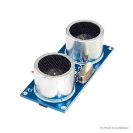 | 
**[ماژول فاصله سنج التراسونیک SRF04](#hw-sen-07-009-n)**
 | `SEN-07-009-N` | **4** | Cafe Robot | [مشخصات 🔍](#hw-sen-07-009-n) |
| 45 |  | 
**[براکت نصب سنسور التراسونیک HC-SR04 برند EasyIOT](#hw-eiot-051-1)**
 | `eiot-051-1` | **1** | Cafe Robot | [مشخصات 🔍](#hw-eiot-051-1) |
| 46 |  | 
**[براکت نصب سنسور التراسونیک HC-SR04 برند EasyIOT](#hw-eiot-051-3)**
 | `eiot-051-3` | **1** | Cafe Robot | [مشخصات 🔍](#hw-eiot-051-3) |
| 47 |  | 
**[براکت نصب سنسور التراسونیک HC-SR04 برند EasyIOT](#hw-eiot-051-4)**
 | `eiot-051-4` | **1** | Cafe Robot | [مشخصات 🔍](#hw-eiot-051-4) |
| 48 | 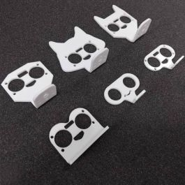 | 
**[براکت نصب سنسور التراسونیک HC-SR04 برند EasyIOT](#hw-eiot-051-5)**
 | `eiot-051-5` | **1** | Cafe Robot | [مشخصات 🔍](#hw-eiot-051-5) |
| 49 |  | 
**[براکت نصب سنسور التراسونیک HC-SR04 برند EasyIOT](#hw-eiot-051-6)**
 | `eiot-051-6` | **1** | Cafe Robot | [مشخصات 🔍](#hw-eiot-051-6) |
| 50 | 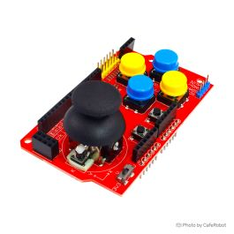 | 
**[شیلد جوی استیک آردوینو (دو محوره)](#hw-kpd-01-001)**
 | `KPD-01-001` | **4** | Cafe Robot | [مشخصات 🔍](#hw-kpd-01-001) |
| 51 | 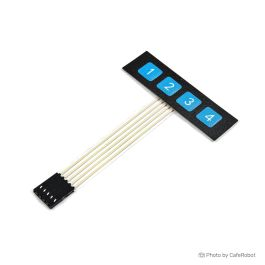 | 
**[کی پد فلت 1 در 4 - صفحه کلید](#hw-kpd-01-013)**
 | `KPD-01-013` | **4** | Cafe Robot | [مشخصات 🔍](#hw-kpd-01-013) |
| 52 | 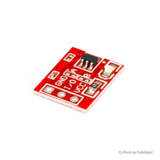 | 
**[کلید لمسی (تاچ) خازنی مدل TTP223](#hw-kpd-01-009)**
 | `KPD-01-009` | **25** | Cafe Robot | [مشخصات 🔍](#hw-kpd-01-009) |
| 53 |  | 
**[کلید فشاری (شاسی) 12 میلی متری مدل DS-427](#hw-elc-14-066)**
 | `ELC-14-066` | **2** | Cafe Robot | [مشخصات 🔍](#hw-elc-14-066) |
| 54 | 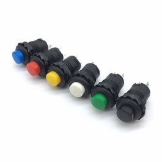 | 
**[کلید فشاری (شاسی) 12 میلی متری مدل DS-427](#hw-elc-14-065)**
 | `ELC-14-065` | **2** | Cafe Robot | [مشخصات 🔍](#hw-elc-14-065) |
| 55 | 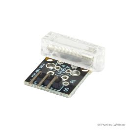 | 
**[ماژول سنسور ضربه و ارتعاش KY-031](#hw-sen-13-046)**
 | `SEN-13-046` | **6** | Cafe Robot | [مشخصات 🔍](#hw-sen-13-046) |
| 56 | 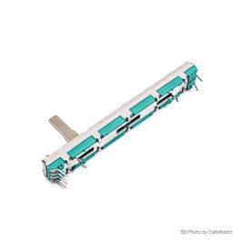 | 
**[پتانسیومتر فیدر اسلایدر کشویی دو کاناله 10 کیلو اهم B103](#hw-misc-04-036)**
 | `misc-04-036` | **4** | Cafe Robot | [مشخصات 🔍](#hw-misc-04-036) |
| 57 | 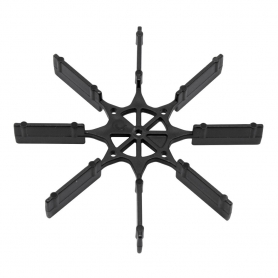 | 
**[سازه پارو پلاستیکی 8 پر سایز 70mm](#hw-19626)**
 | `19626` | **1** | ECA | [مشخصات 🔍](#hw-19626) |
| 58 |  | 
**[ملخ 4 پر سایز 80mm](#hw-16073)**
 | `16073` | **1** | ECA | [مشخصات 🔍](#hw-16073) |
| 59 |  | 
**[ملخ 4 پر سایز 60mm](#hw-16074)**
 | `16074` | **1** | ECA | [مشخصات 🔍](#hw-16074) |
| 60 |  | 
**[ملخ جفت پولر و پوشر مدل 1045 طول 254mm](#hw-16636)**
 | `16636` | **1** | ECA | [مشخصات 🔍](#hw-16636) |
| 61 |  | 
**[شاسی ربات پلاستیکی دو شاخ 145x177mm](#hw-18114)**
 | `18114` | **1** | ECA | [مشخصات 🔍](#hw-18114) |
| 62 |  | 
**[شاسی پلاستیکی خم 2 تیکه](#hw-18112)**
 | `18112` | **1** | ECA | [مشخصات 🔍](#hw-18112) |
| 63 |  | 
**[ماژول کنترلر دور موتور 10 آمپر PWM DC 10A](#hw-5504)**
 | `5504` | **3** | ECA | [مشخصات 🔍](#hw-5504) |
| 64 |  | 
**[اسپیندل موتور DC 12-36V مارک جانسون مدل 775](#hw-16614)**
 | `16614` | **2** | ECA | [مشخصات 🔍](#hw-16614) |
| 65 |  | 
**[ماژول درایور موتور دو کاناله TB6612FNG](#hw-mtr-08-022)**
 | `MTR-08-022` | **2** | Cafe Robot | [مشخصات 🔍](#hw-mtr-08-022) |
| 66 |  | 
**[ماژول درایور موتور 160W DC دو کاناله 7 آمپر جایگزین آمپر بالا برای L298](#hw-mtr-08-023)**
 | `MTR-08-023` | **2** | Cafe Robot | [مشخصات 🔍](#hw-mtr-08-023) |
| 67 |  | 
**[ماژول درایور موتور DC و استپر موتور دو کاناله L298N](#hw-mtr-09-003)**
 | `MTR-09-003` | **2** | Cafe Robot | [مشخصات 🔍](#hw-mtr-09-003) |
| 68 |  | 
**[ماژول درایور موتور DC و استپر موتور Bipolar دو کاناله L298N](#hw-mtr-09-001)**
 | `MTR-09-001` | **4** | Cafe Robot | [مشخصات 🔍](#hw-mtr-09-001) |
| 69 |  | 
**[موتور گیربکس 6 ولت مدل 500](#hw-mtr-02-047)**
 | `MTR-02-047` | **2** | Cafe Robot | [مشخصات 🔍](#hw-mtr-02-047) |
| 70 |  | 
**[ماژول درایور موتور دو کاناله DRV8833](#hw-mtr-08-017)**
 | `MTR-08-017` | **4** | Cafe Robot | [مشخصات 🔍](#hw-mtr-08-017) |
| 71 |  | 
**[درایور موتور DC و استپر موتور 1.5 آمپر دو کاناله MX1508](#hw-mtr-09-017)**
 | `MTR-09-017` | **4** | Cafe Robot | [مشخصات 🔍](#hw-mtr-09-017) |
| 72 |  | 
**[ماژول بلوتوث صوتی MH-M38 دارای 2 خروجی آمپلی فایر 5W](#hw-9647)**
 | `9647` | **1** | ECA | [مشخصات 🔍](#hw-9647) |
| 73 |  | 
**[ماژول بلوتوث صوتی مدل JDY-68A](#hw-16869)**
 | `16869` | **2** | ECA | [مشخصات 🔍](#hw-16869) |
| 74 |  | 
**[ماژول آمپلی فایر صوتی بلوتوث دار 2x3 وات مدل HW-332B](#hw-20250)**
 | `20250` | **1** | ECA | [مشخصات 🔍](#hw-20250) |
| 75 |  | 
**[برد آمپلی فایر حرفه ای 2x50W+100W XH-M139](#hw-7122)**
 | `7122` | **1** | ECA | [مشخصات 🔍](#hw-7122) |
| 76 |  | 
**[ماژول آمپلی فایر 2X100W وات استریو XH-M510](#hw-10964)**
 | `10964` | **1** | ECA | [مشخصات 🔍](#hw-10964) |
| 77 |  | 
**[ماژول آمپلی فایر تک کاناله 100 وات XH-542](#hw-17644)**
 | `17644` | **1** | ECA | [مشخصات 🔍](#hw-17644) |
| 78 |  | 
**[برد پری آمپلی فایر و تون کنترل حرفه ای NE5532](#hw-10240)**
 | `10240` | **2** | ECA | [مشخصات 🔍](#hw-10240) |
| 79 |  | 
**[ماژول آمپلی فایر 2X100W وات استریو XH-M190](#hw-6744)**
 | `6744` | **1** | ECA | [مشخصات 🔍](#hw-6744) |
| 80 |  | 
**[ماژول گیرنده بلوتوث صوتی XY-WRBT دارای بلوتوث ورژن 5](#hw-20246)**
 | `20246` | **2** | ECA | [مشخصات 🔍](#hw-20246) |
| 81 |  | 
**[ماژول میکروفون دارای پری آمپلی فایر MAX4466](#hw-17651)**
 | `17651` | **2** | ECA | [مشخصات 🔍](#hw-17651) |
| 82 |  | 
**[ماژول میکروفون MEMS INMP441 با رابط I2S](#hw-24470)**
 | `24470` | **1** | ECA | [مشخصات 🔍](#hw-24470) |
| 83 |  | 
**[میکروفن خازنی EPE 6x5](#hw-10482)**
 | `10482` | **2** | ECA | [مشخصات 🔍](#hw-10482) |
| 84 |  | 
**[ماژول میکروفن ky-037](#hw-4968)**
 | `4968` | **2** | ECA | [مشخصات 🔍](#hw-4968) |
| 85 |  | 
**[ماژول شارژ و دشارژ 2 آمپر TP4056 به همراه افزاینده با ورودی USB Type-C](#hw-24637)**
 | `24637` | **2** | ECA | [مشخصات 🔍](#hw-24637) |
| 86 |  | 
**[ماژول شارژر باتری لیتیومی 1 آمپر TP4056 با ورودی USB TYPE-C مدل LX-LCBST](#hw-20253)**
 | `20253` | **4** | ECA | [مشخصات 🔍](#hw-20253) |
| 87 |  | 
**[ماژول شارژر باتری لیتیومی 1 آمپر TP4056 دارای محافظ با ورودی USB TYPE-C](#hw-13687)**
 | `13687` | **4** | ECA | [مشخصات 🔍](#hw-13687) |
| 88 |  | 
**[رگولاتور 3.3 ولت LN1134A332MR پکیج SOT-23-5](#hw-10046)**
 | `10046` | **40** | ECA | [مشخصات 🔍](#hw-10046) |
| 89 |  | 
**[باتری کتابی 9 ولت لیتیوم یون قابل شارژ 1200mAh مارک Pujimax با ورودی Type-C](#hw-22027)**
 | `22027` | **2** | ECA | [مشخصات 🔍](#hw-22027) |
| 90 |  | 
**[خازن الکترولیتی ایستاده 4700µF ولتاژ 35V سایز 30x18mm](#hw-p2-0045)**
 | `P2-0045` | **8** | Cafe Robot | [مشخصات 🔍](#hw-p2-0045) |
| 91 |  | 
**[باتری لیتیوم یون 18650 شارژی 3.7 ولت 2600mAh برند Sony](#hw-bat-06-068)**
 | `BAT-06-068` | **2** | Cafe Robot | [مشخصات 🔍](#hw-bat-06-068) |
| 92 |  | 
**[باتری لیتیوم یون 18650 شارژی 3.7 ولت 3300mAh برند Samsung](#hw-bat-06-074)**
 | `BAT-06-074` | **2** | Cafe Robot | [مشخصات 🔍](#hw-bat-06-074) |
| 93 |  | 
**[ماژول پاور سوئیچینگ دارای خروجی 5 ولت 700 میلی آمپر](#hw-bat-02-068)**
 | `BAT-02-068` | **10** | Cafe Robot | [مشخصات 🔍](#hw-bat-02-068) |
| 94 |  | 
**[ماژول رگولاتور فوق کوچک DC به DC کاهنده 1.8 آمپر Mini-360](#hw-bat-02-048-m2)**
 | `BAT-02-048-M2` | **4** | Cafe Robot | [مشخصات 🔍](#hw-bat-02-048-m2) |
| 95 |  | 
**[ماژول رگولاتور افزاینده ولتاژ DC به DC با خروجی 5 ولت](#hw-bat-02-154)**
 | `BAT-02-154` | **10** | Cafe Robot | [مشخصات 🔍](#hw-bat-02-154) |
| 96 |  | 
**[ماژول رگولاتور DC به DC افزاینده 2 آمپر XL-3608](#hw-bat-02-164-5v)**
 | `BAT-02-164-5V` | **10** | Cafe Robot | [مشخصات 🔍](#hw-bat-02-164-5v) |
| 97 |  | 
**[ماژول مالتی پلکسر 16 کاناله با تراشه CD74HC4067](#hw-17679)**
 | `17679` | **10** | ECA | [مشخصات 🔍](#hw-17679) |
| 98 |  | 
**[ماژول کارتخوان میکرو SD - ماژول میکرو اس دی Micro-SD/TF](#hw-5136)**
 | `5136` | **4** | ECA | [مشخصات 🔍](#hw-5136) |
| 99 |  | 
**[ماژول رله 12 ولت چهار کاناله دارای جامپر تعیین سطح تریگر](#hw-rel-01-023)**
 | `REL-01-023` | **2** | Cafe Robot | [مشخصات 🔍](#hw-rel-01-023) |
| 100 |  | 
**[ماژول رله 5 ولت یک کاناله](#hw-rel-01-013)**
 | `REL-01-013` | **3** | Cafe Robot | [مشخصات 🔍](#hw-rel-01-013) |
| 101 |  | 
**[ماژول تشخیص حرکت بدن HC-SR505 PIR](#hw-3616)**
 | `3616` | **1** | ECA | [مشخصات 🔍](#hw-3616) |
| 102 |  | 
**[پین هدر 1x40 نری صاف سبز](#hw-7428)**
 | `7428` | **5** | ECA | [مشخصات 🔍](#hw-7428) |
| 103 |  | 
**[پین هدر 1x40 نری صاف قرمز](#hw-7426)**
 | `7426` | **5** | ECA | [مشخصات 🔍](#hw-7426) |
| 104 |  | 
**[پین هدر 1x40 نری رایت](#hw-592)**
 | `592` | **5** | ECA | [مشخصات 🔍](#hw-592) |
| 105 |  | 
**[سیم برد بوردی آماده بسته 60 الی 65 تایی](#hw-643)**
 | `643` | **2** | ECA | [مشخصات 🔍](#hw-643) |
| 106 |  | 
**[گیره سوسماری کوچک سفید](#hw-7149)**
 | `7149` | **5** | ECA | [مشخصات 🔍](#hw-7149) |
| 107 |  | 
**[گیره سوسماری کوچک آبی](#hw-7150)**
 | `7150` | **5** | ECA | [مشخصات 🔍](#hw-7150) |
| 108 |  | 
**[گیره سوسماری متوسط زرد](#hw-1790)**
 | `1790` | **5** | ECA | [مشخصات 🔍](#hw-1790) |
| 109 |  | 
**[گیره سوسماری متوسط مشکی](#hw-1787)**
 | `1787` | **5** | ECA | [مشخصات 🔍](#hw-1787) |
| 110 |  | 
**[سیم جامپر ماده به ماده 20cm فلت 40 رشته](#hw-2169)**
 | `2169` | **2** | ECA | [مشخصات 🔍](#hw-2169) |
| 111 |  | 
**[سیم جامپر ماده به ماده 10cm فلت 40 رشته](#hw-13688)**
 | `13688` | **2** | ECA | [مشخصات 🔍](#hw-13688) |
| 112 |  | 
**[سیم جامپر نر به ماده 10cm فلت 40 رشته](#hw-11028)**
 | `11028` | **1** | ECA | [مشخصات 🔍](#hw-11028) |
| 113 |  | 
**[سیم جامپر ماده به ماده 30cm فلت 40 رشته](#hw-11030)**
 | `11030` | **2** | ECA | [مشخصات 🔍](#hw-11030) |
| 114 |  | 
**[کابل فلت طوسی 40 رشته یک متر](#hw-1063)**
 | `1063` | **1** | ECA | [مشخصات 🔍](#hw-1063) |
| 115 |  | 
**[سیم جامپر نر به ماده 30cm فلت 40 رشته](#hw-11027)**
 | `11027` | **2** | ECA | [مشخصات 🔍](#hw-11027) |
| 116 |  | 
**[سیم جامپر مادگی به مادگی فلت 40 تایی - طول 30/20/10 سانتی متر](#hw-cab-01-129)**
 | `CAB-01-129` | **1** | Cafe Robot | [مشخصات 🔍](#hw-cab-01-129) |
| 117 |  | 
**[سیم جامپر مادگی به مادگی فلت 40 تایی - طول 30/20/10 سانتی متر](#hw-cab-01-007)**
 | `CAB-01-007` | **1** | Cafe Robot | [مشخصات 🔍](#hw-cab-01-007) |
| 118 |  | 
**[سیم جامپر مادگی به مادگی فلت 40 تایی - طول 30/20/10 سانتی متر](#hw-cab-01-010)**
 | `CAB-01-010` | **1** | Cafe Robot | [مشخصات 🔍](#hw-cab-01-010) |
| 119 |  | 
**[سیم جامپر نری به نری فلت 40 تایی - طول 30/20/10 سانتی متر](#hw-cab-01-012)**
 | `CAB-01-012` | **1** | Cafe Robot | [مشخصات 🔍](#hw-cab-01-012) |
| 120 |  | 
**[سیم جامپر نری به نری فلت 40 تایی - طول 30/20/10 سانتی متر](#hw-cab-01-009)**
 | `CAB-01-009` | **1** | Cafe Robot | [مشخصات 🔍](#hw-cab-01-009) |
| 121 |  | 
**[سیم جامپر نری به مادگی فلت 40 تایی - طول 30/20/10 سانتی متر](#hw-cab-01-008)**
 | `CAB-01-008` | **1** | Cafe Robot | [مشخصات 🔍](#hw-cab-01-008) |
| 122 |  | 
**[سیم جامپر نری به مادگی فلت 40 تایی - طول 30/20/10 سانتی متر](#hw-cab-01-011)**
 | `CAB-01-011` | **1** | Cafe Robot | [مشخصات 🔍](#hw-cab-01-011) |
| 123 |  | 
**[پین هدر نری رنگی فاصله پین 2.54mm](#hw-cab-01-115-blue)**
 | `CAB-01-115-Blue` | **10** | Cafe Robot | [مشخصات 🔍](#hw-cab-01-115-blue) |
| 124 |  | 
**[پین هدر نری رنگی فاصله پین 2.54mm](#hw-cab-01-115-yellow)**
 | `CAB-01-115-Yellow` | **10** | Cafe Robot | [مشخصات 🔍](#hw-cab-01-115-yellow) |
| 125 |  | 
**[پین هدر 2x40 نری مستقیم فاصله پین 2.54 میلی متر](#hw-cab-01-038)**
 | `CAB-01-038` | **1** | Cafe Robot | [مشخصات 🔍](#hw-cab-01-038) |
| 126 |  | 
**[پین هدر 1X40 نری مستقیم فاصله پین 2 میلی متر](#hw-cab-01-141)**
 | `CAB-01-141` | **5** | Cafe Robot | [مشخصات 🔍](#hw-cab-01-141) |
| 127 |  | 
**[پین هدر 1X40 مادگی مستقیم - فاصله پین 1.27 میلی متر](#hw-cab-01-142)**
 | `CAB-01-142` | **2** | Cafe Robot | [مشخصات 🔍](#hw-cab-01-142) |

---

# 💻 ۱. بردهای میکروکنترلر و توسعه (Microcontrollers & Dev Boards)

> **تعداد اقلام در این بخش: 4 کالا**

## 1. برد آردوینو پرومینی مدل 3.3 ولت - Arduino Pro Mini

<a href="#فهرست-سخت‌افزارها">⬆️ بازگشت به فهرست اقلام</a> | <a href="#cat_1_mcu">⤴️ بازگشت به سرشاخه</a>

    

### 🎯 معرفی، ویژگی‌ها و کاربردها
برد فوق مینیاتوری آردوینو با ولتاژ کاری ۳.۳ ولت و مصرف انرژی فوق‌العاده اندک. مناسب برای مدارات قابل حمل، گجت‌های پوشیدنی و اتصال بدون واسطه به سنسورهای ۳.۳ ولتی (مانند NRF24L01 و ESP8266) بدون خطر سوختن ناشی از اختلاف ولتاژ ۵ ولت.

- **سفارش‌های ثبت شده:** Cafe Robot #100128979 (3 عدد), Cafe Robot #100131470 (40 عدد)
- **تراشه / پلتفرم مبنا:** `ATmega328P @ 8 MHz`
- **پروتکل ارتباطی:** `UART, SPI, I2C`

### ⚙️ مشخصات فنی (Technical Specifications)

| پارامتر (Parameter) | مقدار / مشخصه (Specification Value) |
|:---|:---|
| **Microcontroller** | `ATmega328P (3.3V version)` |
| **Clock Frequency** | `8 MHz Internal/Resonator` |
| **Flash / SRAM** | `32 KB / 2 KB` |
| **Operating Voltage** | `3.3V DC` |
| **Input Voltage (RAW)** | `3.35V - 12V DC` |
| **Dimensions** | `18 x 33 mm` |
| **Weight** | `~4 grams` |

### 🔌 نیازمندی‌های اتصال و پین‌اوت (Wiring & Pinout)

| پین (Pin Name) | نوع سیگنال (Signal Type) | شرح عملکرد و نحوه اتصال به آردوینو (Description & Connection) |
|:---:|:---:|:---|
| `RAW` | **Power In** | 
ورودی رگولاتور داخلی تا ۱۲ ولت
 |
| `VCC` | **3.3V In/Out** | 
تغذیه مستقیم ۳.۳ ولت رگوله‌شده
 |
| `GND` | **Ground** | 
زمین مشترک سیستم
 |
| `TXD / RXD` | **UART TTL** | 
اتصال به پین‌های RX و TX مبدل سریال CH340
 |
| `DTR / GRN` | **Auto Reset** | 
اتصال به DTR مبدل سریال برای ریست خودکار هنگام پروگرام
 |
| `D10 - D13` | **SPI Bus** | 
پایه‌های ارتباط سخت‌افزاری SPI
 |
| `A4(SDA) / A5(SCL)` | **I2C Bus** | 
پایه‌های ارتباط I2C
 |

### ⚠️ نکات راه‌اندازی و ملاحظات مهندسی
فاقد پورت USB داخلی است؛ برنامه‌ریزی از طریق مبدل USB-to-TTL با پین DTR انجام می‌شود. جامپر ولتاژ مبدل حتماً روی ۳.۳ ولت باشد.

### 📚 کتابخانه‌های پیشنهادی آردوینو
- `Arduino.h`
- `EEPROM.h`
- `Wire.h`
- `SPI.h`

### 🌐 پیوندهای مرجع و دیتاشیت
- 📄 **دیتاشیت / مستندات سازنده:** [ATmega328P @ 8 MHz Datasheet](https://docs.arduino.cc/retired/boards/arduino-pro-mini)
- 🛒 **صفحه خرید محصول (Cafe Robot):** [برد آردوینو پرومینی مدل 3.3 ولت - Arduino Pro Mini](https://thecaferobot.com/store/arduino-pro-mini-3-3v)

---

## 2. برد توسعه NodeMcu دارای هسته وای فای ESP8266 و مبدل CH340

<a href="#فهرست-سخت‌افزارها">⬆️ بازگشت به فهرست اقلام</a> | <a href="#cat_1_mcu">⤴️ بازگشت به سرشاخه</a>

    

### 🎯 معرفی، ویژگی‌ها و کاربردها
برد اینترنت اشیاء بر پایه تراشه محبوب ESP8266 با قابلیت اتصال مستقیم به شبکه وای‌فای خانگی یا ساخت اکسس پوینت محلی. دارای ۴ مگابایت حافظه فلش، پورت Micro-USB و مبدل CH340 با قابلیت برنامه‌نویسی در آردوینو و MicroPython.

- **سفارش‌های ثبت شده:** Cafe Robot #100128979 (2 عدد)
- **تراشه / پلتفرم مبنا:** `ESP8266-12E/12F + CH340`
- **پروتکل ارتباطی:** `Wi-Fi 802.11 b/g/n, UART, SPI, I2C`

### ⚙️ مشخصات فنی (Technical Specifications)

| پارامتر (Parameter) | مقدار / مشخصه (Specification Value) |
|:---|:---|
| **Core Processor** | `Tensilica Xtensa 32-bit LX106 @ 80/160 MHz` |
| **Wi-Fi Standard** | `802.11 b/g/n (2.4 GHz, WPA2-PSK)` |
| **Flash Memory** | `4 MB SPI Flash` |
| **Logic Level** | `3.3V DC (NOT 5V tolerant!)` |
| **Supply Voltage** | `5V USB or 7-12V VIN` |
| **ADC Channel** | `1 Channel (0 - 1.0V internal, 0 - 3.3V board divider)` |

### 🔌 نیازمندی‌های اتصال و پین‌اوت (Wiring & Pinout)

| پین (Pin Name) | نوع سیگنال (Signal Type) | شرح عملکرد و نحوه اتصال به آردوینو (Description & Connection) |
|:---:|:---:|:---|
| `Micro-USB / VIN` | **Power In** | 
تغذیه ۵ ولت ورودی
 |
| `3V3 / GND` | **Power** | 
خروجی ۳.۳ ولت و زمین مدار
 |
| `D1 (GPIO5) / D2 (GPIO4)` | **I2C** | 
پایه‌های پیش‌فرض SCL و SDA در نرم‌افزار
 |
| `D5 - D8 (GPIO14,12,13,15)` | **SPI** | 
گذرگاه سخت‌افزاری SPI
 |
| `D9 (RX) / D10 (TX)` | **UART** | 
پورت سریال پروگرام و مانیتور
 |
| `A0 (ADC0)` | **Analog** | 
ورودی آنالوگ ۱۰ بیتی
 |

### ⚠️ نکات راه‌اندازی و ملاحظات مهندسی
سطح منطقی تمام پایه‌های GPIO فقط ۳.۳ ولت است و به هیچ عنوان نباید سیگنال ۵ ولت مستقیم به پایه‌ها متصل شود. برای سنسورهای ۵ ولت از تقسیم مقاومتی یا Level Shifter استفاده کنید.

### 📚 کتابخانه‌های پیشنهادی آردوینو
- `ESP8266WiFi.h`
- `ESP8266WebServer.h`
- `PubSubClient.h`
- `ArduinoJson.h`

### 🌐 پیوندهای مرجع و دیتاشیت
- 📄 **دیتاشیت / مستندات سازنده:** [ESP8266-12E/12F + CH340 Datasheet](https://www.espressif.com/sites/default/files/documentation/0a-esp8266ex_datasheet_en.pdf)
- 🛒 **صفحه خرید محصول (Cafe Robot):** [برد توسعه NodeMcu دارای هسته وای فای ESP8266 و مبدل CH340](https://thecaferobot.com/store/nodemcu-lua-serial-wifi-module-esp8266)

---

## 3. برد آردوینو Arduino UNO CH340

<a href="#فهرست-سخت‌افزارها">⬆️ بازگشت به فهرست اقلام</a> | <a href="#cat_1_mcu">⤴️ بازگشت به سرشاخه</a>

    

### 🎯 معرفی، ویژگی‌ها و کاربردها
برد توسعه استاندارد آردوینو اونو مجهز به میکروکنترلر ۸ بیتی ATmega328P و تراشه واسط CH340G. استاندارد مرجع برای شروع یادگیری الکترونیک، رباتیک و نمونه‌سازی سریع با سازگاری با صدها کتابخانه و شیلد.

- **سفارش‌های ثبت شده:** Cafe Robot #100152393 (1 عدد)
- **تراشه / پلتفرم مبنا:** `ATmega328P + WCH CH340G`
- **پروتکل ارتباطی:** `USB Type-B, UART, SPI, I2C`

### ⚙️ مشخصات فنی (Technical Specifications)

| پارامتر (Parameter) | مقدار / مشخصه (Specification Value) |
|:---|:---|
| **Microcontroller** | `ATmega328P (8-bit AVR)` |
| **Clock Speed** | `16 MHz` |
| **Flash / SRAM** | `32 KB Flash / 2 KB SRAM / 1 KB EEPROM` |
| **Operating Voltage** | `5V DC` |
| **Input Voltage** | `7V - 12V DC via DC Jack or VIN` |
| **Digital I/O Pins** | `14 (6 PWM outputs)` |
| **Analog Inputs** | `6 (10-bit ADC)` |

### 🔌 نیازمندی‌های اتصال و پین‌اوت (Wiring & Pinout)

| پین (Pin Name) | نوع سیگنال (Signal Type) | شرح عملکرد و نحوه اتصال به آردوینو (Description & Connection) |
|:---:|:---:|:---|
| `USB Type-B` | **Data / Power** | 
اتصال به پورت USB کامپیوتر
 |
| `DC Jack / VIN` | **Power In** | 
ورودی آداپتور دیواری ۷ الی ۱۲ ولت
 |
| `5V / 3.3V / GND` | **Power Out** | 
پایه‌های تغذیه و زمین
 |
| `D0(RX) / D1(TX)` | **UART** | 
پورت سریال اصلی (مشترک با مبدل USB)
 |
| `D2 - D13` | **Digital I/O** | 
پین‌های دیجیتال (D3, D5, D6, D9, D10, D11 دارای PWM)
 |
| `A0 - A5` | **Analog In** | 
ورودی‌های مبدل آنالوگ به دیجیتال ۱۰ بیتی
 |
| `A4(SDA) / A5(SCL)` | **I2C Bus** | 
رابط دوسیمه I2C سخت‌افزاری
 |

### ⚠️ نکات راه‌اندازی و ملاحظات مهندسی
برای شناسایی در سیستم‌عامل ویندوز درایور WCH CH340 نصب گردد. حداکثر جریان خروجی پایه ۵ ولت حدود ۵۰۰ میلی‌آمپر است.

### 📚 کتابخانه‌های پیشنهادی آردوینو
- `Arduino.h`
- `Wire.h`
- `SPI.h`

### 🌐 پیوندهای مرجع و دیتاشیت
- 📄 **دیتاشیت / مستندات سازنده:** [ATmega328P + WCH CH340G Datasheet](https://ww1.microchip.com/downloads/en/DeviceDoc/Atmel-7810-Automotive-Microcontrollers-ATmega328P_Datasheet.pdf)
- 🛒 **صفحه خرید محصول (Cafe Robot):** [برد آردوینو Arduino UNO CH340](https://thecaferobot.com/store/arduino-uno-ch340g-board)

---

## 4. برد آردوینو Arduino Uno R4 Minima (غیر اصل)

<a href="#فهرست-سخت‌افزارها">⬆️ بازگشت به فهرست اقلام</a> | <a href="#cat_1_mcu">⤴️ بازگشت به سرشاخه</a>

    

### 🎯 معرفی، ویژگی‌ها و کاربردها
برد نسل ۴ آردوینو اونو با پردازنده ۳۲ بیتی آرم کورتکس M4، رم ۳۲ کیلوبایت، فلش ۲۵۶ کیلوبایت، مبدل دیجیتال به آنالوگ ۱۲ بیتی (DAC)، شبکه CAN Bus و پورت مدرن Type-C. سه برابر سریع‌تر از Uno R3 با قابلیت اجرای پروژه‌های محاسباتی سنگین‌تر.

- **سفارش‌های ثبت شده:** Cafe Robot #100152393 (2 عدد)
- **تراشه / پلتفرم مبنا:** `Renesas RA4M1 (ARM Cortex-M4 @ 48 MHz)`
- **پروتکل ارتباطی:** `USB-C, UART, SPI, I2C, CAN Bus, DAC`

### ⚙️ مشخصات فنی (Technical Specifications)

| پارامتر (Parameter) | مقدار / مشخصه (Specification Value) |
|:---|:---|
| **Microcontroller** | `Renesas RA4M1 (Arm Cortex-M4)` |
| **Clock Speed** | `48 MHz` |
| **Memory** | `256 KB Flash / 32 KB SRAM` |
| **Operating Voltage** | `5V DC` |
| **Input Voltage (VIN)** | `6V - 24V DC` |
| **ADC / DAC** | `14-bit ADC / 12-bit DAC` |
| **CAN Interface** | `Integrated CAN controller` |

### 🔌 نیازمندی‌های اتصال و پین‌اوت (Wiring & Pinout)

| پین (Pin Name) | نوع سیگنال (Signal Type) | شرح عملکرد و نحوه اتصال به آردوینو (Description & Connection) |
|:---:|:---:|:---|
| `USB Type-C` | **Power / Prog** | 
اتصال به رایانه برای پروگرام و دیباگ
 |
| `VIN / GND` | **Power In** | 
تغذیه خارجی ۶ الی ۲۴ ولت
 |
| `5V / 3.3V` | **Power Out** | 
تغذیه سنسورها و ماژول‌ها
 |
| `D0 - D13` | **Digital I/O** | 
پین‌های دیجیتال با قابلیت وقفه روی تمام پایه‌ها
 |
| `A0 - A5` | **Analog In** | 
ورودی‌های آنالوگ با دقت ۱۴ بیت
 |
| `CAN RX / TX` | **CAN Bus** | 
پایه‌های شبکه ارتباطی صنعتی CAN
 |
| `DAC (A0)` | **Analog Out** | 
خروجی آنالوگ حقیقی ولتاژ
 |

### ⚠️ نکات راه‌اندازی و ملاحظات مهندسی
کاملاً سازگار با شیلدهای استاندارد آردوینو Uno پنج ولتی است. از طریق کابل USB Type-C تغذیه و پروگرام می‌شود.

### 📚 کتابخانه‌های پیشنهادی آردوینو
- `ArduinoCore-renesas`
- `Wire.h`
- `SPI.h`

### 🌐 پیوندهای مرجع و دیتاشیت
- 📄 **دیتاشیت / مستندات سازنده:** [Renesas RA4M1 (ARM Cortex-M4 @ 48 MHz) Datasheet](https://docs.arduino.cc/resources/datasheets/ABX00080-datasheet.pdf)
- 🛒 **صفحه خرید محصول (Cafe Robot):** [برد آردوینو Arduino Uno R4 Minima (غیر اصل)](https://thecaferobot.com/store/arduino-uno-r4-minima-clone)

---

# 📡 ۲. ماژول‌های ارتباطی، وایرلس و مخابراتی (Wireless & Communication)

> **تعداد اقلام در این بخش: 8 کالا**

## 1. تگ RFID سکه ای 13.56MHZ برچسب دار قطر 25mm

<a href="#فهرست-سخت‌افزارها">⬆️ بازگشت به فهرست اقلام</a> | <a href="#cat_2_comm">⤴️ بازگشت به سرشاخه</a>

    

### 🎯 معرفی، ویژگی‌ها و کاربردها
تگ سکه‌ای ضدآب با چسب دوطرفه مقاوم جهت چسباندن روی سطوح، کارت‌های تردد، ردیابی کالا و سیستم‌های امنیتی فرکانس 13.56 MHz. بدون نیاز به باتری داخلی با عمر مفید نامحدود.

- **سفارش‌های ثبت شده:** ECA #495309 (2 عدد)
- **تراشه / پلتفرم مبنا:** `RFID Tag (13.56 MHz) Passive Transponder`
- **پروتکل ارتباطی:** `RFID RF Coupling (13.56 MHz)`

### ⚙️ مشخصات فنی (Technical Specifications)

| پارامتر (Parameter) | مقدار / مشخصه (Specification Value) |
|:---|:---|
| **Operating Frequency** | `13.56 MHz` |
| **Read Range** | `20 - 50 mm` |
| **Operating Temperature** | `-20°C to +75°C` |
| **Diameter** | `25 mm` |
| **Material** | `PVC with 3M Adhesive backing` |

### 🔌 نیازمندی‌های اتصال و پین‌اوت (Wiring & Pinout)

| پین (Pin Name) | نوع سیگنال (Signal Type) | شرح عملکرد و نحوه اتصال به آردوینو (Description & Connection) |
|:---:|:---:|:---|
| `Antenna Coil` | **Internal** | 
سیم‌پیچ داخلی القایی بدون پین خارجی
 |

### ⚠️ نکات راه‌اندازی و ملاحظات مهندسی
از چسباندن مستقیم تگ روی صفحات فلزی ضخیم خودداری شود، زیرا فلز باعث تضعیف میدان مغناطیسی خواندن می‌شود.

### 📚 کتابخانه‌های پیشنهادی آردوینو
- `MFRC522.h (for 13.56MHz)`
- `RDM6300.h (for 125kHz)`

### 🌐 پیوندهای مرجع و دیتاشیت
- 📄 **دیتاشیت / مستندات سازنده:** [RFID Tag (13.56 MHz) Passive Transponder Datasheet](https://www.nxp.com/docs/en/data-sheet/MF1S50YYX_V1.pdf)
- 🛒 **صفحه خرید محصول (ECA):** [تگ RFID سکه ای 13.56MHZ برچسب دار قطر 25mm](https://eshop.eca.ir/آنتن-و-تگ-rfid/22408-تگ-rfid-سکه-ای-1356mhz-برچسب-دار-قطر-25mm.html)

---

## 2. تگ RFID سکه ای 125KHZ برچسب دار قطر 25mm

<a href="#فهرست-سخت‌افزارها">⬆️ بازگشت به فهرست اقلام</a> | <a href="#cat_2_comm">⤴️ بازگشت به سرشاخه</a>

    

### 🎯 معرفی، ویژگی‌ها و کاربردها
تگ سکه‌ای ضدآب با چسب دوطرفه مقاوم جهت چسباندن روی سطوح، کارت‌های تردد، ردیابی کالا و سیستم‌های امنیتی فرکانس 125 kHz. بدون نیاز به باتری داخلی با عمر مفید نامحدود.

- **سفارش‌های ثبت شده:** ECA #495309 (2 عدد)
- **تراشه / پلتفرم مبنا:** `RFID Tag (125 kHz) Passive Transponder`
- **پروتکل ارتباطی:** `RFID RF Coupling (125 kHz)`

### ⚙️ مشخصات فنی (Technical Specifications)

| پارامتر (Parameter) | مقدار / مشخصه (Specification Value) |
|:---|:---|
| **Operating Frequency** | `125 kHz` |
| **Read Range** | `20 - 50 mm` |
| **Operating Temperature** | `-20°C to +75°C` |
| **Diameter** | `25 mm` |
| **Material** | `PVC with 3M Adhesive backing` |

### 🔌 نیازمندی‌های اتصال و پین‌اوت (Wiring & Pinout)

| پین (Pin Name) | نوع سیگنال (Signal Type) | شرح عملکرد و نحوه اتصال به آردوینو (Description & Connection) |
|:---:|:---:|:---|
| `Antenna Coil` | **Internal** | 
سیم‌پیچ داخلی القایی بدون پین خارجی
 |

### ⚠️ نکات راه‌اندازی و ملاحظات مهندسی
از چسباندن مستقیم تگ روی صفحات فلزی ضخیم خودداری شود، زیرا فلز باعث تضعیف میدان مغناطیسی خواندن می‌شود.

### 📚 کتابخانه‌های پیشنهادی آردوینو
- `MFRC522.h (for 13.56MHz)`
- `RDM6300.h (for 125kHz)`

### 🌐 پیوندهای مرجع و دیتاشیت
- 📄 **دیتاشیت / مستندات سازنده:** [RFID Tag (125 kHz) Passive Transponder Datasheet](https://www.nxp.com/docs/en/data-sheet/MF1S50YYX_V1.pdf)
- 🛒 **صفحه خرید محصول (ECA):** [تگ RFID سکه ای 125KHZ برچسب دار قطر 25mm](https://eshop.eca.ir/آنتن-و-تگ-rfid/23103-تگ-rfid-سکه-ای-125khz-برچسب-دار-قطر-25mm.html)

---

## 3. ریموت 4 کانال بلوتوثی Duplicator طرح مدادی 315MHz مارک HFY مدل HFY614D

<a href="#فهرست-سخت‌افزارها">⬆️ بازگشت به فهرست اقلام</a> | <a href="#cat_2_comm">⤴️ بازگشت به سرشاخه</a>

    

### 🎯 معرفی، ویژگی‌ها و کاربردها
ریموت کنترل لرنینگ ۴ کاناله طرح مدادی فرکانس ۳۱۵ مگاهرتز با قابلیت کپی‌برداری سریع کد (Duplicator) از ریموت‌های فیکس‌کد و لرنینگ. بدنه فلزی-پلاستیکی محکم با روکش کشویی محافظ کلیدها.

- **سفارش‌های ثبت شده:** ECA #495309 (2 عدد)
- **تراشه / پلتفرم مبنا:** `HFY614D Duplicator 315 MHz`
- **پروتکل ارتباطی:** `315 MHz ASK / OOK RF`

### ⚙️ مشخصات فنی (Technical Specifications)

| پارامتر (Parameter) | مقدار / مشخصه (Specification Value) |
|:---|:---|
| **Operating Frequency** | `315 MHz` |
| **Modulation** | `ASK / OOK` |
| **Channels** | `4 Buttons (A, B, C, D)` |
| **Transmission Distance** | `50 - 100 meters (open field)` |
| **Internal Battery** | `12V 27A alkaline battery` |

### 🔌 نیازمندی‌های اتصال و پین‌اوت (Wiring & Pinout)

| پین (Pin Name) | نوع سیگنال (Signal Type) | شرح عملکرد و نحوه اتصال به آردوینو (Description & Connection) |
|:---:|:---:|:---|
| `Button A - D` | **RF Output** | 
ارسال پکت‌های رادیویی با کد اختصاصی هر دکمه
 |

### ⚠️ نکات راه‌اندازی و ملاحظات مهندسی
برای گیرنده از ماژول‌های گیرنده سوپرهترودین ۳۱۵ مگاهرتز (مانند RXB6 یا ماژول‌های دیکودر دار PT2272) متصل به پین دیجیتال آردوینو استفاده شود.

### 📚 کتابخانه‌های پیشنهادی آردوینو
- `RCSwitch.h`

### 🌐 پیوندهای مرجع و دیتاشیت
- 📄 **دیتاشیت / مستندات سازنده:** [HFY614D Duplicator 315 MHz Datasheet](https://github.com/sui77/rc-switch)
- 🛒 **صفحه خرید محصول (ECA):** [ریموت 4 کانال بلوتوثی Duplicator طرح مدادی 315MHz مارک HFY مدل HFY614D](https://eshop.eca.ir/ریموت-کنترلر/19142-ریموت-4-کانال-بلوتوثی-duplicator-طرح-مدادی-315mhz-مارک-hfy-مدل-hfy614d.html)

---

## 4. ماژول مبدل USB به سریال TTL تراشه CH340

<a href="#فهرست-سخت‌افزارها">⬆️ بازگشت به فهرست اقلام</a> | <a href="#cat_2_comm">⤴️ بازگشت به سرشاخه</a>

    

### 🎯 معرفی، ویژگی‌ها و کاربردها
ملزومات استاندارد آزمایشگاهی و کارگاهی شامل سیم‌های تست، کانکتورها، پین‌هدرها و متعلقات رباتیک جهت مونتاژ ایمن، تست روی بردبورد و ساخت بردهای مدار چاپی.

- **سفارش‌های ثبت شده:** Cafe Robot #100128979 (1 عدد), Cafe Robot #100131470 (2 عدد)
- **تراشه / پلتفرم مبنا:** `Standard Hardware Component`
- **پروتکل ارتباطی:** `Electrical Interconnect / Mechanical`

### ⚙️ مشخصات فنی (Technical Specifications)

| پارامتر (Parameter) | مقدار / مشخصه (Specification Value) |
|:---|:---|
| **Item Name** | `ماژول مبدل USB به سریال TTL تراشه CH340` |
| **SKU / Part Number** | `COM-05-007` |
| **Supplier** | `Cafe Robot` |
| **Total Quantity** | `3 units` |

### 🔌 نیازمندی‌های اتصال و پین‌اوت (Wiring & Pinout)

| پین (Pin Name) | نوع سیگنال (Signal Type) | شرح عملکرد و نحوه اتصال به آردوینو (Description & Connection) |
|:---:|:---:|:---|
| `Standard Terminals` | **Interconnect** | 
اتصال بر اساس رنگ، استاندارد بردبورد یا کانکتور مربوطه
 |

### ⚠️ نکات راه‌اندازی و ملاحظات مهندسی
بر اساس کدبندی رنگ‌ها و استاندارد فاصله پین‌ها (Pitch) متصل شود.

### 🌐 پیوندهای مرجع و دیتاشیت
- 📄 **دیتاشیت / مستندات سازنده:** [Standard Hardware Component Datasheet](https://thecaferobot.com/store/ch340g-usb-ttl)
- 🛒 **صفحه خرید محصول (Cafe Robot):** [ماژول مبدل USB به سریال TTL تراشه CH340](https://thecaferobot.com/store/ch340g-usb-ttl)

---

## 5. مبدل یو اس بی به سریال PL2303 - تبدیل USB به TTL Serial - ماژول USB-TTL - پروگرامر STC

<a href="#فهرست-سخت‌افزارها">⬆️ بازگشت به فهرست اقلام</a> | <a href="#cat_2_comm">⤴️ بازگشت به سرشاخه</a>

    

### 🎯 معرفی، ویژگی‌ها و کاربردها
ملزومات استاندارد آزمایشگاهی و کارگاهی شامل سیم‌های تست، کانکتورها، پین‌هدرها و متعلقات رباتیک جهت مونتاژ ایمن، تست روی بردبورد و ساخت بردهای مدار چاپی.

- **سفارش‌های ثبت شده:** Cafe Robot #100128979 (1 عدد)
- **تراشه / پلتفرم مبنا:** `Standard Hardware Component`
- **پروتکل ارتباطی:** `Electrical Interconnect / Mechanical`

### ⚙️ مشخصات فنی (Technical Specifications)

| پارامتر (Parameter) | مقدار / مشخصه (Specification Value) |
|:---|:---|
| **Item Name** | `مبدل یو اس بی به سریال PL2303 - تبدیل USB به TTL Serial - ماژول USB-TTL - پروگرامر STC` |
| **SKU / Part Number** | `COM-05-031` |
| **Supplier** | `Cafe Robot` |
| **Total Quantity** | `1 units` |

### 🔌 نیازمندی‌های اتصال و پین‌اوت (Wiring & Pinout)

| پین (Pin Name) | نوع سیگنال (Signal Type) | شرح عملکرد و نحوه اتصال به آردوینو (Description & Connection) |
|:---:|:---:|:---|
| `Standard Terminals` | **Interconnect** | 
اتصال بر اساس رنگ، استاندارد بردبورد یا کانکتور مربوطه
 |

### ⚠️ نکات راه‌اندازی و ملاحظات مهندسی
بر اساس کدبندی رنگ‌ها و استاندارد فاصله پین‌ها (Pitch) متصل شود.

### 🌐 پیوندهای مرجع و دیتاشیت
- 📄 **دیتاشیت / مستندات سازنده:** [Standard Hardware Component Datasheet](https://thecaferobot.com/store/usb-ttl-pl2303)
- 🛒 **صفحه خرید محصول (Cafe Robot):** [مبدل یو اس بی به سریال PL2303 - تبدیل USB به TTL Serial - ماژول USB-TTL - پروگرامر STC](https://thecaferobot.com/store/usb-ttl-pl2303)

---

## 6. ماژول NRF24L01+PA+LNA - فرستنده و گيرنده راديويي با برد 1 کیلومتر

<a href="#فهرست-سخت‌افزارها">⬆️ بازگشت به فهرست اقلام</a> | <a href="#cat_2_comm">⤴️ بازگشت به سرشاخه</a>

    

### 🎯 معرفی، ویژگی‌ها و کاربردها
ماژول فرستنده و گیرنده رادیویی فرکانس ۲.۴ گیگاهرتز مجهز به تقویت‌کننده ارسال (PA) و تقویت‌کننده نویز پایین (LNA) به همراه آنتن اکسترنال SMA با برد تست‌شده تا ۱۰۰۰ متر. دارای مد توان پایین، صف پکت داخلی و تصحیح خطای خودکار CRC.

- **سفارش‌های ثبت شده:** Cafe Robot #100128979 (4 عدد), Cafe Robot #100131470 (37 عدد)
- **تراشه / پلتفرم مبنا:** `Nordic nRF24L01+ with PA & LNA`
- **پروتکل ارتباطی:** `SPI Bus + 2.4 GHz GFSK RF`

### ⚙️ مشخصات فنی (Technical Specifications)

| پارامتر (Parameter) | مقدار / مشخصه (Specification Value) |
|:---|:---|
| **Frequency Band** | `2.400 - 2.525 GHz (126 channels)` |
| **Data Rate** | `250 kbps, 1 Mbps, 2 Mbps` |
| **Max Transmit Power** | `+20 dBm (100 mW)` |
| **Receive Sensitivity** | `-95 dBm @ 1 Mbps` |
| **Operating Voltage** | `1.9V - 3.6V DC (VCC must NOT exceed 3.6V!)` |
| **Input Logic Tolerance** | `5V tolerant on SPI inputs (CSN, SCK, MOSI, CE)` |

### 🔌 نیازمندی‌های اتصال و پین‌اوت (Wiring & Pinout)

| پین (Pin Name) | نوع سیگنال (Signal Type) | شرح عملکرد و نحوه اتصال به آردوینو (Description & Connection) |
|:---:|:---:|:---|
| `Pin 1: GND` | **Ground** | 
زمین مشترک سیستم
 |
| `Pin 2: VCC` | **3.3V Power** | 
تغذیه رگوله‌شده ۳.۳ ولت با توان خروجی حداقل ۱۵۰ میلی‌آمپر
 |
| `Pin 3: CE` | **Chip Enable** | 
کنترل مود ارسال/دریافت (متصل به پین ۹ آردوینو)
 |
| `Pin 4: CSN` | **SPI CS** | 
انتخاب تراشه SPI (متصل به پین ۱۰ یا ۸ آردوینو)
 |
| `Pin 5: SCK` | **SPI Clock** | 
کلاک SPI (پین ۱۳ در Uno)
 |
| `Pin 6: MOSI` | **SPI MOSI** | 
داده خروجی از میکرو (پین ۱۱ در Uno)
 |
| `Pin 7: MISO` | **SPI MISO** | 
داده ورودی به میکرو (پین ۱۲ در Uno)
 |
| `Pin 8: IRQ` | **Interrupt** | 
وقفه دریافت داده (اختیاری)
 |

### ⚠️ نکات راه‌اندازی و ملاحظات مهندسی
رگولاتور ۳.۳ ولت برد Uno جریان لحظه‌ای ارسال را تامین نمی‌کند؛ یک خازن الکترولیتی ۱۰ الی ۱۰۰ میکروفاراد به همراه یک خازن عدسی ۱۰۰ نانوفاراد مستقیماً روی پایه‌های VCC و GND ماژول لحیم شود تا از ریست شدن پکت‌ها جلوگیری شود.

### 📚 کتابخانه‌های پیشنهادی آردوینو
- `RF24.h`
- `nRF24L01.h`

### 🌐 پیوندهای مرجع و دیتاشیت
- 📄 **دیتاشیت / مستندات سازنده:** [Nordic nRF24L01+ with PA & LNA Datasheet](https://www.sparkfun.com/datasheets/Components/SMD/nRF24L01Pluss_Preliminary_Product_Specification_v1_0.pdf)
- 🛒 **صفحه خرید محصول (Cafe Robot):** [ماژول NRF24L01+PA+LNA - فرستنده و گيرنده راديويي با برد 1 کیلومتر](https://thecaferobot.com/store/nrf24l01-pa-lna-wireless-module)

---

## 7. ماژول GSM چهار باند SIM800L با قابلیت GPRS / GSM / SMS

<a href="#فهرست-سخت‌افزارها">⬆️ بازگشت به فهرست اقلام</a> | <a href="#cat_2_comm">⤴️ بازگشت به سرشاخه</a>

    

### 🎯 معرفی، ویژگی‌ها و کاربردها
ماژول مخابراتی سیم‌کارتی GSM/GPRS با ابعاد بسیار کوچک. امکان ارسال و دریافت پیامک، تماس صوتی، ارتباط با پروتکل‌های HTTP/MQTT و اتصال اینترنت داده GPRS در شبکه‌های همراه اول، ایرانسل و رایتل.

- **سفارش‌های ثبت شده:** Cafe Robot #100128979 (2 عدد)
- **تراشه / پلتفرم مبنا:** `SIMCom SIM800L Quad-band GSM`
- **پروتکل ارتباطی:** `UART (AT Commands), Quad-Band Cellular`

### ⚙️ مشخصات فنی (Technical Specifications)

| پارامتر (Parameter) | مقدار / مشخصه (Specification Value) |
|:---|:---|
| **Bands** | `Quad-Band: 850 / 900 / 1800 / 1900 MHz` |
| **Operating Voltage** | `3.7V - 4.2V DC (Optimal 4.0V)` |
| **Peak Current** | `Up to 2.0A during cellular burst transmission!` |
| **SIM Card** | `Micro-SIM slot with push-push mechanism` |
| **Serial Interface** | `UART TTL with Auto-Baud (9600 - 115200 bps)` |

### 🔌 نیازمندی‌های اتصال و پین‌اوت (Wiring & Pinout)

| پین (Pin Name) | نوع سیگنال (Signal Type) | شرح عملکرد و نحوه اتصال به آردوینو (Description & Connection) |
|:---:|:---:|:---|
| `VCC` | **Power In** | 
تغذیه ۳.۷ تا ۴.۲ ولت از باتری لیتیومی یا رگولاتور پرتوان LM2596
 |
| `GND` | **Ground** | 
زمین مشترک سیستم
 |
| `RST` | **Hardware Reset** | 
پین ریست فعال در سطح پایین
 |
| `RXD` | **UART In** | 
دریافت دستورات AT از آردوینو (نیاز به تقسیم مقاومتی تا ۲.۸ ولت)
 |
| `TXD` | **UART Out** | 
ارسال پاسخ‌های ماژول به آردوینو
 |
| `NET` | **Antenna** | 
اتصال آنتن فنری همراه یا آنتن خارجی IPEX
 |

### ⚠️ نکات راه‌اندازی و ملاحظات مهندسی
هرگز از خروجی ۵ ولت یا ۳.۳ ولت آردوینو تغذیه نشود زیرا در لحظه ثبت در شبکه تا ۲ آمپر جریان می‌کشد و ریست می‌شود. خازن ۱۰۰۰ میکروفاراد موازی با تغذیه الزامی است. پایه RX ماژول نیازمند تقسیم ولتاژ از ۵ به ۲.۸ ولت است.

### 📚 کتابخانه‌های پیشنهادی آردوینو
- `TinyGSM.h`
- `SoftwareSerial.h`

### 🌐 پیوندهای مرجع و دیتاشیت
- 📄 **دیتاشیت / مستندات سازنده:** [SIMCom SIM800L Quad-band GSM Datasheet](https://www.simcom.com/product/SIM800L.html)
- 🛒 **صفحه خرید محصول (Cafe Robot):** [ماژول GSM چهار باند SIM800L با قابلیت GPRS / GSM / SMS](https://thecaferobot.com/store/sim800l-gprs-gsm-sms-microsim-module)

---

## 8. ماژول RC522 RFID با قابلیت خواندن و نوشتن فرکانس 13.56Mhz

<a href="#فهرست-سخت‌افزارها">⬆️ بازگشت به فهرست اقلام</a> | <a href="#cat_2_comm">⤴️ بازگشت به سرشاخه</a>

    

### 🎯 معرفی، ویژگی‌ها و کاربردها
کارتخوان RFID بدون تماس فرکانس ۱۳.۵۶ مگاهرتز با برد تا ۵ سانتی‌متر. پشتیبانی از استانداردهای ISO/IEC 14443A و کارت‌های Mifare Classic 1K/4K. کاربرد گسترده در سیستم‌های حضور و غیاب، قفل‌های الکترونیکی و پرداخت‌های تگ‌محور.

- **سفارش‌های ثبت شده:** Cafe Robot #100131470 (4 عدد)
- **تراشه / پلتفرم مبنا:** `NXP MFRC522 (13.56 MHz RFID)`
- **پروتکل ارتباطی:** `SPI (Default), I2C, UART`

### ⚙️ مشخصات فنی (Technical Specifications)

| پارامتر (Parameter) | مقدار / مشخصه (Specification Value) |
|:---|:---|
| **Carrier Frequency** | `13.56 MHz` |
| **Operating Voltage** | `3.3V DC (DO NOT CONNECT TO 5V!)` |
| **Operating Current** | `13 - 26 mA (Active), 10 uA (Standby)` |
| **Supported Protocols** | `Mifare1 S50, Mifare1 S70, MIFARE Ultralight` |
| **Read Range** | `Up to 50 mm` |

### 🔌 نیازمندی‌های اتصال و پین‌اوت (Wiring & Pinout)

| پین (Pin Name) | نوع سیگنال (Signal Type) | شرح عملکرد و نحوه اتصال به آردوینو (Description & Connection) |
|:---:|:---:|:---|
| `SDA (SS)` | **SPI CS** | 
پین انتخاب تراشه SPI (پین ۱۰ در Uno)
 |
| `SCK` | **SPI Clock** | 
کلاک SPI (پین ۱۳ در Uno)
 |
| `MOSI` | **SPI MOSI** | 
پین ۱۱ در Uno
 |
| `MISO` | **SPI MISO** | 
پین ۱۲ در Uno
 |
| `IRQ` | **Interrupt** | 
پایه وقفه (اختیاری)
 |
| `GND` | **Ground** | 
زمین مشترک
 |
| `RST` | **Reset** | 
ریست ماژول (پین ۹ در Uno)
 |
| `3.3V` | **Power** | 
تغذیه ۳.۳ ولت مستقیم آردوینو
 |

### ⚠️ نکات راه‌اندازی و ملاحظات مهندسی
تغذیه حتماً ۳.۳ ولت باشد. خطوط دیتای SPI آردوینو اونو ۵ ولتی هستند؛ برای کارکرد طولانی و مطمئن استفاده از برد پرومینی ۳.۳ ولت یا تقسیم ولتاژ توصیه می‌شود.

### 📚 کتابخانه‌های پیشنهادی آردوینو
- `MFRC522.h`

### 🌐 پیوندهای مرجع و دیتاشیت
- 📄 **دیتاشیت / مستندات سازنده:** [NXP MFRC522 (13.56 MHz RFID) Datasheet](https://www.nxp.com/docs/en/data-sheet/MFRC522.pdf)
- 🛒 **صفحه خرید محصول (Cafe Robot):** [ماژول RC522 RFID با قابلیت خواندن و نوشتن فرکانس 13.56Mhz](https://thecaferobot.com/store/rc522-rfid-reader)

---

# 🖥️ ۳. نمایشگرها و اندیکاتورهای نوری (Displays & Visual Indicators)

> **تعداد اقلام در این بخش: 18 کالا**

## 1. LED بارگراف 10 بیتی 4 رنگ

<a href="#فهرست-سخت‌افزارها">⬆️ بازگشت به فهرست اقلام</a> | <a href="#cat_3_display">⤴️ بازگشت به سرشاخه</a>

    

### 🎯 معرفی، ویژگی‌ها و کاربردها
المان نمایشگر بصری ال‌ای‌دی جهت نمایش ارقام، ساعت، بارگراف سطح سیگنال، میزان شارژ باتری یا ماتریس کاراکترها. دارای روشنایی عالی در نور روز، زاویه دید نامحدود و طول عمر فوق‌العاده بالا.

- **سفارش‌های ثبت شده:** ECA #495309 (3 عدد)
- **تراشه / پلتفرم مبنا:** `Standard LED Display / Array`
- **پروتکل ارتباطی:** `Multiplexed GPIO / Shift Register (74HC595 / MAX7219)`

### ⚙️ مشخصات فنی (Technical Specifications)

| پارامتر (Parameter) | مقدار / مشخصه (Specification Value) |
|:---|:---|
| **Forward Voltage (Vf)** | `1.8V - 2.2V per LED segment` |
| **Forward Current (If)** | `10 - 20 mA per segment` |
| **Operating Configuration** | `Common Cathode / Common Anode (according to model)` |
| **Wavelength / Color** | `Red (625nm), Green (525nm), Yellow, Blue` |

### 🔌 نیازمندی‌های اتصال و پین‌اوت (Wiring & Pinout)

| پین (Pin Name) | نوع سیگنال (Signal Type) | شرح عملکرد و نحوه اتصال به آردوینو (Description & Connection) |
|:---:|:---:|:---|
| `Anode / Cathode Pins` | **Segments A-G, DP** | 
اتصال به پین‌های میکرو از طریق مقاومت‌های محدودکننده جریان ۲۲۰ الی ۳۳۰ اهم
 |
| `Digit Select Pins` | **Common Pins** | 
پایه‌های مشترک مالتی‌پلکس ارقام
 |

### ⚠️ نکات راه‌اندازی و ملاحظات مهندسی
هرگز پایه‌های ال‌ای‌دی مستقیماً بدون مقاومت محدودکننده جریان (۲۲۰ الی ۴۷۰ اهم) به خروجی ۵ ولت میکرو وصل نشود تا از سوختن پورت‌ها جلوگیری شود. برای کاهش پین‌های مصرفی آردوینو از آیسی MAX7219 یا 74HC595 استفاده کنید.

### 📚 کتابخانه‌های پیشنهادی آردوینو
- `SevSeg.h`
- `LedControl.h`

### 🌐 پیوندهای مرجع و دیتاشیت
- 📄 **دیتاشیت / مستندات سازنده:** [Standard LED Display / Array Datasheet](https://www.sparkfun.com/datasheets/Components/YSD-439AB4B-35.pdf)
- 🛒 **صفحه خرید محصول (ECA):** [LED بارگراف 10 بیتی 4 رنگ](https://eshop.eca.ir/سون-سگمنت/22350-led-بارگراف-10-بیتی-4-رنگ.html)

---

## 2. LED بارگراف 10 بیتی قرمز

<a href="#فهرست-سخت‌افزارها">⬆️ بازگشت به فهرست اقلام</a> | <a href="#cat_3_display">⤴️ بازگشت به سرشاخه</a>

    

### 🎯 معرفی، ویژگی‌ها و کاربردها
المان نمایشگر بصری ال‌ای‌دی جهت نمایش ارقام، ساعت، بارگراف سطح سیگنال، میزان شارژ باتری یا ماتریس کاراکترها. دارای روشنایی عالی در نور روز، زاویه دید نامحدود و طول عمر فوق‌العاده بالا.

- **سفارش‌های ثبت شده:** ECA #495309 (3 عدد)
- **تراشه / پلتفرم مبنا:** `Standard LED Display / Array`
- **پروتکل ارتباطی:** `Multiplexed GPIO / Shift Register (74HC595 / MAX7219)`

### ⚙️ مشخصات فنی (Technical Specifications)

| پارامتر (Parameter) | مقدار / مشخصه (Specification Value) |
|:---|:---|
| **Forward Voltage (Vf)** | `1.8V - 2.2V per LED segment` |
| **Forward Current (If)** | `10 - 20 mA per segment` |
| **Operating Configuration** | `Common Cathode / Common Anode (according to model)` |
| **Wavelength / Color** | `Red (625nm), Green (525nm), Yellow, Blue` |

### 🔌 نیازمندی‌های اتصال و پین‌اوت (Wiring & Pinout)

| پین (Pin Name) | نوع سیگنال (Signal Type) | شرح عملکرد و نحوه اتصال به آردوینو (Description & Connection) |
|:---:|:---:|:---|
| `Anode / Cathode Pins` | **Segments A-G, DP** | 
اتصال به پین‌های میکرو از طریق مقاومت‌های محدودکننده جریان ۲۲۰ الی ۳۳۰ اهم
 |
| `Digit Select Pins` | **Common Pins** | 
پایه‌های مشترک مالتی‌پلکس ارقام
 |

### ⚠️ نکات راه‌اندازی و ملاحظات مهندسی
هرگز پایه‌های ال‌ای‌دی مستقیماً بدون مقاومت محدودکننده جریان (۲۲۰ الی ۴۷۰ اهم) به خروجی ۵ ولت میکرو وصل نشود تا از سوختن پورت‌ها جلوگیری شود. برای کاهش پین‌های مصرفی آردوینو از آیسی MAX7219 یا 74HC595 استفاده کنید.

### 📚 کتابخانه‌های پیشنهادی آردوینو
- `SevSeg.h`
- `LedControl.h`

### 🌐 پیوندهای مرجع و دیتاشیت
- 📄 **دیتاشیت / مستندات سازنده:** [Standard LED Display / Array Datasheet](https://www.sparkfun.com/datasheets/Components/YSD-439AB4B-35.pdf)
- 🛒 **صفحه خرید محصول (ECA):** [LED بارگراف 10 بیتی قرمز](https://eshop.eca.ir/سون-سگمنت/1335-led-بارگراف-10-بیتی-قرمز.html)

---

## 3. سون سگمنت تکی 0.56 اینچ سبز کاتد مشترک

<a href="#فهرست-سخت‌افزارها">⬆️ بازگشت به فهرست اقلام</a> | <a href="#cat_3_display">⤴️ بازگشت به سرشاخه</a>

    

### 🎯 معرفی، ویژگی‌ها و کاربردها
المان نمایشگر بصری ال‌ای‌دی جهت نمایش ارقام، ساعت، بارگراف سطح سیگنال، میزان شارژ باتری یا ماتریس کاراکترها. دارای روشنایی عالی در نور روز، زاویه دید نامحدود و طول عمر فوق‌العاده بالا.

- **سفارش‌های ثبت شده:** ECA #495309 (10 عدد)
- **تراشه / پلتفرم مبنا:** `Standard LED Display / Array`
- **پروتکل ارتباطی:** `Multiplexed GPIO / Shift Register (74HC595 / MAX7219)`

### ⚙️ مشخصات فنی (Technical Specifications)

| پارامتر (Parameter) | مقدار / مشخصه (Specification Value) |
|:---|:---|
| **Forward Voltage (Vf)** | `1.8V - 2.2V per LED segment` |
| **Forward Current (If)** | `10 - 20 mA per segment` |
| **Operating Configuration** | `Common Cathode / Common Anode (according to model)` |
| **Wavelength / Color** | `Red (625nm), Green (525nm), Yellow, Blue` |

### 🔌 نیازمندی‌های اتصال و پین‌اوت (Wiring & Pinout)

| پین (Pin Name) | نوع سیگنال (Signal Type) | شرح عملکرد و نحوه اتصال به آردوینو (Description & Connection) |
|:---:|:---:|:---|
| `Anode / Cathode Pins` | **Segments A-G, DP** | 
اتصال به پین‌های میکرو از طریق مقاومت‌های محدودکننده جریان ۲۲۰ الی ۳۳۰ اهم
 |
| `Digit Select Pins` | **Common Pins** | 
پایه‌های مشترک مالتی‌پلکس ارقام
 |

### ⚠️ نکات راه‌اندازی و ملاحظات مهندسی
هرگز پایه‌های ال‌ای‌دی مستقیماً بدون مقاومت محدودکننده جریان (۲۲۰ الی ۴۷۰ اهم) به خروجی ۵ ولت میکرو وصل نشود تا از سوختن پورت‌ها جلوگیری شود. برای کاهش پین‌های مصرفی آردوینو از آیسی MAX7219 یا 74HC595 استفاده کنید.

### 📚 کتابخانه‌های پیشنهادی آردوینو
- `SevSeg.h`
- `LedControl.h`

### 🌐 پیوندهای مرجع و دیتاشیت
- 📄 **دیتاشیت / مستندات سازنده:** [Standard LED Display / Array Datasheet](https://www.sparkfun.com/datasheets/Components/YSD-439AB4B-35.pdf)
- 🛒 **صفحه خرید محصول (ECA):** [سون سگمنت تکی 0.56 اینچ سبز کاتد مشترک](https://eshop.eca.ir/سون-سگمنت/21585-سون-سگمنت-تکی-056-اینچ-سبز-کاتد-مشترک.html)

---

## 4. LED بارگراف 35 بیتی دو ردیف دو رنگ سبز نارنجی

<a href="#فهرست-سخت‌افزارها">⬆️ بازگشت به فهرست اقلام</a> | <a href="#cat_3_display">⤴️ بازگشت به سرشاخه</a>

    

### 🎯 معرفی، ویژگی‌ها و کاربردها
المان نمایشگر بصری ال‌ای‌دی جهت نمایش ارقام، ساعت، بارگراف سطح سیگنال، میزان شارژ باتری یا ماتریس کاراکترها. دارای روشنایی عالی در نور روز، زاویه دید نامحدود و طول عمر فوق‌العاده بالا.

- **سفارش‌های ثبت شده:** ECA #495309 (1 عدد)
- **تراشه / پلتفرم مبنا:** `Standard LED Display / Array`
- **پروتکل ارتباطی:** `Multiplexed GPIO / Shift Register (74HC595 / MAX7219)`

### ⚙️ مشخصات فنی (Technical Specifications)

| پارامتر (Parameter) | مقدار / مشخصه (Specification Value) |
|:---|:---|
| **Forward Voltage (Vf)** | `1.8V - 2.2V per LED segment` |
| **Forward Current (If)** | `10 - 20 mA per segment` |
| **Operating Configuration** | `Common Cathode / Common Anode (according to model)` |
| **Wavelength / Color** | `Red (625nm), Green (525nm), Yellow, Blue` |

### 🔌 نیازمندی‌های اتصال و پین‌اوت (Wiring & Pinout)

| پین (Pin Name) | نوع سیگنال (Signal Type) | شرح عملکرد و نحوه اتصال به آردوینو (Description & Connection) |
|:---:|:---:|:---|
| `Anode / Cathode Pins` | **Segments A-G, DP** | 
اتصال به پین‌های میکرو از طریق مقاومت‌های محدودکننده جریان ۲۲۰ الی ۳۳۰ اهم
 |
| `Digit Select Pins` | **Common Pins** | 
پایه‌های مشترک مالتی‌پلکس ارقام
 |

### ⚠️ نکات راه‌اندازی و ملاحظات مهندسی
هرگز پایه‌های ال‌ای‌دی مستقیماً بدون مقاومت محدودکننده جریان (۲۲۰ الی ۴۷۰ اهم) به خروجی ۵ ولت میکرو وصل نشود تا از سوختن پورت‌ها جلوگیری شود. برای کاهش پین‌های مصرفی آردوینو از آیسی MAX7219 یا 74HC595 استفاده کنید.

### 📚 کتابخانه‌های پیشنهادی آردوینو
- `SevSeg.h`
- `LedControl.h`

### 🌐 پیوندهای مرجع و دیتاشیت
- 📄 **دیتاشیت / مستندات سازنده:** [Standard LED Display / Array Datasheet](https://www.sparkfun.com/datasheets/Components/YSD-439AB4B-35.pdf)
- 🛒 **صفحه خرید محصول (ECA):** [LED بارگراف 35 بیتی دو ردیف دو رنگ سبز نارنجی](https://eshop.eca.ir/سون-سگمنت/19491-led-بارگراف-35-بیتی-دو-ردیف-دو-رنگ-سبز-نارنجی.html)

---

## 5. سگمنت نمایشگر مدل باتری چهار رنگ

<a href="#فهرست-سخت‌افزارها">⬆️ بازگشت به فهرست اقلام</a> | <a href="#cat_3_display">⤴️ بازگشت به سرشاخه</a>

    

### 🎯 معرفی، ویژگی‌ها و کاربردها
المان نمایشگر بصری ال‌ای‌دی جهت نمایش ارقام، ساعت، بارگراف سطح سیگنال، میزان شارژ باتری یا ماتریس کاراکترها. دارای روشنایی عالی در نور روز، زاویه دید نامحدود و طول عمر فوق‌العاده بالا.

- **سفارش‌های ثبت شده:** ECA #495309 (2 عدد)
- **تراشه / پلتفرم مبنا:** `Standard LED Display / Array`
- **پروتکل ارتباطی:** `Multiplexed GPIO / Shift Register (74HC595 / MAX7219)`

### ⚙️ مشخصات فنی (Technical Specifications)

| پارامتر (Parameter) | مقدار / مشخصه (Specification Value) |
|:---|:---|
| **Forward Voltage (Vf)** | `1.8V - 2.2V per LED segment` |
| **Forward Current (If)** | `10 - 20 mA per segment` |
| **Operating Configuration** | `Common Cathode / Common Anode (according to model)` |
| **Wavelength / Color** | `Red (625nm), Green (525nm), Yellow, Blue` |

### 🔌 نیازمندی‌های اتصال و پین‌اوت (Wiring & Pinout)

| پین (Pin Name) | نوع سیگنال (Signal Type) | شرح عملکرد و نحوه اتصال به آردوینو (Description & Connection) |
|:---:|:---:|:---|
| `Anode / Cathode Pins` | **Segments A-G, DP** | 
اتصال به پین‌های میکرو از طریق مقاومت‌های محدودکننده جریان ۲۲۰ الی ۳۳۰ اهم
 |
| `Digit Select Pins` | **Common Pins** | 
پایه‌های مشترک مالتی‌پلکس ارقام
 |

### ⚠️ نکات راه‌اندازی و ملاحظات مهندسی
هرگز پایه‌های ال‌ای‌دی مستقیماً بدون مقاومت محدودکننده جریان (۲۲۰ الی ۴۷۰ اهم) به خروجی ۵ ولت میکرو وصل نشود تا از سوختن پورت‌ها جلوگیری شود. برای کاهش پین‌های مصرفی آردوینو از آیسی MAX7219 یا 74HC595 استفاده کنید.

### 📚 کتابخانه‌های پیشنهادی آردوینو
- `SevSeg.h`
- `LedControl.h`

### 🌐 پیوندهای مرجع و دیتاشیت
- 📄 **دیتاشیت / مستندات سازنده:** [Standard LED Display / Array Datasheet](https://www.sparkfun.com/datasheets/Components/YSD-439AB4B-35.pdf)
- 🛒 **صفحه خرید محصول (ECA):** [سگمنت نمایشگر مدل باتری چهار رنگ](https://eshop.eca.ir/سون-سگمنت/4726-سگمنت-نمایشگر-مدل-باتری-چهار-رنگ.html)

---

## 6. نشانگر - LED مربعی سبز 10x10mm مارک LITE-ON کد LTL-2855G

<a href="#فهرست-سخت‌افزارها">⬆️ بازگشت به فهرست اقلام</a> | <a href="#cat_3_display">⤴️ بازگشت به سرشاخه</a>

    

### 🎯 معرفی، ویژگی‌ها و کاربردها
المان نمایشگر بصری ال‌ای‌دی جهت نمایش ارقام، ساعت، بارگراف سطح سیگنال، میزان شارژ باتری یا ماتریس کاراکترها. دارای روشنایی عالی در نور روز، زاویه دید نامحدود و طول عمر فوق‌العاده بالا.

- **سفارش‌های ثبت شده:** ECA #495309 (20 عدد)
- **تراشه / پلتفرم مبنا:** `Standard LED Display / Array`
- **پروتکل ارتباطی:** `Multiplexed GPIO / Shift Register (74HC595 / MAX7219)`

### ⚙️ مشخصات فنی (Technical Specifications)

| پارامتر (Parameter) | مقدار / مشخصه (Specification Value) |
|:---|:---|
| **Forward Voltage (Vf)** | `1.8V - 2.2V per LED segment` |
| **Forward Current (If)** | `10 - 20 mA per segment` |
| **Operating Configuration** | `Common Cathode / Common Anode (according to model)` |
| **Wavelength / Color** | `Red (625nm), Green (525nm), Yellow, Blue` |

### 🔌 نیازمندی‌های اتصال و پین‌اوت (Wiring & Pinout)

| پین (Pin Name) | نوع سیگنال (Signal Type) | شرح عملکرد و نحوه اتصال به آردوینو (Description & Connection) |
|:---:|:---:|:---|
| `Anode / Cathode Pins` | **Segments A-G, DP** | 
اتصال به پین‌های میکرو از طریق مقاومت‌های محدودکننده جریان ۲۲۰ الی ۳۳۰ اهم
 |
| `Digit Select Pins` | **Common Pins** | 
پایه‌های مشترک مالتی‌پلکس ارقام
 |

### ⚠️ نکات راه‌اندازی و ملاحظات مهندسی
هرگز پایه‌های ال‌ای‌دی مستقیماً بدون مقاومت محدودکننده جریان (۲۲۰ الی ۴۷۰ اهم) به خروجی ۵ ولت میکرو وصل نشود تا از سوختن پورت‌ها جلوگیری شود. برای کاهش پین‌های مصرفی آردوینو از آیسی MAX7219 یا 74HC595 استفاده کنید.

### 📚 کتابخانه‌های پیشنهادی آردوینو
- `SevSeg.h`
- `LedControl.h`

### 🌐 پیوندهای مرجع و دیتاشیت
- 📄 **دیتاشیت / مستندات سازنده:** [Standard LED Display / Array Datasheet](https://www.sparkfun.com/datasheets/Components/YSD-439AB4B-35.pdf)
- 🛒 **صفحه خرید محصول (ECA):** [نشانگر - LED مربعی سبز 10x10mm مارک LITE-ON کد LTL-2855G](https://eshop.eca.ir/دات-ماتریس/18840-نشانگر-led-مربعی-سبز-10x10mm-مارک-lite-on-کد-ltl-2855g.html)

---

## 7. سون سگمنت 4 دیجیت ساعتی 0.36 اینچ قرمز آند مشترک

<a href="#فهرست-سخت‌افزارها">⬆️ بازگشت به فهرست اقلام</a> | <a href="#cat_3_display">⤴️ بازگشت به سرشاخه</a>

    

### 🎯 معرفی، ویژگی‌ها و کاربردها
المان نمایشگر بصری ال‌ای‌دی جهت نمایش ارقام، ساعت، بارگراف سطح سیگنال، میزان شارژ باتری یا ماتریس کاراکترها. دارای روشنایی عالی در نور روز، زاویه دید نامحدود و طول عمر فوق‌العاده بالا.

- **سفارش‌های ثبت شده:** ECA #707925 (3 عدد)
- **تراشه / پلتفرم مبنا:** `Standard LED Display / Array`
- **پروتکل ارتباطی:** `Multiplexed GPIO / Shift Register (74HC595 / MAX7219)`

### ⚙️ مشخصات فنی (Technical Specifications)

| پارامتر (Parameter) | مقدار / مشخصه (Specification Value) |
|:---|:---|
| **Forward Voltage (Vf)** | `1.8V - 2.2V per LED segment` |
| **Forward Current (If)** | `10 - 20 mA per segment` |
| **Operating Configuration** | `Common Cathode / Common Anode (according to model)` |
| **Wavelength / Color** | `Red (625nm), Green (525nm), Yellow, Blue` |

### 🔌 نیازمندی‌های اتصال و پین‌اوت (Wiring & Pinout)

| پین (Pin Name) | نوع سیگنال (Signal Type) | شرح عملکرد و نحوه اتصال به آردوینو (Description & Connection) |
|:---:|:---:|:---|
| `Anode / Cathode Pins` | **Segments A-G, DP** | 
اتصال به پین‌های میکرو از طریق مقاومت‌های محدودکننده جریان ۲۲۰ الی ۳۳۰ اهم
 |
| `Digit Select Pins` | **Common Pins** | 
پایه‌های مشترک مالتی‌پلکس ارقام
 |

### ⚠️ نکات راه‌اندازی و ملاحظات مهندسی
هرگز پایه‌های ال‌ای‌دی مستقیماً بدون مقاومت محدودکننده جریان (۲۲۰ الی ۴۷۰ اهم) به خروجی ۵ ولت میکرو وصل نشود تا از سوختن پورت‌ها جلوگیری شود. برای کاهش پین‌های مصرفی آردوینو از آیسی MAX7219 یا 74HC595 استفاده کنید.

### 📚 کتابخانه‌های پیشنهادی آردوینو
- `SevSeg.h`
- `LedControl.h`

### 🌐 پیوندهای مرجع و دیتاشیت
- 📄 **دیتاشیت / مستندات سازنده:** [Standard LED Display / Array Datasheet](https://www.sparkfun.com/datasheets/Components/YSD-439AB4B-35.pdf)
- 🛒 **صفحه خرید محصول (ECA):** [سون سگمنت 4 دیجیت ساعتی 0.36 اینچ قرمز آند مشترک](https://eshop.eca.ir/سون-سگمنت/13690-سون-سگمنت-4-دیجیت-ساعتی-036-اینچ-قرمز-آند-مشترک.html)

---

## 8. سون سگمنت 4 دیجیت 0.36 اینچ قرمز مالتی پلکس کاتد مشترک

<a href="#فهرست-سخت‌افزارها">⬆️ بازگشت به فهرست اقلام</a> | <a href="#cat_3_display">⤴️ بازگشت به سرشاخه</a>

    

### 🎯 معرفی، ویژگی‌ها و کاربردها
المان نمایشگر بصری ال‌ای‌دی جهت نمایش ارقام، ساعت، بارگراف سطح سیگنال، میزان شارژ باتری یا ماتریس کاراکترها. دارای روشنایی عالی در نور روز، زاویه دید نامحدود و طول عمر فوق‌العاده بالا.

- **سفارش‌های ثبت شده:** ECA #707925 (3 عدد)
- **تراشه / پلتفرم مبنا:** `Standard LED Display / Array`
- **پروتکل ارتباطی:** `Multiplexed GPIO / Shift Register (74HC595 / MAX7219)`

### ⚙️ مشخصات فنی (Technical Specifications)

| پارامتر (Parameter) | مقدار / مشخصه (Specification Value) |
|:---|:---|
| **Forward Voltage (Vf)** | `1.8V - 2.2V per LED segment` |
| **Forward Current (If)** | `10 - 20 mA per segment` |
| **Operating Configuration** | `Common Cathode / Common Anode (according to model)` |
| **Wavelength / Color** | `Red (625nm), Green (525nm), Yellow, Blue` |

### 🔌 نیازمندی‌های اتصال و پین‌اوت (Wiring & Pinout)

| پین (Pin Name) | نوع سیگنال (Signal Type) | شرح عملکرد و نحوه اتصال به آردوینو (Description & Connection) |
|:---:|:---:|:---|
| `Anode / Cathode Pins` | **Segments A-G, DP** | 
اتصال به پین‌های میکرو از طریق مقاومت‌های محدودکننده جریان ۲۲۰ الی ۳۳۰ اهم
 |
| `Digit Select Pins` | **Common Pins** | 
پایه‌های مشترک مالتی‌پلکس ارقام
 |

### ⚠️ نکات راه‌اندازی و ملاحظات مهندسی
هرگز پایه‌های ال‌ای‌دی مستقیماً بدون مقاومت محدودکننده جریان (۲۲۰ الی ۴۷۰ اهم) به خروجی ۵ ولت میکرو وصل نشود تا از سوختن پورت‌ها جلوگیری شود. برای کاهش پین‌های مصرفی آردوینو از آیسی MAX7219 یا 74HC595 استفاده کنید.

### 📚 کتابخانه‌های پیشنهادی آردوینو
- `SevSeg.h`
- `LedControl.h`

### 🌐 پیوندهای مرجع و دیتاشیت
- 📄 **دیتاشیت / مستندات سازنده:** [Standard LED Display / Array Datasheet](https://www.sparkfun.com/datasheets/Components/YSD-439AB4B-35.pdf)
- 🛒 **صفحه خرید محصول (ECA):** [سون سگمنت 4 دیجیت 0.36 اینچ قرمز مالتی پلکس کاتد مشترک](https://eshop.eca.ir/سون-سگمنت/2429-سون-سگمنت-4-دیجیت-036-اینچ-قرمز-مالتی-پلکس-کاتد-مشترک.html)

---

## 9. دات ماتریس 8x8 سبز 60x60mm

<a href="#فهرست-سخت‌افزارها">⬆️ بازگشت به فهرست اقلام</a> | <a href="#cat_3_display">⤴️ بازگشت به سرشاخه</a>

    

### 🎯 معرفی، ویژگی‌ها و کاربردها
المان نمایشگر بصری ال‌ای‌دی جهت نمایش ارقام، ساعت، بارگراف سطح سیگنال، میزان شارژ باتری یا ماتریس کاراکترها. دارای روشنایی عالی در نور روز، زاویه دید نامحدود و طول عمر فوق‌العاده بالا.

- **سفارش‌های ثبت شده:** ECA #707925 (1 عدد)
- **تراشه / پلتفرم مبنا:** `Standard LED Display / Array`
- **پروتکل ارتباطی:** `Multiplexed GPIO / Shift Register (74HC595 / MAX7219)`

### ⚙️ مشخصات فنی (Technical Specifications)

| پارامتر (Parameter) | مقدار / مشخصه (Specification Value) |
|:---|:---|
| **Forward Voltage (Vf)** | `1.8V - 2.2V per LED segment` |
| **Forward Current (If)** | `10 - 20 mA per segment` |
| **Operating Configuration** | `Common Cathode / Common Anode (according to model)` |
| **Wavelength / Color** | `Red (625nm), Green (525nm), Yellow, Blue` |

### 🔌 نیازمندی‌های اتصال و پین‌اوت (Wiring & Pinout)

| پین (Pin Name) | نوع سیگنال (Signal Type) | شرح عملکرد و نحوه اتصال به آردوینو (Description & Connection) |
|:---:|:---:|:---|
| `Anode / Cathode Pins` | **Segments A-G, DP** | 
اتصال به پین‌های میکرو از طریق مقاومت‌های محدودکننده جریان ۲۲۰ الی ۳۳۰ اهم
 |
| `Digit Select Pins` | **Common Pins** | 
پایه‌های مشترک مالتی‌پلکس ارقام
 |

### ⚠️ نکات راه‌اندازی و ملاحظات مهندسی
هرگز پایه‌های ال‌ای‌دی مستقیماً بدون مقاومت محدودکننده جریان (۲۲۰ الی ۴۷۰ اهم) به خروجی ۵ ولت میکرو وصل نشود تا از سوختن پورت‌ها جلوگیری شود. برای کاهش پین‌های مصرفی آردوینو از آیسی MAX7219 یا 74HC595 استفاده کنید.

### 📚 کتابخانه‌های پیشنهادی آردوینو
- `SevSeg.h`
- `LedControl.h`

### 🌐 پیوندهای مرجع و دیتاشیت
- 📄 **دیتاشیت / مستندات سازنده:** [Standard LED Display / Array Datasheet](https://www.sparkfun.com/datasheets/Components/YSD-439AB4B-35.pdf)
- 🛒 **صفحه خرید محصول (ECA):** [دات ماتریس 8x8 سبز 60x60mm](https://eshop.eca.ir/دات-ماتریس/20518-دات-ماتریس-8x8-سبز-60x60mm.html)

---

## 10. سون سگمنت مالتی پلکس 2 دیجیت 0.4 اینچ قرمز آند مشترک کد 482H

<a href="#فهرست-سخت‌افزارها">⬆️ بازگشت به فهرست اقلام</a> | <a href="#cat_3_display">⤴️ بازگشت به سرشاخه</a>

    

### 🎯 معرفی، ویژگی‌ها و کاربردها
المان نمایشگر بصری ال‌ای‌دی جهت نمایش ارقام، ساعت، بارگراف سطح سیگنال، میزان شارژ باتری یا ماتریس کاراکترها. دارای روشنایی عالی در نور روز، زاویه دید نامحدود و طول عمر فوق‌العاده بالا.

- **سفارش‌های ثبت شده:** ECA #707925 (4 عدد)
- **تراشه / پلتفرم مبنا:** `Standard LED Display / Array`
- **پروتکل ارتباطی:** `Multiplexed GPIO / Shift Register (74HC595 / MAX7219)`

### ⚙️ مشخصات فنی (Technical Specifications)

| پارامتر (Parameter) | مقدار / مشخصه (Specification Value) |
|:---|:---|
| **Forward Voltage (Vf)** | `1.8V - 2.2V per LED segment` |
| **Forward Current (If)** | `10 - 20 mA per segment` |
| **Operating Configuration** | `Common Cathode / Common Anode (according to model)` |
| **Wavelength / Color** | `Red (625nm), Green (525nm), Yellow, Blue` |

### 🔌 نیازمندی‌های اتصال و پین‌اوت (Wiring & Pinout)

| پین (Pin Name) | نوع سیگنال (Signal Type) | شرح عملکرد و نحوه اتصال به آردوینو (Description & Connection) |
|:---:|:---:|:---|
| `Anode / Cathode Pins` | **Segments A-G, DP** | 
اتصال به پین‌های میکرو از طریق مقاومت‌های محدودکننده جریان ۲۲۰ الی ۳۳۰ اهم
 |
| `Digit Select Pins` | **Common Pins** | 
پایه‌های مشترک مالتی‌پلکس ارقام
 |

### ⚠️ نکات راه‌اندازی و ملاحظات مهندسی
هرگز پایه‌های ال‌ای‌دی مستقیماً بدون مقاومت محدودکننده جریان (۲۲۰ الی ۴۷۰ اهم) به خروجی ۵ ولت میکرو وصل نشود تا از سوختن پورت‌ها جلوگیری شود. برای کاهش پین‌های مصرفی آردوینو از آیسی MAX7219 یا 74HC595 استفاده کنید.

### 📚 کتابخانه‌های پیشنهادی آردوینو
- `SevSeg.h`
- `LedControl.h`

### 🌐 پیوندهای مرجع و دیتاشیت
- 📄 **دیتاشیت / مستندات سازنده:** [Standard LED Display / Array Datasheet](https://www.sparkfun.com/datasheets/Components/YSD-439AB4B-35.pdf)
- 🛒 **صفحه خرید محصول (ECA):** [سون سگمنت مالتی پلکس 2 دیجیت 0.4 اینچ قرمز آند مشترک کد 482H](https://eshop.eca.ir/سون-سگمنت/5051-سون-سگمنت-مالتی-پلکس-2-دیجیت-04-اینچ-قرمز-آند-مشترک-کد-482h.html)

---

## 11. سون سگمنت 4 دیجیت 0.52 اینچ سبز کاتد مشترک مارک LITE-ON کد LTD-5337G

<a href="#فهرست-سخت‌افزارها">⬆️ بازگشت به فهرست اقلام</a> | <a href="#cat_3_display">⤴️ بازگشت به سرشاخه</a>

    

### 🎯 معرفی، ویژگی‌ها و کاربردها
المان نمایشگر بصری ال‌ای‌دی جهت نمایش ارقام، ساعت، بارگراف سطح سیگنال، میزان شارژ باتری یا ماتریس کاراکترها. دارای روشنایی عالی در نور روز، زاویه دید نامحدود و طول عمر فوق‌العاده بالا.

- **سفارش‌های ثبت شده:** ECA #707925 (1 عدد)
- **تراشه / پلتفرم مبنا:** `Standard LED Display / Array`
- **پروتکل ارتباطی:** `Multiplexed GPIO / Shift Register (74HC595 / MAX7219)`

### ⚙️ مشخصات فنی (Technical Specifications)

| پارامتر (Parameter) | مقدار / مشخصه (Specification Value) |
|:---|:---|
| **Forward Voltage (Vf)** | `1.8V - 2.2V per LED segment` |
| **Forward Current (If)** | `10 - 20 mA per segment` |
| **Operating Configuration** | `Common Cathode / Common Anode (according to model)` |
| **Wavelength / Color** | `Red (625nm), Green (525nm), Yellow, Blue` |

### 🔌 نیازمندی‌های اتصال و پین‌اوت (Wiring & Pinout)

| پین (Pin Name) | نوع سیگنال (Signal Type) | شرح عملکرد و نحوه اتصال به آردوینو (Description & Connection) |
|:---:|:---:|:---|
| `Anode / Cathode Pins` | **Segments A-G, DP** | 
اتصال به پین‌های میکرو از طریق مقاومت‌های محدودکننده جریان ۲۲۰ الی ۳۳۰ اهم
 |
| `Digit Select Pins` | **Common Pins** | 
پایه‌های مشترک مالتی‌پلکس ارقام
 |

### ⚠️ نکات راه‌اندازی و ملاحظات مهندسی
هرگز پایه‌های ال‌ای‌دی مستقیماً بدون مقاومت محدودکننده جریان (۲۲۰ الی ۴۷۰ اهم) به خروجی ۵ ولت میکرو وصل نشود تا از سوختن پورت‌ها جلوگیری شود. برای کاهش پین‌های مصرفی آردوینو از آیسی MAX7219 یا 74HC595 استفاده کنید.

### 📚 کتابخانه‌های پیشنهادی آردوینو
- `SevSeg.h`
- `LedControl.h`

### 🌐 پیوندهای مرجع و دیتاشیت
- 📄 **دیتاشیت / مستندات سازنده:** [Standard LED Display / Array Datasheet](https://www.sparkfun.com/datasheets/Components/YSD-439AB4B-35.pdf)
- 🛒 **صفحه خرید محصول (ECA):** [سون سگمنت 4 دیجیت 0.52 اینچ سبز کاتد مشترک مارک LITE-ON کد LTD-5337G](https://eshop.eca.ir/سون-سگمنت/18838-سون-سگمنت-4-دیجیت-052-اینچ-سبز-کاتد-مشترک-مارک-lite-on-کد-ltd-5337g.html)

---

## 12. ماژول نمایشگر TFT تمام رنگ 3.5 اینچ دارای ارتباط SPI و چیپ درایور ILI9486L

<a href="#فهرست-سخت‌افزارها">⬆️ بازگشت به فهرست اقلام</a> | <a href="#cat_3_display">⤴️ بازگشت به سرشاخه</a>

    

### 🎯 معرفی، ویژگی‌ها و کاربردها
ماژول نمایشگر رنگی ۳.۵ اینچ تمام‌رنگ TFT با رزولوشن ۴۸۰×۳۲۰ پیکسل، قابلیت نمایش ۶۵K رنگ و رابط پرسرعت ۴ سیمه SPI. دارای درگاه کارت حافظه Micro-SD روی بدنه ماژول جهت بارگذاری سریع تصاویر و فونت‌ها.

- **سفارش‌های ثبت شده:** Cafe Robot #100131577 (2 عدد)
- **تراشه / پلتفرم مبنا:** `ILI9486L / ILI9488 Display Controller`
- **پروتکل ارتباطی:** `4-Wire High Speed SPI`

### ⚙️ مشخصات فنی (Technical Specifications)

| پارامتر (Parameter) | مقدار / مشخصه (Specification Value) |
|:---|:---|
| **Display Size** | `3.5 inch diagonal` |
| **Resolution** | `480 x 320 RGB pixels` |
| **Display Driver** | `ILI9486L` |
| **Interface** | `4-Wire SPI (up to 32 MHz)` |
| **Operating Voltage** | `3.3V - 5.0V (VCC)` |
| **Logic Voltage** | `3.3V Logic` |

### 🔌 نیازمندی‌های اتصال و پین‌اوت (Wiring & Pinout)

| پین (Pin Name) | نوع سیگنال (Signal Type) | شرح عملکرد و نحوه اتصال به آردوینو (Description & Connection) |
|:---:|:---:|:---|
| `VCC / GND` | **Power** | 
تغذیه ۵ یا ۳.۳ ولت و زمین
 |
| `CS` | **Chip Select** | 
انتخاب تراشه نمایشگر (پین ۱۰)
 |
| `RESET` | **Reset** | 
ریست نمایشگر (پین ۹ یا ۸)
 |
| `DC / RS` | **Data/Command** | 
انتخاب فرمان یا دیتا (پین ۷)
 |
| `SDI (MOSI)` | **SPI Data** | 
ارسال دیتا از میکرو (پین ۱۱ در Uno)
 |
| `SCK` | **SPI Clock** | 
کلاک SPI (پین ۱۳ در Uno)
 |
| `LED` | **Backlight** | 
تغذیه ال‌ای‌دی پس‌زمینه (اتصال به ۳.۳V یا PWM)
 |
| `SDO (MISO)` | **SPI Out** | 
خواندن دیتا از نمایشگر (پین ۱۲)
 |

### ⚠️ نکات راه‌اندازی و ملاحظات مهندسی
پین‌های منطقی با ولتاژ ۳.۳ ولت کار می‌کنند؛ در آردوینو Uno پنج ولتی حتماً مقاومت سری ۱K روی خطوط CS, DC, SCK, MOSI قرار دهید تا نمایشگر داغ نشود.

### 📚 کتابخانه‌های پیشنهادی آردوینو
- `TFT_eSPI`
- `Adafruit_GFX.h`
- `MCUFRIEND_kbv`

### 🌐 پیوندهای مرجع و دیتاشیت
- 📄 **دیتاشیت / مستندات سازنده:** [ILI9486L / ILI9488 Display Controller Datasheet](https://www.displayfuture.com/Display/datasheet/controller/ILI9486L.pdf)
- 🛒 **صفحه خرید محصول (Cafe Robot):** [ماژول نمایشگر TFT تمام رنگ 3.5 اینچ دارای ارتباط SPI و چیپ درایور ILI9486L](https://thecaferobot.com/store/3-5-inch-8pin-spi-tft-lcd-module-with-ili9488-driver)

---

## 13. نمایشگر OLED تک رنگ سفید 0.96 اینچ دارای ارتباط SPI/IIC و چیپ درایور SSD1312 با کابل فلت 13 پین

<a href="#فهرست-سخت‌افزارها">⬆️ بازگشت به فهرست اقلام</a> | <a href="#cat_3_display">⤴️ بازگشت به سرشاخه</a>

    

### 🎯 معرفی، ویژگی‌ها و کاربردها
نمایشگر پیشرفته اولد ۰.۹۶ اینچ با وضوح فوق‌العاده، زاویه دید ۱۷۸ درجه، کنتراست بی‌نظیر و مصرف باتری فوق‌العاده اندک بدون نیاز به بک‌لایت. مناسب برای مانیتورینگ بلادرنگ، ساعت‌های دیجیتال و منوهای حرفه‌ای.

- **سفارش‌های ثبت شده:** Cafe Robot #100131577 (4 عدد)
- **تراشه / پلتفرم مبنا:** `SSD1312 / SSD1315 OLED Controller`
- **پروتکل ارتباطی:** `I2C / SPI (Selectable / Ribbon)`

### ⚙️ مشخصات فنی (Technical Specifications)

| پارامتر (Parameter) | مقدار / مشخصه (Specification Value) |
|:---|:---|
| **Screen Size** | `0.96 inch` |
| **Resolution** | `128 x 64 pixels` |
| **Display Technology** | `OLED (Self-illuminating)` |
| **Operating Voltage** | `3.3V - 5.0V DC` |
| **Power Draw** | `Typical 20 mA (All pixels on)` |

### 🔌 نیازمندی‌های اتصال و پین‌اوت (Wiring & Pinout)

| پین (Pin Name) | نوع سیگنال (Signal Type) | شرح عملکرد و نحوه اتصال به آردوینو (Description & Connection) |
|:---:|:---:|:---|
| `GND` | **Ground** | 
زمین مشترک
 |
| `VCC` | **Power** | 
تغذیه ۳.۳ یا ۵ ولت
 |
| `SCL / SCK` | **Clock** | 
پین کلاک I2C (A5 در Uno) یا SPI Clock
 |
| `SDA / MOSI` | **Data** | 
پین داده I2C (A4 در Uno) یا SPI Data
 |

### ⚠️ نکات راه‌اندازی و ملاحظات مهندسی
آدرس I2C پیش‌فرض در اکثر نمونه‌ها 0x3C است. کتابخانه U8g2lib یا Adafruit_SSD1306 با کمترین مصرف رم از این مدل پشتیبانی می‌کنند.

### 📚 کتابخانه‌های پیشنهادی آردوینو
- `U8g2lib.h`
- `Adafruit_SSD1306.h`

### 🌐 پیوندهای مرجع و دیتاشیت
- 📄 **دیتاشیت / مستندات سازنده:** [SSD1312 / SSD1315 OLED Controller Datasheet](https://cdn-shop.adafruit.com/datasheets/SSD1306.pdf)
- 🛒 **صفحه خرید محصول (Cafe Robot):** [نمایشگر OLED تک رنگ سفید 0.96 اینچ دارای ارتباط SPI/IIC و چیپ درایور SSD1312 با کابل فلت 13 پین](https://thecaferobot.com/store/0-96-inch-spi-iic-oled-display-with-ssd1312-driver)

---

## 14. نمایشگر OLED دو رنگ زرد و آبی 0.96 اینچ دارای ارتباط SPI/IIC و چیپ درایور SSD1315 با کابل فلت 30 پین

<a href="#فهرست-سخت‌افزارها">⬆️ بازگشت به فهرست اقلام</a> | <a href="#cat_3_display">⤴️ بازگشت به سرشاخه</a>

    

### 🎯 معرفی، ویژگی‌ها و کاربردها
نمایشگر پیشرفته اولد ۰.۹۶ اینچ با وضوح فوق‌العاده، زاویه دید ۱۷۸ درجه، کنتراست بی‌نظیر و مصرف باتری فوق‌العاده اندک بدون نیاز به بک‌لایت. مناسب برای مانیتورینگ بلادرنگ، ساعت‌های دیجیتال و منوهای حرفه‌ای.

- **سفارش‌های ثبت شده:** Cafe Robot #100131577 (4 عدد)
- **تراشه / پلتفرم مبنا:** `SSD1312 / SSD1315 OLED Controller`
- **پروتکل ارتباطی:** `I2C / SPI (Selectable / Ribbon)`

### ⚙️ مشخصات فنی (Technical Specifications)

| پارامتر (Parameter) | مقدار / مشخصه (Specification Value) |
|:---|:---|
| **Screen Size** | `0.96 inch` |
| **Resolution** | `128 x 64 pixels` |
| **Display Technology** | `OLED (Self-illuminating)` |
| **Operating Voltage** | `3.3V - 5.0V DC` |
| **Power Draw** | `Typical 20 mA (All pixels on)` |

### 🔌 نیازمندی‌های اتصال و پین‌اوت (Wiring & Pinout)

| پین (Pin Name) | نوع سیگنال (Signal Type) | شرح عملکرد و نحوه اتصال به آردوینو (Description & Connection) |
|:---:|:---:|:---|
| `GND` | **Ground** | 
زمین مشترک
 |
| `VCC` | **Power** | 
تغذیه ۳.۳ یا ۵ ولت
 |
| `SCL / SCK` | **Clock** | 
پین کلاک I2C (A5 در Uno) یا SPI Clock
 |
| `SDA / MOSI` | **Data** | 
پین داده I2C (A4 در Uno) یا SPI Data
 |

### ⚠️ نکات راه‌اندازی و ملاحظات مهندسی
آدرس I2C پیش‌فرض در اکثر نمونه‌ها 0x3C است. کتابخانه U8g2lib یا Adafruit_SSD1306 با کمترین مصرف رم از این مدل پشتیبانی می‌کنند.

### 📚 کتابخانه‌های پیشنهادی آردوینو
- `U8g2lib.h`
- `Adafruit_SSD1306.h`

### 🌐 پیوندهای مرجع و دیتاشیت
- 📄 **دیتاشیت / مستندات سازنده:** [SSD1312 / SSD1315 OLED Controller Datasheet](https://cdn-shop.adafruit.com/datasheets/SSD1306.pdf)
- 🛒 **صفحه خرید محصول (Cafe Robot):** [نمایشگر OLED دو رنگ زرد و آبی 0.96 اینچ دارای ارتباط SPI/IIC و چیپ درایور SSD1315 با کابل فلت 30 پین](https://thecaferobot.com/store/0-96-inch-spi-iic-oled-display-with-ssd1315-driver)

---

## 15. نمایشگر TFT تمام رنگ 7 اینچ Innolux مدل AT070TN92 رزولوشن 800x480 با کابل فلت 50 پین Plug In

<a href="#فهرست-سخت‌افزارها">⬆️ بازگشت به فهرست اقلام</a> | <a href="#cat_3_display">⤴️ بازگشت به سرشاخه</a>

    

### 🎯 معرفی، ویژگی‌ها و کاربردها
پنل صنعتی نمایشگر رنگی ۷ اینچی TFT ساخت کمپانی معتبر Innolux با رزولوشن شفاف ۸۰۰×۴۸۰ پیکسل و کابل فلت ۵۰ پین استاندارد. مناسب برای اتصال به بردهای دارای کنترلر سخت‌افزاری ال‌سی‌دی (مانند STM32F4/F7, Allwinner, SSD1963, Raspberry Pi).

- **سفارش‌های ثبت شده:** Cafe Robot #100131577 (1 عدد)
- **تراشه / پلتفرم مبنا:** `Innolux AT070TN92 (800x480 RGB)`
- **پروتکل ارتباطی:** `24-bit Parallel RGB (50-Pin FPC)`

### ⚙️ مشخصات فنی (Technical Specifications)

| پارامتر (Parameter) | مقدار / مشخصه (Specification Value) |
|:---|:---|
| **Screen Size** | `7.0 inch diagonal` |
| **Native Resolution** | `800 x 480 (WVGA)` |
| **Interface Type** | `Parallel 24-bit RGB` |
| **Connector** | `50-Pin 0.5mm pitch FPC Plug-in` |
| **Luminance** | `250 cd/m2 typical` |
| **Backlight** | `White LED array (9.9V @ 140mA)` |

### 🔌 نیازمندی‌های اتصال و پین‌اوت (Wiring & Pinout)

| پین (Pin Name) | نوع سیگنال (Signal Type) | شرح عملکرد و نحوه اتصال به آردوینو (Description & Connection) |
|:---:|:---:|:---|
| `Pin 1-2 (VLED)` | **Backlight** | 
تغذیه ال‌ای‌دی‌های پس‌زمینه
 |
| `Pin 5-12 (R0-R7)` | **Red Data** | 
۸ بیت رنگ قرمز
 |
| `Pin 13-20 (G0-G7)` | **Green Data** | 
۸ بیت رنگ سبز
 |
| `Pin 21-28 (B0-B7)` | **Blue Data** | 
۸ بیت رنگ آبی
 |
| `Pin 30 (CLK)` | **Pixel Clock** | 
کلاک پیکسلی DCLK
 |
| `Pin 31 (DISP)` | **Display On** | 
روشن کردن پنل
 |
| `Pin 32-33 (HS/VS)` | **Sync** | 
پالس‌های همگام‌سازی افقی و عمودی
 |
| `Pin 34 (DE)` | **Data Enable** | 
فعالسازی داده‌های تصویر
 |

### ⚠️ نکات راه‌اندازی و ملاحظات مهندسی
نیاز به برد درایور واسط (مانند SSD1963 یا برد کنترلر HDMI) دارد و نمی‌توان آن را مستقیماً به پایه‌های معمولی آردوینو Uno متصل کرد.

### 📚 کتابخانه‌های پیشنهادی آردوینو
- `SSD1963 Driver Library`
- `LittlevGL (LVGL)`

### 🌐 پیوندهای مرجع و دیتاشیت
- 📄 **دیتاشیت / مستندات سازنده:** [Innolux AT070TN92 (800x480 RGB) Datasheet](https://www.displayfuture.com/Display/datasheet/tft/AT070TN92.pdf)
- 🛒 **صفحه خرید محصول (Cafe Robot):** [نمایشگر TFT تمام رنگ 7 اینچ Innolux مدل AT070TN92 رزولوشن 800x480 با کابل فلت 50 پین Plug In](https://thecaferobot.com/store/7-inch-800x480-innolux-tft-lcd-50-pin-plug-in)

---

## 16. نمایشگر 3.5 اینچ IPS لمسی مقاومتی تایپ B مناسب رزبری پای تولید Waveshare

<a href="#فهرست-سخت‌افزارها">⬆️ بازگشت به فهرست اقلام</a> | <a href="#cat_3_display">⤴️ بازگشت به سرشاخه</a>

    

### 🎯 معرفی، ویژگی‌ها و کاربردها
نمایشگر لمسی مقاومتی ۳.۵ اینچ IPS مدل Type B ساخت معتبر Waveshare با رزولوشن ۴۸۰×۳۲۰ و زاویه دید عریض IPS. دارای کانکتور منطبق بر پین‌های ۴۰ تایی رزبری پای و سازگار با انواع بردهای میکروکنترلر از طریق پین‌های SPI.

- **سفارش‌های ثبت شده:** Cafe Robot #100131577 (1 عدد)
- **تراشه / پلتفرم مبنا:** `ILI9486 + XPT2046 Resistive Touch`
- **پروتکل ارتباطی:** `High-Speed SPI (Display + Touch)`

### ⚙️ مشخصات فنی (Technical Specifications)

| پارامتر (Parameter) | مقدار / مشخصه (Specification Value) |
|:---|:---|
| **Panel Type** | `IPS Full Viewing Angle` |
| **Resolution** | `480 x 320 pixels` |
| **Touch Controller** | `XPT2046 Resistive` |
| **Interface** | `SPI (Display up to 125 MHz on RPi, Touch SPI separate)` |
| **Dimensions** | `85.4 x 55.6 mm` |

### 🔌 نیازمندی‌های اتصال و پین‌اوت (Wiring & Pinout)

| پین (Pin Name) | نوع سیگنال (Signal Type) | شرح عملکرد و نحوه اتصال به آردوینو (Description & Connection) |
|:---:|:---:|:---|
| `Pin 2, 4 (5V)` | **Power In** | 
تغذیه ۵ ولت
 |
| `Pin 6, 9 (GND)` | **Ground** | 
زمین مشترک
 |
| `Pin 19 (MOSI)` | **SPI MOSI** | 
ارسال داده به نمایشگر
 |
| `Pin 21 (MISO)` | **SPI MISO** | 
داده خروجی تاچ
 |
| `Pin 23 (SCLK)` | **SPI Clock** | 
کلاک ارتباطی
 |
| `Pin 24 (CE0)` | **LCD CS** | 
فعالسازی ال‌سی‌دی
 |
| `Pin 26 (CE1)` | **TP CS** | 
فعالسازی کنترلر تاچ
 |

### ⚠️ نکات راه‌اندازی و ملاحظات مهندسی
این نمایشگر به طور استاندارد روی هدر ۴۰ پین رزبری پای سوار می‌شود اما می‌توان از طریق سیم‌های جامپر پین‌های SPI و تاچ آن را به بردهای ESP32 یا STM32 متصل کرد.

### 📚 کتابخانه‌های پیشنهادی آردوینو
- `waveshare-dtoverlays (RPi)`
- `TFT_eSPI`
- `XPT2046_Touchscreen.h`

### 🌐 پیوندهای مرجع و دیتاشیت
- 📄 **دیتاشیت / مستندات سازنده:** [ILI9486 + XPT2046 Resistive Touch Datasheet](https://www.waveshare.com/wiki/3.5inch_RPi_LCD_(B))
- 🛒 **صفحه خرید محصول (Cafe Robot):** [نمایشگر 3.5 اینچ IPS لمسی مقاومتی تایپ B مناسب رزبری پای تولید Waveshare](https://thecaferobot.com/store/3-5inch-rpi-lcd-b-320x480-ips)

---

## 17. ماژول نمایشگر 2.8 اینچ TFT لمسی تمام رنگ دارای ارتباط SPI ورژن 1.2

<a href="#فهرست-سخت‌افزارها">⬆️ بازگشت به فهرست اقلام</a> | <a href="#cat_3_display">⤴️ بازگشت به سرشاخه</a>

    

### 🎯 معرفی، ویژگی‌ها و کاربردها
نمایشگر رنگی ۲.۸ اینچ لمسی TFT نسخه ۱.۲ با درایور محبوب ILI9341 و کنترلر لمسی مقاومتی XPT2046. رزولوشن ۳۲۰×۲۴۰، دارای خشاب کارت SD و پشتیبانی گسترده در تمامی پلتفرم‌های آردوینو و رزبری پای.

- **سفارش‌های ثبت شده:** Cafe Robot #100131577 (2 عدد)
- **تراشه / پلتفرم مبنا:** `ILI9341 / ST7789 + XPT2046 Touch`
- **پروتکل ارتباطی:** `SPI (Display & Touch)`

### ⚙️ مشخصات فنی (Technical Specifications)

| پارامتر (Parameter) | مقدار / مشخصه (Specification Value) |
|:---|:---|
| **Screen Size** | `2.8 inch` |
| **Resolution** | `320 x 240 pixels (QVGA)` |
| **Touch Screen** | `Resistive Touch panel with XPT2046` |
| **Colors** | `262K / 65K Colors` |
| **Operating Voltage** | `3.3V - 5.0V` |

### 🔌 نیازمندی‌های اتصال و پین‌اوت (Wiring & Pinout)

| پین (Pin Name) | نوع سیگنال (Signal Type) | شرح عملکرد و نحوه اتصال به آردوینو (Description & Connection) |
|:---:|:---:|:---|
| `VCC / GND` | **Power** | 
تغذیه و زمین
 |
| `CS / RESET / DC` | **Control** | 
خطوط کنترل نمایشگر
 |
| `SDI / SCK / SDO` | **Display SPI** | 
گذرگاه داده و کلاک تصویر
 |
| `T_CLK / T_CS / T_DIN / T_DO / T_IRQ` | **Touch SPI** | 
خطوط اختصاصی کنترلر لمسی
 |

### ⚠️ نکات راه‌اندازی و ملاحظات مهندسی
پایه‌های سیگنال با ولتاژ ۳.۳ ولت کار می‌کنند. برای سرعت فریم ریت بالا از کتابخانه بهینه‌شده TFT_eSPI استفاده شود.

### 📚 کتابخانه‌های پیشنهادی آردوینو
- `Adafruit_ILI9341.h`
- `XPT2046_Touchscreen.h`
- `TFT_eSPI`

### 🌐 پیوندهای مرجع و دیتاشیت
- 📄 **دیتاشیت / مستندات سازنده:** [ILI9341 / ST7789 + XPT2046 Touch Datasheet](https://cdn-shop.adafruit.com/datasheets/ILI9341.pdf)
- 🛒 **صفحه خرید محصول (Cafe Robot):** [ماژول نمایشگر 2.8 اینچ TFT لمسی تمام رنگ دارای ارتباط SPI ورژن 1.2](https://thecaferobot.com/store/2-8-inch-full-color-touch-tft-lcd-with-spi-interface-v12)

---

## 18. نمایشگر TFT تمام رنگ 1.44 اینچ دارای ارتباط SPI و چیپ درایور ST7735 با کابل فلت 14 پین

<a href="#فهرست-سخت‌افزارها">⬆️ بازگشت به فهرست اقلام</a> | <a href="#cat_3_display">⤴️ بازگشت به سرشاخه</a>

    

### 🎯 معرفی، ویژگی‌ها و کاربردها
نمایشگر تمام رنگی ۱.۴۴ اینچی TFT با رزولوشن ۱۲۸×۱۲۸ پیکسل و کابل فلت ۱۴ پین. مصرف حافظه رم فوق‌العاده اندک، مناسب برای آردوینو Uno و نانو برای نمایش منوهای کاربری، آیکون‌ها و گیج‌های سنسوری.

- **سفارش‌های ثبت شده:** Cafe Robot #100131577 (4 عدد)
- **تراشه / پلتفرم مبنا:** `Sitronix ST7735 Full Color`
- **پروتکل ارتباطی:** `4-Wire SPI`

### ⚙️ مشخصات فنی (Technical Specifications)

| پارامتر (Parameter) | مقدار / مشخصه (Specification Value) |
|:---|:---|
| **Active Area** | `1.44 inch diagonal` |
| **Resolution** | `128 x 128 RGB pixels` |
| **Driver IC** | `ST7735R` |
| **Interface** | `4-Wire SPI` |
| **Colors** | `65,536 colors (16-bit RGB565)` |

### 🔌 نیازمندی‌های اتصال و پین‌اوت (Wiring & Pinout)

| پین (Pin Name) | نوع سیگنال (Signal Type) | شرح عملکرد و نحوه اتصال به آردوینو (Description & Connection) |
|:---:|:---:|:---|
| `VCC / GND` | **Power** | 
تغذیه ۳.۳ الی ۵ ولت و زمین
 |
| `SCL` | **SPI Clock** | 
کلاک SPI
 |
| `SDA` | **SPI MOSI** | 
داده خروجی میکرو
 |
| `RES` | **Reset** | 
پایه ریست
 |
| `DC` | **Command/Data** | 
انتخاب رجیستر
 |
| `CS` | **Chip Select** | 
فعالسازی ماژول
 |
| `BLK` | **Backlight** | 
نور پس‌زمینه
 |

### ⚠️ نکات راه‌اندازی و ملاحظات مهندسی
برای بردهای ۵ ولتی مقاومت‌های ۱K بین خطوط خروجی آردوینو و پایه‌های ورودی نمایشگر قرار دهید تا تصویر بدون برفک ظاهر شود.

### 📚 کتابخانه‌های پیشنهادی آردوینو
- `Adafruit_ST7735.h`
- `Adafruit_GFX.h`

### 🌐 پیوندهای مرجع و دیتاشیت
- 📄 **دیتاشیت / مستندات سازنده:** [Sitronix ST7735 Full Color Datasheet](https://www.crystalfontz.com/controllers/Sitronix/ST7735R/317/)
- 🛒 **صفحه خرید محصول (Cafe Robot):** [نمایشگر TFT تمام رنگ 1.44 اینچ دارای ارتباط SPI و چیپ درایور ST7735 با کابل فلت 14 پین](https://thecaferobot.com/store/1-44-inch-spi-tft-lcd-with-st7735-driver)

---

# 🎛️ ۴. سنسورها، ورودی‌ها و ابزارهای سنجش (Sensors, Inputs & Measurement)

> **تعداد اقلام در این بخش: 26 کالا**

## 1. پتانسیومتر 100 اهم ایستاده ژاپنی

<a href="#فهرست-سخت‌افزارها">⬆️ بازگشت به فهرست اقلام</a> | <a href="#cat_4_sensor">⤴️ بازگشت به سرشاخه</a>

    

### 🎯 معرفی، ویژگی‌ها و کاربردها
مقاومت متغیر متحرک جهت کنترل سطح صدا، سرعت موتور، تنظیم کالیبراسیون و موقعیت مکانی. خروجی ولتاژ خطی متناسب با موقعیت شفت یا اسلایدر فیدر.

- **سفارش‌های ثبت شده:** ECA #495309 (20 عدد)
- **تراشه / پلتفرم مبنا:** `Linear / Rotary Potentiometer`
- **پروتکل ارتباطی:** `Analog Voltage Output (0 - 1023 on ADC)`

### ⚙️ مشخصات فنی (Technical Specifications)

| پارامتر (Parameter) | مقدار / مشخصه (Specification Value) |
|:---|:---|
| **Resistance Values** | `100Ω, 200Ω, 500Ω, 10KΩ B-Curve Linear` |
| **Power Rating** | `0.1W - 0.25W` |
| **Rotation / Travel** | `300 degrees rotary / 60-75 mm sliding travel` |
| **Tolerance** | `±20%` |

### 🔌 نیازمندی‌های اتصال و پین‌اوت (Wiring & Pinout)

| پین (Pin Name) | نوع سیگنال (Signal Type) | شرح عملکرد و نحوه اتصال به آردوینو (Description & Connection) |
|:---:|:---:|:---|
| `Pin 1` | **VCC / Power** | 
اتصال به ۵ ولت آردوینو
 |
| `Pin 2 (Wiper)` | **Analog Output** | 
خروجی متغیر به پین ورودی آنالوگ A0-A5
 |
| `Pin 3` | **GND** | 
اتصال به زمین مدار
 |

### ⚠️ نکات راه‌اندازی و ملاحظات مهندسی
پایه وسط همیشه پایه متغیر (وایپر) است و باید به ورودی آنالوگ آردوینو وصل شود.

### 📚 کتابخانه‌های پیشنهادی آردوینو
- `Arduino.h`

### 🌐 پیوندهای مرجع و دیتاشیت
- 📄 **دیتاشیت / مستندات سازنده:** [Linear / Rotary Potentiometer Datasheet](https://www.bourns.com/docs/product-datasheets/ptv09.pdf)
- 🛒 **صفحه خرید محصول (ECA):** [پتانسیومتر 100 اهم ایستاده ژاپنی](https://eshop.eca.ir/پتانسیومتر/22973-پتانسیومتر-100-اهم-ایستاده-ژاپنی.html)

---

## 2. پتانسیومتر 200 اهم خوابیده

<a href="#فهرست-سخت‌افزارها">⬆️ بازگشت به فهرست اقلام</a> | <a href="#cat_4_sensor">⤴️ بازگشت به سرشاخه</a>

    

### 🎯 معرفی، ویژگی‌ها و کاربردها
مقاومت متغیر متحرک جهت کنترل سطح صدا، سرعت موتور، تنظیم کالیبراسیون و موقعیت مکانی. خروجی ولتاژ خطی متناسب با موقعیت شفت یا اسلایدر فیدر.

- **سفارش‌های ثبت شده:** ECA #495309 (20 عدد)
- **تراشه / پلتفرم مبنا:** `Linear / Rotary Potentiometer`
- **پروتکل ارتباطی:** `Analog Voltage Output (0 - 1023 on ADC)`

### ⚙️ مشخصات فنی (Technical Specifications)

| پارامتر (Parameter) | مقدار / مشخصه (Specification Value) |
|:---|:---|
| **Resistance Values** | `100Ω, 200Ω, 500Ω, 10KΩ B-Curve Linear` |
| **Power Rating** | `0.1W - 0.25W` |
| **Rotation / Travel** | `300 degrees rotary / 60-75 mm sliding travel` |
| **Tolerance** | `±20%` |

### 🔌 نیازمندی‌های اتصال و پین‌اوت (Wiring & Pinout)

| پین (Pin Name) | نوع سیگنال (Signal Type) | شرح عملکرد و نحوه اتصال به آردوینو (Description & Connection) |
|:---:|:---:|:---|
| `Pin 1` | **VCC / Power** | 
اتصال به ۵ ولت آردوینو
 |
| `Pin 2 (Wiper)` | **Analog Output** | 
خروجی متغیر به پین ورودی آنالوگ A0-A5
 |
| `Pin 3` | **GND** | 
اتصال به زمین مدار
 |

### ⚠️ نکات راه‌اندازی و ملاحظات مهندسی
پایه وسط همیشه پایه متغیر (وایپر) است و باید به ورودی آنالوگ آردوینو وصل شود.

### 📚 کتابخانه‌های پیشنهادی آردوینو
- `Arduino.h`

### 🌐 پیوندهای مرجع و دیتاشیت
- 📄 **دیتاشیت / مستندات سازنده:** [Linear / Rotary Potentiometer Datasheet](https://www.bourns.com/docs/product-datasheets/ptv09.pdf)
- 🛒 **صفحه خرید محصول (ECA):** [پتانسیومتر 200 اهم خوابیده](https://eshop.eca.ir/پتانسیومتر/16016-پتانسیومتر-200-اهم-خوابیده.html)

---

## 3. ولوم 500 اهم شفت بلند مدل R160

<a href="#فهرست-سخت‌افزارها">⬆️ بازگشت به فهرست اقلام</a> | <a href="#cat_4_sensor">⤴️ بازگشت به سرشاخه</a>

    

### 🎯 معرفی، ویژگی‌ها و کاربردها
مقاومت متغیر متحرک جهت کنترل سطح صدا، سرعت موتور، تنظیم کالیبراسیون و موقعیت مکانی. خروجی ولتاژ خطی متناسب با موقعیت شفت یا اسلایدر فیدر.

- **سفارش‌های ثبت شده:** ECA #495309 (5 عدد)
- **تراشه / پلتفرم مبنا:** `Linear / Rotary Potentiometer`
- **پروتکل ارتباطی:** `Analog Voltage Output (0 - 1023 on ADC)`

### ⚙️ مشخصات فنی (Technical Specifications)

| پارامتر (Parameter) | مقدار / مشخصه (Specification Value) |
|:---|:---|
| **Resistance Values** | `100Ω, 200Ω, 500Ω, 10KΩ B-Curve Linear` |
| **Power Rating** | `0.1W - 0.25W` |
| **Rotation / Travel** | `300 degrees rotary / 60-75 mm sliding travel` |
| **Tolerance** | `±20%` |

### 🔌 نیازمندی‌های اتصال و پین‌اوت (Wiring & Pinout)

| پین (Pin Name) | نوع سیگنال (Signal Type) | شرح عملکرد و نحوه اتصال به آردوینو (Description & Connection) |
|:---:|:---:|:---|
| `Pin 1` | **VCC / Power** | 
اتصال به ۵ ولت آردوینو
 |
| `Pin 2 (Wiper)` | **Analog Output** | 
خروجی متغیر به پین ورودی آنالوگ A0-A5
 |
| `Pin 3` | **GND** | 
اتصال به زمین مدار
 |

### ⚠️ نکات راه‌اندازی و ملاحظات مهندسی
پایه وسط همیشه پایه متغیر (وایپر) است و باید به ورودی آنالوگ آردوینو وصل شود.

### 📚 کتابخانه‌های پیشنهادی آردوینو
- `Arduino.h`

### 🌐 پیوندهای مرجع و دیتاشیت
- 📄 **دیتاشیت / مستندات سازنده:** [Linear / Rotary Potentiometer Datasheet](https://www.bourns.com/docs/product-datasheets/ptv09.pdf)
- 🛒 **صفحه خرید محصول (ECA):** [ولوم 500 اهم شفت بلند مدل R160](https://eshop.eca.ir/ولوم/23185-ولوم-500-اهم-شفت-بلند-مدل-r160.html)

---

## 4. کیپد 5x4 فلت دار ماتریسی

<a href="#فهرست-سخت‌افزارها">⬆️ بازگشت به فهرست اقلام</a> | <a href="#cat_4_sensor">⤴️ بازگشت به سرشاخه</a>

    

### 🎯 معرفی، ویژگی‌ها و کاربردها
صفحه کلید فلت ماتریسی با ضخامت بسیار کم، انعطاف‌پذیر، ضد گرد و غبار با برچسب خودچسب در پشت. مناسب برای ورود رمز عبور در گاوصندوق، پنل‌های کنترل دستگاه‌های صنعتی و تلفن‌های گویا.

- **سفارش‌های ثبت شده:** ECA #495309 (1 عدد)
- **تراشه / پلتفرم مبنا:** `Matrix Membrane Keypad`
- **پروتکل ارتباطی:** `Row / Column Matrix Scanning`

### ⚙️ مشخصات فنی (Technical Specifications)

| پارامتر (Parameter) | مقدار / مشخصه (Specification Value) |
|:---|:---|
| **Contact Resistance** | `10 - 500 Ohms` |
| **Insulation Resistance** | `> 100M Ohms @ 100V` |
| **Dielectric Withstand** | `250V Rms` |
| **Operating Life** | `> 1,000,000 actuations` |
| **Connector** | `Dupont Pitch 2.54mm Female` |

### 🔌 نیازمندی‌های اتصال و پین‌اوت (Wiring & Pinout)

| پین (Pin Name) | نوع سیگنال (Signal Type) | شرح عملکرد و نحوه اتصال به آردوینو (Description & Connection) |
|:---:|:---:|:---|
| `Pin 1 - Row Pins` | **Row Lines** | 
سطرهای ماتریس کلیدها
 |
| `Col Pins` | **Column Lines** | 
ستون‌های ماتریس کلیدها
 |

### ⚠️ نکات راه‌اندازی و ملاحظات مهندسی
روش اسکن ماتریسی نیاز به مقاومت‌های پول‌آپ دارد که کتابخانه Keypad آردوینو به صورت نرم‌افزاری آن را روی پین‌های ورودی فعال می‌کند.

### 📚 کتابخانه‌های پیشنهادی آردوینو
- `Keypad.h`

### 🌐 پیوندهای مرجع و دیتاشیت
- 📄 **دیتاشیت / مستندات سازنده:** [Matrix Membrane Keypad Datasheet](https://playground.arduino.cc/Code/Keypad/)
- 🛒 **صفحه خرید محصول (ECA):** [کیپد 5x4 فلت دار ماتریسی](https://eshop.eca.ir/کیپد-صفحه-کلید/8421-کیپد-5x4-فلت-دار-ماتریسی.html)

---

## 5. پک فرستنده و گیرنده مادون قرمز TCRT5000

<a href="#فهرست-سخت‌افزارها">⬆️ بازگشت به فهرست اقلام</a> | <a href="#cat_4_sensor">⤴️ بازگشت به سرشاخه</a>

    

### 🎯 معرفی، ویژگی‌ها و کاربردها
ملزومات استاندارد آزمایشگاهی و کارگاهی شامل سیم‌های تست، کانکتورها، پین‌هدرها و متعلقات رباتیک جهت مونتاژ ایمن، تست روی بردبورد و ساخت بردهای مدار چاپی.

- **سفارش‌های ثبت شده:** ECA #495309 (10 عدد)
- **تراشه / پلتفرم مبنا:** `Standard Hardware Component`
- **پروتکل ارتباطی:** `Electrical Interconnect / Mechanical`

### ⚙️ مشخصات فنی (Technical Specifications)

| پارامتر (Parameter) | مقدار / مشخصه (Specification Value) |
|:---|:---|
| **Item Name** | `پک فرستنده و گیرنده مادون قرمز TCRT5000` |
| **SKU / Part Number** | `772` |
| **Supplier** | `ECA` |
| **Total Quantity** | `10 units` |

### 🔌 نیازمندی‌های اتصال و پین‌اوت (Wiring & Pinout)

| پین (Pin Name) | نوع سیگنال (Signal Type) | شرح عملکرد و نحوه اتصال به آردوینو (Description & Connection) |
|:---:|:---:|:---|
| `Standard Terminals` | **Interconnect** | 
اتصال بر اساس رنگ، استاندارد بردبورد یا کانکتور مربوطه
 |

### ⚠️ نکات راه‌اندازی و ملاحظات مهندسی
بر اساس کدبندی رنگ‌ها و استاندارد فاصله پین‌ها (Pitch) متصل شود.

### 🌐 پیوندهای مرجع و دیتاشیت
- 📄 **دیتاشیت / مستندات سازنده:** [Standard Hardware Component Datasheet](https://eshop.eca.ir/ماژول-مادون-قرمز-ir/772-پک-فرستنده-و-گیرنده-مادون-قرمز-tcrt5000.html)
- 🛒 **صفحه خرید محصول (ECA):** [پک فرستنده و گیرنده مادون قرمز TCRT5000](https://eshop.eca.ir/ماژول-مادون-قرمز-ir/772-پک-فرستنده-و-گیرنده-مادون-قرمز-tcrt5000.html)

---

## 6. فتوسل LDR 12mm

<a href="#فهرست-سخت‌افزارها">⬆️ بازگشت به فهرست اقلام</a> | <a href="#cat_4_sensor">⤴️ بازگشت به سرشاخه</a>

    

### 🎯 معرفی، ویژگی‌ها و کاربردها
ملزومات استاندارد آزمایشگاهی و کارگاهی شامل سیم‌های تست، کانکتورها، پین‌هدرها و متعلقات رباتیک جهت مونتاژ ایمن، تست روی بردبورد و ساخت بردهای مدار چاپی.

- **سفارش‌های ثبت شده:** ECA #495309 (5 عدد)
- **تراشه / پلتفرم مبنا:** `Standard Hardware Component`
- **پروتکل ارتباطی:** `Electrical Interconnect / Mechanical`

### ⚙️ مشخصات فنی (Technical Specifications)

| پارامتر (Parameter) | مقدار / مشخصه (Specification Value) |
|:---|:---|
| **Item Name** | `فتوسل LDR 12mm` |
| **SKU / Part Number** | `1116` |
| **Supplier** | `ECA` |
| **Total Quantity** | `5 units` |

### 🔌 نیازمندی‌های اتصال و پین‌اوت (Wiring & Pinout)

| پین (Pin Name) | نوع سیگنال (Signal Type) | شرح عملکرد و نحوه اتصال به آردوینو (Description & Connection) |
|:---:|:---:|:---|
| `Standard Terminals` | **Interconnect** | 
اتصال بر اساس رنگ، استاندارد بردبورد یا کانکتور مربوطه
 |

### ⚠️ نکات راه‌اندازی و ملاحظات مهندسی
بر اساس کدبندی رنگ‌ها و استاندارد فاصله پین‌ها (Pitch) متصل شود.

### 🌐 پیوندهای مرجع و دیتاشیت
- 📄 **دیتاشیت / مستندات سازنده:** [Standard Hardware Component Datasheet](https://eshop.eca.ir/ماژول-مادون-قرمز-ir/1116-فتوسل-ldr-12mm.html)
- 🛒 **صفحه خرید محصول (ECA):** [فتوسل LDR 12mm](https://eshop.eca.ir/ماژول-مادون-قرمز-ir/1116-فتوسل-ldr-12mm.html)

---

## 7. فتوسل LDR 5mm

<a href="#فهرست-سخت‌افزارها">⬆️ بازگشت به فهرست اقلام</a> | <a href="#cat_4_sensor">⤴️ بازگشت به سرشاخه</a>

    

### 🎯 معرفی، ویژگی‌ها و کاربردها
ملزومات استاندارد آزمایشگاهی و کارگاهی شامل سیم‌های تست، کانکتورها، پین‌هدرها و متعلقات رباتیک جهت مونتاژ ایمن، تست روی بردبورد و ساخت بردهای مدار چاپی.

- **سفارش‌های ثبت شده:** ECA #495309 (10 عدد)
- **تراشه / پلتفرم مبنا:** `Standard Hardware Component`
- **پروتکل ارتباطی:** `Electrical Interconnect / Mechanical`

### ⚙️ مشخصات فنی (Technical Specifications)

| پارامتر (Parameter) | مقدار / مشخصه (Specification Value) |
|:---|:---|
| **Item Name** | `فتوسل LDR 5mm` |
| **SKU / Part Number** | `1081` |
| **Supplier** | `ECA` |
| **Total Quantity** | `10 units` |

### 🔌 نیازمندی‌های اتصال و پین‌اوت (Wiring & Pinout)

| پین (Pin Name) | نوع سیگنال (Signal Type) | شرح عملکرد و نحوه اتصال به آردوینو (Description & Connection) |
|:---:|:---:|:---|
| `Standard Terminals` | **Interconnect** | 
اتصال بر اساس رنگ، استاندارد بردبورد یا کانکتور مربوطه
 |

### ⚠️ نکات راه‌اندازی و ملاحظات مهندسی
بر اساس کدبندی رنگ‌ها و استاندارد فاصله پین‌ها (Pitch) متصل شود.

### 🌐 پیوندهای مرجع و دیتاشیت
- 📄 **دیتاشیت / مستندات سازنده:** [Standard Hardware Component Datasheet](https://eshop.eca.ir/ماژول-مادون-قرمز-ir/1081-فتوسل-ldr-5mm.html)
- 🛒 **صفحه خرید محصول (ECA):** [فتوسل LDR 5mm](https://eshop.eca.ir/ماژول-مادون-قرمز-ir/1081-فتوسل-ldr-5mm.html)

---

## 8. دوربین آندوسکوپی فنری 1.3 مگاپیکسل لنز 7mm کابل 5 متر ارتباط USB

<a href="#فهرست-سخت‌افزارها">⬆️ بازگشت به فهرست اقلام</a> | <a href="#cat_4_sensor">⤴️ بازگشت به سرشاخه</a>

    

### 🎯 معرفی، ویژگی‌ها و کاربردها
دوربین شیلنگ آندوسکوپی فنری ضدآب IP67 با قطر لنز ۷ میلی‌متر و کابل بلند ۵ متری. مجهز به ۶ عدد ال‌ای‌دی با قابلیت تنظیم روشنایی، پورت USB با مبدل Type-C/Micro-USB برای بازرسی داخل لوله‌ها، موتور خودرو و فضاهای بسته.

- **سفارش‌های ثبت شده:** ECA #707925 (1 عدد)
- **تراشه / پلتفرم مبنا:** `CMOS 1.3MP Waterproof Camera + 6 LEDs`
- **پروتکل ارتباطی:** `USB Video Class (UVC)`

### ⚙️ مشخصات فنی (Technical Specifications)

| پارامتر (Parameter) | مقدار / مشخصه (Specification Value) |
|:---|:---|
| **Resolution** | `1280 x 720 (1.3 MP) / 640 x 480` |
| **Lens Diameter** | `7.0 mm` |
| **Cable Length** | `5.0 meters flexible wire` |
| **Waterproof Rating** | `IP67` |
| **Lighting** | `6 adjustable White LEDs` |
| **Focal Distance** | `3 cm - 8 cm (Macro)` |

### 🔌 نیازمندی‌های اتصال و پین‌اوت (Wiring & Pinout)

| پین (Pin Name) | نوع سیگنال (Signal Type) | شرح عملکرد و نحوه اتصال به آردوینو (Description & Connection) |
|:---:|:---:|:---|
| `USB Connector` | **UVC Interface** | 
اتصال مستقیم به کامپیوتر یا گوشی اندروید دارای OTG یا رزبری پای
 |

### ⚠️ نکات راه‌اندازی و ملاحظات مهندسی
در ویندوز و لینوکس استاندارد UVC را پشتیبانی می‌کند و با نرم‌افزارهای OpenCV یا وب‌کم بدون نیاز به درایور تصویر می‌دهد.

### 📚 کتابخانه‌های پیشنهادی آردوینو
- `OpenCV (Python/C++)`
- `fswebcam (Linux)`

### 🌐 پیوندهای مرجع و دیتاشیت
- 📄 **دیتاشیت / مستندات سازنده:** [CMOS 1.3MP Waterproof Camera + 6 LEDs Datasheet](https://github.com/opencv/opencv)
- 🛒 **صفحه خرید محصول (ECA):** [دوربین آندوسکوپی فنری 1.3 مگاپیکسل لنز 7mm کابل 5 متر ارتباط USB](https://eshop.eca.ir/میکروسکوپ-و-ذره-بین/25277-دوربین-آندوسکوپی-فنری-13-مگاپیکسل-لنز-7mm-کابل-5-متر-ارتباط-usb.html)

---

## 9. ماژول سنسور لرزش و ویبره SW-18010P

<a href="#فهرست-سخت‌افزارها">⬆️ بازگشت به فهرست اقلام</a> | <a href="#cat_4_sensor">⤴️ بازگشت به سرشاخه</a>

    

### 🎯 معرفی، ویژگی‌ها و کاربردها
سنسور مکانیکی تشخیص لرزش، ضربه و شوک فنری. هنگام سکون مدار باز است و با اعمال کمترین لرزش یا تکان، فنر داخلی به دیواره برخورد کرده و پالس‌های لحظه‌ای تولید می‌کند. ایده‌آل برای دزدگیر خودرو، بیدار کردن مدار از خواب و شمارش گام.

- **سفارش‌های ثبت شده:** ECA #707925 (2 عدد)
- **تراشه / پلتفرم مبنا:** `Spring Vibration / Shock Switch Sensor`
- **پروتکل ارتباطی:** `Digital Switch Contact / Pulse`

### ⚙️ مشخصات فنی (Technical Specifications)

| پارامتر (Parameter) | مقدار / مشخصه (Specification Value) |
|:---|:---|
| **Rated Voltage** | `Up to 12V DC` |
| **Rated Current** | `0.1A` |
| **Contact Resistance** | `< 10 Ohms` |
| **Response Time** | `< 2 ms` |
| **Operating Temperature** | `-40°C to +80°C` |

### 🔌 نیازمندی‌های اتصال و پین‌اوت (Wiring & Pinout)

| پین (Pin Name) | نوع سیگنال (Signal Type) | شرح عملکرد و نحوه اتصال به آردوینو (Description & Connection) |
|:---:|:---:|:---|
| `VCC` | **Power** | 
تغذیه ۵ یا ۳.۳ ولت
 |
| `GND` | **Ground** | 
زمین مدار
 |
| `DO / Signal` | **Digital Out** | 
خروجی سیگنال پالس ضربه به پین وقفه آردوینو (مثلاً پین ۲)
 |

### ⚠️ نکات راه‌اندازی و ملاحظات مهندسی
به دلیل ماهیت مکانیکی فنر، سیگنال خروجی دارای لرزش (Bouncing) است؛ در کد نرم‌افزاری حتماً فیلتر دی‌بانس (Debounce) یا اینتراپت با تاخیر ۵۰ میلی‌ثانیه اعمال گردد.

### 📚 کتابخانه‌های پیشنهادی آردوینو
- `Arduino.h`

### 🌐 پیوندهای مرجع و دیتاشیت
- 📄 **دیتاشیت / مستندات سازنده:** [Spring Vibration / Shock Switch Sensor Datasheet](https://sensorkit.en.joy-it.net/index.php?title=KY-031_Knock_sensor)
- 🛒 **صفحه خرید محصول (ECA):** [ماژول سنسور لرزش و ویبره SW-18010P](https://eshop.eca.ir/ماژول-حرکت-و-لرزش/5332-ماژول-سنسور-لرزش-و-ویبره-sw-18010p.html)

---

## 10. ترموسوئیچ 5 آمپر KSD9700 مدل Normally Open (NO)

<a href="#فهرست-سخت‌افزارها">⬆️ بازگشت به فهرست اقلام</a> | <a href="#cat_4_sensor">⤴️ بازگشت به سرشاخه</a>

    

### 🎯 معرفی، ویژگی‌ها و کاربردها
ملزومات استاندارد آزمایشگاهی و کارگاهی شامل سیم‌های تست، کانکتورها، پین‌هدرها و متعلقات رباتیک جهت مونتاژ ایمن، تست روی بردبورد و ساخت بردهای مدار چاپی.

- **سفارش‌های ثبت شده:** Cafe Robot #100128979 (5 عدد)
- **تراشه / پلتفرم مبنا:** `Standard Hardware Component`
- **پروتکل ارتباطی:** `Electrical Interconnect / Mechanical`

### ⚙️ مشخصات فنی (Technical Specifications)

| پارامتر (Parameter) | مقدار / مشخصه (Specification Value) |
|:---|:---|
| **Item Name** | `ترموسوئیچ 5 آمپر KSD9700 مدل Normally Open (NO)` |
| **SKU / Part Number** | `SEN-10-091` |
| **Supplier** | `Cafe Robot` |
| **Total Quantity** | `5 units` |

### 🔌 نیازمندی‌های اتصال و پین‌اوت (Wiring & Pinout)

| پین (Pin Name) | نوع سیگنال (Signal Type) | شرح عملکرد و نحوه اتصال به آردوینو (Description & Connection) |
|:---:|:---:|:---|
| `Standard Terminals` | **Interconnect** | 
اتصال بر اساس رنگ، استاندارد بردبورد یا کانکتور مربوطه
 |

### ⚠️ نکات راه‌اندازی و ملاحظات مهندسی
بر اساس کدبندی رنگ‌ها و استاندارد فاصله پین‌ها (Pitch) متصل شود.

### 🌐 پیوندهای مرجع و دیتاشیت
- 📄 **دیتاشیت / مستندات سازنده:** [Standard Hardware Component Datasheet](https://thecaferobot.com/store/ksd9700-5a-60-degrees-normally-open-thermal-protector-temperature-control-switch)
- 🛒 **صفحه خرید محصول (Cafe Robot):** [ترموسوئیچ 5 آمپر KSD9700 مدل Normally Open (NO)](https://thecaferobot.com/store/ksd9700-5a-60-degrees-normally-open-thermal-protector-temperature-control-switch)

---

## 11. ترموسوئیچ 5 آمپر KSD9700 مدل Normally Open (NO)

<a href="#فهرست-سخت‌افزارها">⬆️ بازگشت به فهرست اقلام</a> | <a href="#cat_4_sensor">⤴️ بازگشت به سرشاخه</a>

    

### 🎯 معرفی، ویژگی‌ها و کاربردها
ملزومات استاندارد آزمایشگاهی و کارگاهی شامل سیم‌های تست، کانکتورها، پین‌هدرها و متعلقات رباتیک جهت مونتاژ ایمن، تست روی بردبورد و ساخت بردهای مدار چاپی.

- **سفارش‌های ثبت شده:** Cafe Robot #100128979 (5 عدد)
- **تراشه / پلتفرم مبنا:** `Standard Hardware Component`
- **پروتکل ارتباطی:** `Electrical Interconnect / Mechanical`

### ⚙️ مشخصات فنی (Technical Specifications)

| پارامتر (Parameter) | مقدار / مشخصه (Specification Value) |
|:---|:---|
| **Item Name** | `ترموسوئیچ 5 آمپر KSD9700 مدل Normally Open (NO)` |
| **SKU / Part Number** | `SEN-10-090` |
| **Supplier** | `Cafe Robot` |
| **Total Quantity** | `5 units` |

### 🔌 نیازمندی‌های اتصال و پین‌اوت (Wiring & Pinout)

| پین (Pin Name) | نوع سیگنال (Signal Type) | شرح عملکرد و نحوه اتصال به آردوینو (Description & Connection) |
|:---:|:---:|:---|
| `Standard Terminals` | **Interconnect** | 
اتصال بر اساس رنگ، استاندارد بردبورد یا کانکتور مربوطه
 |

### ⚠️ نکات راه‌اندازی و ملاحظات مهندسی
بر اساس کدبندی رنگ‌ها و استاندارد فاصله پین‌ها (Pitch) متصل شود.

### 🌐 پیوندهای مرجع و دیتاشیت
- 📄 **دیتاشیت / مستندات سازنده:** [Standard Hardware Component Datasheet](https://thecaferobot.com/store/ksd9700-5a-60-degrees-normally-open-thermal-protector-temperature-control-switch)
- 🛒 **صفحه خرید محصول (Cafe Robot):** [ترموسوئیچ 5 آمپر KSD9700 مدل Normally Open (NO)](https://thecaferobot.com/store/ksd9700-5a-60-degrees-normally-open-thermal-protector-temperature-control-switch)

---

## 12. ماژول ژیروسکوپ و شتاب سنج 3 محوره GY-521 MPU6050

<a href="#فهرست-سخت‌افزارها">⬆️ بازگشت به فهرست اقلام</a> | <a href="#cat_4_sensor">⤴️ بازگشت به سرشاخه</a>

    

### 🎯 معرفی، ویژگی‌ها و کاربردها
ماژول سنسور ۶ محوره اندازه‌گیری حرکتی متشکل از ژیروسکوپ ۳ محوره و شتاب‌سنج ۳ محوره همراه با واحد پردازش دیجیتال حرکت (DMP). کاربرد در ربات‌های تعادلی (Self-balancing)، گیم‌پدهای حرکتی، استابلایزر گیمبال و هلی‌کوپتر/کوادکوپتر.

- **سفارش‌های ثبت شده:** Cafe Robot #100128979 (4 عدد)
- **تراشه / پلتفرم مبنا:** `InvenSense MPU-6050 (6-DOF IMU)`
- **پروتکل ارتباطی:** `I2C Bus (Address 0x68 or 0x69)`

### ⚙️ مشخصات فنی (Technical Specifications)

| پارامتر (Parameter) | مقدار / مشخصه (Specification Value) |
|:---|:---|
| **Gyroscope Range** | `±250, ±500, ±1000, ±2000 °/sec` |
| **Accelerometer Range** | `±2g, ±4g, ±8g, ±16g` |
| **Internal ADCs** | `16-bit Resolution per axis` |
| **Interface** | `I2C up to 400 kHz` |
| **On-board Regulator** | `KB33 / RT9161 (3.3V Output)` |

### 🔌 نیازمندی‌های اتصال و پین‌اوت (Wiring & Pinout)

| پین (Pin Name) | نوع سیگنال (Signal Type) | شرح عملکرد و نحوه اتصال به آردوینو (Description & Connection) |
|:---:|:---:|:---|
| `VCC` | **Power In** | 
تغذیه ۳.۳ الی ۵ ولت
 |
| `GND` | **Ground** | 
زمین مشترک
 |
| `SCL` | **I2C Clock** | 
پین کلاک I2C (A5 در آردوینو اونو)
 |
| `SDA` | **I2C Data** | 
پین داده I2C (A4 در آردوینو اونو)
 |
| `XDA / XCL` | **Aux I2C** | 
گذرگاه ثانویه برای سنسور مغناطیس‌سنج (اختیاری)
 |
| `AD0` | **I2C Address** | 
اتصال به زمین = آدرس 0x68، اتصال به ۵V = آدرس 0x69
 |
| `INT` | **Interrupt** | 
خروجی وقفه سخت‌افزاری
 |

### ⚠️ نکات راه‌اندازی و ملاحظات مهندسی
ماژول دارای مقاومت‌های پول‌آپ ۴.۷K روی برد است. برای پایدارسازی زاویه در برابر دریفت (Drift)، از فیلتر ترکیبی (Complementary Filter) یا کتابخانه MPU6050_tockn استفاده شود.

### 📚 کتابخانه‌های پیشنهادی آردوینو
- `MPU6050_tockn.h`
- `Adafruit_MPU6050.h`
- `I2Cdev.h`

### 🌐 پیوندهای مرجع و دیتاشیت
- 📄 **دیتاشیت / مستندات سازنده:** [InvenSense MPU-6050 (6-DOF IMU) Datasheet](https://invensense.tdk.com/wp-content/uploads/2015/02/MPU-6000-Datasheet1.pdf)
- 🛒 **صفحه خرید محصول (Cafe Robot):** [ماژول ژیروسکوپ و شتاب سنج 3 محوره GY-521 MPU6050](https://thecaferobot.com/store/gyro-accelerometer-gy521-mpu6050)

---

## 13. ماژول جوی استیک دو محوره Dual-axis XY Joystick

<a href="#فهرست-سخت‌افزارها">⬆️ بازگشت به فهرست اقلام</a> | <a href="#cat_4_sensor">⤴️ بازگشت به سرشاخه</a>

    

### 🎯 معرفی، ویژگی‌ها و کاربردها
اهرم جوی‌استیک دو محوره مشابه دسته بازی پلی‌استیشن با دو پتانسیومتر ۱۰ کیلواهم برای محورهای X و Y و یک کلید فشاری فشاری (Z-Axis / SW) زیر اهرم. کنترل نرم ربات‌های متحرک، بازوی مکانیکی و دوربین PTZ.

- **سفارش‌های ثبت شده:** Cafe Robot #100128979 (4 عدد)
- **تراشه / پلتفرم مبنا:** `Dual Potentiometer (10K) + Pushbutton`
- **پروتکل ارتباطی:** `Dual Analog (X, Y) + Digital Button`

### ⚙️ مشخصات فنی (Technical Specifications)

| پارامتر (Parameter) | مقدار / مشخصه (Specification Value) |
|:---|:---|
| **Potentiometer Resistance** | `10K Ohms linear` |
| **Operating Voltage** | `3.3V - 5.0V` |
| **Center Voltage** | `VCC / 2 (approx 2.5V @ 5V VCC)` |
| **Button Switch** | `Momentary Push Button (Active LOW)` |

### 🔌 نیازمندی‌های اتصال و پین‌اوت (Wiring & Pinout)

| پین (Pin Name) | نوع سیگنال (Signal Type) | شرح عملکرد و نحوه اتصال به آردوینو (Description & Connection) |
|:---:|:---:|:---|
| `GND` | **Ground** | 
زمین مشترک
 |
| `5V / VCC` | **Power** | 
تغذیه ۵ ولت آردوینو
 |
| `VRx` | **X-Axis Analog** | 
خروجی ولتاژ متناسب با زاویه افقی به پین A0
 |
| `VRy` | **Y-Axis Analog** | 
خروجی ولتاژ متناسب با زاویه عمودی به پین A1
 |
| `SW` | **Button Switch** | 
کلید فشاری مرکزی به پین دیجیتال با فعالسازی INPUT_PULLUP
 |

### ⚠️ نکات راه‌اندازی و ملاحظات مهندسی
پین SW به صورت باز است؛ در آردوینو پین مربوطه را به صورت pinMode(pin, INPUT_PULLUP) تعریف کنید تا در حالت فشردن مقدار 0 خوانده شود.

### 📚 کتابخانه‌های پیشنهادی آردوینو
- `Arduino.h`

### 🌐 پیوندهای مرجع و دیتاشیت
- 📄 **دیتاشیت / مستندات سازنده:** [Dual Potentiometer (10K) + Pushbutton Datasheet](https://components101.com/modules/joystick-module)
- 🛒 **صفحه خرید محصول (Cafe Robot):** [ماژول جوی استیک دو محوره Dual-axis XY Joystick](https://thecaferobot.com/store/dual-axis-joystick)

---

## 14. ماژول فاصله سنج التراسونیک SRF04

<a href="#فهرست-سخت‌افزارها">⬆️ بازگشت به فهرست اقلام</a> | <a href="#cat_4_sensor">⤴️ بازگشت به سرشاخه</a>

    

### 🎯 معرفی، ویژگی‌ها و کاربردها
ماژول فاصله‌سنج آلتراسونیک با فرکانس کاری ۴۰ کیلوهرتز و دقت بالا. محاسبه فاصله از روی زمان رفت و برگشت امواج صوتی در بازه ۲ الی ۴۰۰ سانتی‌متر با زاویه دید حدود ۱۵ درجه.

- **سفارش‌های ثبت شده:** Cafe Robot #100151683 (4 عدد)
- **تراشه / پلتفرم مبنا:** `SRF04 Ultrasonic Transducers Pair`
- **پروتکل ارتباطی:** `Digital Trigger & Echo Pulse`

### ⚙️ مشخصات فنی (Technical Specifications)

| پارامتر (Parameter) | مقدار / مشخصه (Specification Value) |
|:---|:---|
| **Ultrasonic Frequency** | `40 kHz` |
| **Operating Voltage** | `5V DC` |
| **Current Consumption** | `15 mA (typical)` |
| **Ranging Distance** | `2 cm - 400 cm (accuracy: 3 mm)` |
| **Trigger Signal** | `10 us TTL pulse` |

### 🔌 نیازمندی‌های اتصال و پین‌اوت (Wiring & Pinout)

| پین (Pin Name) | نوع سیگنال (Signal Type) | شرح عملکرد و نحوه اتصال به آردوینو (Description & Connection) |
|:---:|:---:|:---|
| `VCC` | **Power In** | 
اتصال به پین ۵ ولت آردوینو
 |
| `Trig` | **Trigger Input** | 
پالس تحریک ۱۰ میکروثانیه‌ای
 |
| `Echo` | **Echo Output** | 
مدت زمان پالس سطح HIGH متناسب با فاصله جسم است
 |
| `GND` | **Ground** | 
زمین مدار
 |

### ⚠️ نکات راه‌اندازی و ملاحظات مهندسی
فاصله با فرمول: Distance (cm) = (Echo_Time_us / 2) * 0.0343 محاسبه می‌شود. برای بردهای ۳.۳ ولتی پین Echo باید از تقسیم ولتاژ عبور کند.

### 📚 کتابخانه‌های پیشنهادی آردوینو
- `NewPing.h`

### 🌐 پیوندهای مرجع و دیتاشیت
- 📄 **دیتاشیت / مستندات سازنده:** [SRF04 Ultrasonic Transducers Pair Datasheet](https://www.robot-electronics.co.uk/htm/srf04tech.htm)
- 🛒 **صفحه خرید محصول (Cafe Robot):** [ماژول فاصله سنج التراسونیک SRF04](https://thecaferobot.com/store/srf04-ultrasonic-sensor-module)

---

## 15. براکت نصب سنسور التراسونیک HC-SR04 برند EasyIOT

<a href="#فهرست-سخت‌افزارها">⬆️ بازگشت به فهرست اقلام</a> | <a href="#cat_4_sensor">⤴️ بازگشت به سرشاخه</a>

    

### 🎯 معرفی، ویژگی‌ها و کاربردها
ملزومات استاندارد آزمایشگاهی و کارگاهی شامل سیم‌های تست، کانکتورها، پین‌هدرها و متعلقات رباتیک جهت مونتاژ ایمن، تست روی بردبورد و ساخت بردهای مدار چاپی.

- **سفارش‌های ثبت شده:** Cafe Robot #100151683 (1 عدد)
- **تراشه / پلتفرم مبنا:** `Standard Hardware Component`
- **پروتکل ارتباطی:** `Electrical Interconnect / Mechanical`

### ⚙️ مشخصات فنی (Technical Specifications)

| پارامتر (Parameter) | مقدار / مشخصه (Specification Value) |
|:---|:---|
| **Item Name** | `براکت نصب سنسور التراسونیک HC-SR04 برند EasyIOT` |
| **SKU / Part Number** | `eiot-051-1` |
| **Supplier** | `Cafe Robot` |
| **Total Quantity** | `1 units` |

### 🔌 نیازمندی‌های اتصال و پین‌اوت (Wiring & Pinout)

| پین (Pin Name) | نوع سیگنال (Signal Type) | شرح عملکرد و نحوه اتصال به آردوینو (Description & Connection) |
|:---:|:---:|:---|
| `Standard Terminals` | **Interconnect** | 
اتصال بر اساس رنگ، استاندارد بردبورد یا کانکتور مربوطه
 |

### ⚠️ نکات راه‌اندازی و ملاحظات مهندسی
بر اساس کدبندی رنگ‌ها و استاندارد فاصله پین‌ها (Pitch) متصل شود.

### 🌐 پیوندهای مرجع و دیتاشیت
- 📄 **دیتاشیت / مستندات سازنده:** [Standard Hardware Component Datasheet](https://thecaferobot.com/store/easy-iot-ultrasonic-sensor-mounting-bracket)
- 🛒 **صفحه خرید محصول (Cafe Robot):** [براکت نصب سنسور التراسونیک HC-SR04 برند EasyIOT](https://thecaferobot.com/store/easy-iot-ultrasonic-sensor-mounting-bracket)

---

## 16. براکت نصب سنسور التراسونیک HC-SR04 برند EasyIOT

<a href="#فهرست-سخت‌افزارها">⬆️ بازگشت به فهرست اقلام</a> | <a href="#cat_4_sensor">⤴️ بازگشت به سرشاخه</a>

    

### 🎯 معرفی، ویژگی‌ها و کاربردها
ملزومات استاندارد آزمایشگاهی و کارگاهی شامل سیم‌های تست، کانکتورها، پین‌هدرها و متعلقات رباتیک جهت مونتاژ ایمن، تست روی بردبورد و ساخت بردهای مدار چاپی.

- **سفارش‌های ثبت شده:** Cafe Robot #100151683 (1 عدد)
- **تراشه / پلتفرم مبنا:** `Standard Hardware Component`
- **پروتکل ارتباطی:** `Electrical Interconnect / Mechanical`

### ⚙️ مشخصات فنی (Technical Specifications)

| پارامتر (Parameter) | مقدار / مشخصه (Specification Value) |
|:---|:---|
| **Item Name** | `براکت نصب سنسور التراسونیک HC-SR04 برند EasyIOT` |
| **SKU / Part Number** | `eiot-051-3` |
| **Supplier** | `Cafe Robot` |
| **Total Quantity** | `1 units` |

### 🔌 نیازمندی‌های اتصال و پین‌اوت (Wiring & Pinout)

| پین (Pin Name) | نوع سیگنال (Signal Type) | شرح عملکرد و نحوه اتصال به آردوینو (Description & Connection) |
|:---:|:---:|:---|
| `Standard Terminals` | **Interconnect** | 
اتصال بر اساس رنگ، استاندارد بردبورد یا کانکتور مربوطه
 |

### ⚠️ نکات راه‌اندازی و ملاحظات مهندسی
بر اساس کدبندی رنگ‌ها و استاندارد فاصله پین‌ها (Pitch) متصل شود.

### 🌐 پیوندهای مرجع و دیتاشیت
- 📄 **دیتاشیت / مستندات سازنده:** [Standard Hardware Component Datasheet](https://thecaferobot.com/store/easy-iot-ultrasonic-sensor-mounting-bracket)
- 🛒 **صفحه خرید محصول (Cafe Robot):** [براکت نصب سنسور التراسونیک HC-SR04 برند EasyIOT](https://thecaferobot.com/store/easy-iot-ultrasonic-sensor-mounting-bracket)

---

## 17. براکت نصب سنسور التراسونیک HC-SR04 برند EasyIOT

<a href="#فهرست-سخت‌افزارها">⬆️ بازگشت به فهرست اقلام</a> | <a href="#cat_4_sensor">⤴️ بازگشت به سرشاخه</a>

    

### 🎯 معرفی، ویژگی‌ها و کاربردها
ملزومات استاندارد آزمایشگاهی و کارگاهی شامل سیم‌های تست، کانکتورها، پین‌هدرها و متعلقات رباتیک جهت مونتاژ ایمن، تست روی بردبورد و ساخت بردهای مدار چاپی.

- **سفارش‌های ثبت شده:** Cafe Robot #100151683 (1 عدد)
- **تراشه / پلتفرم مبنا:** `Standard Hardware Component`
- **پروتکل ارتباطی:** `Electrical Interconnect / Mechanical`

### ⚙️ مشخصات فنی (Technical Specifications)

| پارامتر (Parameter) | مقدار / مشخصه (Specification Value) |
|:---|:---|
| **Item Name** | `براکت نصب سنسور التراسونیک HC-SR04 برند EasyIOT` |
| **SKU / Part Number** | `eiot-051-4` |
| **Supplier** | `Cafe Robot` |
| **Total Quantity** | `1 units` |

### 🔌 نیازمندی‌های اتصال و پین‌اوت (Wiring & Pinout)

| پین (Pin Name) | نوع سیگنال (Signal Type) | شرح عملکرد و نحوه اتصال به آردوینو (Description & Connection) |
|:---:|:---:|:---|
| `Standard Terminals` | **Interconnect** | 
اتصال بر اساس رنگ، استاندارد بردبورد یا کانکتور مربوطه
 |

### ⚠️ نکات راه‌اندازی و ملاحظات مهندسی
بر اساس کدبندی رنگ‌ها و استاندارد فاصله پین‌ها (Pitch) متصل شود.

### 🌐 پیوندهای مرجع و دیتاشیت
- 📄 **دیتاشیت / مستندات سازنده:** [Standard Hardware Component Datasheet](https://thecaferobot.com/store/easy-iot-ultrasonic-sensor-mounting-bracket)
- 🛒 **صفحه خرید محصول (Cafe Robot):** [براکت نصب سنسور التراسونیک HC-SR04 برند EasyIOT](https://thecaferobot.com/store/easy-iot-ultrasonic-sensor-mounting-bracket)

---

## 18. براکت نصب سنسور التراسونیک HC-SR04 برند EasyIOT

<a href="#فهرست-سخت‌افزارها">⬆️ بازگشت به فهرست اقلام</a> | <a href="#cat_4_sensor">⤴️ بازگشت به سرشاخه</a>

    

### 🎯 معرفی، ویژگی‌ها و کاربردها
ملزومات استاندارد آزمایشگاهی و کارگاهی شامل سیم‌های تست، کانکتورها، پین‌هدرها و متعلقات رباتیک جهت مونتاژ ایمن، تست روی بردبورد و ساخت بردهای مدار چاپی.

- **سفارش‌های ثبت شده:** Cafe Robot #100151683 (1 عدد)
- **تراشه / پلتفرم مبنا:** `Standard Hardware Component`
- **پروتکل ارتباطی:** `Electrical Interconnect / Mechanical`

### ⚙️ مشخصات فنی (Technical Specifications)

| پارامتر (Parameter) | مقدار / مشخصه (Specification Value) |
|:---|:---|
| **Item Name** | `براکت نصب سنسور التراسونیک HC-SR04 برند EasyIOT` |
| **SKU / Part Number** | `eiot-051-5` |
| **Supplier** | `Cafe Robot` |
| **Total Quantity** | `1 units` |

### 🔌 نیازمندی‌های اتصال و پین‌اوت (Wiring & Pinout)

| پین (Pin Name) | نوع سیگنال (Signal Type) | شرح عملکرد و نحوه اتصال به آردوینو (Description & Connection) |
|:---:|:---:|:---|
| `Standard Terminals` | **Interconnect** | 
اتصال بر اساس رنگ، استاندارد بردبورد یا کانکتور مربوطه
 |

### ⚠️ نکات راه‌اندازی و ملاحظات مهندسی
بر اساس کدبندی رنگ‌ها و استاندارد فاصله پین‌ها (Pitch) متصل شود.

### 🌐 پیوندهای مرجع و دیتاشیت
- 📄 **دیتاشیت / مستندات سازنده:** [Standard Hardware Component Datasheet](https://thecaferobot.com/store/easy-iot-ultrasonic-sensor-mounting-bracket)
- 🛒 **صفحه خرید محصول (Cafe Robot):** [براکت نصب سنسور التراسونیک HC-SR04 برند EasyIOT](https://thecaferobot.com/store/easy-iot-ultrasonic-sensor-mounting-bracket)

---

## 19. براکت نصب سنسور التراسونیک HC-SR04 برند EasyIOT

<a href="#فهرست-سخت‌افزارها">⬆️ بازگشت به فهرست اقلام</a> | <a href="#cat_4_sensor">⤴️ بازگشت به سرشاخه</a>

    

### 🎯 معرفی، ویژگی‌ها و کاربردها
ملزومات استاندارد آزمایشگاهی و کارگاهی شامل سیم‌های تست، کانکتورها، پین‌هدرها و متعلقات رباتیک جهت مونتاژ ایمن، تست روی بردبورد و ساخت بردهای مدار چاپی.

- **سفارش‌های ثبت شده:** Cafe Robot #100151683 (1 عدد)
- **تراشه / پلتفرم مبنا:** `Standard Hardware Component`
- **پروتکل ارتباطی:** `Electrical Interconnect / Mechanical`

### ⚙️ مشخصات فنی (Technical Specifications)

| پارامتر (Parameter) | مقدار / مشخصه (Specification Value) |
|:---|:---|
| **Item Name** | `براکت نصب سنسور التراسونیک HC-SR04 برند EasyIOT` |
| **SKU / Part Number** | `eiot-051-6` |
| **Supplier** | `Cafe Robot` |
| **Total Quantity** | `1 units` |

### 🔌 نیازمندی‌های اتصال و پین‌اوت (Wiring & Pinout)

| پین (Pin Name) | نوع سیگنال (Signal Type) | شرح عملکرد و نحوه اتصال به آردوینو (Description & Connection) |
|:---:|:---:|:---|
| `Standard Terminals` | **Interconnect** | 
اتصال بر اساس رنگ، استاندارد بردبورد یا کانکتور مربوطه
 |

### ⚠️ نکات راه‌اندازی و ملاحظات مهندسی
بر اساس کدبندی رنگ‌ها و استاندارد فاصله پین‌ها (Pitch) متصل شود.

### 🌐 پیوندهای مرجع و دیتاشیت
- 📄 **دیتاشیت / مستندات سازنده:** [Standard Hardware Component Datasheet](https://thecaferobot.com/store/easy-iot-ultrasonic-sensor-mounting-bracket)
- 🛒 **صفحه خرید محصول (Cafe Robot):** [براکت نصب سنسور التراسونیک HC-SR04 برند EasyIOT](https://thecaferobot.com/store/easy-iot-ultrasonic-sensor-mounting-bracket)

---

## 20. شیلد جوی استیک آردوینو (دو محوره)

<a href="#فهرست-سخت‌افزارها">⬆️ بازگشت به فهرست اقلام</a> | <a href="#cat_4_sensor">⤴️ بازگشت به سرشاخه</a>

    

### 🎯 معرفی، ویژگی‌ها و کاربردها
اهرم جوی‌استیک دو محوره مشابه دسته بازی پلی‌استیشن با دو پتانسیومتر ۱۰ کیلواهم برای محورهای X و Y و یک کلید فشاری فشاری (Z-Axis / SW) زیر اهرم. کنترل نرم ربات‌های متحرک، بازوی مکانیکی و دوربین PTZ.

- **سفارش‌های ثبت شده:** Cafe Robot #100151683 (1 عدد), Cafe Robot #100152393 (3 عدد)
- **تراشه / پلتفرم مبنا:** `Dual Potentiometer (10K) + Pushbutton`
- **پروتکل ارتباطی:** `Dual Analog (X, Y) + Digital Button`

### ⚙️ مشخصات فنی (Technical Specifications)

| پارامتر (Parameter) | مقدار / مشخصه (Specification Value) |
|:---|:---|
| **Potentiometer Resistance** | `10K Ohms linear` |
| **Operating Voltage** | `3.3V - 5.0V` |
| **Center Voltage** | `VCC / 2 (approx 2.5V @ 5V VCC)` |
| **Button Switch** | `Momentary Push Button (Active LOW)` |

### 🔌 نیازمندی‌های اتصال و پین‌اوت (Wiring & Pinout)

| پین (Pin Name) | نوع سیگنال (Signal Type) | شرح عملکرد و نحوه اتصال به آردوینو (Description & Connection) |
|:---:|:---:|:---|
| `GND` | **Ground** | 
زمین مشترک
 |
| `5V / VCC` | **Power** | 
تغذیه ۵ ولت آردوینو
 |
| `VRx` | **X-Axis Analog** | 
خروجی ولتاژ متناسب با زاویه افقی به پین A0
 |
| `VRy` | **Y-Axis Analog** | 
خروجی ولتاژ متناسب با زاویه عمودی به پین A1
 |
| `SW` | **Button Switch** | 
کلید فشاری مرکزی به پین دیجیتال با فعالسازی INPUT_PULLUP
 |

### ⚠️ نکات راه‌اندازی و ملاحظات مهندسی
پین SW به صورت باز است؛ در آردوینو پین مربوطه را به صورت pinMode(pin, INPUT_PULLUP) تعریف کنید تا در حالت فشردن مقدار 0 خوانده شود.

### 📚 کتابخانه‌های پیشنهادی آردوینو
- `Arduino.h`

### 🌐 پیوندهای مرجع و دیتاشیت
- 📄 **دیتاشیت / مستندات سازنده:** [Dual Potentiometer (10K) + Pushbutton Datasheet](https://components101.com/modules/joystick-module)
- 🛒 **صفحه خرید محصول (Cafe Robot):** [شیلد جوی استیک آردوینو (دو محوره)](https://thecaferobot.com/store/arduino-joystick-shield-analog-keyboard-mouse)

---

## 21. کی پد فلت 1 در 4 - صفحه کلید

<a href="#فهرست-سخت‌افزارها">⬆️ بازگشت به فهرست اقلام</a> | <a href="#cat_4_sensor">⤴️ بازگشت به سرشاخه</a>

    

### 🎯 معرفی، ویژگی‌ها و کاربردها
صفحه کلید فلت ماتریسی با ضخامت بسیار کم، انعطاف‌پذیر، ضد گرد و غبار با برچسب خودچسب در پشت. مناسب برای ورود رمز عبور در گاوصندوق، پنل‌های کنترل دستگاه‌های صنعتی و تلفن‌های گویا.

- **سفارش‌های ثبت شده:** Cafe Robot #100151683 (4 عدد)
- **تراشه / پلتفرم مبنا:** `Matrix Membrane Keypad`
- **پروتکل ارتباطی:** `Row / Column Matrix Scanning`

### ⚙️ مشخصات فنی (Technical Specifications)

| پارامتر (Parameter) | مقدار / مشخصه (Specification Value) |
|:---|:---|
| **Contact Resistance** | `10 - 500 Ohms` |
| **Insulation Resistance** | `> 100M Ohms @ 100V` |
| **Dielectric Withstand** | `250V Rms` |
| **Operating Life** | `> 1,000,000 actuations` |
| **Connector** | `Dupont Pitch 2.54mm Female` |

### 🔌 نیازمندی‌های اتصال و پین‌اوت (Wiring & Pinout)

| پین (Pin Name) | نوع سیگنال (Signal Type) | شرح عملکرد و نحوه اتصال به آردوینو (Description & Connection) |
|:---:|:---:|:---|
| `Pin 1 - Row Pins` | **Row Lines** | 
سطرهای ماتریس کلیدها
 |
| `Col Pins` | **Column Lines** | 
ستون‌های ماتریس کلیدها
 |

### ⚠️ نکات راه‌اندازی و ملاحظات مهندسی
روش اسکن ماتریسی نیاز به مقاومت‌های پول‌آپ دارد که کتابخانه Keypad آردوینو به صورت نرم‌افزاری آن را روی پین‌های ورودی فعال می‌کند.

### 📚 کتابخانه‌های پیشنهادی آردوینو
- `Keypad.h`

### 🌐 پیوندهای مرجع و دیتاشیت
- 📄 **دیتاشیت / مستندات سازنده:** [Matrix Membrane Keypad Datasheet](https://playground.arduino.cc/Code/Keypad/)
- 🛒 **صفحه خرید محصول (Cafe Robot):** [کی پد فلت 1 در 4 - صفحه کلید](https://thecaferobot.com/store/1x4-flat-keypad)

---

## 22. کلید لمسی (تاچ) خازنی مدل TTP223

<a href="#فهرست-سخت‌افزارها">⬆️ بازگشت به فهرست اقلام</a> | <a href="#cat_4_sensor">⤴️ بازگشت به سرشاخه</a>

    

### 🎯 معرفی، ویژگی‌ها و کاربردها
ماژول کلید لمسی خازنی جایگزین بی‌نظیر برای کلیدهای مکانیکی سنتی. قابلیت تشخیص لمس از پشت سطوح شیشه‌ای، چوبی و پلاستیکی نازک بدون فرسایش مکانیکی. دارای جامپرهای لحیمی A و B برای تغییر حالت به کلید لحظه‌ای یا پایدار (Latch / Toggle).

- **سفارش‌های ثبت شده:** Cafe Robot #100151683 (25 عدد)
- **تراشه / پلتفرم مبنا:** `TonTek TTP223 Capacitive Touch IC`
- **پروتکل ارتباطی:** `Digital High / Low (Touch Detect)`

### ⚙️ مشخصات فنی (Technical Specifications)

| پارامتر (Parameter) | مقدار / مشخصه (Specification Value) |
|:---|:---|
| **Supply Voltage** | `2.0V - 5.5V DC` |
| **Response Time** | `60 ms @ fast mode, 220 ms @ low power` |
| **Output Drive Current** | `8 mA sink / 4 mA source` |
| **Output State (Default)** | `Low level, High upon touch` |

### 🔌 نیازمندی‌های اتصال و پین‌اوت (Wiring & Pinout)

| پین (Pin Name) | نوع سیگنال (Signal Type) | شرح عملکرد و نحوه اتصال به آردوینو (Description & Connection) |
|:---:|:---:|:---|
| `VCC` | **Power** | 
تغذیه ۲.۰ الی ۵.۵ ولت
 |
| `GND` | **Ground** | 
زمین مدار
 |
| `I/O (SIG)` | **Digital Out** | 
خروجی دیجیتال متصل به پین ورودی آردوینو
 |

### ⚠️ نکات راه‌اندازی و ملاحظات مهندسی
با بستن جامپر B روی ماژول، عملکرد کلید از حالت فشاری لحظه‌ای به حالت کلید الاکلنگی (روشن با لمس اول، خاموش با لمس دوم) تبدیل می‌شود.

### 📚 کتابخانه‌های پیشنهادی آردوینو
- `Arduino.h`

### 🌐 پیوندهای مرجع و دیتاشیت
- 📄 **دیتاشیت / مستندات سازنده:** [TonTek TTP223 Capacitive Touch IC Datasheet](https://www.sunrom.com/media/files/p/444/ttp223.pdf)
- 🛒 **صفحه خرید محصول (Cafe Robot):** [کلید لمسی (تاچ) خازنی مدل TTP223](https://thecaferobot.com/store/capacitive-touch-button)

---

## 23. کلید فشاری (شاسی) 12 میلی متری مدل DS-427

<a href="#فهرست-سخت‌افزارها">⬆️ بازگشت به فهرست اقلام</a> | <a href="#cat_4_sensor">⤴️ بازگشت به سرشاخه</a>

    

### 🎯 معرفی، ویژگی‌ها و کاربردها
ملزومات استاندارد آزمایشگاهی و کارگاهی شامل سیم‌های تست، کانکتورها، پین‌هدرها و متعلقات رباتیک جهت مونتاژ ایمن، تست روی بردبورد و ساخت بردهای مدار چاپی.

- **سفارش‌های ثبت شده:** Cafe Robot #100151683 (2 عدد)
- **تراشه / پلتفرم مبنا:** `Standard Hardware Component`
- **پروتکل ارتباطی:** `Electrical Interconnect / Mechanical`

### ⚙️ مشخصات فنی (Technical Specifications)

| پارامتر (Parameter) | مقدار / مشخصه (Specification Value) |
|:---|:---|
| **Item Name** | `کلید فشاری (شاسی) 12 میلی متری مدل DS-427` |
| **SKU / Part Number** | `ELC-14-066` |
| **Supplier** | `Cafe Robot` |
| **Total Quantity** | `2 units` |

### 🔌 نیازمندی‌های اتصال و پین‌اوت (Wiring & Pinout)

| پین (Pin Name) | نوع سیگنال (Signal Type) | شرح عملکرد و نحوه اتصال به آردوینو (Description & Connection) |
|:---:|:---:|:---|
| `Standard Terminals` | **Interconnect** | 
اتصال بر اساس رنگ، استاندارد بردبورد یا کانکتور مربوطه
 |

### ⚠️ نکات راه‌اندازی و ملاحظات مهندسی
بر اساس کدبندی رنگ‌ها و استاندارد فاصله پین‌ها (Pitch) متصل شود.

### 🌐 پیوندهای مرجع و دیتاشیت
- 📄 **دیتاشیت / مستندات سازنده:** [Standard Hardware Component Datasheet](https://thecaferobot.com/store/12mm-red-momentary-ds-427-push-button-1)
- 🛒 **صفحه خرید محصول (Cafe Robot):** [کلید فشاری (شاسی) 12 میلی متری مدل DS-427](https://thecaferobot.com/store/12mm-red-momentary-ds-427-push-button-1)

---

## 24. کلید فشاری (شاسی) 12 میلی متری مدل DS-427

<a href="#فهرست-سخت‌افزارها">⬆️ بازگشت به فهرست اقلام</a> | <a href="#cat_4_sensor">⤴️ بازگشت به سرشاخه</a>

    

### 🎯 معرفی، ویژگی‌ها و کاربردها
ملزومات استاندارد آزمایشگاهی و کارگاهی شامل سیم‌های تست، کانکتورها، پین‌هدرها و متعلقات رباتیک جهت مونتاژ ایمن، تست روی بردبورد و ساخت بردهای مدار چاپی.

- **سفارش‌های ثبت شده:** Cafe Robot #100151683 (2 عدد)
- **تراشه / پلتفرم مبنا:** `Standard Hardware Component`
- **پروتکل ارتباطی:** `Electrical Interconnect / Mechanical`

### ⚙️ مشخصات فنی (Technical Specifications)

| پارامتر (Parameter) | مقدار / مشخصه (Specification Value) |
|:---|:---|
| **Item Name** | `کلید فشاری (شاسی) 12 میلی متری مدل DS-427` |
| **SKU / Part Number** | `ELC-14-065` |
| **Supplier** | `Cafe Robot` |
| **Total Quantity** | `2 units` |

### 🔌 نیازمندی‌های اتصال و پین‌اوت (Wiring & Pinout)

| پین (Pin Name) | نوع سیگنال (Signal Type) | شرح عملکرد و نحوه اتصال به آردوینو (Description & Connection) |
|:---:|:---:|:---|
| `Standard Terminals` | **Interconnect** | 
اتصال بر اساس رنگ، استاندارد بردبورد یا کانکتور مربوطه
 |

### ⚠️ نکات راه‌اندازی و ملاحظات مهندسی
بر اساس کدبندی رنگ‌ها و استاندارد فاصله پین‌ها (Pitch) متصل شود.

### 🌐 پیوندهای مرجع و دیتاشیت
- 📄 **دیتاشیت / مستندات سازنده:** [Standard Hardware Component Datasheet](https://thecaferobot.com/store/12mm-red-momentary-ds-427-push-button-1)
- 🛒 **صفحه خرید محصول (Cafe Robot):** [کلید فشاری (شاسی) 12 میلی متری مدل DS-427](https://thecaferobot.com/store/12mm-red-momentary-ds-427-push-button-1)

---

## 25. ماژول سنسور ضربه و ارتعاش KY-031

<a href="#فهرست-سخت‌افزارها">⬆️ بازگشت به فهرست اقلام</a> | <a href="#cat_4_sensor">⤴️ بازگشت به سرشاخه</a>

    

### 🎯 معرفی، ویژگی‌ها و کاربردها
سنسور مکانیکی تشخیص لرزش، ضربه و شوک فنری. هنگام سکون مدار باز است و با اعمال کمترین لرزش یا تکان، فنر داخلی به دیواره برخورد کرده و پالس‌های لحظه‌ای تولید می‌کند. ایده‌آل برای دزدگیر خودرو، بیدار کردن مدار از خواب و شمارش گام.

- **سفارش‌های ثبت شده:** Cafe Robot #100152393 (6 عدد)
- **تراشه / پلتفرم مبنا:** `Spring Vibration / Shock Switch Sensor`
- **پروتکل ارتباطی:** `Digital Switch Contact / Pulse`

### ⚙️ مشخصات فنی (Technical Specifications)

| پارامتر (Parameter) | مقدار / مشخصه (Specification Value) |
|:---|:---|
| **Rated Voltage** | `Up to 12V DC` |
| **Rated Current** | `0.1A` |
| **Contact Resistance** | `< 10 Ohms` |
| **Response Time** | `< 2 ms` |
| **Operating Temperature** | `-40°C to +80°C` |

### 🔌 نیازمندی‌های اتصال و پین‌اوت (Wiring & Pinout)

| پین (Pin Name) | نوع سیگنال (Signal Type) | شرح عملکرد و نحوه اتصال به آردوینو (Description & Connection) |
|:---:|:---:|:---|
| `VCC` | **Power** | 
تغذیه ۵ یا ۳.۳ ولت
 |
| `GND` | **Ground** | 
زمین مدار
 |
| `DO / Signal` | **Digital Out** | 
خروجی سیگنال پالس ضربه به پین وقفه آردوینو (مثلاً پین ۲)
 |

### ⚠️ نکات راه‌اندازی و ملاحظات مهندسی
به دلیل ماهیت مکانیکی فنر، سیگنال خروجی دارای لرزش (Bouncing) است؛ در کد نرم‌افزاری حتماً فیلتر دی‌بانس (Debounce) یا اینتراپت با تاخیر ۵۰ میلی‌ثانیه اعمال گردد.

### 📚 کتابخانه‌های پیشنهادی آردوینو
- `Arduino.h`

### 🌐 پیوندهای مرجع و دیتاشیت
- 📄 **دیتاشیت / مستندات سازنده:** [Spring Vibration / Shock Switch Sensor Datasheet](https://sensorkit.en.joy-it.net/index.php?title=KY-031_Knock_sensor)
- 🛒 **صفحه خرید محصول (Cafe Robot):** [ماژول سنسور ضربه و ارتعاش KY-031](https://thecaferobot.com/store/knocking-sensor)

---

## 26. پتانسیومتر فیدر اسلایدر کشویی دو کاناله 10 کیلو اهم B103

<a href="#فهرست-سخت‌افزارها">⬆️ بازگشت به فهرست اقلام</a> | <a href="#cat_4_sensor">⤴️ بازگشت به سرشاخه</a>

    

### 🎯 معرفی، ویژگی‌ها و کاربردها
مقاومت متغیر متحرک جهت کنترل سطح صدا، سرعت موتور، تنظیم کالیبراسیون و موقعیت مکانی. خروجی ولتاژ خطی متناسب با موقعیت شفت یا اسلایدر فیدر.

- **سفارش‌های ثبت شده:** Cafe Robot #100152398 (4 عدد)
- **تراشه / پلتفرم مبنا:** `Linear / Rotary Potentiometer`
- **پروتکل ارتباطی:** `Analog Voltage Output (0 - 1023 on ADC)`

### ⚙️ مشخصات فنی (Technical Specifications)

| پارامتر (Parameter) | مقدار / مشخصه (Specification Value) |
|:---|:---|
| **Resistance Values** | `100Ω, 200Ω, 500Ω, 10KΩ B-Curve Linear` |
| **Power Rating** | `0.1W - 0.25W` |
| **Rotation / Travel** | `300 degrees rotary / 60-75 mm sliding travel` |
| **Tolerance** | `±20%` |

### 🔌 نیازمندی‌های اتصال و پین‌اوت (Wiring & Pinout)

| پین (Pin Name) | نوع سیگنال (Signal Type) | شرح عملکرد و نحوه اتصال به آردوینو (Description & Connection) |
|:---:|:---:|:---|
| `Pin 1` | **VCC / Power** | 
اتصال به ۵ ولت آردوینو
 |
| `Pin 2 (Wiper)` | **Analog Output** | 
خروجی متغیر به پین ورودی آنالوگ A0-A5
 |
| `Pin 3` | **GND** | 
اتصال به زمین مدار
 |

### ⚠️ نکات راه‌اندازی و ملاحظات مهندسی
پایه وسط همیشه پایه متغیر (وایپر) است و باید به ورودی آنالوگ آردوینو وصل شود.

### 📚 کتابخانه‌های پیشنهادی آردوینو
- `Arduino.h`

### 🌐 پیوندهای مرجع و دیتاشیت
- 📄 **دیتاشیت / مستندات سازنده:** [Linear / Rotary Potentiometer Datasheet](https://www.bourns.com/docs/product-datasheets/ptv09.pdf)
- 🛒 **صفحه خرید محصول (Cafe Robot):** [پتانسیومتر فیدر اسلایدر کشویی دو کاناله 10 کیلو اهم B103](https://thecaferobot.com/store/75mm-mixer-fader-b10k-two-channel-straight-sliding-potentiometer-b103)

---

# ⚙️ ۵. درایورها، موتورها و قطعات مکانیکی (Motors, Drivers & Mechanics)

> **تعداد اقلام در این بخش: 15 کالا**

## 1. سازه پارو پلاستیکی 8 پر سایز 70mm

<a href="#فهرست-سخت‌افزارها">⬆️ بازگشت به فهرست اقلام</a> | <a href="#cat_5_motor">⤴️ بازگشت به سرشاخه</a>

    

### 🎯 معرفی، ویژگی‌ها و کاربردها
ملزومات استاندارد آزمایشگاهی و کارگاهی شامل سیم‌های تست، کانکتورها، پین‌هدرها و متعلقات رباتیک جهت مونتاژ ایمن، تست روی بردبورد و ساخت بردهای مدار چاپی.

- **سفارش‌های ثبت شده:** ECA #495309 (1 عدد)
- **تراشه / پلتفرم مبنا:** `Standard Hardware Component`
- **پروتکل ارتباطی:** `Electrical Interconnect / Mechanical`

### ⚙️ مشخصات فنی (Technical Specifications)

| پارامتر (Parameter) | مقدار / مشخصه (Specification Value) |
|:---|:---|
| **Item Name** | `سازه پارو پلاستیکی 8 پر سایز 70mm` |
| **SKU / Part Number** | `19626` |
| **Supplier** | `ECA` |
| **Total Quantity** | `1 units` |

### 🔌 نیازمندی‌های اتصال و پین‌اوت (Wiring & Pinout)

| پین (Pin Name) | نوع سیگنال (Signal Type) | شرح عملکرد و نحوه اتصال به آردوینو (Description & Connection) |
|:---:|:---:|:---|
| `Standard Terminals` | **Interconnect** | 
اتصال بر اساس رنگ، استاندارد بردبورد یا کانکتور مربوطه
 |

### ⚠️ نکات راه‌اندازی و ملاحظات مهندسی
بر اساس کدبندی رنگ‌ها و استاندارد فاصله پین‌ها (Pitch) متصل شود.

### 🌐 پیوندهای مرجع و دیتاشیت
- 📄 **دیتاشیت / مستندات سازنده:** [Standard Hardware Component Datasheet](https://eshop.eca.ir/ملخ-پروازی/19626-سازه-پارو-پلاستیکی-8-پر-سایز-70mm.html)
- 🛒 **صفحه خرید محصول (ECA):** [سازه پارو پلاستیکی 8 پر سایز 70mm](https://eshop.eca.ir/ملخ-پروازی/19626-سازه-پارو-پلاستیکی-8-پر-سایز-70mm.html)

---

## 2. ملخ 4 پر سایز 80mm

<a href="#فهرست-سخت‌افزارها">⬆️ بازگشت به فهرست اقلام</a> | <a href="#cat_5_motor">⤴️ بازگشت به سرشاخه</a>

    

### 🎯 معرفی، ویژگی‌ها و کاربردها
ملزومات استاندارد آزمایشگاهی و کارگاهی شامل سیم‌های تست، کانکتورها، پین‌هدرها و متعلقات رباتیک جهت مونتاژ ایمن، تست روی بردبورد و ساخت بردهای مدار چاپی.

- **سفارش‌های ثبت شده:** ECA #495309 (1 عدد)
- **تراشه / پلتفرم مبنا:** `Standard Hardware Component`
- **پروتکل ارتباطی:** `Electrical Interconnect / Mechanical`

### ⚙️ مشخصات فنی (Technical Specifications)

| پارامتر (Parameter) | مقدار / مشخصه (Specification Value) |
|:---|:---|
| **Item Name** | `ملخ 4 پر سایز 80mm` |
| **SKU / Part Number** | `16073` |
| **Supplier** | `ECA` |
| **Total Quantity** | `1 units` |

### 🔌 نیازمندی‌های اتصال و پین‌اوت (Wiring & Pinout)

| پین (Pin Name) | نوع سیگنال (Signal Type) | شرح عملکرد و نحوه اتصال به آردوینو (Description & Connection) |
|:---:|:---:|:---|
| `Standard Terminals` | **Interconnect** | 
اتصال بر اساس رنگ، استاندارد بردبورد یا کانکتور مربوطه
 |

### ⚠️ نکات راه‌اندازی و ملاحظات مهندسی
بر اساس کدبندی رنگ‌ها و استاندارد فاصله پین‌ها (Pitch) متصل شود.

### 🌐 پیوندهای مرجع و دیتاشیت
- 📄 **دیتاشیت / مستندات سازنده:** [Standard Hardware Component Datasheet](https://eshop.eca.ir/ملخ-پروازی/16073-ملخ-4-پر-سایز-80mm.html)
- 🛒 **صفحه خرید محصول (ECA):** [ملخ 4 پر سایز 80mm](https://eshop.eca.ir/ملخ-پروازی/16073-ملخ-4-پر-سایز-80mm.html)

---

## 3. ملخ 4 پر سایز 60mm

<a href="#فهرست-سخت‌افزارها">⬆️ بازگشت به فهرست اقلام</a> | <a href="#cat_5_motor">⤴️ بازگشت به سرشاخه</a>

    

### 🎯 معرفی، ویژگی‌ها و کاربردها
ملزومات استاندارد آزمایشگاهی و کارگاهی شامل سیم‌های تست، کانکتورها، پین‌هدرها و متعلقات رباتیک جهت مونتاژ ایمن، تست روی بردبورد و ساخت بردهای مدار چاپی.

- **سفارش‌های ثبت شده:** ECA #495309 (1 عدد)
- **تراشه / پلتفرم مبنا:** `Standard Hardware Component`
- **پروتکل ارتباطی:** `Electrical Interconnect / Mechanical`

### ⚙️ مشخصات فنی (Technical Specifications)

| پارامتر (Parameter) | مقدار / مشخصه (Specification Value) |
|:---|:---|
| **Item Name** | `ملخ 4 پر سایز 60mm` |
| **SKU / Part Number** | `16074` |
| **Supplier** | `ECA` |
| **Total Quantity** | `1 units` |

### 🔌 نیازمندی‌های اتصال و پین‌اوت (Wiring & Pinout)

| پین (Pin Name) | نوع سیگنال (Signal Type) | شرح عملکرد و نحوه اتصال به آردوینو (Description & Connection) |
|:---:|:---:|:---|
| `Standard Terminals` | **Interconnect** | 
اتصال بر اساس رنگ، استاندارد بردبورد یا کانکتور مربوطه
 |

### ⚠️ نکات راه‌اندازی و ملاحظات مهندسی
بر اساس کدبندی رنگ‌ها و استاندارد فاصله پین‌ها (Pitch) متصل شود.

### 🌐 پیوندهای مرجع و دیتاشیت
- 📄 **دیتاشیت / مستندات سازنده:** [Standard Hardware Component Datasheet](https://eshop.eca.ir/ملخ-پروازی/16074-ملخ-4-پر-سایز-60mm.html)
- 🛒 **صفحه خرید محصول (ECA):** [ملخ 4 پر سایز 60mm](https://eshop.eca.ir/ملخ-پروازی/16074-ملخ-4-پر-سایز-60mm.html)

---

## 4. ملخ جفت پولر و پوشر مدل 1045 طول 254mm

<a href="#فهرست-سخت‌افزارها">⬆️ بازگشت به فهرست اقلام</a> | <a href="#cat_5_motor">⤴️ بازگشت به سرشاخه</a>

    

### 🎯 معرفی، ویژگی‌ها و کاربردها
ملزومات استاندارد آزمایشگاهی و کارگاهی شامل سیم‌های تست، کانکتورها، پین‌هدرها و متعلقات رباتیک جهت مونتاژ ایمن، تست روی بردبورد و ساخت بردهای مدار چاپی.

- **سفارش‌های ثبت شده:** ECA #495309 (1 عدد)
- **تراشه / پلتفرم مبنا:** `Standard Hardware Component`
- **پروتکل ارتباطی:** `Electrical Interconnect / Mechanical`

### ⚙️ مشخصات فنی (Technical Specifications)

| پارامتر (Parameter) | مقدار / مشخصه (Specification Value) |
|:---|:---|
| **Item Name** | `ملخ جفت پولر و پوشر مدل 1045 طول 254mm` |
| **SKU / Part Number** | `16636` |
| **Supplier** | `ECA` |
| **Total Quantity** | `1 units` |

### 🔌 نیازمندی‌های اتصال و پین‌اوت (Wiring & Pinout)

| پین (Pin Name) | نوع سیگنال (Signal Type) | شرح عملکرد و نحوه اتصال به آردوینو (Description & Connection) |
|:---:|:---:|:---|
| `Standard Terminals` | **Interconnect** | 
اتصال بر اساس رنگ، استاندارد بردبورد یا کانکتور مربوطه
 |

### ⚠️ نکات راه‌اندازی و ملاحظات مهندسی
بر اساس کدبندی رنگ‌ها و استاندارد فاصله پین‌ها (Pitch) متصل شود.

### 🌐 پیوندهای مرجع و دیتاشیت
- 📄 **دیتاشیت / مستندات سازنده:** [Standard Hardware Component Datasheet](https://eshop.eca.ir/ملخ-پروازی/16636-ملخ-جفت-پولر-و-پوشر-مدل-1045-طول-254mm.html)
- 🛒 **صفحه خرید محصول (ECA):** [ملخ جفت پولر و پوشر مدل 1045 طول 254mm](https://eshop.eca.ir/ملخ-پروازی/16636-ملخ-جفت-پولر-و-پوشر-مدل-1045-طول-254mm.html)

---

## 5. شاسی ربات پلاستیکی دو شاخ 145x177mm

<a href="#فهرست-سخت‌افزارها">⬆️ بازگشت به فهرست اقلام</a> | <a href="#cat_5_motor">⤴️ بازگشت به سرشاخه</a>

    

### 🎯 معرفی، ویژگی‌ها و کاربردها
ملزومات استاندارد آزمایشگاهی و کارگاهی شامل سیم‌های تست، کانکتورها، پین‌هدرها و متعلقات رباتیک جهت مونتاژ ایمن، تست روی بردبورد و ساخت بردهای مدار چاپی.

- **سفارش‌های ثبت شده:** ECA #495309 (1 عدد)
- **تراشه / پلتفرم مبنا:** `Standard Hardware Component`
- **پروتکل ارتباطی:** `Electrical Interconnect / Mechanical`

### ⚙️ مشخصات فنی (Technical Specifications)

| پارامتر (Parameter) | مقدار / مشخصه (Specification Value) |
|:---|:---|
| **Item Name** | `شاسی ربات پلاستیکی دو شاخ 145x177mm` |
| **SKU / Part Number** | `18114` |
| **Supplier** | `ECA` |
| **Total Quantity** | `1 units` |

### 🔌 نیازمندی‌های اتصال و پین‌اوت (Wiring & Pinout)

| پین (Pin Name) | نوع سیگنال (Signal Type) | شرح عملکرد و نحوه اتصال به آردوینو (Description & Connection) |
|:---:|:---:|:---|
| `Standard Terminals` | **Interconnect** | 
اتصال بر اساس رنگ، استاندارد بردبورد یا کانکتور مربوطه
 |

### ⚠️ نکات راه‌اندازی و ملاحظات مهندسی
بر اساس کدبندی رنگ‌ها و استاندارد فاصله پین‌ها (Pitch) متصل شود.

### 🌐 پیوندهای مرجع و دیتاشیت
- 📄 **دیتاشیت / مستندات سازنده:** [Standard Hardware Component Datasheet](https://eshop.eca.ir/شاسی-ربات/18114-شاسی-ربات-پلاستیکی-دو-شاخ-145x177mm.html)
- 🛒 **صفحه خرید محصول (ECA):** [شاسی ربات پلاستیکی دو شاخ 145x177mm](https://eshop.eca.ir/شاسی-ربات/18114-شاسی-ربات-پلاستیکی-دو-شاخ-145x177mm.html)

---

## 6. شاسی پلاستیکی خم 2 تیکه

<a href="#فهرست-سخت‌افزارها">⬆️ بازگشت به فهرست اقلام</a> | <a href="#cat_5_motor">⤴️ بازگشت به سرشاخه</a>

    

### 🎯 معرفی، ویژگی‌ها و کاربردها
ملزومات استاندارد آزمایشگاهی و کارگاهی شامل سیم‌های تست، کانکتورها، پین‌هدرها و متعلقات رباتیک جهت مونتاژ ایمن، تست روی بردبورد و ساخت بردهای مدار چاپی.

- **سفارش‌های ثبت شده:** ECA #495309 (1 عدد)
- **تراشه / پلتفرم مبنا:** `Standard Hardware Component`
- **پروتکل ارتباطی:** `Electrical Interconnect / Mechanical`

### ⚙️ مشخصات فنی (Technical Specifications)

| پارامتر (Parameter) | مقدار / مشخصه (Specification Value) |
|:---|:---|
| **Item Name** | `شاسی پلاستیکی خم 2 تیکه` |
| **SKU / Part Number** | `18112` |
| **Supplier** | `ECA` |
| **Total Quantity** | `1 units` |

### 🔌 نیازمندی‌های اتصال و پین‌اوت (Wiring & Pinout)

| پین (Pin Name) | نوع سیگنال (Signal Type) | شرح عملکرد و نحوه اتصال به آردوینو (Description & Connection) |
|:---:|:---:|:---|
| `Standard Terminals` | **Interconnect** | 
اتصال بر اساس رنگ، استاندارد بردبورد یا کانکتور مربوطه
 |

### ⚠️ نکات راه‌اندازی و ملاحظات مهندسی
بر اساس کدبندی رنگ‌ها و استاندارد فاصله پین‌ها (Pitch) متصل شود.

### 🌐 پیوندهای مرجع و دیتاشیت
- 📄 **دیتاشیت / مستندات سازنده:** [Standard Hardware Component Datasheet](https://eshop.eca.ir/شاسی-ربات/18112-شاسی-پلاستیکی-خم-2-تیکه.html)
- 🛒 **صفحه خرید محصول (ECA):** [شاسی پلاستیکی خم 2 تیکه](https://eshop.eca.ir/شاسی-ربات/18112-شاسی-پلاستیکی-خم-2-تیکه.html)

---

## 7. ماژول کنترلر دور موتور 10 آمپر PWM DC 10A

<a href="#فهرست-سخت‌افزارها">⬆️ بازگشت به فهرست اقلام</a> | <a href="#cat_5_motor">⤴️ بازگشت به سرشاخه</a>

    

### 🎯 معرفی، ویژگی‌ها و کاربردها
ماژول صنعتی کنترل سرعت موتورهای جریان مستقیم (DC) تا ولتاژ ۴۰ ولت و جریان مداوم ۱۰ آمپر (توان تا ۴۰۰ وات) با بهره‌گیری از مدولاسیون پهنای پالس (PWM) با راندمان بالا و پتانسیومتر ولوم‌دار دارای کلید قطع و وصل.

- **سفارش‌های ثبت شده:** ECA #707925 (3 عدد)
- **تراشه / پلتفرم مبنا:** `PWM High-Power MOSFET Controller 10A`
- **پروتکل ارتباطی:** `PWM Speed Modulation (Potentiometer)`

### ⚙️ مشخصات فنی (Technical Specifications)

| پارامتر (Parameter) | مقدار / مشخصه (Specification Value) |
|:---|:---|
| **Input Supply Voltage** | `12V - 40V DC` |
| **Max Output Power** | `400W (Max 10A current)` |
| **PWM Frequency** | `13 kHz` |
| **Duty Cycle Range** | `10% - 100% (Adjustable)` |
| **Fuse Protection** | `10A 5x20mm standard glass fuse` |

### 🔌 نیازمندی‌های اتصال و پین‌اوت (Wiring & Pinout)

| پین (Pin Name) | نوع سیگنال (Signal Type) | شرح عملکرد و نحوه اتصال به آردوینو (Description & Connection) |
|:---:|:---:|:---|
| `POWER + / -` | **DC In** | 
ورودی منبع تغذیه ۱۲ الی ۴۰ ولت
 |
| `MOTOR + / -` | **Motor Out** | 
خروجی به ترمینال‌های موتور DC
 |

### ⚠️ نکات راه‌اندازی و ملاحظات مهندسی
ورودی منبع تغذیه باید حتماً ولتاژ DC باشد و به هیچ وجه نباید به برق متناوب شهر (AC) وصل شود.

### 📚 کتابخانه‌های پیشنهادی آردوینو
- `N/A (Standalone Module)`

### 🌐 پیوندهای مرجع و دیتاشیت
- 📄 **دیتاشیت / مستندات سازنده:** [PWM High-Power MOSFET Controller 10A Datasheet](https://eshop.eca.ir)
- 🛒 **صفحه خرید محصول (ECA):** [ماژول کنترلر دور موتور 10 آمپر PWM DC 10A](https://eshop.eca.ir/ماژول-درایور-موتور/5504-ماژول-کنترلر-دور-موتور-10-آمپر-pwm-dc-10a.html)

---

## 8. اسپیندل موتور DC 12-36V مارک جانسون مدل 775

<a href="#فهرست-سخت‌افزارها">⬆️ بازگشت به فهرست اقلام</a> | <a href="#cat_5_motor">⤴️ بازگشت به سرشاخه</a>

    

### 🎯 معرفی، ویژگی‌ها و کاربردها
موتور پرقدرت و پرسرعت DC مدل ۷۷۵ با گشتاور بسیار بالا و بلبرینگ‌های دوبل صنعتی. دارای فن خنک‌کننده داخلی، سرعت تا ۲۰۰۰۰ دور در دقیقه در ولتاژ ۲۴ ولت. مناسب برای ساخت فرز CNC، دریل رومیزی، اره مویی و ربات‌های جنگجو.

- **سفارش‌های ثبت شده:** ECA #707925 (2 عدد)
- **تراشه / پلتفرم مبنا:** `Johnson 775 High-Torque DC Motor`
- **پروتکل ارتباطی:** `Direct DC / High Power PWM`

### ⚙️ مشخصات فنی (Technical Specifications)

| پارامتر (Parameter) | مقدار / مشخصه (Specification Value) |
|:---|:---|
| **Rated Voltage** | `12V - 36V DC (Optimal 24V)` |
| **No-load Speed** | `10,000 RPM @ 12V, 20,000 RPM @ 24V` |
| **Stall Current** | `> 10A` |
| **Shaft Diameter** | `5 mm D-shape shaft` |
| **Motor Weight** | `~350 grams` |

### 🔌 نیازمندی‌های اتصال و پین‌اوت (Wiring & Pinout)

| پین (Pin Name) | نوع سیگنال (Signal Type) | شرح عملکرد و نحوه اتصال به آردوینو (Description & Connection) |
|:---:|:---:|:---|
| `Terminal + / -` | **DC Power** | 
ورودی برق DC پرتوان با قابلیت معکوس‌سازی قطبیت برای تغییر جهت چرخش
 |

### ⚠️ نکات راه‌اندازی و ملاحظات مهندسی
این موتور جریان راه‌اندازی و قفل بسیار بالایی (بیش از ۱۰ آمپر) دارد؛ حتماً از درایورهای صنعتی توان بالا یا ماژول PWM ۱۰ آمپر و منبع تغذیه حداقل ۱۰ آمپر استفاده شود.

### 📚 کتابخانه‌های پیشنهادی آردوینو
- `N/A (Direct Motor Drive)`

### 🌐 پیوندهای مرجع و دیتاشیت
- 📄 **دیتاشیت / مستندات سازنده:** [Johnson 775 High-Torque DC Motor Datasheet](https://www.johnsonelectric.com)
- 🛒 **صفحه خرید محصول (ECA):** [اسپیندل موتور DC 12-36V مارک جانسون مدل 775](https://eshop.eca.ir/موتور-dc/16614-اسپیندل-موتور-dc-12-36v-مارک-جانسون-مدل-775.html)

---

## 9. ماژول درایور موتور دو کاناله TB6612FNG

<a href="#فهرست-سخت‌افزارها">⬆️ بازگشت به فهرست اقلام</a> | <a href="#cat_5_motor">⤴️ بازگشت به سرشاخه</a>

    

### 🎯 معرفی، ویژگی‌ها و کاربردها
درایور مدرن دو کاناله ماسفتی پربازده موتور DC. جایگزین عالی و بهینه‌تر برای L298N با افت ولتاژ نزدیک به صفر، داغ نکردن برد و مصرف جریان فوق‌العاده اندک در حالت بیکاری با پین Standby.

- **سفارش‌های ثبت شده:** Cafe Robot #100151683 (2 عدد)
- **تراشه / پلتفرم مبنا:** `Toshiba TB6612FNG Dual MOSFET Driver`
- **پروتکل ارتباطی:** `Dual H-Bridge (PWM + Direction)`

### ⚙️ مشخصات فنی (Technical Specifications)

| پارامتر (Parameter) | مقدار / مشخصه (Specification Value) |
|:---|:---|
| **Motor Voltage (VM)** | `4.5V - 13.5V DC` |
| **Logic Voltage (VCC)** | `2.7V - 5.5V DC` |
| **Output Current** | `1.2A continuous per channel (3.2A peak)` |
| **PWM Frequency** | `Up to 100 kHz` |
| **RDS(on)** | `0.5 Ohms typical (very low heat)` |

### 🔌 نیازمندی‌های اتصال و پین‌اوت (Wiring & Pinout)

| پین (Pin Name) | نوع سیگنال (Signal Type) | شرح عملکرد و نحوه اتصال به آردوینو (Description & Connection) |
|:---:|:---:|:---|
| `VM` | **Motor Power** | 
تغذیه موتورها (۴.۵ الی ۱۳.۵ ولت)
 |
| `VCC` | **Logic Power** | 
تغذیه منطقی ۵ ولت آردوینو
 |
| `GND` | **Ground** | 
زمین مشترک سیستم
 |
| `AO1 / AO2` | **Motor A** | 
ترمینال‌های موتور سمت چپ
 |
| `BO1 / BO2` | **Motor B** | 
ترمینال‌های موتور سمت راست
 |
| `PWMA / PWMB` | **PWM Speed** | 
کنترل سرعت موتورها
 |
| `AIN1, AIN2` | **Direction A** | 
جهت چرخش موتور A
 |
| `BIN1, BIN2` | **Direction B** | 
جهت چرخش موتور B
 |
| `STBY` | **Standby Pin** | 
اتصال به ۵ ولت آردوینو برای فعالسازی ماژول
 |

### ⚠️ نکات راه‌اندازی و ملاحظات مهندسی
پایه STBY (استندبای) باید حتماً به پین دیجیتال HIGH یا مستقیم به ۵ ولت وصل شود، در غیر این صورت خروجی‌ها غیرفعال خواهند بود.

### 📚 کتابخانه‌های پیشنهادی آردوینو
- `SparkFunTB6612.h`

### 🌐 پیوندهای مرجع و دیتاشیت
- 📄 **دیتاشیت / مستندات سازنده:** [Toshiba TB6612FNG Dual MOSFET Driver Datasheet](https://www.sparkfun.com/datasheets/Robotics/TB6612FNG.pdf)
- 🛒 **صفحه خرید محصول (Cafe Robot):** [ماژول درایور موتور دو کاناله TB6612FNG](https://thecaferobot.com/store/tb6612fng-dc-dual-motor-driver-module-2)

---

## 10. ماژول درایور موتور 160W DC دو کاناله 7 آمپر جایگزین آمپر بالا برای L298

<a href="#فهرست-سخت‌افزارها">⬆️ بازگشت به فهرست اقلام</a> | <a href="#cat_5_motor">⤴️ بازگشت به سرشاخه</a>

    

### 🎯 معرفی، ویژگی‌ها و کاربردها
ماژول درایور قدرتمند و کلاسیک L298N با هیت‌سینک آلومینیومی بزرگ و ترمینال‌های پیچی. قابلیت راه‌اندازی دو موتور DC تا ۲ آمپر یا یک استپر موتور دوقطبی ۴ سیمه. دارای رگولاتور داخلی ۵ ولت برای تغذیه بخش لاجیک.

- **سفارش‌های ثبت شده:** Cafe Robot #100151683 (2 عدد)
- **تراشه / پلتفرم مبنا:** `STMicroelectronics L298N Dual H-Bridge`
- **پروتکل ارتباطی:** `Dual H-Bridge (PWM / Direction)`

### ⚙️ مشخصات فنی (Technical Specifications)

| پارامتر (Parameter) | مقدار / مشخصه (Specification Value) |
|:---|:---|
| **Drive Voltage (VS)** | `5V - 35V DC` |
| **Peak Current per Bridge** | `2.0A` |
| **Logic Operating Current** | `0 - 36 mA` |
| **Internal 5V Regulator** | `78M05 integrated` |
| **Max Power Dissipation** | `20W @ 75°C` |

### 🔌 نیازمندی‌های اتصال و پین‌اوت (Wiring & Pinout)

| پین (Pin Name) | نوع سیگنال (Signal Type) | شرح عملکرد و نحوه اتصال به آردوینو (Description & Connection) |
|:---:|:---:|:---|
| `12V Power Terminal` | **Motor Supply** | 
ورودی ولتاژ موتورها
 |
| `GND` | **Ground** | 
زمین مشترک منبع و آردوینو
 |
| `5V Terminal` | **5V Power** | 
اگر جامپر فعال باشد خروجی ۵ ولت، اگر جامپر نباشد ورودی ۵ ولت
 |
| `OUT1 / OUT2` | **Motor A** | 
اتصال به موتور اول
 |
| `OUT3 / OUT4` | **Motor B** | 
اتصال به موتور دوم
 |
| `ENA / ENB` | **Enable / PWM** | 
کنترل سرعت با پالس PWM
 |
| `IN1 - IN4` | **Direction Logic** | 
پایه‌های منطقی جهت چرخش
 |

### ⚠️ نکات راه‌اندازی و ملاحظات مهندسی
اگر ولتاژ موتور بالای ۱۲ ولت است، جامپر ۵ ولت را بردارید و ترمینال ۵ ولت را به ۵ ولت آردوینو وصل کنید تا رگولاتور نسوزد.

### 📚 کتابخانه‌های پیشنهادی آردوینو
- `L298N.h`
- `Stepper.h`

### 🌐 پیوندهای مرجع و دیتاشیت
- 📄 **دیتاشیت / مستندات سازنده:** [STMicroelectronics L298N Dual H-Bridge Datasheet](https://www.sparkfun.com/datasheets/Robotics/L298_H_Bridge.pdf)
- 🛒 **صفحه خرید محصول (Cafe Robot):** [ماژول درایور موتور 160W DC دو کاناله 7 آمپر جایگزین آمپر بالا برای L298](https://thecaferobot.com/store/l298-7a-160w-dual-channel-dc-motor-drive-module)

---

## 11. ماژول درایور موتور DC و استپر موتور دو کاناله L298N

<a href="#فهرست-سخت‌افزارها">⬆️ بازگشت به فهرست اقلام</a> | <a href="#cat_5_motor">⤴️ بازگشت به سرشاخه</a>

    

### 🎯 معرفی، ویژگی‌ها و کاربردها
ماژول درایور قدرتمند و کلاسیک L298N با هیت‌سینک آلومینیومی بزرگ و ترمینال‌های پیچی. قابلیت راه‌اندازی دو موتور DC تا ۲ آمپر یا یک استپر موتور دوقطبی ۴ سیمه. دارای رگولاتور داخلی ۵ ولت برای تغذیه بخش لاجیک.

- **سفارش‌های ثبت شده:** Cafe Robot #100151683 (2 عدد)
- **تراشه / پلتفرم مبنا:** `STMicroelectronics L298N Dual H-Bridge`
- **پروتکل ارتباطی:** `Dual H-Bridge (PWM / Direction)`

### ⚙️ مشخصات فنی (Technical Specifications)

| پارامتر (Parameter) | مقدار / مشخصه (Specification Value) |
|:---|:---|
| **Drive Voltage (VS)** | `5V - 35V DC` |
| **Peak Current per Bridge** | `2.0A` |
| **Logic Operating Current** | `0 - 36 mA` |
| **Internal 5V Regulator** | `78M05 integrated` |
| **Max Power Dissipation** | `20W @ 75°C` |

### 🔌 نیازمندی‌های اتصال و پین‌اوت (Wiring & Pinout)

| پین (Pin Name) | نوع سیگنال (Signal Type) | شرح عملکرد و نحوه اتصال به آردوینو (Description & Connection) |
|:---:|:---:|:---|
| `12V Power Terminal` | **Motor Supply** | 
ورودی ولتاژ موتورها
 |
| `GND` | **Ground** | 
زمین مشترک منبع و آردوینو
 |
| `5V Terminal` | **5V Power** | 
اگر جامپر فعال باشد خروجی ۵ ولت، اگر جامپر نباشد ورودی ۵ ولت
 |
| `OUT1 / OUT2` | **Motor A** | 
اتصال به موتور اول
 |
| `OUT3 / OUT4` | **Motor B** | 
اتصال به موتور دوم
 |
| `ENA / ENB` | **Enable / PWM** | 
کنترل سرعت با پالس PWM
 |
| `IN1 - IN4` | **Direction Logic** | 
پایه‌های منطقی جهت چرخش
 |

### ⚠️ نکات راه‌اندازی و ملاحظات مهندسی
اگر ولتاژ موتور بالای ۱۲ ولت است، جامپر ۵ ولت را بردارید و ترمینال ۵ ولت را به ۵ ولت آردوینو وصل کنید تا رگولاتور نسوزد.

### 📚 کتابخانه‌های پیشنهادی آردوینو
- `L298N.h`
- `Stepper.h`

### 🌐 پیوندهای مرجع و دیتاشیت
- 📄 **دیتاشیت / مستندات سازنده:** [STMicroelectronics L298N Dual H-Bridge Datasheet](https://www.sparkfun.com/datasheets/Robotics/L298_H_Bridge.pdf)
- 🛒 **صفحه خرید محصول (Cafe Robot):** [ماژول درایور موتور DC و استپر موتور دو کاناله L298N](https://thecaferobot.com/store/l298-dual-bridge-drive)

---

## 12. ماژول درایور موتور DC و استپر موتور Bipolar دو کاناله L298N

<a href="#فهرست-سخت‌افزارها">⬆️ بازگشت به فهرست اقلام</a> | <a href="#cat_5_motor">⤴️ بازگشت به سرشاخه</a>

    

### 🎯 معرفی، ویژگی‌ها و کاربردها
ماژول درایور قدرتمند و کلاسیک L298N با هیت‌سینک آلومینیومی بزرگ و ترمینال‌های پیچی. قابلیت راه‌اندازی دو موتور DC تا ۲ آمپر یا یک استپر موتور دوقطبی ۴ سیمه. دارای رگولاتور داخلی ۵ ولت برای تغذیه بخش لاجیک.

- **سفارش‌های ثبت شده:** Cafe Robot #100151683 (4 عدد)
- **تراشه / پلتفرم مبنا:** `STMicroelectronics L298N Dual H-Bridge`
- **پروتکل ارتباطی:** `Dual H-Bridge (PWM / Direction)`

### ⚙️ مشخصات فنی (Technical Specifications)

| پارامتر (Parameter) | مقدار / مشخصه (Specification Value) |
|:---|:---|
| **Drive Voltage (VS)** | `5V - 35V DC` |
| **Peak Current per Bridge** | `2.0A` |
| **Logic Operating Current** | `0 - 36 mA` |
| **Internal 5V Regulator** | `78M05 integrated` |
| **Max Power Dissipation** | `20W @ 75°C` |

### 🔌 نیازمندی‌های اتصال و پین‌اوت (Wiring & Pinout)

| پین (Pin Name) | نوع سیگنال (Signal Type) | شرح عملکرد و نحوه اتصال به آردوینو (Description & Connection) |
|:---:|:---:|:---|
| `12V Power Terminal` | **Motor Supply** | 
ورودی ولتاژ موتورها
 |
| `GND` | **Ground** | 
زمین مشترک منبع و آردوینو
 |
| `5V Terminal` | **5V Power** | 
اگر جامپر فعال باشد خروجی ۵ ولت، اگر جامپر نباشد ورودی ۵ ولت
 |
| `OUT1 / OUT2` | **Motor A** | 
اتصال به موتور اول
 |
| `OUT3 / OUT4` | **Motor B** | 
اتصال به موتور دوم
 |
| `ENA / ENB` | **Enable / PWM** | 
کنترل سرعت با پالس PWM
 |
| `IN1 - IN4` | **Direction Logic** | 
پایه‌های منطقی جهت چرخش
 |

### ⚠️ نکات راه‌اندازی و ملاحظات مهندسی
اگر ولتاژ موتور بالای ۱۲ ولت است، جامپر ۵ ولت را بردارید و ترمینال ۵ ولت را به ۵ ولت آردوینو وصل کنید تا رگولاتور نسوزد.

### 📚 کتابخانه‌های پیشنهادی آردوینو
- `L298N.h`
- `Stepper.h`

### 🌐 پیوندهای مرجع و دیتاشیت
- 📄 **دیتاشیت / مستندات سازنده:** [STMicroelectronics L298N Dual H-Bridge Datasheet](https://www.sparkfun.com/datasheets/Robotics/L298_H_Bridge.pdf)
- 🛒 **صفحه خرید محصول (Cafe Robot):** [ماژول درایور موتور DC و استپر موتور Bipolar دو کاناله L298N](https://thecaferobot.com/store/l298n-dhb-motor-driver)

---

## 13. موتور گیربکس 6 ولت مدل 500

<a href="#فهرست-سخت‌افزارها">⬆️ بازگشت به فهرست اقلام</a> | <a href="#cat_5_motor">⤴️ بازگشت به سرشاخه</a>

    

### 🎯 معرفی، ویژگی‌ها و کاربردها
ملزومات استاندارد آزمایشگاهی و کارگاهی شامل سیم‌های تست، کانکتورها، پین‌هدرها و متعلقات رباتیک جهت مونتاژ ایمن، تست روی بردبورد و ساخت بردهای مدار چاپی.

- **سفارش‌های ثبت شده:** Cafe Robot #100151683 (2 عدد)
- **تراشه / پلتفرم مبنا:** `Standard Hardware Component`
- **پروتکل ارتباطی:** `Electrical Interconnect / Mechanical`

### ⚙️ مشخصات فنی (Technical Specifications)

| پارامتر (Parameter) | مقدار / مشخصه (Specification Value) |
|:---|:---|
| **Item Name** | `موتور گیربکس 6 ولت مدل 500` |
| **SKU / Part Number** | `MTR-02-047` |
| **Supplier** | `Cafe Robot` |
| **Total Quantity** | `2 units` |

### 🔌 نیازمندی‌های اتصال و پین‌اوت (Wiring & Pinout)

| پین (Pin Name) | نوع سیگنال (Signal Type) | شرح عملکرد و نحوه اتصال به آردوینو (Description & Connection) |
|:---:|:---:|:---|
| `Standard Terminals` | **Interconnect** | 
اتصال بر اساس رنگ، استاندارد بردبورد یا کانکتور مربوطه
 |

### ⚠️ نکات راه‌اندازی و ملاحظات مهندسی
بر اساس کدبندی رنگ‌ها و استاندارد فاصله پین‌ها (Pitch) متصل شود.

### 🌐 پیوندهای مرجع و دیتاشیت
- 📄 **دیتاشیت / مستندات سازنده:** [Standard Hardware Component Datasheet](https://thecaferobot.com/store/dc-gear-motor-500)
- 🛒 **صفحه خرید محصول (Cafe Robot):** [موتور گیربکس 6 ولت مدل 500](https://thecaferobot.com/store/dc-gear-motor-500)

---

## 14. ماژول درایور موتور دو کاناله DRV8833

<a href="#فهرست-سخت‌افزارها">⬆️ بازگشت به فهرست اقلام</a> | <a href="#cat_5_motor">⤴️ بازگشت به سرشاخه</a>

    

### 🎯 معرفی، ویژگی‌ها و کاربردها
ماژول درایور ماسفتی ولتاژ پایین دو کاناله با بازدهی بالا و جریان مداوم ۱.۵ آمپر (پیک ۲ آمپر). ایده‌آل برای روبات‌های کوچک با باتری‌های ۳.۷ ولت تک سلول یا دو سلول لیتیومی بدون افت ولتاژ زیاد.

- **سفارش‌های ثبت شده:** Cafe Robot #100152393 (4 عدد)
- **تراشه / پلتفرم مبنا:** `Texas Instruments DRV8833 Dual H-Bridge`
- **پروتکل ارتباطی:** `PWM / Digital Dual H-Bridge`

### ⚙️ مشخصات فنی (Technical Specifications)

| پارامتر (Parameter) | مقدار / مشخصه (Specification Value) |
|:---|:---|
| **Supply Voltage (VM)** | `2.7V - 10.8V DC` |
| **RMS Current per Channel** | `1.5A` |
| **MOSFET RDS(on)** | `360 mΩ` |
| **Sleep Mode Current** | `3 uA (Ultra low power)` |

### 🔌 نیازمندی‌های اتصال و پین‌اوت (Wiring & Pinout)

| پین (Pin Name) | نوع سیگنال (Signal Type) | شرح عملکرد و نحوه اتصال به آردوینو (Description & Connection) |
|:---:|:---:|:---|
| `VM / GND` | **Power In** | 
ورودی ولتاژ موتورها و زمین
 |
| `IN1 / IN2` | **Input A** | 
کنترل جهت و سرعت موتور اول
 |
| `IN3 / IN4` | **Input B** | 
کنترل جهت و سرعت موتور دوم
 |
| `OUT1 / OUT2` | **Motor A** | 
خروجی به موتور A
 |
| `OUT3 / OUT4` | **Motor B** | 
خروجی به موتور B
 |
| `SLP` | **Sleep Pin** | 
اتصال به VCC برای خروج از حالت خواب
 |

### ⚠️ نکات راه‌اندازی و ملاحظات مهندسی
پایه SLP را به ولتاژ منطقی HIGH یا پین ۵ ولت وصل کنید تا درایور فعال شود.

### 📚 کتابخانه‌های پیشنهادی آردوینو
- `Arduino.h`

### 🌐 پیوندهای مرجع و دیتاشیت
- 📄 **دیتاشیت / مستندات سازنده:** [Texas Instruments DRV8833 Dual H-Bridge Datasheet](https://www.ti.com/lit/ds/symlink/drv8833.pdf)
- 🛒 **صفحه خرید محصول (Cafe Robot):** [ماژول درایور موتور دو کاناله DRV8833](https://thecaferobot.com/store/drv8833-dual-motor-driver-module)

---

## 15. درایور موتور DC و استپر موتور 1.5 آمپر دو کاناله MX1508

<a href="#فهرست-سخت‌افزارها">⬆️ بازگشت به فهرست اقلام</a> | <a href="#cat_5_motor">⤴️ بازگشت به سرشاخه</a>

    

### 🎯 معرفی، ویژگی‌ها و کاربردها
درایور موتور مینیاتوری دو کاناله با ابعاد بسیار کوچک و وزن ناچیز. توانایی راه‌اندازی دو موتور DC کوچک تا جریان ۱.۵ آمپر با مصرف انرژی ناچیز در حالت بیکاری، مناسب ربات‌های مینیاتوری و اسباب‌بازی‌ها.

- **سفارش‌های ثبت شده:** Cafe Robot #100152393 (4 عدد)
- **تراشه / پلتفرم مبنا:** `MX1508 Dual DC Motor Driver`
- **پروتکل ارتباطی:** `Dual H-Bridge PWM`

### ⚙️ مشخصات فنی (Technical Specifications)

| پارامتر (Parameter) | مقدار / مشخصه (Specification Value) |
|:---|:---|
| **Operating Voltage** | `2V - 10V DC` |
| **Continuous Current** | `1.5A per channel (2.5A peak)` |
| **Standby Current** | `< 0.1 uA` |
| **Thermal Protection** | `Integrated thermal shutdown circuit` |

### 🔌 نیازمندی‌های اتصال و پین‌اوت (Wiring & Pinout)

| پین (Pin Name) | نوع سیگنال (Signal Type) | شرح عملکرد و نحوه اتصال به آردوینو (Description & Connection) |
|:---:|:---:|:---|
| `MOTOR A / MOTOR B` | **Outputs** | 
خروجی‌ها به موتورهای راست و چپ
 |
| `IN1 - IN4` | **Logic Inputs** | 
کنترل جهت و سرعت از پین‌های PWM آردوینو
 |
| `+ / -` | **Power In** | 
تغذیه باتری ۲ الی ۱۰ ولت
 |

### ⚠️ نکات راه‌اندازی و ملاحظات مهندسی
زمین باتری موتور و زمین آردوینو باید به یکدیگر متصل (مشترک) شوند.

### 📚 کتابخانه‌های پیشنهادی آردوینو
- `Arduino.h`

### 🌐 پیوندهای مرجع و دیتاشیت
- 📄 **دیتاشیت / مستندات سازنده:** [MX1508 Dual DC Motor Driver Datasheet](https://components101.com/modules/mx1508-dc-motor-driver-pinout-datasheet)
- 🛒 **صفحه خرید محصول (Cafe Robot):** [درایور موتور DC و استپر موتور 1.5 آمپر دو کاناله MX1508](https://thecaferobot.com/store/1-5a-2-way-mx1508-dc-motor-driver-module)

---

# 🔊 ۶. ماژول‌های صوتی، آمپلی‌فایرها و میکروفون‌ها (Audio Amplifiers & Microphones)

> **تعداد اقلام در این بخش: 13 کالا**

## 1. ماژول بلوتوث صوتی MH-M38 دارای 2 خروجی آمپلی فایر 5W

<a href="#فهرست-سخت‌افزارها">⬆️ بازگشت به فهرست اقلام</a> | <a href="#cat_6_audio">⤴️ بازگشت به سرشاخه</a>

    

### 🎯 معرفی، ویژگی‌ها و کاربردها
ماژول گیرنده صوتی بلوتوث با کیفیت صدای بدون افت (Lossless)، اتصال خودکار به گوشی موبایل و لپ‌تاپ و خروجی جک ۳.۵ میلی‌متری هدفون یا ترمینال‌های آمپلی‌فایر داخلی توان بالا. مناسب برای بلوتوثی کردن اسپیکرها و سیستم‌های صوتی خودرو.

- **سفارش‌های ثبت شده:** ECA #495309 (1 عدد)
- **تراشه / پلتفرم مبنا:** `Bluetooth Audio Receiver / Amp Module`
- **پروتکل ارتباطی:** `Bluetooth 5.0 / 4.2 A2DP, AVRCP`

### ⚙️ مشخصات فنی (Technical Specifications)

| پارامتر (Parameter) | مقدار / مشخصه (Specification Value) |
|:---|:---|
| **Bluetooth Version** | `Bluetooth 5.0 / 4.2` |
| **Audio Formats** | `WAV, APE, FLAC, MP3, AAC` |
| **Operating Voltage** | `3.7V - 5.0V DC` |
| **Signal to Noise Ratio** | `90 dB` |
| **Transmission Range** | `Up to 15 meters without obstacles` |

### 🔌 نیازمندی‌های اتصال و پین‌اوت (Wiring & Pinout)

| پین (Pin Name) | نوع سیگنال (Signal Type) | شرح عملکرد و نحوه اتصال به آردوینو (Description & Connection) |
|:---:|:---:|:---|
| `VCC / 5V` | **Power In** | 
ورودی تغذیه ۵ ولت یا باتری ۳.۷ ولت لیتیومی
 |
| `GND` | **Ground** | 
زمین مدار
 |
| `L / R / AGND` | **Audio Out** | 
خروجی‌های صدای استریو آنالوگ چپ، راست و زمین صوتی
 |
| `SPK+ / SPK-` | **Speaker** | 
خروجی مستقیم به بلندگوها (در مدل‌های دارای آمپلی‌فایر)
 |

### ⚠️ نکات راه‌اندازی و ملاحظات مهندسی
برای حذف نویز هوای صوتی (Ground Loop Noise)، زمین تغذیه و زمین صوتی به صورت ستاره‌ای متصل شوند یا از ایزولاتور نویز B0505S استفاده شود.

### 📚 کتابخانه‌های پیشنهادی آردوینو
- `N/A (Standalone Bluetooth Receiver)`

### 🌐 پیوندهای مرجع و دیتاشیت
- 📄 **دیتاشیت / مستندات سازنده:** [Bluetooth Audio Receiver / Amp Module Datasheet](https://eshop.eca.ir)
- 🛒 **صفحه خرید محصول (ECA):** [ماژول بلوتوث صوتی MH-M38 دارای 2 خروجی آمپلی فایر 5W](https://eshop.eca.ir/ماژول-صوتی/9647-ماژول-بلوتوث-صوتی-mh-m38-دارای-2-خروجی-آمپلی-فایر-5w-با-کانکتور-micro-usb.html)

---

## 2. ماژول بلوتوث صوتی مدل JDY-68A

<a href="#فهرست-سخت‌افزارها">⬆️ بازگشت به فهرست اقلام</a> | <a href="#cat_6_audio">⤴️ بازگشت به سرشاخه</a>

    

### 🎯 معرفی، ویژگی‌ها و کاربردها
ماژول گیرنده صوتی بلوتوث با کیفیت صدای بدون افت (Lossless)، اتصال خودکار به گوشی موبایل و لپ‌تاپ و خروجی جک ۳.۵ میلی‌متری هدفون یا ترمینال‌های آمپلی‌فایر داخلی توان بالا. مناسب برای بلوتوثی کردن اسپیکرها و سیستم‌های صوتی خودرو.

- **سفارش‌های ثبت شده:** ECA #495309 (2 عدد)
- **تراشه / پلتفرم مبنا:** `Bluetooth Audio Receiver / Amp Module`
- **پروتکل ارتباطی:** `Bluetooth 5.0 / 4.2 A2DP, AVRCP`

### ⚙️ مشخصات فنی (Technical Specifications)

| پارامتر (Parameter) | مقدار / مشخصه (Specification Value) |
|:---|:---|
| **Bluetooth Version** | `Bluetooth 5.0 / 4.2` |
| **Audio Formats** | `WAV, APE, FLAC, MP3, AAC` |
| **Operating Voltage** | `3.7V - 5.0V DC` |
| **Signal to Noise Ratio** | `90 dB` |
| **Transmission Range** | `Up to 15 meters without obstacles` |

### 🔌 نیازمندی‌های اتصال و پین‌اوت (Wiring & Pinout)

| پین (Pin Name) | نوع سیگنال (Signal Type) | شرح عملکرد و نحوه اتصال به آردوینو (Description & Connection) |
|:---:|:---:|:---|
| `VCC / 5V` | **Power In** | 
ورودی تغذیه ۵ ولت یا باتری ۳.۷ ولت لیتیومی
 |
| `GND` | **Ground** | 
زمین مدار
 |
| `L / R / AGND` | **Audio Out** | 
خروجی‌های صدای استریو آنالوگ چپ، راست و زمین صوتی
 |
| `SPK+ / SPK-` | **Speaker** | 
خروجی مستقیم به بلندگوها (در مدل‌های دارای آمپلی‌فایر)
 |

### ⚠️ نکات راه‌اندازی و ملاحظات مهندسی
برای حذف نویز هوای صوتی (Ground Loop Noise)، زمین تغذیه و زمین صوتی به صورت ستاره‌ای متصل شوند یا از ایزولاتور نویز B0505S استفاده شود.

### 📚 کتابخانه‌های پیشنهادی آردوینو
- `N/A (Standalone Bluetooth Receiver)`

### 🌐 پیوندهای مرجع و دیتاشیت
- 📄 **دیتاشیت / مستندات سازنده:** [Bluetooth Audio Receiver / Amp Module Datasheet](https://eshop.eca.ir)
- 🛒 **صفحه خرید محصول (ECA):** [ماژول بلوتوث صوتی مدل JDY-68A](https://eshop.eca.ir/ماژول-بلوتوث-bluetooth/16869-ماژول-بلوتوث-صوتی-مدل-jdy-68a.html)

---

## 3. ماژول آمپلی فایر صوتی بلوتوث دار 2x3 وات مدل HW-332B

<a href="#فهرست-سخت‌افزارها">⬆️ بازگشت به فهرست اقلام</a> | <a href="#cat_6_audio">⤴️ بازگشت به سرشاخه</a>

    

### 🎯 معرفی، ویژگی‌ها و کاربردها
ماژول گیرنده صوتی بلوتوث با کیفیت صدای بدون افت (Lossless)، اتصال خودکار به گوشی موبایل و لپ‌تاپ و خروجی جک ۳.۵ میلی‌متری هدفون یا ترمینال‌های آمپلی‌فایر داخلی توان بالا. مناسب برای بلوتوثی کردن اسپیکرها و سیستم‌های صوتی خودرو.

- **سفارش‌های ثبت شده:** ECA #495309 (1 عدد)
- **تراشه / پلتفرم مبنا:** `Bluetooth Audio Receiver / Amp Module`
- **پروتکل ارتباطی:** `Bluetooth 5.0 / 4.2 A2DP, AVRCP`

### ⚙️ مشخصات فنی (Technical Specifications)

| پارامتر (Parameter) | مقدار / مشخصه (Specification Value) |
|:---|:---|
| **Bluetooth Version** | `Bluetooth 5.0 / 4.2` |
| **Audio Formats** | `WAV, APE, FLAC, MP3, AAC` |
| **Operating Voltage** | `3.7V - 5.0V DC` |
| **Signal to Noise Ratio** | `90 dB` |
| **Transmission Range** | `Up to 15 meters without obstacles` |

### 🔌 نیازمندی‌های اتصال و پین‌اوت (Wiring & Pinout)

| پین (Pin Name) | نوع سیگنال (Signal Type) | شرح عملکرد و نحوه اتصال به آردوینو (Description & Connection) |
|:---:|:---:|:---|
| `VCC / 5V` | **Power In** | 
ورودی تغذیه ۵ ولت یا باتری ۳.۷ ولت لیتیومی
 |
| `GND` | **Ground** | 
زمین مدار
 |
| `L / R / AGND` | **Audio Out** | 
خروجی‌های صدای استریو آنالوگ چپ، راست و زمین صوتی
 |
| `SPK+ / SPK-` | **Speaker** | 
خروجی مستقیم به بلندگوها (در مدل‌های دارای آمپلی‌فایر)
 |

### ⚠️ نکات راه‌اندازی و ملاحظات مهندسی
برای حذف نویز هوای صوتی (Ground Loop Noise)، زمین تغذیه و زمین صوتی به صورت ستاره‌ای متصل شوند یا از ایزولاتور نویز B0505S استفاده شود.

### 📚 کتابخانه‌های پیشنهادی آردوینو
- `N/A (Standalone Bluetooth Receiver)`

### 🌐 پیوندهای مرجع و دیتاشیت
- 📄 **دیتاشیت / مستندات سازنده:** [Bluetooth Audio Receiver / Amp Module Datasheet](https://eshop.eca.ir)
- 🛒 **صفحه خرید محصول (ECA):** [ماژول آمپلی فایر صوتی بلوتوث دار 2x3 وات مدل HW-332B](https://eshop.eca.ir/ماژول-صوتی/20250-ماژول-آمپلی-فایر-صوتی-بلوتوث-دار-2x3-وات-مدل-hw-332b.html)

---

## 4. برد آمپلی فایر حرفه ای 2x50W+100W XH-M139

<a href="#فهرست-سخت‌افزارها">⬆️ بازگشت به فهرست اقلام</a> | <a href="#cat_6_audio">⤴️ بازگشت به سرشاخه</a>

    

### 🎯 معرفی، ویژگی‌ها و کاربردها
برد آمپلی‌فایر حرفه‌ای های‌فای استریو ۲.۱ کاناله با دو تراشه کلاس دی TPA3116D2. خروجی ۵۰ وات برای کانال چپ، ۵۰ وات برای راست و ۱۰۰ وات مجزا برای کانال باس ساب‌ووفر با پتانسیومترهای تنظیم بیس، فرکانس قطع و ولوم کلی.

- **سفارش‌های ثبت شده:** ECA #683683 (1 عدد)
- **تراشه / پلتفرم مبنا:** `2x Texas Instruments TPA3116D2 Class D`
- **پروتکل ارتباطی:** `Analog Audio 2.1 Channel (Subwoofer)`

### ⚙️ مشخصات فنی (Technical Specifications)

| پارامتر (Parameter) | مقدار / مشخصه (Specification Value) |
|:---|:---|
| **Output Power** | `50W + 50W (Stereo) + 100W (Subwoofer) = 200W RMS` |
| **Supply Voltage** | `DC 12V - 24V` |
| **Efficiency** | `> 90% Class D` |
| **Signal to Noise Ratio** | `100 dB` |
| **Speaker Impedance** | `4 - 8 Ω (L/R), 2 - 8 Ω (Sub)` |

### 🔌 نیازمندی‌های اتصال و پین‌اوت (Wiring & Pinout)

| پین (Pin Name) | نوع سیگنال (Signal Type) | شرح عملکرد و نحوه اتصال به آردوینو (Description & Connection) |
|:---:|:---:|:---|
| `DC Jack / Screw Terminal` | **Power In** | 
ورودی تغذیه ۱۲ الی ۲۴ ولت مستقیم
 |
| `AUX 3.5mm / 3-Pin XH` | **Audio In** | 
ورودی صدای استریو
 |
| `L / R Speaker Screw Terminals` | **Audio Out** | 
خروجی باندهای استریو
 |
| `Subwoofer Screw Terminal` | **Audio Out** | 
خروجی ووفر
 |

### ⚠️ نکات راه‌اندازی و ملاحظات مهندسی
برای رسیدن به توان ۲۰۰ وات کامل، از منبع تغذیه سوئیچینگ ۲۴ ولت با حداقل ۵ آمپر جریان استفاده کنید.

### 📚 کتابخانه‌های پیشنهادی آردوینو
- `N/A (Hardware Audio Amplifier)`

### 🌐 پیوندهای مرجع و دیتاشیت
- 📄 **دیتاشیت / مستندات سازنده:** [2x Texas Instruments TPA3116D2 Class D Datasheet](https://www.ti.com/lit/ds/symlink/tpa3116d2.pdf)
- 🛒 **صفحه خرید محصول (ECA):** [برد آمپلی فایر حرفه ای 2x50W+100W XH-M139](https://eshop.eca.ir/ماژول-صوتی/7122-برد-آمپلی-فایر-حرفه-ای-2x50w100w-xh-m139.html)

---

## 5. ماژول آمپلی فایر 2X100W وات استریو XH-M510

<a href="#فهرست-سخت‌افزارها">⬆️ بازگشت به فهرست اقلام</a> | <a href="#cat_6_audio">⤴️ بازگشت به سرشاخه</a>

    

### 🎯 معرفی، ویژگی‌ها و کاربردها
ملزومات استاندارد آزمایشگاهی و کارگاهی شامل سیم‌های تست، کانکتورها، پین‌هدرها و متعلقات رباتیک جهت مونتاژ ایمن، تست روی بردبورد و ساخت بردهای مدار چاپی.

- **سفارش‌های ثبت شده:** ECA #683683 (1 عدد)
- **تراشه / پلتفرم مبنا:** `Standard Hardware Component`
- **پروتکل ارتباطی:** `Electrical Interconnect / Mechanical`

### ⚙️ مشخصات فنی (Technical Specifications)

| پارامتر (Parameter) | مقدار / مشخصه (Specification Value) |
|:---|:---|
| **Item Name** | `ماژول آمپلی فایر 2X100W وات استریو XH-M510` |
| **SKU / Part Number** | `10964` |
| **Supplier** | `ECA` |
| **Total Quantity** | `1 units` |

### 🔌 نیازمندی‌های اتصال و پین‌اوت (Wiring & Pinout)

| پین (Pin Name) | نوع سیگنال (Signal Type) | شرح عملکرد و نحوه اتصال به آردوینو (Description & Connection) |
|:---:|:---:|:---|
| `Standard Terminals` | **Interconnect** | 
اتصال بر اساس رنگ، استاندارد بردبورد یا کانکتور مربوطه
 |

### ⚠️ نکات راه‌اندازی و ملاحظات مهندسی
بر اساس کدبندی رنگ‌ها و استاندارد فاصله پین‌ها (Pitch) متصل شود.

### 🌐 پیوندهای مرجع و دیتاشیت
- 📄 **دیتاشیت / مستندات سازنده:** [Standard Hardware Component Datasheet](https://eshop.eca.ir/ماژول-صوتی/10964-ماژول-آمپلی-فایر-2x100w-وات-استریو-xh-m510.html)
- 🛒 **صفحه خرید محصول (ECA):** [ماژول آمپلی فایر 2X100W وات استریو XH-M510](https://eshop.eca.ir/ماژول-صوتی/10964-ماژول-آمپلی-فایر-2x100w-وات-استریو-xh-m510.html)

---

## 6. ماژول آمپلی فایر تک کاناله 100 وات XH-542

<a href="#فهرست-سخت‌افزارها">⬆️ بازگشت به فهرست اقلام</a> | <a href="#cat_6_audio">⤴️ بازگشت به سرشاخه</a>

    

### 🎯 معرفی، ویژگی‌ها و کاربردها
ملزومات استاندارد آزمایشگاهی و کارگاهی شامل سیم‌های تست، کانکتورها، پین‌هدرها و متعلقات رباتیک جهت مونتاژ ایمن، تست روی بردبورد و ساخت بردهای مدار چاپی.

- **سفارش‌های ثبت شده:** ECA #683683 (1 عدد)
- **تراشه / پلتفرم مبنا:** `Standard Hardware Component`
- **پروتکل ارتباطی:** `Electrical Interconnect / Mechanical`

### ⚙️ مشخصات فنی (Technical Specifications)

| پارامتر (Parameter) | مقدار / مشخصه (Specification Value) |
|:---|:---|
| **Item Name** | `ماژول آمپلی فایر تک کاناله 100 وات XH-542` |
| **SKU / Part Number** | `17644` |
| **Supplier** | `ECA` |
| **Total Quantity** | `1 units` |

### 🔌 نیازمندی‌های اتصال و پین‌اوت (Wiring & Pinout)

| پین (Pin Name) | نوع سیگنال (Signal Type) | شرح عملکرد و نحوه اتصال به آردوینو (Description & Connection) |
|:---:|:---:|:---|
| `Standard Terminals` | **Interconnect** | 
اتصال بر اساس رنگ، استاندارد بردبورد یا کانکتور مربوطه
 |

### ⚠️ نکات راه‌اندازی و ملاحظات مهندسی
بر اساس کدبندی رنگ‌ها و استاندارد فاصله پین‌ها (Pitch) متصل شود.

### 🌐 پیوندهای مرجع و دیتاشیت
- 📄 **دیتاشیت / مستندات سازنده:** [Standard Hardware Component Datasheet](https://eshop.eca.ir/ماژول-صوتی/17644-ماژول-آمپلی-فایر-تک-کاناله-100-وات-xh-542.html)
- 🛒 **صفحه خرید محصول (ECA):** [ماژول آمپلی فایر تک کاناله 100 وات XH-542](https://eshop.eca.ir/ماژول-صوتی/17644-ماژول-آمپلی-فایر-تک-کاناله-100-وات-xh-542.html)

---

## 7. برد پری آمپلی فایر و تون کنترل حرفه ای NE5532

<a href="#فهرست-سخت‌افزارها">⬆️ بازگشت به فهرست اقلام</a> | <a href="#cat_6_audio">⤴️ بازگشت به سرشاخه</a>

    

### 🎯 معرفی، ویژگی‌ها و کاربردها
ملزومات استاندارد آزمایشگاهی و کارگاهی شامل سیم‌های تست، کانکتورها، پین‌هدرها و متعلقات رباتیک جهت مونتاژ ایمن، تست روی بردبورد و ساخت بردهای مدار چاپی.

- **سفارش‌های ثبت شده:** ECA #683683 (2 عدد)
- **تراشه / پلتفرم مبنا:** `Standard Hardware Component`
- **پروتکل ارتباطی:** `Electrical Interconnect / Mechanical`

### ⚙️ مشخصات فنی (Technical Specifications)

| پارامتر (Parameter) | مقدار / مشخصه (Specification Value) |
|:---|:---|
| **Item Name** | `برد پری آمپلی فایر و تون کنترل حرفه ای NE5532` |
| **SKU / Part Number** | `10240` |
| **Supplier** | `ECA` |
| **Total Quantity** | `2 units` |

### 🔌 نیازمندی‌های اتصال و پین‌اوت (Wiring & Pinout)

| پین (Pin Name) | نوع سیگنال (Signal Type) | شرح عملکرد و نحوه اتصال به آردوینو (Description & Connection) |
|:---:|:---:|:---|
| `Standard Terminals` | **Interconnect** | 
اتصال بر اساس رنگ، استاندارد بردبورد یا کانکتور مربوطه
 |

### ⚠️ نکات راه‌اندازی و ملاحظات مهندسی
بر اساس کدبندی رنگ‌ها و استاندارد فاصله پین‌ها (Pitch) متصل شود.

### 🌐 پیوندهای مرجع و دیتاشیت
- 📄 **دیتاشیت / مستندات سازنده:** [Standard Hardware Component Datasheet](https://eshop.eca.ir/ماژول-صوتی/10240-برد-پری-آمپلی-فایر-و-تون-کنترل-حرفه-ای-ne5532.html)
- 🛒 **صفحه خرید محصول (ECA):** [برد پری آمپلی فایر و تون کنترل حرفه ای NE5532](https://eshop.eca.ir/ماژول-صوتی/10240-برد-پری-آمپلی-فایر-و-تون-کنترل-حرفه-ای-ne5532.html)

---

## 8. ماژول آمپلی فایر 2X100W وات استریو XH-M190

<a href="#فهرست-سخت‌افزارها">⬆️ بازگشت به فهرست اقلام</a> | <a href="#cat_6_audio">⤴️ بازگشت به سرشاخه</a>

    

### 🎯 معرفی، ویژگی‌ها و کاربردها
ملزومات استاندارد آزمایشگاهی و کارگاهی شامل سیم‌های تست، کانکتورها، پین‌هدرها و متعلقات رباتیک جهت مونتاژ ایمن، تست روی بردبورد و ساخت بردهای مدار چاپی.

- **سفارش‌های ثبت شده:** ECA #683683 (1 عدد)
- **تراشه / پلتفرم مبنا:** `Standard Hardware Component`
- **پروتکل ارتباطی:** `Electrical Interconnect / Mechanical`

### ⚙️ مشخصات فنی (Technical Specifications)

| پارامتر (Parameter) | مقدار / مشخصه (Specification Value) |
|:---|:---|
| **Item Name** | `ماژول آمپلی فایر 2X100W وات استریو XH-M190` |
| **SKU / Part Number** | `6744` |
| **Supplier** | `ECA` |
| **Total Quantity** | `1 units` |

### 🔌 نیازمندی‌های اتصال و پین‌اوت (Wiring & Pinout)

| پین (Pin Name) | نوع سیگنال (Signal Type) | شرح عملکرد و نحوه اتصال به آردوینو (Description & Connection) |
|:---:|:---:|:---|
| `Standard Terminals` | **Interconnect** | 
اتصال بر اساس رنگ، استاندارد بردبورد یا کانکتور مربوطه
 |

### ⚠️ نکات راه‌اندازی و ملاحظات مهندسی
بر اساس کدبندی رنگ‌ها و استاندارد فاصله پین‌ها (Pitch) متصل شود.

### 🌐 پیوندهای مرجع و دیتاشیت
- 📄 **دیتاشیت / مستندات سازنده:** [Standard Hardware Component Datasheet](https://eshop.eca.ir/ماژول-صوتی/6744-ماژول-آمپلی-فایر-2x100w-وات-استریو-xh-m190.html)
- 🛒 **صفحه خرید محصول (ECA):** [ماژول آمپلی فایر 2X100W وات استریو XH-M190](https://eshop.eca.ir/ماژول-صوتی/6744-ماژول-آمپلی-فایر-2x100w-وات-استریو-xh-m190.html)

---

## 9. ماژول گیرنده بلوتوث صوتی XY-WRBT دارای بلوتوث ورژن 5

<a href="#فهرست-سخت‌افزارها">⬆️ بازگشت به فهرست اقلام</a> | <a href="#cat_6_audio">⤴️ بازگشت به سرشاخه</a>

    

### 🎯 معرفی، ویژگی‌ها و کاربردها
ماژول گیرنده صوتی بلوتوث با کیفیت صدای بدون افت (Lossless)، اتصال خودکار به گوشی موبایل و لپ‌تاپ و خروجی جک ۳.۵ میلی‌متری هدفون یا ترمینال‌های آمپلی‌فایر داخلی توان بالا. مناسب برای بلوتوثی کردن اسپیکرها و سیستم‌های صوتی خودرو.

- **سفارش‌های ثبت شده:** ECA #683683 (2 عدد)
- **تراشه / پلتفرم مبنا:** `Bluetooth Audio Receiver / Amp Module`
- **پروتکل ارتباطی:** `Bluetooth 5.0 / 4.2 A2DP, AVRCP`

### ⚙️ مشخصات فنی (Technical Specifications)

| پارامتر (Parameter) | مقدار / مشخصه (Specification Value) |
|:---|:---|
| **Bluetooth Version** | `Bluetooth 5.0 / 4.2` |
| **Audio Formats** | `WAV, APE, FLAC, MP3, AAC` |
| **Operating Voltage** | `3.7V - 5.0V DC` |
| **Signal to Noise Ratio** | `90 dB` |
| **Transmission Range** | `Up to 15 meters without obstacles` |

### 🔌 نیازمندی‌های اتصال و پین‌اوت (Wiring & Pinout)

| پین (Pin Name) | نوع سیگنال (Signal Type) | شرح عملکرد و نحوه اتصال به آردوینو (Description & Connection) |
|:---:|:---:|:---|
| `VCC / 5V` | **Power In** | 
ورودی تغذیه ۵ ولت یا باتری ۳.۷ ولت لیتیومی
 |
| `GND` | **Ground** | 
زمین مدار
 |
| `L / R / AGND` | **Audio Out** | 
خروجی‌های صدای استریو آنالوگ چپ، راست و زمین صوتی
 |
| `SPK+ / SPK-` | **Speaker** | 
خروجی مستقیم به بلندگوها (در مدل‌های دارای آمپلی‌فایر)
 |

### ⚠️ نکات راه‌اندازی و ملاحظات مهندسی
برای حذف نویز هوای صوتی (Ground Loop Noise)، زمین تغذیه و زمین صوتی به صورت ستاره‌ای متصل شوند یا از ایزولاتور نویز B0505S استفاده شود.

### 📚 کتابخانه‌های پیشنهادی آردوینو
- `N/A (Standalone Bluetooth Receiver)`

### 🌐 پیوندهای مرجع و دیتاشیت
- 📄 **دیتاشیت / مستندات سازنده:** [Bluetooth Audio Receiver / Amp Module Datasheet](https://eshop.eca.ir)
- 🛒 **صفحه خرید محصول (ECA):** [ماژول گیرنده بلوتوث صوتی XY-WRBT دارای بلوتوث ورژن 5](https://eshop.eca.ir/ماژول-صوتی/20246-ماژول-گیرنده-بلوتوث-صوتی-xy-wrbt-دارای-بلوتوث-ورژن-5.html)

---

## 10. ماژول میکروفون دارای پری آمپلی فایر MAX4466

<a href="#فهرست-سخت‌افزارها">⬆️ بازگشت به فهرست اقلام</a> | <a href="#cat_6_audio">⤴️ بازگشت به سرشاخه</a>

    

### 🎯 معرفی، ویژگی‌ها و کاربردها
ماژول میکروفون خازنی مجهز به تقویت‌کننده کم‌نویز آپ‌امپ MAX4466 با ردکننده نویز منبع تغذیه فوق‌العاده. مجهز به پتانسیومتر تریمر تنظیم گین در پشت برد از ۲۵ تا ۱۲۵ برابر، ایده‌آل برای ساخت رقص نور و ویومتر با آردوینو.

- **سفارش‌های ثبت شده:** ECA #722399 (2 عدد)
- **تراشه / پلتفرم مبنا:** `Maxim MAX4466 Low-Noise Op-Amp`
- **پروتکل ارتباطی:** `Analog Audio Signal`

### ⚙️ مشخصات فنی (Technical Specifications)

| پارامتر (Parameter) | مقدار / مشخصه (Specification Value) |
|:---|:---|
| **Supply Voltage** | `2.4V - 5.5V DC` |
| **Gain Range** | `Adjustable 25x to 125x via trimmer` |
| **Frequency Response** | `20 Hz - 20 kHz` |
| **Output DC Bias** | `VCC / 2` |

### 🔌 نیازمندی‌های اتصال و پین‌اوت (Wiring & Pinout)

| پین (Pin Name) | نوع سیگنال (Signal Type) | شرح عملکرد و نحوه اتصال به آردوینو (Description & Connection) |
|:---:|:---:|:---|
| `VCC` | **Power** | 
تغذیه ۳.۳ یا ۵ ولت
 |
| `GND` | **Ground** | 
زمین مدار
 |
| `OUT` | **Analog Out** | 
سیگنال صوت تقویت‌شده به پین آنالوگ آردوینو (A0)
 |

### ⚠️ نکات راه‌اندازی و ملاحظات مهندسی
خروجی ماژول روی ولتاژ VCC/2 بایاس شده است (در حالت سکوت حدود ۵۱۲ روی ورودی آنالوگ خوانده می‌شود).

### 📚 کتابخانه‌های پیشنهادی آردوینو
- `Arduino.h`
- `arduinoFFT.h`

### 🌐 پیوندهای مرجع و دیتاشیت
- 📄 **دیتاشیت / مستندات سازنده:** [Maxim MAX4466 Low-Noise Op-Amp Datasheet](https://datasheets.maximintegrated.com/en/ds/MAX4465-MAX4469.pdf)
- 🛒 **صفحه خرید محصول (ECA):** [ماژول میکروفون دارای پری آمپلی فایر MAX4466](https://eshop.eca.ir/ماژول-صوتی/17651-ماژول-میکروفون-دارای-پری-آمپلی-فایر-max4466.html)

---

## 11. ماژول میکروفون MEMS INMP441 با رابط I2S

<a href="#فهرست-سخت‌افزارها">⬆️ بازگشت به فهرست اقلام</a> | <a href="#cat_6_audio">⤴️ بازگشت به سرشاخه</a>

    

### 🎯 معرفی، ویژگی‌ها و کاربردها
میکروفون دیجیتال فوق‌العاده باکیفیت و نویز بسیار پایین بر پایه تکنولوژی MEMS با خروجی مستقیم رابط دیجیتال I2S. بدون نیاز به پیش‌تقویت‌کننده خارجی یا مبدل آنالوگ، ایده‌آل برای ضبط صدا و هوش مصنوعی تشخیص گفتار در ESP32/RPi.

- **سفارش‌های ثبت شده:** ECA #722399 (1 عدد)
- **تراشه / پلتفرم مبنا:** `InvenSense INMP441 MEMS Omnidirectional Mic`
- **پروتکل ارتباطی:** `I2S Digital Audio Bus (24-bit)`

### ⚙️ مشخصات فنی (Technical Specifications)

| پارامتر (Parameter) | مقدار / مشخصه (Specification Value) |
|:---|:---|
| **Digital Interface** | `I2S (24-bit data output)` |
| **Sensitivity** | `-26 dBFS` |
| **Signal-to-Noise Ratio** | `61 dBA` |
| **Frequency Range** | `60 Hz - 15,000 Hz` |
| **Current Draw** | `1.4 mA` |

### 🔌 نیازمندی‌های اتصال و پین‌اوت (Wiring & Pinout)

| پین (Pin Name) | نوع سیگنال (Signal Type) | شرح عملکرد و نحوه اتصال به آردوینو (Description & Connection) |
|:---:|:---:|:---|
| `VDD` | **Power** | 
تغذیه ۳.۳ ولت
 |
| `GND` | **Ground** | 
زمین مدار
 |
| `SD` | **Serial Data** | 
داده‌های دیجیتال I2S
 |
| `WS` | **Word Select** | 
پایه انتخاب کلاک فریم چپ/راست (LRCK)
 |
| `SCK` | **Serial Clock** | 
کلاک انتقال بیت I2S
 |
| `L/R` | **Channel Select** | 
زمین = کانال چپ، ۳.۳V = کانال راست
 |

### ⚠️ نکات راه‌اندازی و ملاحظات مهندسی
فقط به میکروکنترلرهای دارای گذرگاه I2S سخت‌افزاری (مانند ESP32, STM32, Raspberry Pi) متصل می‌شود.

### 📚 کتابخانه‌های پیشنهادی آردوینو
- `driver/i2s.h (ESP32)`
- `arduino-audio-tools`

### 🌐 پیوندهای مرجع و دیتاشیت
- 📄 **دیتاشیت / مستندات سازنده:** [InvenSense INMP441 MEMS Omnidirectional Mic Datasheet](https://invensense.tdk.com/wp-content/uploads/2015/02/INMP441.pdf)
- 🛒 **صفحه خرید محصول (ECA):** [ماژول میکروفون MEMS INMP441 با رابط I2S](https://eshop.eca.ir/ماژول-صوتی/24470-ماژول-میکروفون-mems-inmp441-با-رابط-i2s.html)

---

## 12. میکروفن خازنی EPE 6x5

<a href="#فهرست-سخت‌افزارها">⬆️ بازگشت به فهرست اقلام</a> | <a href="#cat_6_audio">⤴️ بازگشت به سرشاخه</a>

    

### 🎯 معرفی، ویژگی‌ها و کاربردها
ملزومات استاندارد آزمایشگاهی و کارگاهی شامل سیم‌های تست، کانکتورها، پین‌هدرها و متعلقات رباتیک جهت مونتاژ ایمن، تست روی بردبورد و ساخت بردهای مدار چاپی.

- **سفارش‌های ثبت شده:** ECA #722399 (2 عدد)
- **تراشه / پلتفرم مبنا:** `Standard Hardware Component`
- **پروتکل ارتباطی:** `Electrical Interconnect / Mechanical`

### ⚙️ مشخصات فنی (Technical Specifications)

| پارامتر (Parameter) | مقدار / مشخصه (Specification Value) |
|:---|:---|
| **Item Name** | `میکروفن خازنی EPE 6x5` |
| **SKU / Part Number** | `10482` |
| **Supplier** | `ECA` |
| **Total Quantity** | `2 units` |

### 🔌 نیازمندی‌های اتصال و پین‌اوت (Wiring & Pinout)

| پین (Pin Name) | نوع سیگنال (Signal Type) | شرح عملکرد و نحوه اتصال به آردوینو (Description & Connection) |
|:---:|:---:|:---|
| `Standard Terminals` | **Interconnect** | 
اتصال بر اساس رنگ، استاندارد بردبورد یا کانکتور مربوطه
 |

### ⚠️ نکات راه‌اندازی و ملاحظات مهندسی
بر اساس کدبندی رنگ‌ها و استاندارد فاصله پین‌ها (Pitch) متصل شود.

### 🌐 پیوندهای مرجع و دیتاشیت
- 📄 **دیتاشیت / مستندات سازنده:** [Standard Hardware Component Datasheet](https://eshop.eca.ir/بازر-پیزو-و-بلندگو/10482-میکروفن-خازنی-epe-6x5.html)
- 🛒 **صفحه خرید محصول (ECA):** [میکروفن خازنی EPE 6x5](https://eshop.eca.ir/بازر-پیزو-و-بلندگو/10482-میکروفن-خازنی-epe-6x5.html)

---

## 13. ماژول میکروفن ky-037

<a href="#فهرست-سخت‌افزارها">⬆️ بازگشت به فهرست اقلام</a> | <a href="#cat_6_audio">⤴️ بازگشت به سرشاخه</a>

    

### 🎯 معرفی، ویژگی‌ها و کاربردها
ملزومات استاندارد آزمایشگاهی و کارگاهی شامل سیم‌های تست، کانکتورها، پین‌هدرها و متعلقات رباتیک جهت مونتاژ ایمن، تست روی بردبورد و ساخت بردهای مدار چاپی.

- **سفارش‌های ثبت شده:** ECA #722399 (2 عدد)
- **تراشه / پلتفرم مبنا:** `Standard Hardware Component`
- **پروتکل ارتباطی:** `Electrical Interconnect / Mechanical`

### ⚙️ مشخصات فنی (Technical Specifications)

| پارامتر (Parameter) | مقدار / مشخصه (Specification Value) |
|:---|:---|
| **Item Name** | `ماژول میکروفن ky-037` |
| **SKU / Part Number** | `4968` |
| **Supplier** | `ECA` |
| **Total Quantity** | `2 units` |

### 🔌 نیازمندی‌های اتصال و پین‌اوت (Wiring & Pinout)

| پین (Pin Name) | نوع سیگنال (Signal Type) | شرح عملکرد و نحوه اتصال به آردوینو (Description & Connection) |
|:---:|:---:|:---|
| `Standard Terminals` | **Interconnect** | 
اتصال بر اساس رنگ، استاندارد بردبورد یا کانکتور مربوطه
 |

### ⚠️ نکات راه‌اندازی و ملاحظات مهندسی
بر اساس کدبندی رنگ‌ها و استاندارد فاصله پین‌ها (Pitch) متصل شود.

### 🌐 پیوندهای مرجع و دیتاشیت
- 📄 **دیتاشیت / مستندات سازنده:** [Standard Hardware Component Datasheet](https://eshop.eca.ir/ماژول-صوتی/4968-ماژول-میکروفن-ky-037.html)
- 🛒 **صفحه خرید محصول (ECA):** [ماژول میکروفن ky-037](https://eshop.eca.ir/ماژول-صوتی/4968-ماژول-میکروفن-ky-037.html)

---

# 🔋 ۷. منابع تغذیه، رگولاتورها و ماژول‌های شارژ (Power, Regulators & Chargers)

> **تعداد اقلام در این بخش: 12 کالا**

## 1. ماژول شارژ و دشارژ 2 آمپر TP4056 به همراه افزاینده با ورودی USB Type-C

<a href="#فهرست-سخت‌افزارها">⬆️ بازگشت به فهرست اقلام</a> | <a href="#cat_7_power">⤴️ بازگشت به سرشاخه</a>

    

### 🎯 معرفی، ویژگی‌ها و کاربردها
ماژول شارژر هوشمند باتری‌های لیتیوم-یون و لیتیوم-پلیمر با درگاه پرسرعت Type-C. روش شارژ جریان ثابت/ولتاژ ثابت (CC/CV) همراه با مدار محافظ دوتایی در برابر اتصال کوتاه، شارژ اضافه و تخلیه بحرانی باتری زیر ۲.۵ ولت.

- **سفارش‌های ثبت شده:** ECA #707925 (2 عدد)
- **تراشه / پلتفرم مبنا:** `TP4056 + DW01A + FS8205A MOSFET`
- **پروتکل ارتباطی:** `CC/CV Lithium Ion Battery Management`

### ⚙️ مشخصات فنی (Technical Specifications)

| پارامتر (Parameter) | مقدار / مشخصه (Specification Value) |
|:---|:---|
| **Input Interface** | `USB Type-C or solder pads` |
| **Input Voltage** | `4.5V - 5.5V DC` |
| **Charge Voltage** | `4.2V ± 1%` |
| **Max Charging Current** | `1000 mA (programmable)` |
| **Protection Cut-off** | `Overdischarge cut-off @ 2.5V, Overcurrent @ 3A` |

### 🔌 نیازمندی‌های اتصال و پین‌اوت (Wiring & Pinout)

| پین (Pin Name) | نوع سیگنال (Signal Type) | شرح عملکرد و نحوه اتصال به آردوینو (Description & Connection) |
|:---:|:---:|:---|
| `Type-C / IN+ IN-` | **5V Input** | 
ورودی برق ۵ ولت
 |
| `B+ / B-` | **Battery Terminals** | 
اتصال به قطب‌های مثبت و منفی باتری لیتیومی
 |
| `OUT+ / OUT-` | **System Load** | 
خروجی به مدار مصرف‌کننده (با قابلیت قطع محافظ در تخلیه)
 |

### ⚠️ نکات راه‌اندازی و ملاحظات مهندسی
مدار بار را به پایه‌های OUT+ و OUT- متصل کنید تا در صورت خالی شدن باتری، مدار به موقع قطع شده و به سلول لیتیومی آسیب نرسد.

### 📚 کتابخانه‌های پیشنهادی آردوینو
- `N/A (Battery Circuit)`

### 🌐 پیوندهای مرجع و دیتاشیت
- 📄 **دیتاشیت / مستندات سازنده:** [TP4056 + DW01A + FS8205A MOSFET Datasheet](https://dlnmh9ip6v2uc.cloudfront.net/datasheets/Prototyping/TP4056.pdf)
- 🛒 **صفحه خرید محصول (ECA):** [ماژول شارژ و دشارژ 2 آمپر TP4056 به همراه افزاینده با ورودی USB Type-C](https://eshop.eca.ir/ماژول-تغذیه-ولتاژ-و-شارژ/24637-ماژول-شارژ-و-دشارژ-2-آمپر-tp4056-به-همراه-افزاینده-با-ورودی-usb-type-c.html)

---

## 2. ماژول شارژر باتری لیتیومی 1 آمپر TP4056 با ورودی USB TYPE-C مدل LX-LCBST

<a href="#فهرست-سخت‌افزارها">⬆️ بازگشت به فهرست اقلام</a> | <a href="#cat_7_power">⤴️ بازگشت به سرشاخه</a>

    

### 🎯 معرفی، ویژگی‌ها و کاربردها
ماژول شارژر هوشمند باتری‌های لیتیوم-یون و لیتیوم-پلیمر با درگاه پرسرعت Type-C. روش شارژ جریان ثابت/ولتاژ ثابت (CC/CV) همراه با مدار محافظ دوتایی در برابر اتصال کوتاه، شارژ اضافه و تخلیه بحرانی باتری زیر ۲.۵ ولت.

- **سفارش‌های ثبت شده:** ECA #707925 (4 عدد)
- **تراشه / پلتفرم مبنا:** `TP4056 + DW01A + FS8205A MOSFET`
- **پروتکل ارتباطی:** `CC/CV Lithium Ion Battery Management`

### ⚙️ مشخصات فنی (Technical Specifications)

| پارامتر (Parameter) | مقدار / مشخصه (Specification Value) |
|:---|:---|
| **Input Interface** | `USB Type-C or solder pads` |
| **Input Voltage** | `4.5V - 5.5V DC` |
| **Charge Voltage** | `4.2V ± 1%` |
| **Max Charging Current** | `1000 mA (programmable)` |
| **Protection Cut-off** | `Overdischarge cut-off @ 2.5V, Overcurrent @ 3A` |

### 🔌 نیازمندی‌های اتصال و پین‌اوت (Wiring & Pinout)

| پین (Pin Name) | نوع سیگنال (Signal Type) | شرح عملکرد و نحوه اتصال به آردوینو (Description & Connection) |
|:---:|:---:|:---|
| `Type-C / IN+ IN-` | **5V Input** | 
ورودی برق ۵ ولت
 |
| `B+ / B-` | **Battery Terminals** | 
اتصال به قطب‌های مثبت و منفی باتری لیتیومی
 |
| `OUT+ / OUT-` | **System Load** | 
خروجی به مدار مصرف‌کننده (با قابلیت قطع محافظ در تخلیه)
 |

### ⚠️ نکات راه‌اندازی و ملاحظات مهندسی
مدار بار را به پایه‌های OUT+ و OUT- متصل کنید تا در صورت خالی شدن باتری، مدار به موقع قطع شده و به سلول لیتیومی آسیب نرسد.

### 📚 کتابخانه‌های پیشنهادی آردوینو
- `N/A (Battery Circuit)`

### 🌐 پیوندهای مرجع و دیتاشیت
- 📄 **دیتاشیت / مستندات سازنده:** [TP4056 + DW01A + FS8205A MOSFET Datasheet](https://dlnmh9ip6v2uc.cloudfront.net/datasheets/Prototyping/TP4056.pdf)
- 🛒 **صفحه خرید محصول (ECA):** [ماژول شارژر باتری لیتیومی 1 آمپر TP4056 با ورودی USB TYPE-C مدل LX-LCBST](https://eshop.eca.ir/ماژول-تغذیه-ولتاژ-و-شارژ/20253-ماژول-شارژر-باتری-لیتیومی-1-آمپر-tp4056-با-ورودی-usb-type-c-مدل-lx-lcbst.html)

---

## 3. ماژول شارژر باتری لیتیومی 1 آمپر TP4056 دارای محافظ با ورودی USB TYPE-C

<a href="#فهرست-سخت‌افزارها">⬆️ بازگشت به فهرست اقلام</a> | <a href="#cat_7_power">⤴️ بازگشت به سرشاخه</a>

    

### 🎯 معرفی، ویژگی‌ها و کاربردها
ماژول شارژر هوشمند باتری‌های لیتیوم-یون و لیتیوم-پلیمر با درگاه پرسرعت Type-C. روش شارژ جریان ثابت/ولتاژ ثابت (CC/CV) همراه با مدار محافظ دوتایی در برابر اتصال کوتاه، شارژ اضافه و تخلیه بحرانی باتری زیر ۲.۵ ولت.

- **سفارش‌های ثبت شده:** ECA #707925 (4 عدد)
- **تراشه / پلتفرم مبنا:** `TP4056 + DW01A + FS8205A MOSFET`
- **پروتکل ارتباطی:** `CC/CV Lithium Ion Battery Management`

### ⚙️ مشخصات فنی (Technical Specifications)

| پارامتر (Parameter) | مقدار / مشخصه (Specification Value) |
|:---|:---|
| **Input Interface** | `USB Type-C or solder pads` |
| **Input Voltage** | `4.5V - 5.5V DC` |
| **Charge Voltage** | `4.2V ± 1%` |
| **Max Charging Current** | `1000 mA (programmable)` |
| **Protection Cut-off** | `Overdischarge cut-off @ 2.5V, Overcurrent @ 3A` |

### 🔌 نیازمندی‌های اتصال و پین‌اوت (Wiring & Pinout)

| پین (Pin Name) | نوع سیگنال (Signal Type) | شرح عملکرد و نحوه اتصال به آردوینو (Description & Connection) |
|:---:|:---:|:---|
| `Type-C / IN+ IN-` | **5V Input** | 
ورودی برق ۵ ولت
 |
| `B+ / B-` | **Battery Terminals** | 
اتصال به قطب‌های مثبت و منفی باتری لیتیومی
 |
| `OUT+ / OUT-` | **System Load** | 
خروجی به مدار مصرف‌کننده (با قابلیت قطع محافظ در تخلیه)
 |

### ⚠️ نکات راه‌اندازی و ملاحظات مهندسی
مدار بار را به پایه‌های OUT+ و OUT- متصل کنید تا در صورت خالی شدن باتری، مدار به موقع قطع شده و به سلول لیتیومی آسیب نرسد.

### 📚 کتابخانه‌های پیشنهادی آردوینو
- `N/A (Battery Circuit)`

### 🌐 پیوندهای مرجع و دیتاشیت
- 📄 **دیتاشیت / مستندات سازنده:** [TP4056 + DW01A + FS8205A MOSFET Datasheet](https://dlnmh9ip6v2uc.cloudfront.net/datasheets/Prototyping/TP4056.pdf)
- 🛒 **صفحه خرید محصول (ECA):** [ماژول شارژر باتری لیتیومی 1 آمپر TP4056 دارای محافظ با ورودی USB TYPE-C](https://eshop.eca.ir/ماژول-تغذیه-ولتاژ-و-شارژ/13687-ماژول-شارژر-باتری-لیتیومی-1-آمپر-tp4056-دارای-محافظ-با-ورودی-usb-type-c.html)

---

## 4. رگولاتور 3.3 ولت LN1134A332MR پکیج SOT-23-5

<a href="#فهرست-سخت‌افزارها">⬆️ بازگشت به فهرست اقلام</a> | <a href="#cat_7_power">⤴️ بازگشت به سرشاخه</a>

    

### 🎯 معرفی، ویژگی‌ها و کاربردها
ملزومات استاندارد آزمایشگاهی و کارگاهی شامل سیم‌های تست، کانکتورها، پین‌هدرها و متعلقات رباتیک جهت مونتاژ ایمن، تست روی بردبورد و ساخت بردهای مدار چاپی.

- **سفارش‌های ثبت شده:** ECA #722399 (40 عدد)
- **تراشه / پلتفرم مبنا:** `Standard Hardware Component`
- **پروتکل ارتباطی:** `Electrical Interconnect / Mechanical`

### ⚙️ مشخصات فنی (Technical Specifications)

| پارامتر (Parameter) | مقدار / مشخصه (Specification Value) |
|:---|:---|
| **Item Name** | `رگولاتور 3.3 ولت LN1134A332MR پکیج SOT-23-5` |
| **SKU / Part Number** | `10046` |
| **Supplier** | `ECA` |
| **Total Quantity** | `40 units` |

### 🔌 نیازمندی‌های اتصال و پین‌اوت (Wiring & Pinout)

| پین (Pin Name) | نوع سیگنال (Signal Type) | شرح عملکرد و نحوه اتصال به آردوینو (Description & Connection) |
|:---:|:---:|:---|
| `Standard Terminals` | **Interconnect** | 
اتصال بر اساس رنگ، استاندارد بردبورد یا کانکتور مربوطه
 |

### ⚠️ نکات راه‌اندازی و ملاحظات مهندسی
بر اساس کدبندی رنگ‌ها و استاندارد فاصله پین‌ها (Pitch) متصل شود.

### 🌐 پیوندهای مرجع و دیتاشیت
- 📄 **دیتاشیت / مستندات سازنده:** [Standard Hardware Component Datasheet](https://eshop.eca.ir/رگولاتور/10046-رگولاتور-33-ولت-ln1134a332mr-پکیج-sot-23-5.html)
- 🛒 **صفحه خرید محصول (ECA):** [رگولاتور 3.3 ولت LN1134A332MR پکیج SOT-23-5](https://eshop.eca.ir/رگولاتور/10046-رگولاتور-33-ولت-ln1134a332mr-پکیج-sot-23-5.html)

---

## 5. باتری کتابی 9 ولت لیتیوم یون قابل شارژ 1200mAh مارک Pujimax با ورودی Type-C

<a href="#فهرست-سخت‌افزارها">⬆️ بازگشت به فهرست اقلام</a> | <a href="#cat_7_power">⤴️ بازگشت به سرشاخه</a>

    

### 🎯 معرفی، ویژگی‌ها و کاربردها
باتری لیتیوم یون قابل شارژ با چگالی انرژی فوق‌العاده بالا، بدون اثر حافظه و نرخ خود‌تخلیگی بسیار ناچیز. ظرفیت اسمی 1200 mAh مناسب تغذیه بی‌سیم بردهای آردوینو، ربات‌ها و ماژول‌های پرمصرف.

- **سفارش‌های ثبت شده:** ECA #722399 (2 عدد)
- **تراشه / پلتفرم مبنا:** `Li-ion Rechargeable Battery (9V 1200 mAh)`
- **پروتکل ارتباطی:** `Chemical Electrochemical Cell`

### ⚙️ مشخصات فنی (Technical Specifications)

| پارامتر (Parameter) | مقدار / مشخصه (Specification Value) |
|:---|:---|
| **Nominal Voltage** | `9V DC` |
| **Rated Capacity** | `1200 mAh` |
| **Cycle Life** | `> 500 charge cycles` |
| **Chemistry** | `Lithium-Ion (NMC/LCO)` |

### 🔌 نیازمندی‌های اتصال و پین‌اوت (Wiring & Pinout)

| پین (Pin Name) | نوع سیگنال (Signal Type) | شرح عملکرد و نحوه اتصال به آردوینو (Description & Connection) |
|:---:|:---:|:---|
| `Positive (+)` | **VCC** | 
قطب مثبت باتری
 |
| `Negative (-)` | **GND** | 
قطب منفی باتری
 |

### ⚠️ نکات راه‌اندازی و ملاحظات مهندسی
هرگز دو قطب باتری اتصال کوتاه نشوند. جهت شارژ حتماً از ماژول‌های محافظت‌شده نظیر TP4056 یا شارژر استاندارد استفاده شود.

### 📚 کتابخانه‌های پیشنهادی آردوینو
- `N/A (Battery Hardware)`

### 🌐 پیوندهای مرجع و دیتاشیت
- 📄 **دیتاشیت / مستندات سازنده:** [Li-ion Rechargeable Battery (9V 1200 mAh) Datasheet](https://industrial.panasonic.com/ww/products/pt/lithium-ion)
- 🛒 **صفحه خرید محصول (ECA):** [باتری کتابی 9 ولت لیتیوم یون قابل شارژ 1200mAh مارک Pujimax با ورودی Type-C](https://eshop.eca.ir/باتری-کتابی/22027-باتری-کتابی-9-ولت-لیتیوم-یون-قابل-شارژ-1200mah-مارک-pujimax-با-ورودی-type-c.html)

---

## 6. خازن الکترولیتی ایستاده 4700µF ولتاژ 35V سایز 30x18mm

<a href="#فهرست-سخت‌افزارها">⬆️ بازگشت به فهرست اقلام</a> | <a href="#cat_7_power">⤴️ بازگشت به سرشاخه</a>

    

### 🎯 معرفی، ویژگی‌ها و کاربردها
ملزومات استاندارد آزمایشگاهی و کارگاهی شامل سیم‌های تست، کانکتورها، پین‌هدرها و متعلقات رباتیک جهت مونتاژ ایمن، تست روی بردبورد و ساخت بردهای مدار چاپی.

- **سفارش‌های ثبت شده:** Cafe Robot #100128979 (8 عدد)
- **تراشه / پلتفرم مبنا:** `Standard Hardware Component`
- **پروتکل ارتباطی:** `Electrical Interconnect / Mechanical`

### ⚙️ مشخصات فنی (Technical Specifications)

| پارامتر (Parameter) | مقدار / مشخصه (Specification Value) |
|:---|:---|
| **Item Name** | `خازن الکترولیتی ایستاده 4700µF ولتاژ 35V سایز 30x18mm` |
| **SKU / Part Number** | `P2-0045` |
| **Supplier** | `Cafe Robot` |
| **Total Quantity** | `8 units` |

### 🔌 نیازمندی‌های اتصال و پین‌اوت (Wiring & Pinout)

| پین (Pin Name) | نوع سیگنال (Signal Type) | شرح عملکرد و نحوه اتصال به آردوینو (Description & Connection) |
|:---:|:---:|:---|
| `Standard Terminals` | **Interconnect** | 
اتصال بر اساس رنگ، استاندارد بردبورد یا کانکتور مربوطه
 |

### ⚠️ نکات راه‌اندازی و ملاحظات مهندسی
بر اساس کدبندی رنگ‌ها و استاندارد فاصله پین‌ها (Pitch) متصل شود.

### 🌐 پیوندهای مرجع و دیتاشیت
- 📄 **دیتاشیت / مستندات سازنده:** [Standard Hardware Component Datasheet](https://thecaferobot.com/store/aluminum-capacitors-4-7mf-through-hole-radial-20-percent-p2-00045)
- 🛒 **صفحه خرید محصول (Cafe Robot):** [خازن الکترولیتی ایستاده 4700µF ولتاژ 35V سایز 30x18mm](https://thecaferobot.com/store/aluminum-capacitors-4-7mf-through-hole-radial-20-percent-p2-00045)

---

## 7. باتری لیتیوم یون 18650 شارژی 3.7 ولت 2600mAh برند Sony

<a href="#فهرست-سخت‌افزارها">⬆️ بازگشت به فهرست اقلام</a> | <a href="#cat_7_power">⤴️ بازگشت به سرشاخه</a>

    

### 🎯 معرفی، ویژگی‌ها و کاربردها
باتری لیتیوم یون قابل شارژ با چگالی انرژی فوق‌العاده بالا، بدون اثر حافظه و نرخ خود‌تخلیگی بسیار ناچیز. ظرفیت اسمی 2600 mAh مناسب تغذیه بی‌سیم بردهای آردوینو، ربات‌ها و ماژول‌های پرمصرف.

- **سفارش‌های ثبت شده:** Cafe Robot #100131577 (2 عدد)
- **تراشه / پلتفرم مبنا:** `Li-ion Rechargeable Battery (3.7V 2600 mAh)`
- **پروتکل ارتباطی:** `Chemical Electrochemical Cell`

### ⚙️ مشخصات فنی (Technical Specifications)

| پارامتر (Parameter) | مقدار / مشخصه (Specification Value) |
|:---|:---|
| **Nominal Voltage** | `3.7V DC` |
| **Rated Capacity** | `2600 mAh` |
| **Cycle Life** | `> 500 charge cycles` |
| **Chemistry** | `Lithium-Ion (NMC/LCO)` |

### 🔌 نیازمندی‌های اتصال و پین‌اوت (Wiring & Pinout)

| پین (Pin Name) | نوع سیگنال (Signal Type) | شرح عملکرد و نحوه اتصال به آردوینو (Description & Connection) |
|:---:|:---:|:---|
| `Positive (+)` | **VCC** | 
قطب مثبت باتری
 |
| `Negative (-)` | **GND** | 
قطب منفی باتری
 |

### ⚠️ نکات راه‌اندازی و ملاحظات مهندسی
هرگز دو قطب باتری اتصال کوتاه نشوند. جهت شارژ حتماً از ماژول‌های محافظت‌شده نظیر TP4056 یا شارژر استاندارد استفاده شود.

### 📚 کتابخانه‌های پیشنهادی آردوینو
- `N/A (Battery Hardware)`

### 🌐 پیوندهای مرجع و دیتاشیت
- 📄 **دیتاشیت / مستندات سازنده:** [Li-ion Rechargeable Battery (3.7V 2600 mAh) Datasheet](https://industrial.panasonic.com/ww/products/pt/lithium-ion)
- 🛒 **صفحه خرید محصول (Cafe Robot):** [باتری لیتیوم یون 18650 شارژی 3.7 ولت 2600mAh برند Sony](https://thecaferobot.com/store/18650-3.7v-2600mah-li-ion-rechargeable-battery-sony-brand)

---

## 8. باتری لیتیوم یون 18650 شارژی 3.7 ولت 3300mAh برند Samsung

<a href="#فهرست-سخت‌افزارها">⬆️ بازگشت به فهرست اقلام</a> | <a href="#cat_7_power">⤴️ بازگشت به سرشاخه</a>

    

### 🎯 معرفی، ویژگی‌ها و کاربردها
باتری لیتیوم یون قابل شارژ با چگالی انرژی فوق‌العاده بالا، بدون اثر حافظه و نرخ خود‌تخلیگی بسیار ناچیز. ظرفیت اسمی 3300 mAh مناسب تغذیه بی‌سیم بردهای آردوینو، ربات‌ها و ماژول‌های پرمصرف.

- **سفارش‌های ثبت شده:** Cafe Robot #100131577 (2 عدد)
- **تراشه / پلتفرم مبنا:** `Li-ion Rechargeable Battery (3.7V 3300 mAh)`
- **پروتکل ارتباطی:** `Chemical Electrochemical Cell`

### ⚙️ مشخصات فنی (Technical Specifications)

| پارامتر (Parameter) | مقدار / مشخصه (Specification Value) |
|:---|:---|
| **Nominal Voltage** | `3.7V DC` |
| **Rated Capacity** | `3300 mAh` |
| **Cycle Life** | `> 500 charge cycles` |
| **Chemistry** | `Lithium-Ion (NMC/LCO)` |

### 🔌 نیازمندی‌های اتصال و پین‌اوت (Wiring & Pinout)

| پین (Pin Name) | نوع سیگنال (Signal Type) | شرح عملکرد و نحوه اتصال به آردوینو (Description & Connection) |
|:---:|:---:|:---|
| `Positive (+)` | **VCC** | 
قطب مثبت باتری
 |
| `Negative (-)` | **GND** | 
قطب منفی باتری
 |

### ⚠️ نکات راه‌اندازی و ملاحظات مهندسی
هرگز دو قطب باتری اتصال کوتاه نشوند. جهت شارژ حتماً از ماژول‌های محافظت‌شده نظیر TP4056 یا شارژر استاندارد استفاده شود.

### 📚 کتابخانه‌های پیشنهادی آردوینو
- `N/A (Battery Hardware)`

### 🌐 پیوندهای مرجع و دیتاشیت
- 📄 **دیتاشیت / مستندات سازنده:** [Li-ion Rechargeable Battery (3.7V 3300 mAh) Datasheet](https://industrial.panasonic.com/ww/products/pt/lithium-ion)
- 🛒 **صفحه خرید محصول (Cafe Robot):** [باتری لیتیوم یون 18650 شارژی 3.7 ولت 3300mAh برند Samsung](https://thecaferobot.com/store/18650-3.7v-3300mah-li-ion-rechargeable-battery-samsung-brand)

---

## 9. ماژول پاور سوئیچینگ دارای خروجی 5 ولت 700 میلی آمپر

<a href="#فهرست-سخت‌افزارها">⬆️ بازگشت به فهرست اقلام</a> | <a href="#cat_7_power">⤴️ بازگشت به سرشاخه</a>

    

### 🎯 معرفی، ویژگی‌ها و کاربردها
ملزومات استاندارد آزمایشگاهی و کارگاهی شامل سیم‌های تست، کانکتورها، پین‌هدرها و متعلقات رباتیک جهت مونتاژ ایمن، تست روی بردبورد و ساخت بردهای مدار چاپی.

- **سفارش‌های ثبت شده:** Cafe Robot #100151683 (10 عدد)
- **تراشه / پلتفرم مبنا:** `Standard Hardware Component`
- **پروتکل ارتباطی:** `Electrical Interconnect / Mechanical`

### ⚙️ مشخصات فنی (Technical Specifications)

| پارامتر (Parameter) | مقدار / مشخصه (Specification Value) |
|:---|:---|
| **Item Name** | `ماژول پاور سوئیچینگ دارای خروجی 5 ولت 700 میلی آمپر` |
| **SKU / Part Number** | `BAT-02-068` |
| **Supplier** | `Cafe Robot` |
| **Total Quantity** | `10 units` |

### 🔌 نیازمندی‌های اتصال و پین‌اوت (Wiring & Pinout)

| پین (Pin Name) | نوع سیگنال (Signal Type) | شرح عملکرد و نحوه اتصال به آردوینو (Description & Connection) |
|:---:|:---:|:---|
| `Standard Terminals` | **Interconnect** | 
اتصال بر اساس رنگ، استاندارد بردبورد یا کانکتور مربوطه
 |

### ⚠️ نکات راه‌اندازی و ملاحظات مهندسی
بر اساس کدبندی رنگ‌ها و استاندارد فاصله پین‌ها (Pitch) متصل شود.

### 🌐 پیوندهای مرجع و دیتاشیت
- 📄 **دیتاشیت / مستندات سازنده:** [Standard Hardware Component Datasheet](https://thecaferobot.com/store/5v-700ma-switching-power-supply-module-h6b3)
- 🛒 **صفحه خرید محصول (Cafe Robot):** [ماژول پاور سوئیچینگ دارای خروجی 5 ولت 700 میلی آمپر](https://thecaferobot.com/store/5v-700ma-switching-power-supply-module-h6b3)

---

## 10. ماژول رگولاتور فوق کوچک DC به DC کاهنده 1.8 آمپر Mini-360

<a href="#فهرست-سخت‌افزارها">⬆️ بازگشت به فهرست اقلام</a> | <a href="#cat_7_power">⤴️ بازگشت به سرشاخه</a>

    

### 🎯 معرفی، ویژگی‌ها و کاربردها
ماژول رگولاتور کاهنده ولتاژ فوق‌العاده فشرده با بازدهی تا ۹۶ درصد و فرکانس سوئیچینگ ۳۴۰ کیلوهرتز. ابعاد مینیاتوری ۱۷×۱۱ میلی‌متر، پتانسیومتر مولتی‌ترن دقیق و جریان مداوم ۱.۸ آمپر (پیک ۳ آمپر).

- **سفارش‌های ثبت شده:** Cafe Robot #100151683 (4 عدد)
- **تراشه / پلتفرم مبنا:** `Monolithic Power Systems MP1482 Buck IC`
- **پروتکل ارتباطی:** `DC-DC Synchronous Step-Down (Buck)`

### ⚙️ مشخصات فنی (Technical Specifications)

| پارامتر (Parameter) | مقدار / مشخصه (Specification Value) |
|:---|:---|
| **Input Voltage** | `4.75V - 23V DC` |
| **Output Voltage** | `1.0V - 17V DC (Adjustable)` |
| **Continuous Current** | `1.8A (3A peak with heatsink)` |
| **Efficiency** | `Up to 96%` |
| **Switching Frequency** | `340 kHz` |
| **Dimensions** | `17 x 11 x 3.8 mm` |

### 🔌 نیازمندی‌های اتصال و پین‌اوت (Wiring & Pinout)

| پین (Pin Name) | نوع سیگنال (Signal Type) | شرح عملکرد و نحوه اتصال به آردوینو (Description & Connection) |
|:---:|:---:|:---|
| `IN+ / IN-` | **Power In** | 
ورودی ولتاژ مثبت و منفی منبع تغذیه یا باتری
 |
| `OUT+ / OUT-` | **Power Out** | 
خروجی ولتاژ رگوله‌شده کاهش‌یافته
 |

### ⚠️ نکات راه‌اندازی و ملاحظات مهندسی
حتماً قبل از اتصال خروجی به بردهای حساس (مانند آردوینو یا ESP)، ولتاژ خروجی را با مولتی‌متر اندازه‌گیری و با پیچ پتانسیومتر روی ولتاژ دلخواه تثبیت کنید.

### 📚 کتابخانه‌های پیشنهادی آردوینو
- `N/A (Hardware Power Module)`

### 🌐 پیوندهای مرجع و دیتاشیت
- 📄 **دیتاشیت / مستندات سازنده:** [Monolithic Power Systems MP1482 Buck IC Datasheet](https://www.monolithicpower.com/en/documentview/index/doc_id/67)
- 🛒 **صفحه خرید محصول (Cafe Robot):** [ماژول رگولاتور فوق کوچک DC به DC کاهنده 1.8 آمپر Mini-360](https://thecaferobot.com/store/mini360-hm-dc-step-down-power-module-lm2596)

---

## 11. ماژول رگولاتور افزاینده ولتاژ DC به DC با خروجی 5 ولت

<a href="#فهرست-سخت‌افزارها">⬆️ بازگشت به فهرست اقلام</a> | <a href="#cat_7_power">⤴️ بازگشت به سرشاخه</a>

    

### 🎯 معرفی، ویژگی‌ها و کاربردها
ملزومات استاندارد آزمایشگاهی و کارگاهی شامل سیم‌های تست، کانکتورها، پین‌هدرها و متعلقات رباتیک جهت مونتاژ ایمن، تست روی بردبورد و ساخت بردهای مدار چاپی.

- **سفارش‌های ثبت شده:** Cafe Robot #100151683 (10 عدد)
- **تراشه / پلتفرم مبنا:** `Standard Hardware Component`
- **پروتکل ارتباطی:** `Electrical Interconnect / Mechanical`

### ⚙️ مشخصات فنی (Technical Specifications)

| پارامتر (Parameter) | مقدار / مشخصه (Specification Value) |
|:---|:---|
| **Item Name** | `ماژول رگولاتور افزاینده ولتاژ DC به DC با خروجی 5 ولت` |
| **SKU / Part Number** | `BAT-02-154` |
| **Supplier** | `Cafe Robot` |
| **Total Quantity** | `10 units` |

### 🔌 نیازمندی‌های اتصال و پین‌اوت (Wiring & Pinout)

| پین (Pin Name) | نوع سیگنال (Signal Type) | شرح عملکرد و نحوه اتصال به آردوینو (Description & Connection) |
|:---:|:---:|:---|
| `Standard Terminals` | **Interconnect** | 
اتصال بر اساس رنگ، استاندارد بردبورد یا کانکتور مربوطه
 |

### ⚠️ نکات راه‌اندازی و ملاحظات مهندسی
بر اساس کدبندی رنگ‌ها و استاندارد فاصله پین‌ها (Pitch) متصل شود.

### 🌐 پیوندهای مرجع و دیتاشیت
- 📄 **دیتاشیت / مستندات سازنده:** [Standard Hardware Component Datasheet](https://thecaferobot.com/store/dc-dc-5v-step-up-boost-conveter-module)
- 🛒 **صفحه خرید محصول (Cafe Robot):** [ماژول رگولاتور افزاینده ولتاژ DC به DC با خروجی 5 ولت](https://thecaferobot.com/store/dc-dc-5v-step-up-boost-conveter-module)

---

## 12. ماژول رگولاتور DC به DC افزاینده 2 آمپر XL-3608

<a href="#فهرست-سخت‌افزارها">⬆️ بازگشت به فهرست اقلام</a> | <a href="#cat_7_power">⤴️ بازگشت به سرشاخه</a>

    

### 🎯 معرفی، ویژگی‌ها و کاربردها
ماژول افزاینده ولتاژ سوئیچینگ با فرکانس کاری ۱.۲ مگاهرتز و جریان سوئیچینگ ۲ آمپر. قابلیت افزایش ولتاژ باتری تک سلول ۳.۷ ولت به ۵ ولت برای آردوینو یا ۱۲ ولت برای رله‌ها و موتورها.

- **سفارش‌های ثبت شده:** Cafe Robot #100151683 (10 عدد)
- **تراشه / پلتفرم مبنا:** `Aerosemi MT3608 / XL3608 Boost Converter`
- **پروتکل ارتباطی:** `DC-DC High Efficiency Step-Up (Boost)`

### ⚙️ مشخصات فنی (Technical Specifications)

| پارامتر (Parameter) | مقدار / مشخصه (Specification Value) |
|:---|:---|
| **Input Voltage** | `2V - 24V DC` |
| **Output Voltage** | `Up to 28V DC (Adjustable)` |
| **Max Switch Current** | `2.0A` |
| **Efficiency** | `Up to 93%` |
| **Switching Frequency** | `1.2 MHz fixed` |

### 🔌 نیازمندی‌های اتصال و پین‌اوت (Wiring & Pinout)

| پین (Pin Name) | نوع سیگنال (Signal Type) | شرح عملکرد و نحوه اتصال به آردوینو (Description & Connection) |
|:---:|:---:|:---|
| `VIN+ / VIN-` | **Input** | 
ورودی ولتاژ باتری
 |
| `VOUT+ / VOUT-` | **Output** | 
خروجی ولتاژ تقویت‌شده
 |

### ⚠️ نکات راه‌اندازی و ملاحظات مهندسی
اگر در راه‌اندازی اول ولتاژ تغییر نکرد، پیچ پتانسیومتر را ۱۰ تا ۱۵ دور پادساعتگرد بچرخانید تا مدار شروع به بوست کند.

### 📚 کتابخانه‌های پیشنهادی آردوینو
- `N/A (Hardware Power Module)`

### 🌐 پیوندهای مرجع و دیتاشیت
- 📄 **دیتاشیت / مستندات سازنده:** [Aerosemi MT3608 / XL3608 Boost Converter Datasheet](https://www.olimex.com/Products/Breadboarding/BB-PWR-3608/resources/MT3608.pdf)
- 🛒 **صفحه خرید محصول (Cafe Robot):** [ماژول رگولاتور DC به DC افزاینده 2 آمپر XL-3608](https://thecaferobot.com/store/xl3608-2a-mini-dc-dc-boost-converter)

---

# 🔌 ۸. رله‌ها، مالتی‌پلکسرها و رابط‌های جانبی (Relays & Interface Modules)

> **تعداد اقلام در این بخش: 4 کالا**

## 1. ماژول مالتی پلکسر 16 کاناله با تراشه CD74HC4067

<a href="#فهرست-سخت‌افزارها">⬆️ بازگشت به فهرست اقلام</a> | <a href="#cat_8_relay">⤴️ بازگشت به سرشاخه</a>

    

### 🎯 معرفی، ویژگی‌ها و کاربردها
ماژول مالتی‌پلکسر و دی‌مالتی‌پلکسر ۱۶ کاناله دوطرفه. به میکروکنترلر اجازه می‌دهد تنها با اشغال ۴ پین دیجیتال کنترلی، ۱۶ سنسور آنالوگ را به یک پین ورودی آنالوگ واحد متصل کرده و مقادیر آن‌ها را به صورت ترتیبی بخواند.

- **سفارش‌های ثبت شده:** ECA #495309 (10 عدد)
- **تراشه / پلتفرم مبنا:** `Texas Instruments CD74HC4067 16-Ch Mux`
- **پروتکل ارتباطی:** `16-to-1 Bidirectional Analog/Digital Multiplexer`

### ⚙️ مشخصات فنی (Technical Specifications)

| پارامتر (Parameter) | مقدار / مشخصه (Specification Value) |
|:---|:---|
| **Channels** | `16 Channels (Bidirectional)` |
| **Operating Voltage** | `2.0V - 6.0V DC` |
| **On-State Resistance** | `~70 Ω @ 4.5V` |
| **Switching Speed** | `Up to 50 MHz digital bandwidth` |
| **Control Logic** | `4 Address Lines (S0, S1, S2, S3) + 1 Active LOW Enable (EN)` |

### 🔌 نیازمندی‌های اتصال و پین‌اوت (Wiring & Pinout)

| پین (Pin Name) | نوع سیگنال (Signal Type) | شرح عملکرد و نحوه اتصال به آردوینو (Description & Connection) |
|:---:|:---:|:---|
| `VCC / GND` | **Power** | 
تغذیه ۵ یا ۳.۳ ولت و زمین مدار
 |
| `SIG` | **Signal In/Out** | 
پایه مشترک آنالوگ متصل به پین A0 آردوینو
 |
| `S0 - S3` | **Channel Select** | 
۴ پین دیجیتال برای انتخاب کانال ۰ الی ۱۵ به صورت باینری
 |
| `EN` | **Enable Pin** | 
فعالسازی آی‌سی (اتصال به GND برای فعال بودن مداوم)
 |
| `C0 - C15` | **Channels** | 
۱۶ پین ورودی/خروجی سنسورها
 |

### ⚠️ نکات راه‌اندازی و ملاحظات مهندسی
پایه EN فعال در سطح پایین است؛ در صورت عدم اتصال به زمین، خروجی در حالت امپدانس بالا قطع خواهد ماند.

### 📚 کتابخانه‌های پیشنهادی آردوینو
- `Arduino.h`

### 🌐 پیوندهای مرجع و دیتاشیت
- 📄 **دیتاشیت / مستندات سازنده:** [Texas Instruments CD74HC4067 16-Ch Mux Datasheet](https://www.ti.com/lit/ds/symlink/cd74hc4067.pdf)
- 🛒 **صفحه خرید محصول (ECA):** [ماژول مالتی پلکسر 16 کاناله با تراشه CD74HC4067](https://eshop.eca.ir/سایر-ماژول-های-کاربردی/17679-ماژول-مالتی-پلکسر-16-کاناله-با-تراشه-cd74hc4067.html)

---

## 2. ماژول کارتخوان میکرو SD - ماژول میکرو اس دی Micro-SD/TF

<a href="#فهرست-سخت‌افزارها">⬆️ بازگشت به فهرست اقلام</a> | <a href="#cat_8_relay">⤴️ بازگشت به سرشاخه</a>

    

### 🎯 معرفی، ویژگی‌ها و کاربردها
ماژول کارت‌خوان حافظه Micro SD / TF با مبدل سطح ولتاژ و رگولاتور داخلی ۳.۳ ولت. ارتباط مستقیم و بدون خطر با پین‌های ۵ ولت آردوینو اونو برای ثبت لاگ داده‌های سنسوری (Datalogging)، فایل‌های صوتی و وب‌سرور محلی.

- **سفارش‌های ثبت شده:** ECA #722399 (4 عدد)
- **تراشه / پلتفرم مبنا:** `Micro-SD Card Socket + 74LVC125A Level Shifter`
- **پروتکل ارتباطی:** `SPI Bus (SD Mode)`

### ⚙️ مشخصات فنی (Technical Specifications)

| پارامتر (Parameter) | مقدار / مشخصه (Specification Value) |
|:---|:---|
| **Supported Cards** | `Micro SD (<= 2GB), Micro SDHC (<= 32GB) FAT16/FAT32` |
| **Operating Voltage** | `4.5V - 5.5V DC` |
| **Current Draw** | `0.2 - 200 mA` |
| **SPI Pins** | `CS, MOSI, MISO, SCK` |

### 🔌 نیازمندی‌های اتصال و پین‌اوت (Wiring & Pinout)

| پین (Pin Name) | نوع سیگنال (Signal Type) | شرح عملکرد و نحوه اتصال به آردوینو (Description & Connection) |
|:---:|:---:|:---|
| `VCC` | **Power** | 
تغذیه ۵ ولت آردوینو
 |
| `GND` | **Ground** | 
زمین مدار
 |
| `CS` | **Chip Select** | 
پین ۴ یا ۱۰ آردوینو
 |
| `MOSI` | **SPI MOSI** | 
پین ۱۱ در Uno
 |
| `SCK` | **SPI Clock** | 
پین ۱۳ در Uno
 |
| `MISO` | **SPI MISO** | 
پین ۱۲ در Uno
 |

### ⚠️ نکات راه‌اندازی و ملاحظات مهندسی
کارت حافظه حتماً به صورت FAT16 یا FAT32 فرمت شده باشد. کتابخانه رسمی SD.h آردوینو به صورت پیش‌فرض با این ماژول کار می‌کند.

### 📚 کتابخانه‌های پیشنهادی آردوینو
- `SD.h`
- `SPI.h`

### 🌐 پیوندهای مرجع و دیتاشیت
- 📄 **دیتاشیت / مستندات سازنده:** [Micro-SD Card Socket + 74LVC125A Level Shifter Datasheet](https://www.sdcard.org/developers/overview/capacity/)
- 🛒 **صفحه خرید محصول (ECA):** [ماژول کارتخوان میکرو SD - ماژول میکرو اس دی Micro-SD/TF](https://eshop.eca.ir/سایر-ماژول-های-کاربردی/5136-ماژول-کارتخوان-میکرو-sd-ماژول-میکرو-اس-دی-micro-sdtf.html)

---

## 3. ماژول رله 12 ولت چهار کاناله دارای جامپر تعیین سطح تریگر

<a href="#فهرست-سخت‌افزارها">⬆️ بازگشت به فهرست اقلام</a> | <a href="#cat_8_relay">⤴️ بازگشت به سرشاخه</a>

    

### 🎯 معرفی، ویژگی‌ها و کاربردها
ماژول رله الکترومکانیکی 4 Channels ایزوله‌شده توسط اپتوکوپلر نوری جهت حفاظت کامل از میکروکنترلر در برابر نویزهای برگشتی و جرقه. قابلیت قطع و وصل بارهای جریان متناوب تا ۲۵۰ ولت ۱۰ آمپر با جامپر تعیین سطح تریگر.

- **سفارش‌های ثبت شده:** Cafe Robot #100151683 (2 عدد)
- **تراشه / پلتفرم مبنا:** `Songle Relay + Optocoupler Isolation`
- **پروتکل ارتباطی:** `Digital Trigger (High/Low Level Selectable)`

### ⚙️ مشخصات فنی (Technical Specifications)

| پارامتر (Parameter) | مقدار / مشخصه (Specification Value) |
|:---|:---|
| **Coil Voltage** | `12V DC` |
| **Contact Rating (AC)** | `250V AC @ 10A` |
| **Contact Rating (DC)** | `30V DC @ 10A` |
| **Trigger Current** | `5 mA per channel` |
| **Isolation** | `Optocoupler Optoisolation on all channels` |

### 🔌 نیازمندی‌های اتصال و پین‌اوت (Wiring & Pinout)

| پین (Pin Name) | نوع سیگنال (Signal Type) | شرح عملکرد و نحوه اتصال به آردوینو (Description & Connection) |
|:---:|:---:|:---|
| `VCC` | **Coil Supply** | 
تغذیه 12V مستقیم سیم‌پیچ
 |
| `GND` | **Ground** | 
زمین مدار
 |
| `IN / IN1-IN4` | **Digital Trigger** | 
فرمان تریگر از پین‌های دیجیتال آردوینو
 |
| `COM` | **Common** | 
ترمینال مشترک فاز یا ورودی جریان
 |
| `NO` | **Normally Open** | 
کنتاکت در حالت عادی باز (با تریگر وصل می‌شود)
 |
| `NC` | **Normally Closed** | 
کنتاکت در حالت عادی بسته (با تریگر قطع می‌شود)
 |

### ⚠️ نکات راه‌اندازی و ملاحظات مهندسی
برای مدل‌های ۱۲ ولت، بوبین حتماً از منبع ۱۲ ولت خارجی تغذیه شود نه پین ۵ ولت آردوینو. جامپر High/Low تعیین می‌کند که رله با صفر منطقی فعال شود یا با یک منطقی.

### 📚 کتابخانه‌های پیشنهادی آردوینو
- `Arduino.h`

### 🌐 پیوندهای مرجع و دیتاشیت
- 📄 **دیتاشیت / مستندات سازنده:** [Songle Relay + Optocoupler Isolation Datasheet](https://www.circuitbasics.com/wp-content/uploads/2015/11/SRD-05VDC-SL-C-Datasheet.pdf)
- 🛒 **صفحه خرید محصول (Cafe Robot):** [ماژول رله 12 ولت چهار کاناله دارای جامپر تعیین سطح تریگر](https://thecaferobot.com/store/12v-4way-relay-module)

---

## 4. ماژول رله 5 ولت یک کاناله

<a href="#فهرست-سخت‌افزارها">⬆️ بازگشت به فهرست اقلام</a> | <a href="#cat_8_relay">⤴️ بازگشت به سرشاخه</a>

    

### 🎯 معرفی، ویژگی‌ها و کاربردها
ماژول رله الکترومکانیکی 1 Channel ایزوله‌شده توسط اپتوکوپلر نوری جهت حفاظت کامل از میکروکنترلر در برابر نویزهای برگشتی و جرقه. قابلیت قطع و وصل بارهای جریان متناوب تا ۲۵۰ ولت ۱۰ آمپر با جامپر تعیین سطح تریگر.

- **سفارش‌های ثبت شده:** Cafe Robot #100151683 (3 عدد)
- **تراشه / پلتفرم مبنا:** `Songle Relay + Optocoupler Isolation`
- **پروتکل ارتباطی:** `Digital Trigger (High/Low Level Selectable)`

### ⚙️ مشخصات فنی (Technical Specifications)

| پارامتر (Parameter) | مقدار / مشخصه (Specification Value) |
|:---|:---|
| **Coil Voltage** | `5V DC` |
| **Contact Rating (AC)** | `250V AC @ 10A` |
| **Contact Rating (DC)** | `30V DC @ 10A` |
| **Trigger Current** | `5 mA per channel` |
| **Isolation** | `Optocoupler Optoisolation on all channels` |

### 🔌 نیازمندی‌های اتصال و پین‌اوت (Wiring & Pinout)

| پین (Pin Name) | نوع سیگنال (Signal Type) | شرح عملکرد و نحوه اتصال به آردوینو (Description & Connection) |
|:---:|:---:|:---|
| `VCC` | **Coil Supply** | 
تغذیه 5V مستقیم سیم‌پیچ
 |
| `GND` | **Ground** | 
زمین مدار
 |
| `IN / IN1-IN4` | **Digital Trigger** | 
فرمان تریگر از پین‌های دیجیتال آردوینو
 |
| `COM` | **Common** | 
ترمینال مشترک فاز یا ورودی جریان
 |
| `NO` | **Normally Open** | 
کنتاکت در حالت عادی باز (با تریگر وصل می‌شود)
 |
| `NC` | **Normally Closed** | 
کنتاکت در حالت عادی بسته (با تریگر قطع می‌شود)
 |

### ⚠️ نکات راه‌اندازی و ملاحظات مهندسی
برای مدل‌های ۱۲ ولت، بوبین حتماً از منبع ۱۲ ولت خارجی تغذیه شود نه پین ۵ ولت آردوینو. جامپر High/Low تعیین می‌کند که رله با صفر منطقی فعال شود یا با یک منطقی.

### 📚 کتابخانه‌های پیشنهادی آردوینو
- `Arduino.h`

### 🌐 پیوندهای مرجع و دیتاشیت
- 📄 **دیتاشیت / مستندات سازنده:** [Songle Relay + Optocoupler Isolation Datasheet](https://www.circuitbasics.com/wp-content/uploads/2015/11/SRD-05VDC-SL-C-Datasheet.pdf)
- 🛒 **صفحه خرید محصول (Cafe Robot):** [ماژول رله 5 ولت یک کاناله](https://thecaferobot.com/store/1chanel-5v-relay)

---

# 🧵 ۹. سیم‌ها، کابل‌ها، پین‌هدرها و تجهیزات اتصال (Wiring, Headers & Connectors)

> **تعداد اقلام در این بخش: 27 کالا**

## 1. ماژول تشخیص حرکت بدن HC-SR505 PIR

<a href="#فهرست-سخت‌افزارها">⬆️ بازگشت به فهرست اقلام</a> | <a href="#cat_9_wiring">⤴️ بازگشت به سرشاخه</a>

    

### 🎯 معرفی، ویژگی‌ها و کاربردها
سنسور تشخیص حرکت مادون قرمز مینیاتوری با مصرف جریان فوق‌العاده اندک (زیر ۶۰ میکروآمپر). زاویه تشخیص مخروطی ۱۰۰ درجه تا برد ۳ متر، ایده‌آل برای مدارات کم‌مصرف باتری‌محور و روشنایی اتوماتیک راهروها.

- **سفارش‌های ثبت شده:** ECA #495309 (1 عدد)
- **تراشه / پلتفرم مبنا:** `PIR Motion Pyroelectric Sensor`
- **پروتکل ارتباطی:** `Digital Output (HIGH on Motion)`

### ⚙️ مشخصات فنی (Technical Specifications)

| پارامتر (Parameter) | مقدار / مشخصه (Specification Value) |
|:---|:---|
| **Input Voltage** | `DC 4.5V - 20V` |
| **Quiescent Current** | `< 60 uA` |
| **Output Level** | `3.3V High / 0V Low` |
| **Delay Time** | `~8 seconds` |
| **Sensing Angle** | `< 100 degrees cone angle` |

### 🔌 نیازمندی‌های اتصال و پین‌اوت (Wiring & Pinout)

| پین (Pin Name) | نوع سیگنال (Signal Type) | شرح عملکرد و نحوه اتصال به آردوینو (Description & Connection) |
|:---:|:---:|:---|
| `Pin 1: + (VCC)` | **Power** | 
تغذیه ۵ ولت آردوینو
 |
| `Pin 2: OUT` | **Signal** | 
خروجی دیجیتال به پین وقفه یا دیجیتال میکرو
 |
| `Pin 3: - (GND)` | **Ground** | 
زمین مدار
 |

### ⚠️ نکات راه‌اندازی و ملاحظات مهندسی
خروجی ۳.۳ ولت است و به راحتی توسط تمام میکروکنترلرهای ۵ ولت و ۳.۳ ولت شناسایی می‌شود. حدود ۲۰ ثانیه پس از اتصال برق، سنسور وارد شرایط پایدار می‌شود.

### 📚 کتابخانه‌های پیشنهادی آردوینو
- `Arduino.h`

### 🌐 پیوندهای مرجع و دیتاشیت
- 📄 **دیتاشیت / مستندات سازنده:** [PIR Motion Pyroelectric Sensor Datasheet](https://www.elecrow.com/wiki/images/7/75/HC-SR505_Datasheet.pdf)
- 🛒 **صفحه خرید محصول (ECA):** [ماژول تشخیص حرکت بدن HC-SR505 PIR](https://eshop.eca.ir/ماژول-و-سوئیچ-pir/3616-ماژول-تشخیص-حرکت-بدن-hc-sr505-pir.html)

---

## 2. پین هدر 1x40 نری صاف سبز

<a href="#فهرست-سخت‌افزارها">⬆️ بازگشت به فهرست اقلام</a> | <a href="#cat_9_wiring">⤴️ بازگشت به سرشاخه</a>

    

### 🎯 معرفی، ویژگی‌ها و کاربردها
ملزومات استاندارد آزمایشگاهی و کارگاهی شامل سیم‌های تست، کانکتورها، پین‌هدرها و متعلقات رباتیک جهت مونتاژ ایمن، تست روی بردبورد و ساخت بردهای مدار چاپی.

- **سفارش‌های ثبت شده:** ECA #495309 (5 عدد)
- **تراشه / پلتفرم مبنا:** `Standard Hardware Component`
- **پروتکل ارتباطی:** `Electrical Interconnect / Mechanical`

### ⚙️ مشخصات فنی (Technical Specifications)

| پارامتر (Parameter) | مقدار / مشخصه (Specification Value) |
|:---|:---|
| **Item Name** | `پین هدر 1x40 نری صاف سبز` |
| **SKU / Part Number** | `7428` |
| **Supplier** | `ECA` |
| **Total Quantity** | `5 units` |

### 🔌 نیازمندی‌های اتصال و پین‌اوت (Wiring & Pinout)

| پین (Pin Name) | نوع سیگنال (Signal Type) | شرح عملکرد و نحوه اتصال به آردوینو (Description & Connection) |
|:---:|:---:|:---|
| `Standard Terminals` | **Interconnect** | 
اتصال بر اساس رنگ، استاندارد بردبورد یا کانکتور مربوطه
 |

### ⚠️ نکات راه‌اندازی و ملاحظات مهندسی
بر اساس کدبندی رنگ‌ها و استاندارد فاصله پین‌ها (Pitch) متصل شود.

### 🌐 پیوندهای مرجع و دیتاشیت
- 📄 **دیتاشیت / مستندات سازنده:** [Standard Hardware Component Datasheet](https://eshop.eca.ir/پین-هدر/7428-پین-هدر-1x40-نری-صاف-سبز.html)
- 🛒 **صفحه خرید محصول (ECA):** [پین هدر 1x40 نری صاف سبز](https://eshop.eca.ir/پین-هدر/7428-پین-هدر-1x40-نری-صاف-سبز.html)

---

## 3. پین هدر 1x40 نری صاف قرمز

<a href="#فهرست-سخت‌افزارها">⬆️ بازگشت به فهرست اقلام</a> | <a href="#cat_9_wiring">⤴️ بازگشت به سرشاخه</a>

    

### 🎯 معرفی، ویژگی‌ها و کاربردها
ملزومات استاندارد آزمایشگاهی و کارگاهی شامل سیم‌های تست، کانکتورها، پین‌هدرها و متعلقات رباتیک جهت مونتاژ ایمن، تست روی بردبورد و ساخت بردهای مدار چاپی.

- **سفارش‌های ثبت شده:** ECA #495309 (5 عدد)
- **تراشه / پلتفرم مبنا:** `Standard Hardware Component`
- **پروتکل ارتباطی:** `Electrical Interconnect / Mechanical`

### ⚙️ مشخصات فنی (Technical Specifications)

| پارامتر (Parameter) | مقدار / مشخصه (Specification Value) |
|:---|:---|
| **Item Name** | `پین هدر 1x40 نری صاف قرمز` |
| **SKU / Part Number** | `7426` |
| **Supplier** | `ECA` |
| **Total Quantity** | `5 units` |

### 🔌 نیازمندی‌های اتصال و پین‌اوت (Wiring & Pinout)

| پین (Pin Name) | نوع سیگنال (Signal Type) | شرح عملکرد و نحوه اتصال به آردوینو (Description & Connection) |
|:---:|:---:|:---|
| `Standard Terminals` | **Interconnect** | 
اتصال بر اساس رنگ، استاندارد بردبورد یا کانکتور مربوطه
 |

### ⚠️ نکات راه‌اندازی و ملاحظات مهندسی
بر اساس کدبندی رنگ‌ها و استاندارد فاصله پین‌ها (Pitch) متصل شود.

### 🌐 پیوندهای مرجع و دیتاشیت
- 📄 **دیتاشیت / مستندات سازنده:** [Standard Hardware Component Datasheet](https://eshop.eca.ir/پین-هدر/7426-پین-هدر-1x40-نری-صاف-قرمز.html)
- 🛒 **صفحه خرید محصول (ECA):** [پین هدر 1x40 نری صاف قرمز](https://eshop.eca.ir/پین-هدر/7426-پین-هدر-1x40-نری-صاف-قرمز.html)

---

## 4. پین هدر 1x40 نری رایت

<a href="#فهرست-سخت‌افزارها">⬆️ بازگشت به فهرست اقلام</a> | <a href="#cat_9_wiring">⤴️ بازگشت به سرشاخه</a>

    

### 🎯 معرفی، ویژگی‌ها و کاربردها
ملزومات استاندارد آزمایشگاهی و کارگاهی شامل سیم‌های تست، کانکتورها، پین‌هدرها و متعلقات رباتیک جهت مونتاژ ایمن، تست روی بردبورد و ساخت بردهای مدار چاپی.

- **سفارش‌های ثبت شده:** ECA #495309 (5 عدد)
- **تراشه / پلتفرم مبنا:** `Standard Hardware Component`
- **پروتکل ارتباطی:** `Electrical Interconnect / Mechanical`

### ⚙️ مشخصات فنی (Technical Specifications)

| پارامتر (Parameter) | مقدار / مشخصه (Specification Value) |
|:---|:---|
| **Item Name** | `پین هدر 1x40 نری رایت` |
| **SKU / Part Number** | `592` |
| **Supplier** | `ECA` |
| **Total Quantity** | `5 units` |

### 🔌 نیازمندی‌های اتصال و پین‌اوت (Wiring & Pinout)

| پین (Pin Name) | نوع سیگنال (Signal Type) | شرح عملکرد و نحوه اتصال به آردوینو (Description & Connection) |
|:---:|:---:|:---|
| `Standard Terminals` | **Interconnect** | 
اتصال بر اساس رنگ، استاندارد بردبورد یا کانکتور مربوطه
 |

### ⚠️ نکات راه‌اندازی و ملاحظات مهندسی
بر اساس کدبندی رنگ‌ها و استاندارد فاصله پین‌ها (Pitch) متصل شود.

### 🌐 پیوندهای مرجع و دیتاشیت
- 📄 **دیتاشیت / مستندات سازنده:** [Standard Hardware Component Datasheet](https://eshop.eca.ir/پین-هدر/592-پین-هدر-1x40-نری-رایت.html)
- 🛒 **صفحه خرید محصول (ECA):** [پین هدر 1x40 نری رایت](https://eshop.eca.ir/پین-هدر/592-پین-هدر-1x40-نری-رایت.html)

---

## 5. سیم برد بوردی آماده بسته 60 الی 65 تایی

<a href="#فهرست-سخت‌افزارها">⬆️ بازگشت به فهرست اقلام</a> | <a href="#cat_9_wiring">⤴️ بازگشت به سرشاخه</a>

    

### 🎯 معرفی، ویژگی‌ها و کاربردها
ملزومات استاندارد آزمایشگاهی و کارگاهی شامل سیم‌های تست، کانکتورها، پین‌هدرها و متعلقات رباتیک جهت مونتاژ ایمن، تست روی بردبورد و ساخت بردهای مدار چاپی.

- **سفارش‌های ثبت شده:** ECA #722399 (2 عدد)
- **تراشه / پلتفرم مبنا:** `Standard Hardware Component`
- **پروتکل ارتباطی:** `Electrical Interconnect / Mechanical`

### ⚙️ مشخصات فنی (Technical Specifications)

| پارامتر (Parameter) | مقدار / مشخصه (Specification Value) |
|:---|:---|
| **Item Name** | `سیم برد بوردی آماده بسته 60 الی 65 تایی` |
| **SKU / Part Number** | `643` |
| **Supplier** | `ECA` |
| **Total Quantity** | `2 units` |

### 🔌 نیازمندی‌های اتصال و پین‌اوت (Wiring & Pinout)

| پین (Pin Name) | نوع سیگنال (Signal Type) | شرح عملکرد و نحوه اتصال به آردوینو (Description & Connection) |
|:---:|:---:|:---|
| `Standard Terminals` | **Interconnect** | 
اتصال بر اساس رنگ، استاندارد بردبورد یا کانکتور مربوطه
 |

### ⚠️ نکات راه‌اندازی و ملاحظات مهندسی
بر اساس کدبندی رنگ‌ها و استاندارد فاصله پین‌ها (Pitch) متصل شود.

### 🌐 پیوندهای مرجع و دیتاشیت
- 📄 **دیتاشیت / مستندات سازنده:** [Standard Hardware Component Datasheet](https://eshop.eca.ir/سایر-سیم-و-کابل-ها/643-سیم-برد-بوردی-آماده-بسته-60-الی-65-تایی.html)
- 🛒 **صفحه خرید محصول (ECA):** [سیم برد بوردی آماده بسته 60 الی 65 تایی](https://eshop.eca.ir/سایر-سیم-و-کابل-ها/643-سیم-برد-بوردی-آماده-بسته-60-الی-65-تایی.html)

---

## 6. گیره سوسماری کوچک سفید

<a href="#فهرست-سخت‌افزارها">⬆️ بازگشت به فهرست اقلام</a> | <a href="#cat_9_wiring">⤴️ بازگشت به سرشاخه</a>

    

### 🎯 معرفی، ویژگی‌ها و کاربردها
ملزومات استاندارد آزمایشگاهی و کارگاهی شامل سیم‌های تست، کانکتورها، پین‌هدرها و متعلقات رباتیک جهت مونتاژ ایمن، تست روی بردبورد و ساخت بردهای مدار چاپی.

- **سفارش‌های ثبت شده:** ECA #722399 (5 عدد)
- **تراشه / پلتفرم مبنا:** `Standard Hardware Component`
- **پروتکل ارتباطی:** `Electrical Interconnect / Mechanical`

### ⚙️ مشخصات فنی (Technical Specifications)

| پارامتر (Parameter) | مقدار / مشخصه (Specification Value) |
|:---|:---|
| **Item Name** | `گیره سوسماری کوچک سفید` |
| **SKU / Part Number** | `7149` |
| **Supplier** | `ECA` |
| **Total Quantity** | `5 units` |

### 🔌 نیازمندی‌های اتصال و پین‌اوت (Wiring & Pinout)

| پین (Pin Name) | نوع سیگنال (Signal Type) | شرح عملکرد و نحوه اتصال به آردوینو (Description & Connection) |
|:---:|:---:|:---|
| `Standard Terminals` | **Interconnect** | 
اتصال بر اساس رنگ، استاندارد بردبورد یا کانکتور مربوطه
 |

### ⚠️ نکات راه‌اندازی و ملاحظات مهندسی
بر اساس کدبندی رنگ‌ها و استاندارد فاصله پین‌ها (Pitch) متصل شود.

### 🌐 پیوندهای مرجع و دیتاشیت
- 📄 **دیتاشیت / مستندات سازنده:** [Standard Hardware Component Datasheet](https://eshop.eca.ir/کابل-و-گیره-سوسماری/7149-گیره-سوسماری-کوچک-سفید.html)
- 🛒 **صفحه خرید محصول (ECA):** [گیره سوسماری کوچک سفید](https://eshop.eca.ir/کابل-و-گیره-سوسماری/7149-گیره-سوسماری-کوچک-سفید.html)

---

## 7. گیره سوسماری کوچک آبی

<a href="#فهرست-سخت‌افزارها">⬆️ بازگشت به فهرست اقلام</a> | <a href="#cat_9_wiring">⤴️ بازگشت به سرشاخه</a>

    

### 🎯 معرفی، ویژگی‌ها و کاربردها
ملزومات استاندارد آزمایشگاهی و کارگاهی شامل سیم‌های تست، کانکتورها، پین‌هدرها و متعلقات رباتیک جهت مونتاژ ایمن، تست روی بردبورد و ساخت بردهای مدار چاپی.

- **سفارش‌های ثبت شده:** ECA #722399 (5 عدد)
- **تراشه / پلتفرم مبنا:** `Standard Hardware Component`
- **پروتکل ارتباطی:** `Electrical Interconnect / Mechanical`

### ⚙️ مشخصات فنی (Technical Specifications)

| پارامتر (Parameter) | مقدار / مشخصه (Specification Value) |
|:---|:---|
| **Item Name** | `گیره سوسماری کوچک آبی` |
| **SKU / Part Number** | `7150` |
| **Supplier** | `ECA` |
| **Total Quantity** | `5 units` |

### 🔌 نیازمندی‌های اتصال و پین‌اوت (Wiring & Pinout)

| پین (Pin Name) | نوع سیگنال (Signal Type) | شرح عملکرد و نحوه اتصال به آردوینو (Description & Connection) |
|:---:|:---:|:---|
| `Standard Terminals` | **Interconnect** | 
اتصال بر اساس رنگ، استاندارد بردبورد یا کانکتور مربوطه
 |

### ⚠️ نکات راه‌اندازی و ملاحظات مهندسی
بر اساس کدبندی رنگ‌ها و استاندارد فاصله پین‌ها (Pitch) متصل شود.

### 🌐 پیوندهای مرجع و دیتاشیت
- 📄 **دیتاشیت / مستندات سازنده:** [Standard Hardware Component Datasheet](https://eshop.eca.ir/کابل-و-گیره-سوسماری/7150-گیره-سوسماری-کوچک-آبی.html)
- 🛒 **صفحه خرید محصول (ECA):** [گیره سوسماری کوچک آبی](https://eshop.eca.ir/کابل-و-گیره-سوسماری/7150-گیره-سوسماری-کوچک-آبی.html)

---

## 8. گیره سوسماری متوسط زرد

<a href="#فهرست-سخت‌افزارها">⬆️ بازگشت به فهرست اقلام</a> | <a href="#cat_9_wiring">⤴️ بازگشت به سرشاخه</a>

    

### 🎯 معرفی، ویژگی‌ها و کاربردها
ملزومات استاندارد آزمایشگاهی و کارگاهی شامل سیم‌های تست، کانکتورها، پین‌هدرها و متعلقات رباتیک جهت مونتاژ ایمن، تست روی بردبورد و ساخت بردهای مدار چاپی.

- **سفارش‌های ثبت شده:** ECA #722399 (5 عدد)
- **تراشه / پلتفرم مبنا:** `Standard Hardware Component`
- **پروتکل ارتباطی:** `Electrical Interconnect / Mechanical`

### ⚙️ مشخصات فنی (Technical Specifications)

| پارامتر (Parameter) | مقدار / مشخصه (Specification Value) |
|:---|:---|
| **Item Name** | `گیره سوسماری متوسط زرد` |
| **SKU / Part Number** | `1790` |
| **Supplier** | `ECA` |
| **Total Quantity** | `5 units` |

### 🔌 نیازمندی‌های اتصال و پین‌اوت (Wiring & Pinout)

| پین (Pin Name) | نوع سیگنال (Signal Type) | شرح عملکرد و نحوه اتصال به آردوینو (Description & Connection) |
|:---:|:---:|:---|
| `Standard Terminals` | **Interconnect** | 
اتصال بر اساس رنگ، استاندارد بردبورد یا کانکتور مربوطه
 |

### ⚠️ نکات راه‌اندازی و ملاحظات مهندسی
بر اساس کدبندی رنگ‌ها و استاندارد فاصله پین‌ها (Pitch) متصل شود.

### 🌐 پیوندهای مرجع و دیتاشیت
- 📄 **دیتاشیت / مستندات سازنده:** [Standard Hardware Component Datasheet](https://eshop.eca.ir/کابل-و-گیره-سوسماری/1790-گیره-سوسماری-متوسط-زرد.html)
- 🛒 **صفحه خرید محصول (ECA):** [گیره سوسماری متوسط زرد](https://eshop.eca.ir/کابل-و-گیره-سوسماری/1790-گیره-سوسماری-متوسط-زرد.html)

---

## 9. گیره سوسماری متوسط مشکی

<a href="#فهرست-سخت‌افزارها">⬆️ بازگشت به فهرست اقلام</a> | <a href="#cat_9_wiring">⤴️ بازگشت به سرشاخه</a>

    

### 🎯 معرفی، ویژگی‌ها و کاربردها
ملزومات استاندارد آزمایشگاهی و کارگاهی شامل سیم‌های تست، کانکتورها، پین‌هدرها و متعلقات رباتیک جهت مونتاژ ایمن، تست روی بردبورد و ساخت بردهای مدار چاپی.

- **سفارش‌های ثبت شده:** ECA #722399 (5 عدد)
- **تراشه / پلتفرم مبنا:** `Standard Hardware Component`
- **پروتکل ارتباطی:** `Electrical Interconnect / Mechanical`

### ⚙️ مشخصات فنی (Technical Specifications)

| پارامتر (Parameter) | مقدار / مشخصه (Specification Value) |
|:---|:---|
| **Item Name** | `گیره سوسماری متوسط مشکی` |
| **SKU / Part Number** | `1787` |
| **Supplier** | `ECA` |
| **Total Quantity** | `5 units` |

### 🔌 نیازمندی‌های اتصال و پین‌اوت (Wiring & Pinout)

| پین (Pin Name) | نوع سیگنال (Signal Type) | شرح عملکرد و نحوه اتصال به آردوینو (Description & Connection) |
|:---:|:---:|:---|
| `Standard Terminals` | **Interconnect** | 
اتصال بر اساس رنگ، استاندارد بردبورد یا کانکتور مربوطه
 |

### ⚠️ نکات راه‌اندازی و ملاحظات مهندسی
بر اساس کدبندی رنگ‌ها و استاندارد فاصله پین‌ها (Pitch) متصل شود.

### 🌐 پیوندهای مرجع و دیتاشیت
- 📄 **دیتاشیت / مستندات سازنده:** [Standard Hardware Component Datasheet](https://eshop.eca.ir/کابل-و-گیره-سوسماری/1787-گیره-سوسماری-متوسط-مشکی.html)
- 🛒 **صفحه خرید محصول (ECA):** [گیره سوسماری متوسط مشکی](https://eshop.eca.ir/کابل-و-گیره-سوسماری/1787-گیره-سوسماری-متوسط-مشکی.html)

---

## 10. سیم جامپر ماده به ماده 20cm فلت 40 رشته

<a href="#فهرست-سخت‌افزارها">⬆️ بازگشت به فهرست اقلام</a> | <a href="#cat_9_wiring">⤴️ بازگشت به سرشاخه</a>

    

### 🎯 معرفی، ویژگی‌ها و کاربردها
ملزومات استاندارد آزمایشگاهی و کارگاهی شامل سیم‌های تست، کانکتورها، پین‌هدرها و متعلقات رباتیک جهت مونتاژ ایمن، تست روی بردبورد و ساخت بردهای مدار چاپی.

- **سفارش‌های ثبت شده:** ECA #722399 (2 عدد)
- **تراشه / پلتفرم مبنا:** `Standard Hardware Component`
- **پروتکل ارتباطی:** `Electrical Interconnect / Mechanical`

### ⚙️ مشخصات فنی (Technical Specifications)

| پارامتر (Parameter) | مقدار / مشخصه (Specification Value) |
|:---|:---|
| **Item Name** | `سیم جامپر ماده به ماده 20cm فلت 40 رشته` |
| **SKU / Part Number** | `2169` |
| **Supplier** | `ECA` |
| **Total Quantity** | `2 units` |

### 🔌 نیازمندی‌های اتصال و پین‌اوت (Wiring & Pinout)

| پین (Pin Name) | نوع سیگنال (Signal Type) | شرح عملکرد و نحوه اتصال به آردوینو (Description & Connection) |
|:---:|:---:|:---|
| `Standard Terminals` | **Interconnect** | 
اتصال بر اساس رنگ، استاندارد بردبورد یا کانکتور مربوطه
 |

### ⚠️ نکات راه‌اندازی و ملاحظات مهندسی
بر اساس کدبندی رنگ‌ها و استاندارد فاصله پین‌ها (Pitch) متصل شود.

### 🌐 پیوندهای مرجع و دیتاشیت
- 📄 **دیتاشیت / مستندات سازنده:** [Standard Hardware Component Datasheet](https://eshop.eca.ir/جامپر-و-سیم-جامپر/2169-سیم-جامپر-ماده-به-ماده-20cm-فلت-40-رشته.html)
- 🛒 **صفحه خرید محصول (ECA):** [سیم جامپر ماده به ماده 20cm فلت 40 رشته](https://eshop.eca.ir/جامپر-و-سیم-جامپر/2169-سیم-جامپر-ماده-به-ماده-20cm-فلت-40-رشته.html)

---

## 11. سیم جامپر ماده به ماده 10cm فلت 40 رشته

<a href="#فهرست-سخت‌افزارها">⬆️ بازگشت به فهرست اقلام</a> | <a href="#cat_9_wiring">⤴️ بازگشت به سرشاخه</a>

    

### 🎯 معرفی، ویژگی‌ها و کاربردها
ملزومات استاندارد آزمایشگاهی و کارگاهی شامل سیم‌های تست، کانکتورها، پین‌هدرها و متعلقات رباتیک جهت مونتاژ ایمن، تست روی بردبورد و ساخت بردهای مدار چاپی.

- **سفارش‌های ثبت شده:** ECA #722399 (2 عدد)
- **تراشه / پلتفرم مبنا:** `Standard Hardware Component`
- **پروتکل ارتباطی:** `Electrical Interconnect / Mechanical`

### ⚙️ مشخصات فنی (Technical Specifications)

| پارامتر (Parameter) | مقدار / مشخصه (Specification Value) |
|:---|:---|
| **Item Name** | `سیم جامپر ماده به ماده 10cm فلت 40 رشته` |
| **SKU / Part Number** | `13688` |
| **Supplier** | `ECA` |
| **Total Quantity** | `2 units` |

### 🔌 نیازمندی‌های اتصال و پین‌اوت (Wiring & Pinout)

| پین (Pin Name) | نوع سیگنال (Signal Type) | شرح عملکرد و نحوه اتصال به آردوینو (Description & Connection) |
|:---:|:---:|:---|
| `Standard Terminals` | **Interconnect** | 
اتصال بر اساس رنگ، استاندارد بردبورد یا کانکتور مربوطه
 |

### ⚠️ نکات راه‌اندازی و ملاحظات مهندسی
بر اساس کدبندی رنگ‌ها و استاندارد فاصله پین‌ها (Pitch) متصل شود.

### 🌐 پیوندهای مرجع و دیتاشیت
- 📄 **دیتاشیت / مستندات سازنده:** [Standard Hardware Component Datasheet](https://eshop.eca.ir/جامپر-و-سیم-جامپر/13688-سیم-جامپر-ماده-به-ماده-10cm-فلت-40-رشته.html)
- 🛒 **صفحه خرید محصول (ECA):** [سیم جامپر ماده به ماده 10cm فلت 40 رشته](https://eshop.eca.ir/جامپر-و-سیم-جامپر/13688-سیم-جامپر-ماده-به-ماده-10cm-فلت-40-رشته.html)

---

## 12. سیم جامپر نر به ماده 10cm فلت 40 رشته

<a href="#فهرست-سخت‌افزارها">⬆️ بازگشت به فهرست اقلام</a> | <a href="#cat_9_wiring">⤴️ بازگشت به سرشاخه</a>

    

### 🎯 معرفی، ویژگی‌ها و کاربردها
ملزومات استاندارد آزمایشگاهی و کارگاهی شامل سیم‌های تست، کانکتورها، پین‌هدرها و متعلقات رباتیک جهت مونتاژ ایمن، تست روی بردبورد و ساخت بردهای مدار چاپی.

- **سفارش‌های ثبت شده:** ECA #722399 (1 عدد)
- **تراشه / پلتفرم مبنا:** `Standard Hardware Component`
- **پروتکل ارتباطی:** `Electrical Interconnect / Mechanical`

### ⚙️ مشخصات فنی (Technical Specifications)

| پارامتر (Parameter) | مقدار / مشخصه (Specification Value) |
|:---|:---|
| **Item Name** | `سیم جامپر نر به ماده 10cm فلت 40 رشته` |
| **SKU / Part Number** | `11028` |
| **Supplier** | `ECA` |
| **Total Quantity** | `1 units` |

### 🔌 نیازمندی‌های اتصال و پین‌اوت (Wiring & Pinout)

| پین (Pin Name) | نوع سیگنال (Signal Type) | شرح عملکرد و نحوه اتصال به آردوینو (Description & Connection) |
|:---:|:---:|:---|
| `Standard Terminals` | **Interconnect** | 
اتصال بر اساس رنگ، استاندارد بردبورد یا کانکتور مربوطه
 |

### ⚠️ نکات راه‌اندازی و ملاحظات مهندسی
بر اساس کدبندی رنگ‌ها و استاندارد فاصله پین‌ها (Pitch) متصل شود.

### 🌐 پیوندهای مرجع و دیتاشیت
- 📄 **دیتاشیت / مستندات سازنده:** [Standard Hardware Component Datasheet](https://eshop.eca.ir/جامپر-و-سیم-جامپر/11028-سیم-جامپر-نر-به-ماده-10cm-فلت-40-رشته.html)
- 🛒 **صفحه خرید محصول (ECA):** [سیم جامپر نر به ماده 10cm فلت 40 رشته](https://eshop.eca.ir/جامپر-و-سیم-جامپر/11028-سیم-جامپر-نر-به-ماده-10cm-فلت-40-رشته.html)

---

## 13. سیم جامپر ماده به ماده 30cm فلت 40 رشته

<a href="#فهرست-سخت‌افزارها">⬆️ بازگشت به فهرست اقلام</a> | <a href="#cat_9_wiring">⤴️ بازگشت به سرشاخه</a>

    

### 🎯 معرفی، ویژگی‌ها و کاربردها
ملزومات استاندارد آزمایشگاهی و کارگاهی شامل سیم‌های تست، کانکتورها، پین‌هدرها و متعلقات رباتیک جهت مونتاژ ایمن، تست روی بردبورد و ساخت بردهای مدار چاپی.

- **سفارش‌های ثبت شده:** ECA #722399 (2 عدد)
- **تراشه / پلتفرم مبنا:** `Standard Hardware Component`
- **پروتکل ارتباطی:** `Electrical Interconnect / Mechanical`

### ⚙️ مشخصات فنی (Technical Specifications)

| پارامتر (Parameter) | مقدار / مشخصه (Specification Value) |
|:---|:---|
| **Item Name** | `سیم جامپر ماده به ماده 30cm فلت 40 رشته` |
| **SKU / Part Number** | `11030` |
| **Supplier** | `ECA` |
| **Total Quantity** | `2 units` |

### 🔌 نیازمندی‌های اتصال و پین‌اوت (Wiring & Pinout)

| پین (Pin Name) | نوع سیگنال (Signal Type) | شرح عملکرد و نحوه اتصال به آردوینو (Description & Connection) |
|:---:|:---:|:---|
| `Standard Terminals` | **Interconnect** | 
اتصال بر اساس رنگ، استاندارد بردبورد یا کانکتور مربوطه
 |

### ⚠️ نکات راه‌اندازی و ملاحظات مهندسی
بر اساس کدبندی رنگ‌ها و استاندارد فاصله پین‌ها (Pitch) متصل شود.

### 🌐 پیوندهای مرجع و دیتاشیت
- 📄 **دیتاشیت / مستندات سازنده:** [Standard Hardware Component Datasheet](https://eshop.eca.ir/جامپر-و-سیم-جامپر/11030-سیم-جامپر-ماده-به-ماده-30cm-فلت-40-رشته.html)
- 🛒 **صفحه خرید محصول (ECA):** [سیم جامپر ماده به ماده 30cm فلت 40 رشته](https://eshop.eca.ir/جامپر-و-سیم-جامپر/11030-سیم-جامپر-ماده-به-ماده-30cm-فلت-40-رشته.html)

---

## 14. کابل فلت طوسی 40 رشته یک متر

<a href="#فهرست-سخت‌افزارها">⬆️ بازگشت به فهرست اقلام</a> | <a href="#cat_9_wiring">⤴️ بازگشت به سرشاخه</a>

    

### 🎯 معرفی، ویژگی‌ها و کاربردها
ملزومات استاندارد آزمایشگاهی و کارگاهی شامل سیم‌های تست، کانکتورها، پین‌هدرها و متعلقات رباتیک جهت مونتاژ ایمن، تست روی بردبورد و ساخت بردهای مدار چاپی.

- **سفارش‌های ثبت شده:** ECA #722399 (1 عدد)
- **تراشه / پلتفرم مبنا:** `Standard Hardware Component`
- **پروتکل ارتباطی:** `Electrical Interconnect / Mechanical`

### ⚙️ مشخصات فنی (Technical Specifications)

| پارامتر (Parameter) | مقدار / مشخصه (Specification Value) |
|:---|:---|
| **Item Name** | `کابل فلت طوسی 40 رشته یک متر` |
| **SKU / Part Number** | `1063` |
| **Supplier** | `ECA` |
| **Total Quantity** | `1 units` |

### 🔌 نیازمندی‌های اتصال و پین‌اوت (Wiring & Pinout)

| پین (Pin Name) | نوع سیگنال (Signal Type) | شرح عملکرد و نحوه اتصال به آردوینو (Description & Connection) |
|:---:|:---:|:---|
| `Standard Terminals` | **Interconnect** | 
اتصال بر اساس رنگ، استاندارد بردبورد یا کانکتور مربوطه
 |

### ⚠️ نکات راه‌اندازی و ملاحظات مهندسی
بر اساس کدبندی رنگ‌ها و استاندارد فاصله پین‌ها (Pitch) متصل شود.

### 🌐 پیوندهای مرجع و دیتاشیت
- 📄 **دیتاشیت / مستندات سازنده:** [Standard Hardware Component Datasheet](https://eshop.eca.ir/کابل-فلت-و-ffc/1063-کابل-فلت-طوسی-40-رشته-یک-متر.html)
- 🛒 **صفحه خرید محصول (ECA):** [کابل فلت طوسی 40 رشته یک متر](https://eshop.eca.ir/کابل-فلت-و-ffc/1063-کابل-فلت-طوسی-40-رشته-یک-متر.html)

---

## 15. سیم جامپر نر به ماده 30cm فلت 40 رشته

<a href="#فهرست-سخت‌افزارها">⬆️ بازگشت به فهرست اقلام</a> | <a href="#cat_9_wiring">⤴️ بازگشت به سرشاخه</a>

    

### 🎯 معرفی، ویژگی‌ها و کاربردها
ملزومات استاندارد آزمایشگاهی و کارگاهی شامل سیم‌های تست، کانکتورها، پین‌هدرها و متعلقات رباتیک جهت مونتاژ ایمن، تست روی بردبورد و ساخت بردهای مدار چاپی.

- **سفارش‌های ثبت شده:** ECA #722399 (2 عدد)
- **تراشه / پلتفرم مبنا:** `Standard Hardware Component`
- **پروتکل ارتباطی:** `Electrical Interconnect / Mechanical`

### ⚙️ مشخصات فنی (Technical Specifications)

| پارامتر (Parameter) | مقدار / مشخصه (Specification Value) |
|:---|:---|
| **Item Name** | `سیم جامپر نر به ماده 30cm فلت 40 رشته` |
| **SKU / Part Number** | `11027` |
| **Supplier** | `ECA` |
| **Total Quantity** | `2 units` |

### 🔌 نیازمندی‌های اتصال و پین‌اوت (Wiring & Pinout)

| پین (Pin Name) | نوع سیگنال (Signal Type) | شرح عملکرد و نحوه اتصال به آردوینو (Description & Connection) |
|:---:|:---:|:---|
| `Standard Terminals` | **Interconnect** | 
اتصال بر اساس رنگ، استاندارد بردبورد یا کانکتور مربوطه
 |

### ⚠️ نکات راه‌اندازی و ملاحظات مهندسی
بر اساس کدبندی رنگ‌ها و استاندارد فاصله پین‌ها (Pitch) متصل شود.

### 🌐 پیوندهای مرجع و دیتاشیت
- 📄 **دیتاشیت / مستندات سازنده:** [Standard Hardware Component Datasheet](https://eshop.eca.ir/جامپر-و-سیم-جامپر/11027-سیم-جامپر-نر-به-ماده-30cm-فلت-40-رشته.html)
- 🛒 **صفحه خرید محصول (ECA):** [سیم جامپر نر به ماده 30cm فلت 40 رشته](https://eshop.eca.ir/جامپر-و-سیم-جامپر/11027-سیم-جامپر-نر-به-ماده-30cm-فلت-40-رشته.html)

---

## 16. سیم جامپر مادگی به مادگی فلت 40 تایی - طول 30/20/10 سانتی متر

<a href="#فهرست-سخت‌افزارها">⬆️ بازگشت به فهرست اقلام</a> | <a href="#cat_9_wiring">⤴️ بازگشت به سرشاخه</a>

    

### 🎯 معرفی، ویژگی‌ها و کاربردها
ملزومات استاندارد آزمایشگاهی و کارگاهی شامل سیم‌های تست، کانکتورها، پین‌هدرها و متعلقات رباتیک جهت مونتاژ ایمن، تست روی بردبورد و ساخت بردهای مدار چاپی.

- **سفارش‌های ثبت شده:** Cafe Robot #100131470 (1 عدد)
- **تراشه / پلتفرم مبنا:** `Standard Hardware Component`
- **پروتکل ارتباطی:** `Electrical Interconnect / Mechanical`

### ⚙️ مشخصات فنی (Technical Specifications)

| پارامتر (Parameter) | مقدار / مشخصه (Specification Value) |
|:---|:---|
| **Item Name** | `سیم جامپر مادگی به مادگی فلت 40 تایی - طول 30/20/10 سانتی متر` |
| **SKU / Part Number** | `CAB-01-129` |
| **Supplier** | `Cafe Robot` |
| **Total Quantity** | `1 units` |

### 🔌 نیازمندی‌های اتصال و پین‌اوت (Wiring & Pinout)

| پین (Pin Name) | نوع سیگنال (Signal Type) | شرح عملکرد و نحوه اتصال به آردوینو (Description & Connection) |
|:---:|:---:|:---|
| `Standard Terminals` | **Interconnect** | 
اتصال بر اساس رنگ، استاندارد بردبورد یا کانکتور مربوطه
 |

### ⚠️ نکات راه‌اندازی و ملاحظات مهندسی
بر اساس کدبندی رنگ‌ها و استاندارد فاصله پین‌ها (Pitch) متصل شود.

### 🌐 پیوندهای مرجع و دیتاشیت
- 📄 **دیتاشیت / مستندات سازنده:** [Standard Hardware Component Datasheet](https://thecaferobot.com/store/female-female-40p-21cm)
- 🛒 **صفحه خرید محصول (Cafe Robot):** [سیم جامپر مادگی به مادگی فلت 40 تایی - طول 30/20/10 سانتی متر](https://thecaferobot.com/store/female-female-40p-21cm)

---

## 17. سیم جامپر مادگی به مادگی فلت 40 تایی - طول 30/20/10 سانتی متر

<a href="#فهرست-سخت‌افزارها">⬆️ بازگشت به فهرست اقلام</a> | <a href="#cat_9_wiring">⤴️ بازگشت به سرشاخه</a>

    

### 🎯 معرفی، ویژگی‌ها و کاربردها
ملزومات استاندارد آزمایشگاهی و کارگاهی شامل سیم‌های تست، کانکتورها، پین‌هدرها و متعلقات رباتیک جهت مونتاژ ایمن، تست روی بردبورد و ساخت بردهای مدار چاپی.

- **سفارش‌های ثبت شده:** Cafe Robot #100131470 (1 عدد)
- **تراشه / پلتفرم مبنا:** `Standard Hardware Component`
- **پروتکل ارتباطی:** `Electrical Interconnect / Mechanical`

### ⚙️ مشخصات فنی (Technical Specifications)

| پارامتر (Parameter) | مقدار / مشخصه (Specification Value) |
|:---|:---|
| **Item Name** | `سیم جامپر مادگی به مادگی فلت 40 تایی - طول 30/20/10 سانتی متر` |
| **SKU / Part Number** | `CAB-01-007` |
| **Supplier** | `Cafe Robot` |
| **Total Quantity** | `1 units` |

### 🔌 نیازمندی‌های اتصال و پین‌اوت (Wiring & Pinout)

| پین (Pin Name) | نوع سیگنال (Signal Type) | شرح عملکرد و نحوه اتصال به آردوینو (Description & Connection) |
|:---:|:---:|:---|
| `Standard Terminals` | **Interconnect** | 
اتصال بر اساس رنگ، استاندارد بردبورد یا کانکتور مربوطه
 |

### ⚠️ نکات راه‌اندازی و ملاحظات مهندسی
بر اساس کدبندی رنگ‌ها و استاندارد فاصله پین‌ها (Pitch) متصل شود.

### 🌐 پیوندهای مرجع و دیتاشیت
- 📄 **دیتاشیت / مستندات سازنده:** [Standard Hardware Component Datasheet](https://thecaferobot.com/store/female-female-40p-21cm)
- 🛒 **صفحه خرید محصول (Cafe Robot):** [سیم جامپر مادگی به مادگی فلت 40 تایی - طول 30/20/10 سانتی متر](https://thecaferobot.com/store/female-female-40p-21cm)

---

## 18. سیم جامپر مادگی به مادگی فلت 40 تایی - طول 30/20/10 سانتی متر

<a href="#فهرست-سخت‌افزارها">⬆️ بازگشت به فهرست اقلام</a> | <a href="#cat_9_wiring">⤴️ بازگشت به سرشاخه</a>

    

### 🎯 معرفی، ویژگی‌ها و کاربردها
ملزومات استاندارد آزمایشگاهی و کارگاهی شامل سیم‌های تست، کانکتورها، پین‌هدرها و متعلقات رباتیک جهت مونتاژ ایمن، تست روی بردبورد و ساخت بردهای مدار چاپی.

- **سفارش‌های ثبت شده:** Cafe Robot #100131470 (1 عدد)
- **تراشه / پلتفرم مبنا:** `Standard Hardware Component`
- **پروتکل ارتباطی:** `Electrical Interconnect / Mechanical`

### ⚙️ مشخصات فنی (Technical Specifications)

| پارامتر (Parameter) | مقدار / مشخصه (Specification Value) |
|:---|:---|
| **Item Name** | `سیم جامپر مادگی به مادگی فلت 40 تایی - طول 30/20/10 سانتی متر` |
| **SKU / Part Number** | `CAB-01-010` |
| **Supplier** | `Cafe Robot` |
| **Total Quantity** | `1 units` |

### 🔌 نیازمندی‌های اتصال و پین‌اوت (Wiring & Pinout)

| پین (Pin Name) | نوع سیگنال (Signal Type) | شرح عملکرد و نحوه اتصال به آردوینو (Description & Connection) |
|:---:|:---:|:---|
| `Standard Terminals` | **Interconnect** | 
اتصال بر اساس رنگ، استاندارد بردبورد یا کانکتور مربوطه
 |

### ⚠️ نکات راه‌اندازی و ملاحظات مهندسی
بر اساس کدبندی رنگ‌ها و استاندارد فاصله پین‌ها (Pitch) متصل شود.

### 🌐 پیوندهای مرجع و دیتاشیت
- 📄 **دیتاشیت / مستندات سازنده:** [Standard Hardware Component Datasheet](https://thecaferobot.com/store/female-female-40p-21cm)
- 🛒 **صفحه خرید محصول (Cafe Robot):** [سیم جامپر مادگی به مادگی فلت 40 تایی - طول 30/20/10 سانتی متر](https://thecaferobot.com/store/female-female-40p-21cm)

---

## 19. سیم جامپر نری به نری فلت 40 تایی - طول 30/20/10 سانتی متر

<a href="#فهرست-سخت‌افزارها">⬆️ بازگشت به فهرست اقلام</a> | <a href="#cat_9_wiring">⤴️ بازگشت به سرشاخه</a>

    

### 🎯 معرفی، ویژگی‌ها و کاربردها
ملزومات استاندارد آزمایشگاهی و کارگاهی شامل سیم‌های تست، کانکتورها، پین‌هدرها و متعلقات رباتیک جهت مونتاژ ایمن، تست روی بردبورد و ساخت بردهای مدار چاپی.

- **سفارش‌های ثبت شده:** Cafe Robot #100131470 (1 عدد)
- **تراشه / پلتفرم مبنا:** `Standard Hardware Component`
- **پروتکل ارتباطی:** `Electrical Interconnect / Mechanical`

### ⚙️ مشخصات فنی (Technical Specifications)

| پارامتر (Parameter) | مقدار / مشخصه (Specification Value) |
|:---|:---|
| **Item Name** | `سیم جامپر نری به نری فلت 40 تایی - طول 30/20/10 سانتی متر` |
| **SKU / Part Number** | `CAB-01-012` |
| **Supplier** | `Cafe Robot` |
| **Total Quantity** | `1 units` |

### 🔌 نیازمندی‌های اتصال و پین‌اوت (Wiring & Pinout)

| پین (Pin Name) | نوع سیگنال (Signal Type) | شرح عملکرد و نحوه اتصال به آردوینو (Description & Connection) |
|:---:|:---:|:---|
| `Standard Terminals` | **Interconnect** | 
اتصال بر اساس رنگ، استاندارد بردبورد یا کانکتور مربوطه
 |

### ⚠️ نکات راه‌اندازی و ملاحظات مهندسی
بر اساس کدبندی رنگ‌ها و استاندارد فاصله پین‌ها (Pitch) متصل شود.

### 🌐 پیوندهای مرجع و دیتاشیت
- 📄 **دیتاشیت / مستندات سازنده:** [Standard Hardware Component Datasheet](https://thecaferobot.com/store/male-male-40p-21cm)
- 🛒 **صفحه خرید محصول (Cafe Robot):** [سیم جامپر نری به نری فلت 40 تایی - طول 30/20/10 سانتی متر](https://thecaferobot.com/store/male-male-40p-21cm)

---

## 20. سیم جامپر نری به نری فلت 40 تایی - طول 30/20/10 سانتی متر

<a href="#فهرست-سخت‌افزارها">⬆️ بازگشت به فهرست اقلام</a> | <a href="#cat_9_wiring">⤴️ بازگشت به سرشاخه</a>

    

### 🎯 معرفی، ویژگی‌ها و کاربردها
ملزومات استاندارد آزمایشگاهی و کارگاهی شامل سیم‌های تست، کانکتورها، پین‌هدرها و متعلقات رباتیک جهت مونتاژ ایمن، تست روی بردبورد و ساخت بردهای مدار چاپی.

- **سفارش‌های ثبت شده:** Cafe Robot #100131470 (1 عدد)
- **تراشه / پلتفرم مبنا:** `Standard Hardware Component`
- **پروتکل ارتباطی:** `Electrical Interconnect / Mechanical`

### ⚙️ مشخصات فنی (Technical Specifications)

| پارامتر (Parameter) | مقدار / مشخصه (Specification Value) |
|:---|:---|
| **Item Name** | `سیم جامپر نری به نری فلت 40 تایی - طول 30/20/10 سانتی متر` |
| **SKU / Part Number** | `CAB-01-009` |
| **Supplier** | `Cafe Robot` |
| **Total Quantity** | `1 units` |

### 🔌 نیازمندی‌های اتصال و پین‌اوت (Wiring & Pinout)

| پین (Pin Name) | نوع سیگنال (Signal Type) | شرح عملکرد و نحوه اتصال به آردوینو (Description & Connection) |
|:---:|:---:|:---|
| `Standard Terminals` | **Interconnect** | 
اتصال بر اساس رنگ، استاندارد بردبورد یا کانکتور مربوطه
 |

### ⚠️ نکات راه‌اندازی و ملاحظات مهندسی
بر اساس کدبندی رنگ‌ها و استاندارد فاصله پین‌ها (Pitch) متصل شود.

### 🌐 پیوندهای مرجع و دیتاشیت
- 📄 **دیتاشیت / مستندات سازنده:** [Standard Hardware Component Datasheet](https://thecaferobot.com/store/male-male-40p-21cm)
- 🛒 **صفحه خرید محصول (Cafe Robot):** [سیم جامپر نری به نری فلت 40 تایی - طول 30/20/10 سانتی متر](https://thecaferobot.com/store/male-male-40p-21cm)

---

## 21. سیم جامپر نری به مادگی فلت 40 تایی - طول 30/20/10 سانتی متر

<a href="#فهرست-سخت‌افزارها">⬆️ بازگشت به فهرست اقلام</a> | <a href="#cat_9_wiring">⤴️ بازگشت به سرشاخه</a>

    

### 🎯 معرفی، ویژگی‌ها و کاربردها
ملزومات استاندارد آزمایشگاهی و کارگاهی شامل سیم‌های تست، کانکتورها، پین‌هدرها و متعلقات رباتیک جهت مونتاژ ایمن، تست روی بردبورد و ساخت بردهای مدار چاپی.

- **سفارش‌های ثبت شده:** Cafe Robot #100131470 (1 عدد)
- **تراشه / پلتفرم مبنا:** `Standard Hardware Component`
- **پروتکل ارتباطی:** `Electrical Interconnect / Mechanical`

### ⚙️ مشخصات فنی (Technical Specifications)

| پارامتر (Parameter) | مقدار / مشخصه (Specification Value) |
|:---|:---|
| **Item Name** | `سیم جامپر نری به مادگی فلت 40 تایی - طول 30/20/10 سانتی متر` |
| **SKU / Part Number** | `CAB-01-008` |
| **Supplier** | `Cafe Robot` |
| **Total Quantity** | `1 units` |

### 🔌 نیازمندی‌های اتصال و پین‌اوت (Wiring & Pinout)

| پین (Pin Name) | نوع سیگنال (Signal Type) | شرح عملکرد و نحوه اتصال به آردوینو (Description & Connection) |
|:---:|:---:|:---|
| `Standard Terminals` | **Interconnect** | 
اتصال بر اساس رنگ، استاندارد بردبورد یا کانکتور مربوطه
 |

### ⚠️ نکات راه‌اندازی و ملاحظات مهندسی
بر اساس کدبندی رنگ‌ها و استاندارد فاصله پین‌ها (Pitch) متصل شود.

### 🌐 پیوندهای مرجع و دیتاشیت
- 📄 **دیتاشیت / مستندات سازنده:** [Standard Hardware Component Datasheet](https://thecaferobot.com/store/male-female-jumper-wire-40p)
- 🛒 **صفحه خرید محصول (Cafe Robot):** [سیم جامپر نری به مادگی فلت 40 تایی - طول 30/20/10 سانتی متر](https://thecaferobot.com/store/male-female-jumper-wire-40p)

---

## 22. سیم جامپر نری به مادگی فلت 40 تایی - طول 30/20/10 سانتی متر

<a href="#فهرست-سخت‌افزارها">⬆️ بازگشت به فهرست اقلام</a> | <a href="#cat_9_wiring">⤴️ بازگشت به سرشاخه</a>

    

### 🎯 معرفی، ویژگی‌ها و کاربردها
ملزومات استاندارد آزمایشگاهی و کارگاهی شامل سیم‌های تست، کانکتورها، پین‌هدرها و متعلقات رباتیک جهت مونتاژ ایمن، تست روی بردبورد و ساخت بردهای مدار چاپی.

- **سفارش‌های ثبت شده:** Cafe Robot #100131470 (1 عدد)
- **تراشه / پلتفرم مبنا:** `Standard Hardware Component`
- **پروتکل ارتباطی:** `Electrical Interconnect / Mechanical`

### ⚙️ مشخصات فنی (Technical Specifications)

| پارامتر (Parameter) | مقدار / مشخصه (Specification Value) |
|:---|:---|
| **Item Name** | `سیم جامپر نری به مادگی فلت 40 تایی - طول 30/20/10 سانتی متر` |
| **SKU / Part Number** | `CAB-01-011` |
| **Supplier** | `Cafe Robot` |
| **Total Quantity** | `1 units` |

### 🔌 نیازمندی‌های اتصال و پین‌اوت (Wiring & Pinout)

| پین (Pin Name) | نوع سیگنال (Signal Type) | شرح عملکرد و نحوه اتصال به آردوینو (Description & Connection) |
|:---:|:---:|:---|
| `Standard Terminals` | **Interconnect** | 
اتصال بر اساس رنگ، استاندارد بردبورد یا کانکتور مربوطه
 |

### ⚠️ نکات راه‌اندازی و ملاحظات مهندسی
بر اساس کدبندی رنگ‌ها و استاندارد فاصله پین‌ها (Pitch) متصل شود.

### 🌐 پیوندهای مرجع و دیتاشیت
- 📄 **دیتاشیت / مستندات سازنده:** [Standard Hardware Component Datasheet](https://thecaferobot.com/store/male-female-jumper-wire-40p)
- 🛒 **صفحه خرید محصول (Cafe Robot):** [سیم جامپر نری به مادگی فلت 40 تایی - طول 30/20/10 سانتی متر](https://thecaferobot.com/store/male-female-jumper-wire-40p)

---

## 23. پین هدر نری رنگی فاصله پین 2.54mm

<a href="#فهرست-سخت‌افزارها">⬆️ بازگشت به فهرست اقلام</a> | <a href="#cat_9_wiring">⤴️ بازگشت به سرشاخه</a>

    

### 🎯 معرفی، ویژگی‌ها و کاربردها
ملزومات استاندارد آزمایشگاهی و کارگاهی شامل سیم‌های تست، کانکتورها، پین‌هدرها و متعلقات رباتیک جهت مونتاژ ایمن، تست روی بردبورد و ساخت بردهای مدار چاپی.

- **سفارش‌های ثبت شده:** Cafe Robot #100151683 (10 عدد)
- **تراشه / پلتفرم مبنا:** `Standard Hardware Component`
- **پروتکل ارتباطی:** `Electrical Interconnect / Mechanical`

### ⚙️ مشخصات فنی (Technical Specifications)

| پارامتر (Parameter) | مقدار / مشخصه (Specification Value) |
|:---|:---|
| **Item Name** | `پین هدر نری رنگی فاصله پین 2.54mm` |
| **SKU / Part Number** | `CAB-01-115-Blue` |
| **Supplier** | `Cafe Robot` |
| **Total Quantity** | `10 units` |

### 🔌 نیازمندی‌های اتصال و پین‌اوت (Wiring & Pinout)

| پین (Pin Name) | نوع سیگنال (Signal Type) | شرح عملکرد و نحوه اتصال به آردوینو (Description & Connection) |
|:---:|:---:|:---|
| `Standard Terminals` | **Interconnect** | 
اتصال بر اساس رنگ، استاندارد بردبورد یا کانکتور مربوطه
 |

### ⚠️ نکات راه‌اندازی و ملاحظات مهندسی
بر اساس کدبندی رنگ‌ها و استاندارد فاصله پین‌ها (Pitch) متصل شود.

### 🌐 پیوندهای مرجع و دیتاشیت
- 📄 **دیتاشیت / مستندات سازنده:** [Standard Hardware Component Datasheet](https://thecaferobot.com/store/2-54mm-colored-header-pins)
- 🛒 **صفحه خرید محصول (Cafe Robot):** [پین هدر نری رنگی فاصله پین 2.54mm](https://thecaferobot.com/store/2-54mm-colored-header-pins)

---

## 24. پین هدر نری رنگی فاصله پین 2.54mm

<a href="#فهرست-سخت‌افزارها">⬆️ بازگشت به فهرست اقلام</a> | <a href="#cat_9_wiring">⤴️ بازگشت به سرشاخه</a>

    

### 🎯 معرفی، ویژگی‌ها و کاربردها
ملزومات استاندارد آزمایشگاهی و کارگاهی شامل سیم‌های تست، کانکتورها، پین‌هدرها و متعلقات رباتیک جهت مونتاژ ایمن، تست روی بردبورد و ساخت بردهای مدار چاپی.

- **سفارش‌های ثبت شده:** Cafe Robot #100151683 (10 عدد)
- **تراشه / پلتفرم مبنا:** `Standard Hardware Component`
- **پروتکل ارتباطی:** `Electrical Interconnect / Mechanical`

### ⚙️ مشخصات فنی (Technical Specifications)

| پارامتر (Parameter) | مقدار / مشخصه (Specification Value) |
|:---|:---|
| **Item Name** | `پین هدر نری رنگی فاصله پین 2.54mm` |
| **SKU / Part Number** | `CAB-01-115-Yellow` |
| **Supplier** | `Cafe Robot` |
| **Total Quantity** | `10 units` |

### 🔌 نیازمندی‌های اتصال و پین‌اوت (Wiring & Pinout)

| پین (Pin Name) | نوع سیگنال (Signal Type) | شرح عملکرد و نحوه اتصال به آردوینو (Description & Connection) |
|:---:|:---:|:---|
| `Standard Terminals` | **Interconnect** | 
اتصال بر اساس رنگ، استاندارد بردبورد یا کانکتور مربوطه
 |

### ⚠️ نکات راه‌اندازی و ملاحظات مهندسی
بر اساس کدبندی رنگ‌ها و استاندارد فاصله پین‌ها (Pitch) متصل شود.

### 🌐 پیوندهای مرجع و دیتاشیت
- 📄 **دیتاشیت / مستندات سازنده:** [Standard Hardware Component Datasheet](https://thecaferobot.com/store/2-54mm-colored-header-pins)
- 🛒 **صفحه خرید محصول (Cafe Robot):** [پین هدر نری رنگی فاصله پین 2.54mm](https://thecaferobot.com/store/2-54mm-colored-header-pins)

---

## 25. پین هدر 2x40 نری مستقیم فاصله پین 2.54 میلی متر

<a href="#فهرست-سخت‌افزارها">⬆️ بازگشت به فهرست اقلام</a> | <a href="#cat_9_wiring">⤴️ بازگشت به سرشاخه</a>

    

### 🎯 معرفی، ویژگی‌ها و کاربردها
ملزومات استاندارد آزمایشگاهی و کارگاهی شامل سیم‌های تست، کانکتورها، پین‌هدرها و متعلقات رباتیک جهت مونتاژ ایمن، تست روی بردبورد و ساخت بردهای مدار چاپی.

- **سفارش‌های ثبت شده:** Cafe Robot #100151683 (1 عدد)
- **تراشه / پلتفرم مبنا:** `Standard Hardware Component`
- **پروتکل ارتباطی:** `Electrical Interconnect / Mechanical`

### ⚙️ مشخصات فنی (Technical Specifications)

| پارامتر (Parameter) | مقدار / مشخصه (Specification Value) |
|:---|:---|
| **Item Name** | `پین هدر 2x40 نری مستقیم فاصله پین 2.54 میلی متر` |
| **SKU / Part Number** | `CAB-01-038` |
| **Supplier** | `Cafe Robot` |
| **Total Quantity** | `1 units` |

### 🔌 نیازمندی‌های اتصال و پین‌اوت (Wiring & Pinout)

| پین (Pin Name) | نوع سیگنال (Signal Type) | شرح عملکرد و نحوه اتصال به آردوینو (Description & Connection) |
|:---:|:---:|:---|
| `Standard Terminals` | **Interconnect** | 
اتصال بر اساس رنگ، استاندارد بردبورد یا کانکتور مربوطه
 |

### ⚠️ نکات راه‌اندازی و ملاحظات مهندسی
بر اساس کدبندی رنگ‌ها و استاندارد فاصله پین‌ها (Pitch) متصل شود.

### 🌐 پیوندهای مرجع و دیتاشیت
- 📄 **دیتاشیت / مستندات سازنده:** [Standard Hardware Component Datasheet](https://thecaferobot.com/store/double-row-pin-header-male-2x40p-2-54mm)
- 🛒 **صفحه خرید محصول (Cafe Robot):** [پین هدر 2x40 نری مستقیم فاصله پین 2.54 میلی متر](https://thecaferobot.com/store/double-row-pin-header-male-2x40p-2-54mm)

---

## 26. پین هدر 1X40 نری مستقیم فاصله پین 2 میلی متر

<a href="#فهرست-سخت‌افزارها">⬆️ بازگشت به فهرست اقلام</a> | <a href="#cat_9_wiring">⤴️ بازگشت به سرشاخه</a>

    

### 🎯 معرفی، ویژگی‌ها و کاربردها
ملزومات استاندارد آزمایشگاهی و کارگاهی شامل سیم‌های تست، کانکتورها، پین‌هدرها و متعلقات رباتیک جهت مونتاژ ایمن، تست روی بردبورد و ساخت بردهای مدار چاپی.

- **سفارش‌های ثبت شده:** Cafe Robot #100151683 (5 عدد)
- **تراشه / پلتفرم مبنا:** `Standard Hardware Component`
- **پروتکل ارتباطی:** `Electrical Interconnect / Mechanical`

### ⚙️ مشخصات فنی (Technical Specifications)

| پارامتر (Parameter) | مقدار / مشخصه (Specification Value) |
|:---|:---|
| **Item Name** | `پین هدر 1X40 نری مستقیم فاصله پین 2 میلی متر` |
| **SKU / Part Number** | `CAB-01-141` |
| **Supplier** | `Cafe Robot` |
| **Total Quantity** | `5 units` |

### 🔌 نیازمندی‌های اتصال و پین‌اوت (Wiring & Pinout)

| پین (Pin Name) | نوع سیگنال (Signal Type) | شرح عملکرد و نحوه اتصال به آردوینو (Description & Connection) |
|:---:|:---:|:---|
| `Standard Terminals` | **Interconnect** | 
اتصال بر اساس رنگ، استاندارد بردبورد یا کانکتور مربوطه
 |

### ⚠️ نکات راه‌اندازی و ملاحظات مهندسی
بر اساس کدبندی رنگ‌ها و استاندارد فاصله پین‌ها (Pitch) متصل شود.

### 🌐 پیوندهای مرجع و دیتاشیت
- 📄 **دیتاشیت / مستندات سازنده:** [Standard Hardware Component Datasheet](https://thecaferobot.com/store/2mm-1x40p-pin-header-male)
- 🛒 **صفحه خرید محصول (Cafe Robot):** [پین هدر 1X40 نری مستقیم فاصله پین 2 میلی متر](https://thecaferobot.com/store/2mm-1x40p-pin-header-male)

---

## 27. پین هدر 1X40 مادگی مستقیم - فاصله پین 1.27 میلی متر

<a href="#فهرست-سخت‌افزارها">⬆️ بازگشت به فهرست اقلام</a> | <a href="#cat_9_wiring">⤴️ بازگشت به سرشاخه</a>

    

### 🎯 معرفی، ویژگی‌ها و کاربردها
ملزومات استاندارد آزمایشگاهی و کارگاهی شامل سیم‌های تست، کانکتورها، پین‌هدرها و متعلقات رباتیک جهت مونتاژ ایمن، تست روی بردبورد و ساخت بردهای مدار چاپی.

- **سفارش‌های ثبت شده:** Cafe Robot #100151683 (2 عدد)
- **تراشه / پلتفرم مبنا:** `Standard Hardware Component`
- **پروتکل ارتباطی:** `Electrical Interconnect / Mechanical`

### ⚙️ مشخصات فنی (Technical Specifications)

| پارامتر (Parameter) | مقدار / مشخصه (Specification Value) |
|:---|:---|
| **Item Name** | `پین هدر 1X40 مادگی مستقیم - فاصله پین 1.27 میلی متر` |
| **SKU / Part Number** | `CAB-01-142` |
| **Supplier** | `Cafe Robot` |
| **Total Quantity** | `2 units` |

### 🔌 نیازمندی‌های اتصال و پین‌اوت (Wiring & Pinout)

| پین (Pin Name) | نوع سیگنال (Signal Type) | شرح عملکرد و نحوه اتصال به آردوینو (Description & Connection) |
|:---:|:---:|:---|
| `Standard Terminals` | **Interconnect** | 
اتصال بر اساس رنگ، استاندارد بردبورد یا کانکتور مربوطه
 |

### ⚠️ نکات راه‌اندازی و ملاحظات مهندسی
بر اساس کدبندی رنگ‌ها و استاندارد فاصله پین‌ها (Pitch) متصل شود.

### 🌐 پیوندهای مرجع و دیتاشیت
- 📄 **دیتاشیت / مستندات سازنده:** [Standard Hardware Component Datasheet](https://thecaferobot.com/store/1-27mm-1x40p-pin-header-female)
- 🛒 **صفحه خرید محصول (Cafe Robot):** [پین هدر 1X40 مادگی مستقیم - فاصله پین 1.27 میلی متر](https://thecaferobot.com/store/1-27mm-1x40p-pin-header-female)

---

