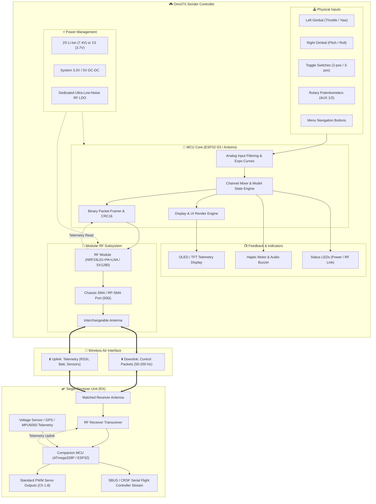
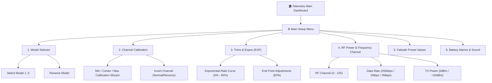
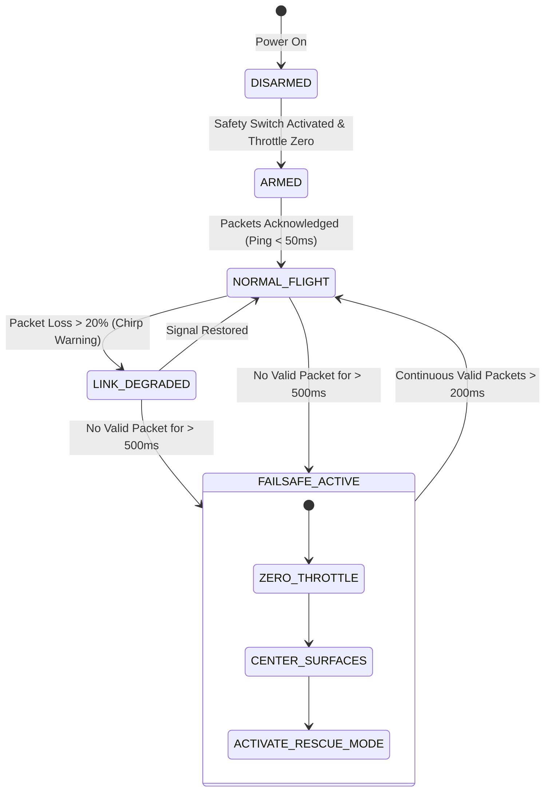

# 🚀 Advanced Modular RC Controller (OmniTX)
### *Next-Generation Arduino/ESP32 Radio Controller with Pluggable Antenna Bay & Real-Time Telemetry Display*

---

[](https://opensource.org/licenses/MIT)
[](https://www.arduino.cc/)
[](#pluggable-rf-subsystem)
[](#display-and-telemetry)
[](#firmware-architecture)
[](#construction-roadmap)
[-C51A4A?style=for-the-badge&logo=raspberry-pi&logoColor=white)](raspberry-pi-b-4g.md)

---

> [!IMPORTANT]
> **MASTER HIGH-LEVEL SPECIFICATION & LIVING BLUEPRINT**  
> This document is the primary reference and requirements manual for building the **OmniTX Advanced RC Controller**. All high-level architectures, standards, packet protocols, antenna configurations, and failsafe specifications originate from this document.
> 
> 🍓 **Dedicated Hardware Implementation**: For constructing the transmitter using a **Raspberry Pi 4 Model B (4GB)** as the master sender and evaluating the **ECA ESP32 30-Pin board** as the receiver, see the specialized hardware design document: [raspberry-pi-b-4g.md](file:///c:/Users/Bahma/Documents/GitHub/arduino-projects/RC-Controller/raspberry-pi-b-4g.md).

---

<a id="table-of-contents"></a>
## 📑 Table of Contents
1. [🌟 System Overview & Core Capabilities](#system-overview)
   - [🔑 Key Architectural Highlights](#system-highlights)
2. [🏗️ High-Level System Architecture](#system-architecture)
   - [🌐 Core System Signal Flow](#system-flow-diagram)
   - [🧩 Module Interactions, Protocols & Engineering Standards](#module-interactions-and-standards)
     - [🗺️ Full Module Interaction Architecture Diagram](#modular-interaction-diagram)
     - [1. Inter-Module Hardware Bus & Electrical Standards](#hardware-bus-standards)
     - [2. RF Air Interface & Wireless Communication Standards](#rf-air-interface-standards)
     - [3. Vehicle & Flight Controller Actuator Interface Standards](#vehicle-interfaces-and-standards)
     - [4. Safety, Failsafe & Operational Interlock Standards](#safety-interlock-standards)
     - [5. Auxiliary Ecosystem Standards (Simulators & Trainer Link)](#auxiliary-ecosystem-standards)
     - [📊 Comprehensive Engineering Standards Reference Matrix](#standards-summary-table)
3. [📡 Pluggable Antenna & RF Transceiver Subsystem](#pluggable-rf-subsystem)
   - [RF Connector Standards (SMA vs RP-SMA)](#rf-connector-standards)
   - [Modular Antenna Selection by Mission Profile](#modular-antenna-selection)
   - [RF Transceiver Options & Comparison](#rf-transceiver-comparison)
   - [RF Power & Noise Decoupling Circuitry](#rf-power-decoupling)
4. [🖥️ Sender Display & Telemetry UI System](#display-and-telemetry)
   - [Display Module Options](#display-module-options)
   - [Telemetry Dashboard & UI Wireframe](#telemetry-dashboard-wireframe)
   - [Menu System & Model Memory Architecture](#menu-system-architecture)
5. [🧠 Microcontroller Core & Hardware Specifications](#mcu-specifications)
   - [Microcontroller Comparison & Recommendation](#mcu-comparison)
   - [Complete Pinout Assignment Matrix](#pinout-matrix)
6. [🕹️ Input Controls & Ergonomics Architecture](#input-controls)
   - [Channel Mapping Standard (AETR vs TAER)](#channel-mapping-standards)
7. [⚡ Power Architecture & Battery Management](#power-architecture)
   - [Battery Protection Specifications](#battery-protection-specs)
8. [🔄 Communication Protocol, Packet Framing & Failsafe](#protocol-and-failsafe)
   - [Over-The-Air Binary Packet Specification](#ota-packet-spec)
   - [Telemetry Uplink Packet (Vehicle to Controller)](#telemetry-uplink-packet)
   - [Failsafe Engine State Machine](#failsafe-state-machine)
9. [🛩️ Companion Receiver (RX) Architecture](#companion-receiver)
10. [📦 Bill of Materials (BOM) & Parts Sourcing](#bill-of-materials)
11. [💻 Firmware Architecture & Directory Structure](#firmware-architecture)
12. [🗺️ Master Construction Roadmap](#construction-roadmap)
13. [⚠️ Safety, RF Compliance & Troubleshooting](#safety-and-troubleshooting)
   - [Critical Hardware Safety Rules](#hardware-safety-rules)
   - [Rapid Troubleshooting Matrix](#troubleshooting-matrix)

---

<a id="system-overview"></a>
## 🌟 System Overview & Core Capabilities

The **OmniTX** is an open-architecture, hobbyist-to-pro grade RC transmitter engineered for versatile remote control scenarios:
- **Multirotors / FPV Drones**: Low-latency, high-refresh rate telemetry and switch-armed failsafe modes.
- **Fixed-Wing Aircraft**: Dual-rate trims, flaps, multi-position flight modes, and long-range link options.
- **Ground Rovers & Crawlers**: Precision dual-axis throttle/steering, lighting toggles, winch controls.
- **Robotic Platforms & RC Boats**: High channel counts, bidirectional sensor telemetry, and failsafe motor cutoffs.

<a id="system-highlights"></a>
### 🔑 Key Architectural Highlights
- 🔌 **Modular 50Ω Pluggable RF Interface**: Equipped with a chassis-mounted **SMA / RP-SMA** gold-plated RF connector, allowing instant swapping between rubber-duck omni antennas, directional high-gain patch antennas, or Sub-GHz dipoles.
- 📺 **Sender-Side Telemetry Cockpit**: Built-in OLED / TFT graphical display presenting real-time stick deflection graphs, battery levels (TX & vehicle RX), Link Quality (LQ), RSSI signal strength (dBm), flight modes, and stopwatch timer.
- 🎛️ **Multi-Channel Precision Inputs**: Support for 2× 2-axis analog gimbals (4 primary channels), 2× 3-position toggle switches, 2× 2-position toggle switches, 2× rotary potentiometers (auxiliary sliders), and navigation menu buttons.
- 🛡️ **Zero-Compromise Failsafe Protection**: Hardware and software link loss watchdog automatically triggers vehicle throttle zeroing and failsafe actions in under 150 ms of lost communication.
- 🔋 **Integrated Power Conditioning**: Dual Li-Ion 18650 / LiPo cell system with independent ultra-low-noise LDO power supply dedicated to the RF front-end to eliminate brownouts and jitter.

---

<a id="system-architecture"></a>
## 🏗️ High-Level System Architecture

<a id="system-flow-diagram"></a>
### 🌐 Core System Signal Flow

The diagram below illustrates the end-to-end signal flow between the **OmniTX Sender Controller**, the **Modular RF Link**, and the **Receiver (RX) Unit**:



---

<a id="module-interactions-and-standards"></a>
### 🧩 Module Interactions, Protocols & Engineering Standards Matrix

To elevate the OmniTX from a simple hobby experiment into a **resilient, industrial-grade radio system**, all internal modules, air interfaces, and vehicle connections must strictly adhere to recognized engineering protocols and standards.

<a id="modular-interaction-diagram"></a>
#### 🗺️ Full Module Interaction & Protocol Architecture Diagram

The architectural diagram below maps out **every system module**, the precise communication bus standards interconnecting them, the over-the-air RF transport stack, and the downstream vehicle actuation standards:

```mermaid
flowchart TB
    %% Pilot Inputs & Signal Conditioning
    subgraph MOD_INPUTS ["🕹️ 1. Pilot Inputs & Signal Conditioning Module (IAM)"]
        direction TB
        IN_STICKS["Dual 2-Axis Gimbals\n(Ch 1-4: Throttle, Roll, Pitch, Yaw)"]
        IN_SWITCHES["Toggle Switches (SPDT)\n(Ch 5-8: Arm, Flight Modes, AUX)"]
        IN_POTS["Rotary Potentiometers\n(Ch 9-10: Gimbal Tilt, Sliders)"]
        IN_BTNS["Navigation & Trim Buttons\n(Menu Nav & Sub-Trims +/-)"]
        
        HW_FILTER["Hardware RC Low-Pass Filter\n(R=10kΩ, C=100nF, fc ≈ 40 Hz)"]
        ADC_SAMPLER["12-Bit SAR ADC (DMA / Multichannel)\n(0 - 4095 counts @ 1 kHz)"]
        DSP_ENGINE["DSP Conditioning Engine\n• EMA Digital Filter (α = 0.3)\n• Deadband Suppression (±25 counts)\n• Exponential Expo Transform (0-60%)\n• 1000µs - 2000µs Normalization"]

        IN_STICKS & IN_POTS --> HW_FILTER --> ADC_SAMPLER --> DSP_ENGINE
        IN_SWITCHES & IN_BTNS --> DSP_ENGINE
    end

    %% Core Microcontroller Engine
    subgraph MOD_CORE ["🧠 2. Dual-Core Real-Time Processor Subsystem (ESP32-S3)"]
        direction TB
        subgraph CORE_APP ["Core 1: System Management, HMI & UI (100 Hz Loop)"]
            CH_MIXER["Channel Mixer Engine\n• Delta-Wing / Elevon Mix\n• V-Tail / Flaperon Mix"]
            STATE_MACHINE["System State & Arming Interlock\n• Throttle Zero Boot Guard\n• Model Profile Manager (1..10)"]
            NVS_STORE["Non-Volatile Storage (NVS / LittleFS)\n(Saves Trims, Calibration, Names)"]
            UI_RENDER["Display Pipeline (Double-Buffered)\n(U8g2 / TFT_eSPI 60 FPS)"]
        end

        subgraph RTOS_PIPE ["⚡ Inter-Core Atomic IPC"]
            QUEUE["Thread-Safe FreeRTOS Queue\n(Zero-Copy Channel Buffer Struct)"]
        end

        subgraph CORE_RF ["Core 0: Deterministic RF & Telemetry Engine (200 Hz Loop)"]
            PKT_ENCODER["Binary Packet Encoder\n(16-Byte Packed Little-Endian)"]
            CRC_ENGINE["CRC-16-CCITT Engine\n(Poly: 0x1021, Init: 0xFFFF)"]
            FHSS_MGR["FHSS Frequency Hopper\n(70+ Channels Pseudorandom)"]
            TDD_SCHED["TDD Frame Scheduler\n(Downlink TX / Uplink RX Slots)"]
        end

        DSP_ENGINE --> CH_MIXER --> STATE_MACHINE
        STATE_MACHINE <--> NVS_STORE
        STATE_MACHINE --> QUEUE --> PKT_ENCODER
        PKT_ENCODER --> CRC_ENGINE --> FHSS_MGR --> TDD_SCHED
        STATE_MACHINE --> UI_RENDER
    end

    %% Displays, Feedback & Simulation
    subgraph MOD_PERIPH ["🖥️ 3. Feedback, Display & External Simulation Module"]
        DISP_PANEL["OLED 128x64 / Color IPS TFT\n(Live Stick Vectors, RSSI, Volts)"]
        ALARM_FEEDBACK["Haptic & Acoustic Alerts\n• 2.7 kHz Piezo Buzzer (PWM)\n• ERM Vibration Motor (MOSFET)"]
        USB_SUBSYS["USB Composite Stack\n• HID Gamepad (Flight Simulators)\n• CDC Virtual COM Port (CLI/Logs)"]

        UI_RENDER -- "Fast I2C (400 kHz) / SPI (40 MHz)" --> DISP_PANEL
        STATE_MACHINE -- "PWM Timers & GPIO" --> ALARM_FEEDBACK
        STATE_MACHINE -- "USB 2.0 Full-Speed" --> USB_SUBSYS
    end

    %% RF Subsystem Front-End
    subgraph MOD_RF_BAY ["📡 4. RF Transceiver & 50Ω Antenna Bay"]
        RF_TRANSCEIVER["RF Transceiver Front-End\n(NRF24L01+PA+LNA / SX1280)\nTX Power: +20 dBm (100 mW)"]
        LDO_CLEAN["Dedicated Low-Noise 3.3V LDO\n(RT9193 / AMS1117 with 10µF+100nF)"]
        SMA_BULKHEAD["Panel SMA Female 50Ω Bulkhead\n(Impedance: 50Ω, VSWR <= 1.5)"]
        MISSION_ANT["Interchangeable Mission Antenna\n(Rubber Duck / Patch / Moxon)"]

        TDD_SCHED -- "High-Speed SPI (10-16 MHz) + IRQ" --> RF_TRANSCEIVER
        LDO_CLEAN -. "Filtered 3.3V" .-> RF_TRANSCEIVER
        RF_TRANSCEIVER -- "50Ω Microstrip / RG178 Pigtail" --> SMA_BULKHEAD --> MISSION_ANT
    end

    %% Air Channel Interface
    subgraph AIR_SPACE ["🌊 5. Wireless Air Interface (2.4 GHz ISM / Sub-GHz)"]
        DOWNLINK_PKT["⬇️ Downlink RC Packet (50 - 250 Hz)\nLatency: 3-8 ms | Range: 1-10 km"]
        UPLINK_PKT["⬆️ Uplink Telemetry ACK (20 - 50 Hz)\n(Battery, RSSI dBm, LQ %, GPS)"]
    end

    MISSION_ANT <==> DOWNLINK_PKT & UPLINK_PKT

    %% Companion Receiver Module
    subgraph MOD_RECEIVER ["🛩️ 6. Companion Receiver & Vehicle Actuation (RX)"]
        RX_ANTENNA["Matched Receiver Antenna"]
        RX_TRANSCEIVER["Transceiver + LNA Front-End"]
        RX_PROCESSOR["Companion MCU (ATmega328P / ESP32)"]
        FAILSAFE_MON["Failsafe Watchdog Engine\n(Auto-Disarm if Ping > 150 ms)"]

        subgraph FLIGHT_INTERFACES ["🔌 Actuator & Flight Controller Standards"]
            PWM_SERVOS["Standard PWM Servo Rail (50-400 Hz)\n(Ch 1-8 Servos & Analog ESCs)"]
            SBUS_STREAM["SBUS Inverted Serial (100k 8E2)\n(Betaflight / iNav / ArduPilot)"]
            CRSF_STREAM["CRSF Duplex Telemetry (420kbaud)\n(High-Speed FC Telemetry)"]
            DSHOT_STREAM["DShot150/300/600 Digital Rail\n(Direct Digital Motor Telemetry)"]
        end

        VEHICLE_SENSORS["On-Board Telemetry Sensors\n(LiPo Voltage Divider, Current, GPS)"]

        RX_ANTENNA <==> RX_TRANSCEIVER
        RX_TRANSCEIVER -- "SPI Bus" --> RX_PROCESSOR
        RX_PROCESSOR <--> FAILSAFE_MON
        RX_PROCESSOR --> PWM_SERVOS & SBUS_STREAM & CRSF_STREAM & DSHOT_STREAM
        VEHICLE_SENSORS -- "ADC / I2C / UART" --> RX_PROCESSOR
        RX_PROCESSOR -. Telemetry Uplink Frame .-> RX_TRANSCEIVER
    end

    DOWNLINK_PKT & UPLINK_PKT <==> RX_ANTENNA
    TDD_SCHED -. Decoded Telemetry .-> UI_RENDER
```



---

<a id="hardware-bus-standards"></a>
#### 1. Inter-Module Hardware Bus & Electrical Standards

Every hardware interconnect within the OmniTX sender unit is governed by dedicated electrical and bus standards:

| Bus / Interface | Electrical Specification | Clock / Baud Rate | Connected Modules | Standard Protocol & Engineering Rationale |
| :--- | :--- | :--- | :--- | :--- |
| **SPI (Serial Peripheral Interface)** | 3.3V CMOS, 4-wire (MOSI, MISO, SCK, CSN) + CE + IRQ | **10 MHz – 16 MHz** (Mode 0: CPOL=0, CPHA=0) | MCU ↔ RF Transceiver (NRF24 / SX1280) | **Motorola SPI Standard**: Maximum throughput for binary packet exchange with deterministic microsecond latency. |
| **I2C (Inter-Integrated Circuit)** | 3.3V Open-Drain, 4.7 kΩ pull-ups on SDA & SCL | **Fast-Mode (400 kHz)** | MCU ↔ OLED Display (SSD1306 / SH1106) | **NXP I2C Standard (UM10204)**: Minimal pin consumption (2 GPIOs); avoids bus lockups with software timeouts. |
| **ADC (Analog-to-Digital Conversion)** | 0.0V – 3.3V, 12-bit Successive Approximation (SAR) | **1 kHz – 5 kHz** per-channel sampling with DMA | MCU ↔ Gimbals, Dials & Battery Divider | **Hardware Anti-Aliasing RC Filter** ($R=10\,\text{k}\Omega, C=100\,\text{nF}, f_c \approx 40\,\text{Hz}$) + Moving Average to eliminate servo tremor. |
| **USB HID (Human Interface Device)** | USB 2.0 Full-Speed (12 Mbps), Differential $D+/D-$ | Standard HID Polling @ **1000 Hz (1 ms)** | MCU ↔ PC / Mac / Smartphone | **USB HID 1.11 Gamepad Standard**: Enables direct plug-and-play use with FPV flight simulators (*Liftoff*, *Velocidrone*, *RealFlight*) with zero drivers! |
| **USB CDC (Virtual COM Port)** | USB 2.0 CDC-ACM Serial VCP | **115,200 / 921,600 baud** | MCU ↔ Debug Terminal / Blackbox GUI | **USB CDC Standard**: High-speed real-time calibration tuning, firmware flashing, and packet logging. |
| **PWM Timers** | 3.3V logic, Timer-driven push-pull output | **2.0 kHz – 4.0 kHz** (Piezo) / **50 Hz** (Servo test) | MCU ↔ Buzzer & Haptic Transistor | Hardware PWM generation for tactile and audio alerts without blocking the processor loops. |

---

<a id="rf-air-interface-standards"></a>
#### 2. RF Air Interface & Wireless Communication Standards

The wireless link is engineered to operate in crowded RF environments (surrounded by Wi-Fi, Bluetooth, and competing transmitters):

```
       ┌────────────────────────────────────────────────────────────────────────┐
       │                 OMNITX WIRELESS AIR INTERFACE STACK                     │
       ├────────────────────────────────────────────────────────────────────────┤
       │ [Layer 7: Application]  RC Channels 1-16, Trims, Flight Modes, Telemetry│
       │ [Layer 4: Transport]    TDD Time-Division Duplexing, 10ms Frame Slot   │
       │ [Layer 3: Network]      FHSS Frequency Hopping (70+ Channels Sequence) │
       │ [Layer 2: Data Link]    Sync Word (0xAA55), 16-Bit CRC-CCITT, Bind ID  │
       │ [Layer 1: Physical PHY] 2.4 GHz ISM / Sub-GHz, GFSK/FLRC/LoRa, 50Ω SMA │
       └────────────────────────────────────────────────────────────────────────┘
```

1. **ISM Band Allocation & Regulatory Compliance**:
   - **2.4000 GHz – 2.4835 GHz** (Worldwide License-Free ISM Band).
   - Maximum transmit power adheres to regional regulations: **100 mW EIRP (+20 dBm)** in CE regions, up to **1000 mW (+30 dBm)** under FCC Part 15 rules with FHSS.
2. **RF Modulation Schemes**:
   - **GFSK (Gaussian Frequency Shift Keying)**: $BT = 0.5$, 250 kbps (maximum sensitivity $-94\,\text{dBm}$) to 2 Mbps (ultra-low latency).
   - **FLRC (Fast Low-Rate Communication)**: Available on SX1280 chips, delivering 1.3 Mbps data rate with $-108\,\text{dBm}$ sensitivity and $<3\,\text{ms}$ latency.
   - **LoRa (Chirp Spread Spectrum)**: Spreading factors SF5 to SF12 for extreme long-range penetration ($>15\,\text{km}$) in noisy environments.
3. **FHSS (Frequency Hopping Spread Spectrum)**:
   - Divides the 2.4 GHz spectrum into **70 to 80 discreet 1 MHz channels**.
   - Hops to a new pseudorandom frequency every 10 ms (100 hops/sec) based on a mathematical seed derived from the transmitter's unique **Bind ID**. If a Wi-Fi router jams channel 36, packet loss is contained to just 1.25% rather than a complete link loss.
4. **TDD (Time-Division Duplexing) Slot Allocation**:
   - Master frame window: **10 ms** (100 Hz refresh rate).
   - **Downlink Slot (0 to 7 ms)**: Transmitter broadcasts packed 16-byte RC control packet.
   - **Uplink Slot (7 to 10 ms)**: Receiver replies with 7-byte Telemetry ACK packet containing vehicle battery, RSSI, and sensor telemetry.
5. **Frame Integrity & Checksum Verification**:
   - Fixed 16-bit Preamble + Synchronization Word: `0xAA55`.
   - **CRC-16-CCITT Error Detection**: Generator polynomial $x^{16} + x^{12} + x^5 + 1$ (Hex: `0x1021`, Initial: `0xFFFF`). Corrupted packets are rejected before reaching flight servos.
6. **Impedance Matching & 50Ω RF Front-End Standard**:
   - All RF traces are designed as $50\,\Omega$ coplanar waveguides with ground clearance.
   - Terminated to a chassis **SMA Female bulkhead** with a target **VSWR $\le 1.5:1$** to maximize forward radiated power and protect the power amplifier.

---

<a id="vehicle-interfaces-and-standards"></a>
#### 3. Vehicle & Flight Controller Actuator Interface Standards

The companion receiver must communicate seamlessly with legacy servos as well as modern flight controllers (*Betaflight, iNav, ArduPilot, PX4*):

| Actuator Protocol | Signal Topology | Baud / Frequency | Frame Period | Purpose & Flight Controller Integration |
| :--- | :--- | :--- | :--- | :--- |
| **PWM (Pulse Width Modulation)** | 5V / 3.3V Single-wire per channel | 50 Hz (20 ms period) standard (up to 400 Hz for digital servos) | 20 ms | **RC Servo Standard**: $1000\,\mu\text{s}$ (0%), $1500\,\mu\text{s}$ (Center), $2000\,\mu\text{s}$ (100%). Direct control of analog/digital servos and standard motor ESCs. |
| **SBUS (Serial Bus)** | Inverted Asynchronous Serial (Open-collector/TTL) | **100,000 baud, 8-E-2** (8 data bits, Even parity, 2 stop bits) | 9 ms (high speed) or 14 ms | **Futaba / OpenTX Flight Controller Standard**: Carries 16 proportional 11-bit channels + 2 boolean channels + failsafe flag in a single 25-byte frame. |
| **CRSF (Crossfire Protocol)** | Non-Inverted Full-Duplex UART | **420,000 baud, 8-N-1** (8 data bits, No parity, 1 stop bit) | 4 ms – 10 ms | **TBS Crossfire / ExpressLRS Modern Standard**: Multi-frame protocol with dynamic payloads (RC channels, battery, GPS coordinates, flight modes, link statistics). |
| **DShot (Digital Shot - DShot300/600)** | Bidirectional Single-Wire Digital Bitstream | 300 kbit/s (DShot300) or 600 kbit/s (DShot600) | Microsecond bursts | **Modern Drone ESC Standard**: Sends exact digital throttle values with 4-bit CRC; receives motor RPM telemetry back over the same line without analog drift. |
| **MSP (Multiwii Serial Protocol) / MAVLink** | Full-Duplex Serial UART | 115,200 / 57,600 baud | Periodic polling | Enables bidirectional mission telemetry exchange with ArduPilot and Betaflight flight computers. |

---

<a id="safety-interlock-standards"></a>
#### 4. Safety, Failsafe & Operational Interlock Standards

Safety standards are strictly enforced in firmware to prevent unintended motor spin-ups or vehicle fly-aways:

- 🛑 **Pre-Flight Throttle Interlock**: Upon powering on the controller, the firmware performs a hardware safety check. If the throttle stick is $>2\%$ deflection or the physical `ARM` toggle switch is in the active position, the controller sounds an alarm and blocks RF transmission until all controls are returned to zero/safe.
- ⏱️ **Deterministic Failsafe Watchdog ($<150\,\text{ms}$)**: The companion receiver maintains a hardware watchdog timer. If valid RF packets cease for $>150\,\text{ms}$, the receiver enters `FAILSAFE` mode:
  - Drops channel 3 (Throttle) to $0\,\mu\text{s}$ ($988\,\mu\text{s}$ dead stop).
  - Asserts the SBUS / CRSF failsafe flag byte, triggering the flight controller's automated **GPS Rescue / Return-to-Home (RTH)** sequence.
- 🔒 **Model ID Authentication Hash**: Every model saved in the transmitter contains a unique 16-bit cryptographic Model ID hash embedded in every frame. The receiver will ignore packets from the same transmitter if the wrong model profile is active on the OLED screen.
- ⚡ **Brownout & Voltage Sag Guard**: An internal supervisory circuit detects voltage dips below 3.0V on the MCU, safely locking state and sounding an audible warning rather than outputting corrupted PWM pulses to motors.

---

<a id="auxiliary-ecosystem-standards"></a>
#### 5. Auxiliary Ecosystem Standards (Simulators & Trainer Link)

To maximize usability beyond field flying, OmniTX implements standard simulation and training bridges:

- 🎮 **USB HID Joystick Flight Simulator Standard**: When plugged into a computer via USB-C, the ESP32-S3 exposes a standard USB Human Interface Device (HID) descriptor featuring 8 proportional axes and 16 buttons. Compatible out of the box with *Liftoff*, *Velocidrone*, *Uncrashed*, *DCL The Game*, *AccuRC*, and *RealFlight*.
- 👨‍🏫 **Trainer Port / Buddy-Box Protocol**:
  - **Hardware 3.5 mm Jack**: Emits standard 8-channel PPM (Pulse Position Modulation) pulse train for direct cable connection to student radios.
  - **Wireless Bluetooth LE Trainer**: The ESP32 Bluetooth stack can pair wirelessly with a student transmitter, allowing an instructor to toggle master control using switch `SW_C`.

---

<a id="standards-summary-table"></a>
#### 📊 Comprehensive Engineering Standards Reference Matrix

| Subsystem Domain | Implemented Standard | Specification / Parameter | Status in OmniTX | Architectural Benefit |
| :--- | :--- | :--- | :--- | :--- |
| **RF Physical (PHY)** | 50Ω RF Bulkhead | SMA Female 50Ω Chassis Mount, VSWR $\le 1.5$ | 🟢 **Core Standard** | Allows swapping Omni, Patch, and Moxon antennas safely. |
| **RF Modulation** | GFSK / FLRC / LoRa | 2.4 GHz ISM / Sub-GHz, $BT=0.5$, 250k - 2Mbps | 🟢 **Core Standard** | Adaptable from high-speed racing to 10 km+ long-range telemetry. |
| **Air Spread Spectrum**| FHSS (Frequency Hopping)| 70+ Hopping channels, 10 ms dwell time | 🟢 **Core Standard** | Complete immunity against residential Wi-Fi and Bluetooth interference. |
| **Packet Integrity** | CRC-16-CCITT | Polynomial: `0x1021`, Initial: `0xFFFF`, Sync: `0xAA55` | 🟢 **Core Standard** | Bit-error rejection ensures zero corrupted commands reach vehicle. |
| **Duplexing Scheme** | TDD (Time-Division) | 10 ms window: 7 ms TX Downlink / 3 ms RX Telemetry | 🟢 **Core Standard** | Bidirectional real-time telemetry without second receiver module. |
| **Display Protocol** | Fast I2C / SPI | I2C 400 kHz (UM10204) / SPI 40 MHz | 🟢 **Core Standard** | Smooth 60 FPS graphical cockpit rendering without CPU lag. |
| **Flight Controller Out**| SBUS Protocol | Inverted Serial, 100kbaud 8-E-2, 25-byte frame | 🟢 **Core Standard** | Single-wire 16-channel connection to Betaflight, iNav, ArduPilot. |
| **Modern Telemetry Out**| CRSF Protocol | Duplex UART, 420kbaud 8-N-1 | 🟣 **Phase 5 Feature** | High-speed bidirectional telemetry pipeline with flight computers. |
| **Direct Actuators** | Standard RC PWM | 50 Hz – 400 Hz, $1000\,\mu\text{s} - 2000\,\mu\text{s}$ pulses | 🟢 **Core Standard** | Plug-and-play compatibility with standard airplane/car servos & ESCs. |
| **Simulator Interface**| USB HID Gamepad | USB 2.0 Full-Speed HID Joystick Descriptor | 🟢 **Core Standard** | Zero-latency flight training on PC/Mac FPV simulators via USB-C. |
| **Non-Volatile Memory**| NVS / LittleFS | Key-Value & Binary Struct Flash Storage | 🟢 **Core Standard** | Preserves 10 model configs, stick trims, and calibrations through reboot. |
| **Safety Interlock** | Failsafe Watchdog | Hardware & Software 150 ms link loss auto-cutoff | 🟢 **Core Standard** | Guarantees instant motor disarm and GPS rescue on link loss. |

---

<a id="pluggable-rf-subsystem"></a>
## 📡 Pluggable Antenna & RF Transceiver Subsystem

A primary design requirement of this project is the **standardized pluggable antenna interface**, allowing the controller to adapt to different operational ranges, frequencies, and physical environments without rebuilding the core hardware.

<a id="rf-connector-standards"></a>
### RF Connector Guide: SMA vs RP-SMA

> [!WARNING]
> **CRITICAL RF MATING RULE**: Connecting incompatible pin/hole pairs can snap the central RF pin or leave a completely uncoupled air gap, resulting in instant amplifier burnout on high-power PA modules!

| Connector Type | Outer Thread Gender | Center Conductor | Used Commonly In | Mates With |
| :--- | :--- | :--- | :--- | :--- |
| **SMA Male** | Inside threads | **Solid Pin** | Commercial Antennas / Amateur Radio / FPV video | SMA Female |
| **SMA Female** | Outside threads | **Receptacle (Hole)** | **Controller Chassis Mount (Recommended)** | SMA Male |
| **RP-SMA Male** | Inside threads | **Receptacle (Hole)** | Wi-Fi Antennas / Commercial 2.4GHz gear | RP-SMA Female |
| **RP-SMA Female**| Outside threads | **Solid Pin** | Wi-Fi Routers / Commercial RC Transmitters | RP-SMA Male |

```
Standard SMA (Recommended for OmniTX):
   [SMA Female Chassis Jack]  <=====>  [SMA Male Antenna Plug]
   Outer Threads: External             Outer Threads: Internal
   Center Pin: Hole (Receptacle)        Center Pin: Solid Gold Pin
```

<a id="modular-antenna-selection"></a>
### Modular Antenna Selection by Mission Profile

By terminating the transmitter RF module output to a **panel-mounted 50Ω SMA Female bulkhead connector** via a low-loss RG178 / RG316 IPX/U.FL pigtail, the operator can switch antennas depending on the mission:

```
  ┌────────────────────────────────────────────────────────────────────────┐
  │                   ANTENNA PROFILES CATALOG TABLE                       │
  ├──────────────────┬───────────┬──────────┬──────────────┬───────────────┤
  │ Antenna Style    │ Gain (dBi)│ Radiation│ Beam Angle   │ Best Use Case │
  ├──────────────────┼───────────┼──────────┼──────────────┼───────────────┤
  │ 2.4GHz Rubber Duck│ 2.0 - 3.0 │ Omni     │ 360° Horiz.  │ General LOS,  │
  │ (Standard Whip)  │           │          │ 70° Vert.    │ Cars, Boats   │
  ├──────────────────┼───────────┼──────────┼──────────────┼───────────────┤
  │ 2.4GHz High-Gain │ 5.0 - 7.0 │ Omni     │ 360° Horiz.  │ Park Flyers,  │
  │ Long Dipole      │           │ Flattened│ 30° Vert.    │ Flat Fields   │
  ├──────────────────┼───────────┼──────────┼──────────────┼───────────────┤
  │ 2.4GHz Patch /   │ 8.0 - 12.0│ Direction│ ~60° Cone    │ Long Range    │
  │ Directional Panel│           │          │ Forward      │ Fixed Wing FPV│
  ├──────────────────┼───────────┼──────────┼──────────────┼───────────────┤
  │ 915/868MHz Moxon │ 5.5 dBi   │ Direction│ ~120° Cone   │ Ultra Long    │
  │ (Sub-GHz LoRa)   │           │ Forward  │ Forward      │ Range (10km+) │
  ├──────────────────┼───────────┼──────────┼──────────────┼───────────────┤
  │ 2.4GHz Cloverleaf│ 1.2 dBi   │ Circular │ Spherical    │ Acro Drones,  │
  │ (RHCP)           │           │ Pol.     │              │ Multipath Rej.│
  └──────────────────┴───────────┴──────────┴──────────────┴───────────────┘
```

> [!CAUTION]
> **NEVER TRANSMIT WITHOUT AN ANTENNA CONNECTED!**  
> If an RF module with Power Amplifier (e.g., NRF24L01+PA+LNA @ +20 dBm or SX1280 @ +13 dBm) is powered on without a 50Ω load (antenna attached), 100% of the forward RF energy is reflected back into the amplifier transistor (VSWR > 20:1), resulting in permanent silicon destruction in seconds.

<a id="rf-transceiver-comparison"></a>
### RF Transceiver Options & Comparison

The OmniTX platform is engineered to support swappable or modular transceivers:

| Metric | Option A: NRF24L01+PA+LNA | Option B: SX1280 (FLRC / LoRa) | Option C: SX1262 / SX1276 | Option D: ESP-NOW (Native) |
| :--- | :--- | :--- | :--- | :--- |
| **Frequency Band** | 2.400 - 2.525 GHz | 2.400 - 2.500 GHz | 433 / 868 / 915 MHz | 2.400 - 2.484 GHz |
| **Max TX Power** | +20 dBm (100 mW) | +13 dBm to +20 dBm | +22 dBm (160 mW) | +20 dBm (100 mW) |
| **Typical Range (LOS)**| 800 m - 1.2 km | 3 km - 10 km (LoRa) | 10 km - 30 km+ | 200 m - 450 m |
| **Packet Latency** | 3 - 8 ms | 2 - 5 ms (FLRC mode) | 20 - 60 ms (LoRa) | 2 - 5 ms |
| **Modulation** | GFSK | FLRC, LoRa, GFSK | LoRa, FSK | DSSS / OFDM (802.11) |
| **Hardware Bus** | High-Speed SPI (10MHz) | High-Speed SPI (16MHz) | High-Speed SPI (10MHz) | On-chip (ESP32 only) |
| **RF Connector** | IPX/U.FL to SMA on PCB | IPX/U.FL to SMA | IPX/U.FL to SMA | Ceramic / External U.FL|
| **Cost & Sourcing**| 🟢 Low (~$2.50) | 🟡 Moderate (~$6.00) | 🟡 Moderate (~$5.00) | 🟢 Free (Built-in) |
| **Recommended For**| **Phase 1 Prototyping** | **Ultimate 2.4GHz Build** | **Extreme Range Rovers** | **Quick Breadboard POC**|

<a id="rf-power-decoupling"></a>
### RF Power & Noise Decoupling Circuitry

RF transceivers demand transient currents up to 150-200 mA during transmit pulses. If powered directly from noisy MCU 3.3V rails without proper filtering, packet loss spikes dramatically.

```
       RAW BATTERY (7.4V or 5.0V)
                  │
                  ▼
         [Dedicated 3.3V LDO]  (e.g., AMS1117-3.3 or RT9193-33)
                  │
                  ├───┬───────────────────────┐
                  │   │                       │
                 === [100µF Low-ESR Tantalum] │
                  │   │                       │
                  │  === [10µF Ceramic]       │
                  │   │                       │
                  │  === [100nF Ceramic]      │
                  │   │ (Placed within 5mm)   │
                  │   │                       │
                  ▼   ▼                       ▼
            [RF VCC (Pin 2)]             [VCC Decoupling]
            [NRF24 / SX1280]             [Shield Ground]
```

> [!TIP]
> Always solder a **10 µF tantalum or electrolytic capacitor** in parallel with a **100 nF ceramic capacitor** directly across the `VCC` and `GND` pins of the RF transceiver module. This single hardware modification prevents 95% of communication dropouts caused by voltage ripples.

---

<a id="display-and-telemetry"></a>
## 🖥️ Sender Display & Telemetry UI System

Having real-time telemetry on the transmitter turns an ordinary RC remote into an **intelligent control station**.

<a id="display-module-options"></a>
### Display Module Options

| Display Technology | Interface | Resolution | Refresh Speed | Power Draw | Sunlight Visibility | Verdict |
| :--- | :--- | :--- | :--- | :--- | :--- | :--- |
| **SSD1306 OLED (0.96")** | I2C (4-pin) | 128 × 64 Mono | 30 - 45 FPS | ~20 mA | 🟡 Fair | 🟢 **Ideal for POC & Compact build** |
| **SH1106 OLED (1.30")** | I2C / SPI | 128 × 64 Mono | 30 - 50 FPS | ~25 mA | 🟢 Good | 🟢 **Best Compact Readability** |
| **ST7789 IPS Color TFT**| SPI (7-pin) | 240 × 240 / 320×240 | 60+ FPS (SPI) | ~60 mA | 🟢 Excellent | 🟣 **Advanced Pro Build Choice** |
| **ILI9341 Color TFT (2.8")**| SPI + Touch | 320 × 240 Color | 40 - 60 FPS | ~90 mA | 🟢 Excellent | 🟡 Requires larger enclosure |

<a id="telemetry-dashboard-wireframe"></a>
### Telemetry Dashboard & UI Wireframe

The standard 128×64 pixel OLED telemetry screen is divided into **three functional zones**:

```
┌─────────────────────────────────────────────────────────────┐
│ TX: 8.1V [███]    RX: 11.8V [██ ]    SIG: -62dBm  LQ: 100% │  <-- Zone 1: Status & Power Bar
├─────────────────────────────────────────────────────────────┤
│   CH1 (AIL)   CH2 (ELE)   CH3 (THR)   CH4 (RUD)             │
│    [──|──]     [──|──]     [|─────]    [──|──]              │  <-- Zone 2: Real-Time Gimbal
│     -04%        +12%         00%        -02%                │      & Channel Sliders
│                                                             │
│   AUX1: [POS 2]    AUX2: [MAX]    ARM: [SAFE]               │  <-- Switch & Safety Flags
├─────────────────────────────────────────────────────────────┤
│ MODEL: 01 (Trainer)   MODE: ACRO    PKT: 100Hz   T: 12:45   │  <-- Zone 3: Model & Session Bar
└─────────────────────────────────────────────────────────────┘
```

#### On-Screen Telemetry Parameters:
1. **TX Battery Voltage**: Measured via internal voltage divider on ADC (`V_TX`).
2. **RX Vehicle Battery Voltage**: Received via uplink packet from telemetry sensor (`V_RX`).
3. **Signal Quality (LQ / RSSI)**: Packet success rate percentage and RSSI in dBm.
4. **Channel Deflection Indicators**: Miniature bar gauges representing stick deflection (-100% to +100%).
5. **Arming Status Banner**: Flashing `[ARMED]` or steady `[DISARMED]` warning indicator.
6. **Active Model Profile**: Current model configuration (e.g., "Drone-01", "Glider", "Rover").
7. **Session Stopwatch**: Flight / drive timer automatically started when throttle passes 5%.

<a id="menu-system-architecture"></a>
### Menu System & Model Memory Architecture

The display controller integrates a **hierarchical settings menu** navigated using a rotary encoder or 3 navigation buttons (`UP`, `DOWN`, `SELECT`):



---

<a id="mcu-specifications"></a>
## 🧠 Microcontroller Core & Hardware Specifications

<a id="mcu-comparison"></a>
### Microcontroller Comparison & Recommendation

| Feature / MCU | Arduino Nano (ATmega328P) | STM32F401 (BlackPill) | ESP32-S3 (Recommended) |
| :--- | :--- | :--- | :--- |
| **Clock Speed** | 16 MHz (8-bit) | 84 MHz (32-bit ARM) | 240 MHz (Dual-Core 32-bit) |
| **Flash Memory** | 32 KB | 512 KB | 8 MB - 16 MB |
| **SRAM** | 2 KB | 96 KB | 512 KB |
| **ADC Channels** | 8 channels (10-bit) | 16 channels (12-bit) | 20 channels (12-bit with DMA) |
| **Hardware SPI / I2C** | 1x SPI / 1x I2C | 3x SPI / 3x I2C | 3x SPI / 2x I2C |
| **Built-in Wireless**| None | None | 2.4 GHz Wi-Fi & BLE 5.0 |
| **USB Support** | External CH340 / FTDI | Native USB Device | Native USB-C OTG |
| **Suitability** | 🟡 Minimum viable baseline | 🟢 High performance | 🌟 **Ultimate Best Choice** |

> [!TIP]
> **ESP32-S3 or ESP32 Dual-Core is the strongly recommended MCU**:
> - **Core 0** is dedicated solely to the high-speed RF transmit/receive loop and failsafe watchdog timer.
> - **Core 1** runs the OLED graphics rendering, menu system, and ADC filtering smoothly without dropping RF packets.

<a id="pinout-matrix"></a>
### Complete Pinout Assignment Matrix

The pin mapping below is optimized for the **ESP32-S3 / ESP32 DevKit** architecture:

```
               ┌──────────────────────────────┐
               │    ESP32 / ESP32-S3 38-PIN   │
               ├──────────────┬───────────────┤
         3.3V  │ [1]      [38]│  GND          │
           EN  │ [2]      [37]│  GPIO 23 (MOSI - RF)
(Roll) GPIO 36 │ [3]      [36]│  GPIO 22 (I2C SCL - Display)
(Pitch)GPIO 39 │ [4]      [35]│  GPIO 21 (I2C SDA - Display)
(Throt)GPIO 34 │ [5]      [34]│  GPIO 19 (MISO - RF)
(Yaw)  GPIO 35 │ [6]      [33]│  GPIO 18 (SCK - RF)
 (POT1)GPIO 32 │ [7]      [32]│  GPIO 5  (RF CSN / NSS)
 (POT2)GPIO 33 │ [8]      [31]│  GPIO 4  (RF CE)
 (SW_A)GPIO 25 │ [9]      [30]│  GPIO 2  (RF IRQ)
 (SW_B)GPIO 26 │ [10]     [29]│  GPIO 15 (Buzzer PWM)
 (SW_C)GPIO 27 │ [11]     [28]│  GPIO 13 (Haptic Motor)
 (SW_D)GPIO 14 │ [12]     [27]│  GPIO 12 (Batt Voltage ADC)
               └──────────────┴───────────────┘
```

#### Detailed Hardware Pinout Reference Table:

| Subsystem | Signal Function | ESP32 Pin | Arduino Nano Pin | Hardware Type | Description |
| :--- | :--- | :--- | :--- | :--- | :--- |
| **Left Gimbal** | Throttle (Y-axis) | `GPIO 34` | `A0` | Analog Input | 10k potentiometer / Hall sensor |
| **Left Gimbal** | Yaw / Rudder (X-axis) | `GPIO 35` | `A1` | Analog Input | 10k potentiometer / Hall sensor |
| **Right Gimbal** | Pitch / Elevator (Y-axis) | `GPIO 39` | `A2` | Analog Input | 10k potentiometer / Hall sensor |
| **Right Gimbal** | Roll / Aileron (X-axis) | `GPIO 36` | `A3` | Analog Input | 10k potentiometer / Hall sensor |
| **Auxiliary Dial 1** | AUX 1 (Potentiometer) | `GPIO 32` | `A6` | Analog Input | 10k Linear Rotary Potentiometer |
| **Auxiliary Dial 2** | AUX 2 (Potentiometer) | `GPIO 33` | `A7` | Analog Input | 10k Linear Rotary Potentiometer |
| **Switch A (Arm)** | Safety Arming Switch | `GPIO 25` | `D2` | Digital Input (Pullup) | 2-Position Toggle Switch (SPST) |
| **Switch B (Mode)**| Flight Mode Switch | `GPIO 26, 27` | `D3, D4` | Digital Input (Pullup) | 3-Position Toggle Switch (SPDT Center-Off)|
| **Switch C (Rates)**| Dual Rates Switch | `GPIO 14` | `D7` | Digital Input (Pullup) | 2-Position Toggle Switch |
| **Display (I2C)** | `SDA` (Serial Data) | `GPIO 21` | `A4` | Open-Drain Bidirectional| OLED Display I2C Bus |
| **Display (I2C)** | `SCL` (Serial Clock) | `GPIO 22` | `A5` | Push-Pull Output | OLED Display I2C Clock (400 kHz) |
| **RF Transceiver** | `SCK` (SPI Clock) | `GPIO 18` | `D13` | SPI Clock Out | Hardware SPI Bus Clock |
| **RF Transceiver** | `MOSI` (Master Out) | `GPIO 23` | `D11` | SPI Data Out | Hardware SPI Data Line |
| **RF Transceiver** | `MISO` (Master In) | `GPIO 19` | `D12` | SPI Data In | Hardware SPI Data Return Line |
| **RF Transceiver** | `CSN` / `NSS` (Chip Select) | `GPIO 5` | `D10` | Digital Output | Active Low SPI Chip Select |
| **RF Transceiver** | `CE` (Chip Enable) | `GPIO 4` | `D9` | Digital Output | RF Transmit/Receive Enable |
| **RF Transceiver** | `IRQ` (Interrupt) | `GPIO 2` | `D8` | Digital Input | Packet Received / ACK Interrupt |
| **Haptic Feedback** | Vibration Motor | `GPIO 13` | `D5` | Digital Out (MOSFET) | Low battery & failsafe tactile vibration|
| **Audio Feedback** | Passive Buzzer | `GPIO 15` | `D6` | PWM Output | Melodies, alarms, confirmation clicks |
| **Power Sensing** | TX Battery Monitor | `GPIO 12` | `A7` | Analog Divider Input | 100kΩ / 33kΩ voltage divider |

---

<a id="input-controls"></a>
## 🕹️ Input Controls & Ergonomics Architecture

To ensure high-precision flight control, the inputs must be physically robust, electronically filtered, and mathematically normalized.

```
       RAW POTENTIOMETER VOLTAGE (0.0V - 3.3V)
                         │
                         ▼
             [100nF Hardware Low-Pass Filter]
                         │
                         ▼
               [12-bit ADC Sampling] (Values: 0 - 4095)
                         │
                         ▼
             [Moving Average / EMA Filter (Alpha = 0.3)]
                         │
                         ▼
              [Deadband Calculation (Center ±25 counts)]
                         │
                         ▼
               [Exponential Curve Mapping (Expo = 25%)]
                         │
                         ▼
        NORMALIZED RC CHANNEL (1000 µs - 1500 µs - 2000 µs)
```

<a id="channel-mapping-standards"></a>
### Channel Mapping Standard (AETR vs TAER)
The OmniTX supports selectable channel mapping profiles stored in non-volatile memory:
- **AETR Mode** (Standard for OpenTX / EdgeTX / Betaflight):
  - **CH1**: Aileron (Roll)
  - **CH2**: Elevator (Pitch)
  - **CH3**: Throttle
  - **CH4**: Rudder (Yaw)
- **TAER Mode** (Standard for Spektrum):
  - **CH1**: Throttle | **CH2**: Aileron | **CH3**: Elevator | **CH4**: Rudder
- **CH5 - CH8**: Auxiliary channels (Arming, Flight Modes, Gimbal Tilt, Headlights/Buzzer).

---

<a id="power-architecture"></a>
## ⚡ Power Architecture & Battery Management

Stable, clean power is paramount for RF range and preventing microcontroller brownouts during vibration motor pulses.

```
                    ┌────────────────────────────┐
                    │ 2S Li-Ion Pack (7.4V-8.4V) │
                    └─────────────┬──────────────┘
                                  │
                       [Main Power Rocker Switch]
                                  │
         ┌────────────────────────┴────────────────────────┐
         │                                                 │
         ▼                                                 ▼
┌─────────────────────────┐                     ┌────────────────────────┐
│ DC-DC Step-Down (5.0V)  │                     │ Precision 100k/33k Div │
│ (Powers MCU & Display)  │                     │ Connected to GPIO 12   │
└────────────┬────────────┘                     └────────────────────────┘
             │
   ┌─────────┴────────────────────────┐
   │                                  │
   ▼                                  ▼
[MCU 3.3V System Rail]    [Ultra-Low Noise Dedicated 3.3V LDO]
(ESP32, OLED, Buzzer)     (Exclusively powers RF PA Module)
```

<a id="battery-protection-specs"></a>
### Battery Protection Specifications:
- **Low Battery Warning (Alert 1)**: When cell drops below **3.6V** (7.2V total pack), audio tone chirps and display flashes battery icon.
- **Critical Battery Warning (Alert 2)**: When cell drops below **3.4V** (6.8V total pack), continuous haptic vibration and emergency screen warning.
- **Hardware Reverse-Polarity Protection**: P-Channel MOSFET (e.g., AO3401) on input path prevents board destruction if battery is connected backwards.

---

<a id="protocol-and-failsafe"></a>
## 🔄 Communication Protocol, Packet Framing & Failsafe

<a id="ota-packet-spec"></a>
### Over-The-Air Binary Packet Specification

Instead of sending slow ASCII text strings (e.g. `sprintf` commas), the OmniTX utilizes a **compact 16-byte packed binary struct** transmitted at up to 200 Hz.

```
┌───────┬────────┬─────────────────────────┬──────────────┬───────────────┬─────────┐
│ Byte  │ Name   │ Type                    │ Resolution   │ Range         │ Purpose │
├───────┼────────┼─────────────────────────┼──────────────┼───────────────┼─────────┤
│ 0     │ SYNC1  │ uint8_t                 │ Constant     │ 0xAA          │ Framing │
│ 1     │ SYNC2  │ uint8_t                 │ Constant     │ 0x55          │ Framing │
│ 2     │ PKT_ID │ uint8_t                 │ Counter      │ 0 to 255      │ Dropped │
│ 3..4  │ CH1    │ uint16_t (Little Endian)│ 16-bit (µs)  │ 1000 - 2000 µs│ Roll    │
│ 5..6  │ CH2    │ uint16_t (Little Endian)│ 16-bit (µs)  │ 1000 - 2000 µs│ Pitch   │
│ 7..8  │ CH3    │ uint16_t (Little Endian)│ 16-bit (µs)  │ 1000 - 2000 µs│ Throttle│
│ 9..10 │ CH4    │ uint16_t (Little Endian)│ 16-bit (µs)  │ 1000 - 2000 µs│ Yaw     │
│ 11    │ CH5..8 │ uint8_t                 │ Bitfields    │ 4x 2-bit state│ Switches│
│ 12    │ AUX1   │ uint8_t                 │ Scaled 0-255 │ 8-bit Analog  │ Dial 1  │
│ 13    │ AUX2   │ uint8_t                 │ Scaled 0-255 │ 8-bit Analog  │ Dial 2  │
│ 14..15│ CRC16  │ uint16_t (CCITT)        │ Checksum     │ 0x0000-0xFFFF │ Integrity
└───────┴────────┴─────────────────────────┴──────────────┴───────────────┴─────────┘
```

<a id="telemetry-uplink-packet"></a>
### Telemetry Uplink Packet (Vehicle to Controller)
```
┌───────┬────────┬─────────────────────────┬──────────────┬───────────────┬─────────┐
│ Byte  │ Name   │ Type                    │ Resolution   │ Range         │ Purpose │
├───────┼────────┼─────────────────────────┼──────────────┼───────────────┼─────────┤
│ 0     │ SYNC1  │ uint8_t                 │ Constant     │ 0xEE          │ Uplink  │
│ 1     │ RX_BAT │ uint16_t                │ 10 mV / LSB  │ 0 - 25.2V     │ Vehicle │
│ 2     │ RSSI   │ int8_t                  │ 1 dBm / LSB  │ -120 to 0 dBm │ Signal  │
│ 3     │ LQ     │ uint8_t                 │ 1 % / LSB    │ 0 - 100%      │ Quality │
│ 4     │ STATUS │ uint8_t                 │ Bitflags     │ Flags         │ Arm/GPS │
│ 5..6  │ CRC16  │ uint16_t                │ Checksum     │ 0x0000-0xFFFF │ Valid   │
└───────┴────────┴─────────────────────────┴──────────────┴───────────────┴─────────┘
```

<a id="failsafe-state-machine"></a>
### Failsafe Engine State Machine



---

<a id="companion-receiver"></a>
## 🛩️ Companion Receiver (RX) Architecture

The receiver companion module receives the over-the-air packets and outputs signals for servos and flight controllers:

```
                          ┌────────────────────────────┐
                          │   Receiver Pluggable Ant   │
                          │      (SMA / U.FL Dipole)   │
                          └─────────────┬──────────────┘
                                        │
                          ┌─────────────▼──────────────┐
                          │ NRF24L01 / SX1280 RX Module│
                          └─────────────┬──────────────┘
                                        │ High-Speed SPI
                          ┌─────────────▼──────────────┐
                          │ Companion MCU (e.g. ATmega │
                          │ 328P / Pro Mini / ESP32)   │
                          └──────┬──────────────┬──────┘
                                 │              │
                   ┌─────────────▼────┐    ┌────▼─────────────┐
                   │ 8x PWM Outputs   │    │ SBUS / CRSF      │
                   │ (Direct to Servos│    │ Serial Inverted  │
                   │  & Motor ESCs)   │    │ (Flight Contrl)  │
                   └──────────────────┘    └──────────────────┘
```

---

<a id="bill-of-materials"></a>
## 📦 Bill of Materials (BOM) & Parts Sourcing

The hardware BOM is divided into the primary components required for the transmitter:

| Category | Component Description | Recommended Model | Qty | Est. Cost (USD) |
| :--- | :--- | :--- | :--- | :--- |
| **Microcontroller** | ESP32-S3 DevKitC (or ESP32 NodeMCU) | ESP32-S3-WROOM-1 | 1 | $4.50 |
| **RF Transceiver** | 2.4GHz +20dBm Transceiver with PA+LNA | NRF24L01+PA+LNA (IPX) | 1 | $2.80 |
| **Chassis RF Port** | IPX/U.FL to SMA Female Bulkhead Pigtail (RG178 50Ω)| 15cm Gold-plated SMA-F | 1 | $1.20 |
| **Primary Antenna** | 2.4GHz 3dBi Rubber Duck Omnidirectional Antenna | SMA Male Swivel Dipole | 1 | $1.50 |
| **Long-Range Ant** | 2.4GHz 9dBi Directional Panel Patch Antenna | SMA Male Directional | 1 | $4.00 |
| **Display** | 0.96" or 1.3" I2C Monochrome OLED Screen | SSD1306 / SH1106 | 1 | $2.50 |
| **Gimbals** | 2-Axis Joystick Gimbal Assemblies | FrSky M9 or Arduino Thumb | 2 | $6.00 - $18.00 |
| **Switches** | 2-Position Miniature Toggle Switch (MTS-102) | SPDT ON-ON | 2 | $1.00 |
| **Switches** | 3-Position Miniature Toggle Switch (MTS-103) | SPDT ON-OFF-ON | 2 | $1.20 |
| **Potentiometers**| 10kΩ Linear Rotary Potentiometers with Knobs | B10K Potentiometer | 2 | $0.80 |
| **Feedback** | 5V Active/Passive Buzzer + 3V Coin Vibration Motor | Haptic ERM Motor | 1+1 | $1.00 |
| **Power Supply** | 18650 Li-Ion Cells (3000mAh) + 2S Battery Holder | Samsung 30Q / LG HG2 | 2 | $7.00 |
| **Regulators** | Step-down Buck Converter / LDO Module | MP1584EN / AMS1117-3.3 | 2 | $1.50 |
| **Passive Bay** | 10µF Tantalum, 100nF Ceramic Caps, 100k/33k Resistors| Miscellaneous kit | 1 | $1.00 |
| **Total Estimated BOM** | | | | **~$36.00 - $48.00** |

---

<a id="firmware-architecture"></a>
## 💻 Firmware Architecture & Directory Structure

The project is structured with a modular, testable C++ architecture compatible with both **Arduino IDE** and **PlatformIO**:

```
RC-Controller/
├── README.md                      # 📖 Master Specification & Blueprint (This Document)
├── platformio.ini                 # ⚙️ PlatformIO multi-environment configuration
├── src/                           # 🧠 Source Code
│   ├── main.cpp                   # Main program setup() and loop() orchestration
│   ├── config.h                   # Global pinouts, RF channels, calibration constants
│   ├── radio/                     # 📡 RF Communication Module
│   │   ├── RadioManager.h         # Abstract radio interface (NRF24, SX1280, ESP-NOW)
│   │   ├── RadioManager.cpp       # Packet transmission, ACK handling & frequency hopping
│   │   └── PacketDef.h            # Binary packet structures & CRC16 calculation
│   ├── inputs/                    # 🕹️ Input Processing Module
│   │   ├── InputManager.h         # Gimbals, switches, and potentiometer sampling
│   │   ├── InputManager.cpp       # Exponential curves, deadzones, moving average filters
│   │   └── Calibration.h          # EEPROM/Preferences model calibration storage
│   ├── display/                   # 🖥️ User Interface & Telemetry
│   │   ├── DisplayManager.h       # Screen layout driver (Adafruit_SSD1306 / U8g2)
│   │   ├── DisplayManager.cpp     # Dashboard widgets, channel bars, signal icons
│   │   └── MenuSystem.cpp         # Interactive settings menu & model selector
│   └── telemetry/                 # 📊 Telemetry & Safety
│       ├── Failsafe.h             # Watchdog timers and lost-link trigger logic
│       └── BatteryMonitor.h       # ADC voltage calculations and alert thresholds
├── receiver/                      # 🛩️ Companion Receiver Firmware
│   ├── rx_main.ino                # Arduino Nano / ESP32 receiver firmware
│   └── sbus_out.cpp               # SBUS and PWM pulse generation
├── docs/                          # 📚 Engineering Documents & Diagrams
│   ├── schematics/                # Schematic diagrams, wiring plans, pinouts
│   ├── 3d_enclosure/              # STL files for transmitter shell & antenna mount
│   └── testing/                   # Range test logs and RF test protocols
```

---

<a id="construction-roadmap"></a>
## 🗺️ Master Construction Roadmap

This roadmap tracks the step-by-step evolution from breadboard POC to final field-tested transmitter.

- [ ] **Phase 1: Breadboard Proof-of-Concept & RF Link**
  - [ ] Solder decoupling capacitors (10µF + 100nF) to NRF24L01+PA+LNA module.
  - [ ] Connect SMA female bulkhead antenna pigtail and mount 2.4GHz duck antenna.
  - [ ] Establish bidirectional communication test between TX and breadboard RX.
  - [ ] Measure baseline packet round-trip latency and packet loss rate.
- [ ] **Phase 2: Display & Telemetry Dashboard**
  - [ ] Connect SSD1306 / SH1106 I2C OLED display.
  - [ ] Implement graphical telemetry dashboard (stick deflections, battery bars, signal dBm).
  - [ ] Add menu navigation logic for calibration and model selection.
- [ ] **Phase 3: Input Processing, Exponential Curves & Trims**
  - [ ] Wire dual 2-axis gimbals and calibrate ADC min/center/max deadzones.
  - [ ] Wire 2-pos arming switch and 3-pos flight mode switch with pullup resistors.
  - [ ] Implement exponential (EXPO) calculation and dual-rate curves.
  - [ ] Store calibration and trim values in non-volatile flash memory (Preferences/EEPROM).
- [ ] **Phase 4: Power Conditioning & Battery Monitoring**
  - [ ] Build 2S Li-Ion power circuit with low-noise 3.3V RF regulator.
  - [ ] Calibrate 100k/33k battery voltage divider with multimeter reference.
  - [ ] Program audible buzzer and haptic vibration low-voltage alert sequences.
- [ ] **Phase 5: Failsafe Architecture & Companion Receiver**
  - [ ] Flash companion receiver firmware to output 8-channel PWM and SBUS stream.
  - [ ] Implement 200ms link timeout failsafe auto-disarm engine.
  - [ ] Validate failsafe behavior under physical antenna disconnection and out-of-range scenarios.
- [ ] **Phase 6: Custom 3D Printed Enclosure & Field Testing**
  - [ ] Design ergonomic handheld enclosure with dedicated SMA top mount.
  - [ ] Perform ground range tests (Rubber Duck omni vs High-Gain Directional Patch).
  - [ ] Conduct live flight/drive trials with telemetry logging.

---

<a id="safety-and-troubleshooting"></a>
## ⚠️ Safety, RF Compliance & Troubleshooting

<a id="hardware-safety-rules"></a>
### Critical Hardware Safety Rules:
1. ⚡ **Never apply 5V directly to the NRF24L01 or SX1280 `VCC` pin**: The logic pins (`SCK`, `MOSI`, `CSN`, `CE`) are 5V-tolerant on authentic chips, but `VCC` **must never exceed 3.6V**.
2. 📡 **Never power the transmitter without an antenna**: Always screw the antenna firmly onto the SMA connector before plugging in the battery.
3. 🛑 **Always set the arming switch to SAFE before powering on**: Firmware will block RF transmission if the arming switch is active upon boot.

<a id="troubleshooting-matrix"></a>
### Rapid Troubleshooting Matrix:

| Symptom | Probable Cause | Corrective Action |
| :--- | :--- | :--- |
| **OLED display does not turn on** | Incorrect I2C address (0x3C vs 0x3D) or loose wiring | Run I2C scanner sketch; verify pullup resistors (4.7kΩ) on SDA/SCL. |
| **High packet loss (>20%) at 2 meters** | Voltage ripple on RF transceiver 3.3V rail | Solder 10µF tantalum cap directly across RF module `VCC` & `GND`. |
| **Gimbal readings jitter randomly** | Unfiltered ADC noise or ground loop | Add 100nF cap from analog pin to GND; use EMA digital filter. |
| **Transceiver fails to initialize (`Radio.begin() == false`)** | SPI pin swap or loose `CSN`/`CE` line | Verify SPI pin mappings in `config.h` against MCU hardware SPI table. |
| **Range drops drastically (<50m)** | SMA connector center pin mismatch or counterfeit module | Inspect SMA center pin gender; test with genuine PA+LNA module. |

---

<p align="center">
  <b>OmniTX Modular RC Controller System</b> • Crafted for open-source pilots, drivers, and roboticists.
  <br>
  <i>Keep this document updated as new hardware modules and firmware features are added!</i>
</p>
