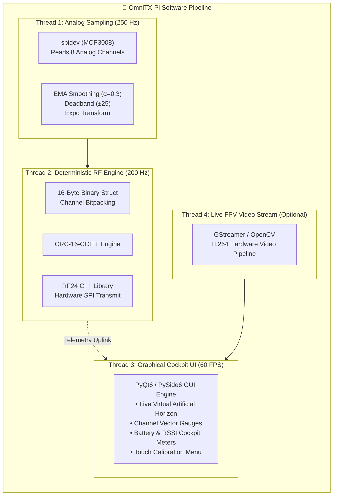

# 🍓 OmniTX-Pi: Raspberry Pi 4 Model B (4GB) Master Sender Architecture
### *Advanced Portable Ground Control Station & RC Transmitter with Pluggable Antenna Bay & ESP32 Companion Receiver Evaluation*

---

[-C51A4A?style=for-the-badge&logo=raspberry-pi&logoColor=white)](#-raspberry-pi-4-model-b-as-master-sender-device)
[](#-receiver-evaluation-the-eca-esp32-30-pin-board)
[](#-rf-subsystem--pluggable-antenna-interface)
[](#-software-os--gui-telemetry-stack)
[](#-step-by-step-construction-plan)

---

> [!IMPORTANT]
> **COMPANION HARDWARE DESIGN DOCUMENT**  
> This document specifies the complete engineering design for using the **Raspberry Pi 4 Model B (4GB RAM)** as the **Sender (Transmitter / Ground Station)** device. It works in conjunction with the high-level specification in [`README.md`](file:///c:/Users/Bahma/Documents/GitHub/arduino-projects/RC-Controller/README.md) and provides an in-depth evaluation of the **ECA ESP32 30-Pin development board** as the vehicle companion receiver and flight controller interface.

---

## 📑 Table of Contents
1. [🔍 Executive Evaluation: Is the ECA ESP32 Board Enough for Flight Control & Communication?](#receiver-evaluation)
   - [Part 1: Communication with Raspberry Pi 4 (Verdict: 100% YES)](#communication-evaluation)
   - [Part 2: Flight Control Capabilities (The Critical Distinction)](#flight-control-evaluation)
   - [Part 3: Recommended Architectural Solutions](#recommended-solutions)
2. [🍓 Raspberry Pi 4 Model B as Master Sender Device](#rpi4-master-sender)
   - [Why Raspberry Pi 4 (4GB) Transforms This Project](#why-rpi4)
   - [The Critical ADC Challenge & Hardware Solutions](#adc-solutions)
3. [🏗️ End-to-End System Architecture (RPi 4 TX ↔ ESP32 RX)](#end-to-end-architecture)
4. [🔌 Raspberry Pi 4 40-Pin GPIO Pinout & Interfacing Matrix](#rpi4-gpio-pinout)
5. [📡 RF Subsystem & Pluggable Antenna Interface](#rf-subsystem-pluggable-antenna)
6. [🖥️ Display Cockpit & Touchscreen Dashboard Options](#display-cockpit-options)
7. [⚡ Power Delivery, Battery & Thermal Management](#power-battery-management)
8. [💻 Software, OS & GUI Telemetry Stack](#software-gui-telemetry-stack)
9. [🛩️ ESP32 Receiver Firmware & Output Protocols (PWM / SBUS / CRSF)](#esp32-receiver-firmware)
10. [📦 Bill of Materials (BOM) for RPi 4 TX + ESP32 RX](#rpi4-bom)
11. [🗺️ Step-by-Step Construction Plan](#construction-plan)

---

<a id="receiver-evaluation"></a>
## 🔍 Receiver Evaluation: The ECA ESP32 30-Pin Board

You requested an engineering evaluation of the following board from ECA:
> **Product URL**: [برد توسعه ESP32 دارای Wifi و بلوتوث 30 پایه (ECA Shop)](https://eshop.eca.ir/%D9%85%D8%A7%DA%98%D9%88%D9%84-%D9%87%D8%A7%DB%8C-esp-%D9%88-%D8%A7%DB%8C%D9%86%D8%AA%D8%B1%D9%86%D8%AA-%D8%A7%D8%B4%DB%8C%D8%A7/7255-%D8%A8%D8%B1%D8%AF-%D8%AA%D9%88%D8%B3%D8%B9%D9%87-esp32-%D8%AF%D8%A7%D8%B1%D8%A7%DB%8C-wifi-%D9%88-%D8%A8%D9%84%D9%88%D8%AA%D9%88%D8%AB-30-%D9%BE%D8%A7%DB%8C%D9%87.html)  
> **Identified Hardware**: **ESP32 NodeMCU 30-Pin Development Board (ESP-WROOM-32 Module with CP2102 / CH9102 Serial USB)**, dual-core Xtensa LX6 @ 240 MHz, 520 KB SRAM, 4 MB SPI Flash, Wi-Fi 802.11 b/g/n, and Bluetooth v4.2 BR/EDR & BLE.

Here is the objective engineering breakdown answering both parts of your question:

---

<a id="communication-evaluation"></a>
### Part 1: Communication Between ESP32 and Raspberry Pi 4
> **Verdict: 🟢 YES, ABSOLUTELY 100% CAPABLE.**

The ESP32 is one of the most versatile companion communication processors available. It can communicate with the Raspberry Pi 4 via multiple robust methods:

```
  ┌────────────────────────────────────────────────────────────────────────┐
  │         COMMUNICATION LINK OPTIONS (RPi 4 SENDER ↔ ESP32 RECEIVER)     │
  ├──────────────────┬─────────────────┬──────────┬──────────────┬─────────┤
  │ Link Method      │ Physical Layer  │ Range    │ Refresh Rate │ Latency │
  ├──────────────────┼─────────────────┼──────────┼──────────────┼─────────┤
  │ 1. NRF24L01+PA   │ 2.4 GHz SPI     │ 1 - 2 km │ 100 - 200 Hz │ 3 - 6 ms│
  │ (Pluggable SMA)  │ (Chassis Port)  │          │              │         │
  ├──────────────────┼─────────────────┼──────────┼──────────────┼─────────┤
  │ 2. SX1280 (FLRC) │ 2.4 GHz SPI     │ 3 - 8 km │ 150 - 250 Hz │ 2 - 4 ms│
  │ (Pluggable SMA)  │ (Chassis Port)  │          │              │         │
  ├──────────────────┼─────────────────┼──────────┼──────────────┼─────────┤
  │ 3. Wi-Fi UDP /   │ 2.4 GHz 802.11n │ 150 -    │ 50 - 100 Hz  │ 8 - 15ms│
  │ Ad-Hoc Hotspot   │ (Native Radios) │ 300 m    │              │         │
  ├──────────────────┼─────────────────┼──────────┼──────────────┼─────────┤
  │ 4. ESP-NOW Link  │ 2.4 GHz MAC     │ 250 -    │ 100 - 200 Hz │ 3 - 5 ms│
  │ (Via RPi ESP Hat)│ Raw Packets     │ 450 m    │              │         │
  ├──────────────────┼─────────────────┼──────────┼──────────────┼─────────┤
  │ 5. Sub-GHz LoRa  │ 433/915 MHz SPI │ 15 -     │ 20 - 50 Hz   │ 25 -    │
  │ (SX1262 Module)  │ (Moxon Antenna) │ 30 km    │              │ 40 ms   │
  └──────────────────┴─────────────────┴──────────┴──────────────┴─────────┘
```

> [!TIP]
> **Recommended Communication Link for this Build**:  
> Wire an **NRF24L01+PA+LNA** (or **SX1280**) transceiver module to the Raspberry Pi 4's hardware SPI (`/dev/spidev0.0`) with a gold-plated SMA bulkhead antenna port on the transmitter chassis, and connect a matching module to the ESP32 receiver board on the vehicle. This gives you **instant microsecond hardware SPI framing, 1+ km range, sub-5ms latency, and full frequency hopping (FHSS)**.

---

<a id="flight-control-evaluation"></a>
### Part 2: Flight Control Capabilities (The Critical Distinction)
> **Verdict: ⚠️ IT DEPENDS ON YOUR VEHICLE TYPE! Read this distinction carefully:**

#### 🚗 Case A: For Ground Rovers, RC Cars, Robotic Arms, or RC Boats
- **Verdict: 🟢 YES, 100% SUFFICIENT ALONE!**
- The ESP32 30-pin board has plenty of PWM timers (`LEDC` peripheral) to directly control steering servos, ESC electronic speed controllers for brushless/brushed motors, lights, and pan-tilt gimbal servos. It requires no additional flight controller.

#### 🛩️ Case B: For Multi-Rotor Drones (Quadcopter / Hexacopter) & Aerobatic Planes
- **Verdict: 🔴 NO, NOT SUFFICIENT BY ITSELF WITHOUT AN IMU GYRO/ACCELEROMETER!**
- **Why?** The ECA 30-pin board is a **microcontroller development board only**; it **does NOT have an on-board Inertial Measurement Unit (IMU)** (no Gyroscope or Accelerometer chip like MPU6050, BMI270, or ICM-42688).
- A drone requires an IMU running high-speed PID loops (at 1 kHz to 8 kHz) to balance itself hundreds of times per second against gravity and wind. Without an IMU, the motors cannot balance the craft.

---

<a id="recommended-solutions"></a>
### Part 3: Recommended Architectural Solutions

Depending on your project roadmap, choose one of these two proven paths:

```
┌─────────────────────────────────────────────────────────────────────────────┐
│ PATH 1: THE PROFESSIONAL DUAL-TIER ARCHITECTURE (HIGHLY RECOMMENDED)        │
├─────────────────────────────────────────────────────────────────────────────┤
│                                                                             │
│ [Raspberry Pi 4B TX]  ====== 2.4GHz RF ======>  [ECA ESP32 Receiver (RX)]   │
│ (Master GCS / Sticks)                           (Decodes RF & Telemetry)    │
│                                                              │              │
│                                                              │ SBUS / CRSF  │
│                                                              │ 1-Wire Serial│
│                                                              ▼              │
│                                                 [Flight Controller Board]   │
│                                                 (SpeedyBee F405 / Pixhawk / │
│                                                  Betaflight / ArduPilot)    │
│                                                  (Has Gyro/Baro, runs PIDs) │
│                                                              │              │
│                                                              ▼              │
│                                                       [4x Motor ESCs]       │
└─────────────────────────────────────────────────────────────────────────────┘

┌─────────────────────────────────────────────────────────────────────────────┐
│ PATH 2: THE DIY SINGLE-BOARD ESP32 FLIGHT CONTROLLER (BUDGET / EXPERIMENTAL)│
├─────────────────────────────────────────────────────────────────────────────┤
│                                                                             │
│ [Raspberry Pi 4B TX]  ====== 2.4GHz RF ======>  [ECA ESP32 30-Pin Board]    │
│                                                 (Acts as RX + Flight Ctrl)  │
│                                                              │              │
│                                                    I2C Bus ──┼── PWM Rails  │
│                                                              │   (Motors)   │
│                                                              ▼              │
│                                                    [External IMU Sensor]    │
│                                                    (MPU6050 / BMI270 Board) │
│                                                    (Cost: ~$2.00)           │
└─────────────────────────────────────────────────────────────────────────────┘
```

> [!IMPORTANT]
> **Key Recommendation**:
> If building a **drone or FPV quadcopter**, use the ECA ESP32 as your **Intelligent Telemetry & Link Receiver**, and feed its output via **SBUS or CRSF** directly into a standard Flight Controller ($25–$35). This is the safest, most reliable setup used by professional pilots worldwide.
> If building a **rover, boat, or robot**, the ECA ESP32 board is **all you need**!

---

<a id="rpi4-master-sender"></a>
<a id="raspberry-pi-4-master-sender"></a>
## 🍓 Raspberry Pi 4 Model B as Master Sender Device

Using a **Raspberry Pi 4 Model B (4GB RAM)** as your handheld transmitter elevates this project from an ordinary remote control into an **Advanced Multi-Functional Ground Control Station (GCS)**.

<a id="why-rpi4"></a>
### Why Raspberry Pi 4 (4GB) Transforms This Project

1. **High-Definition Graphical Cockpit**:
   - Drive a **5-inch or 7-inch HDMI / DSI Touchscreen** displaying real-time vehicle attitude (artificial horizon), GPS maps, battery graphs, channel sliders, and flight mode toggles.
2. **Live FPV HD Video Stream Decoding**:
   - Because the RPi 4 features a hardware H.264/H.265 video decoder, you can stream live digital video from the vehicle camera onto the transmitter screen with ultra-low latency alongside your RC controls!
3. **Dual-Frequency Simultaneous Telemetry**:
   - Run high-speed RC control loops (100–200 Hz) while concurrently logging full MAVLink / Blackbox telemetry to the 32GB/64GB microSD card.
4. **Full Flight Simulator & Mission Planning**:
   - Run **QGroundControl**, **Mission Planner**, or custom Python Qt ground software directly on the transmitter itself without needing an external laptop.

---

<a id="adc-solutions"></a>
### The Critical ADC Challenge & Hardware Solutions

> [!WARNING]
> **THE RASPBERRY PI 4 HAS NO NATIVE ANALOG INPUTS (NO ADC)!**  
> Unlike Arduino or ESP32, all 40 GPIO pins on the Raspberry Pi 4 are strictly digital (0V or 3.3V). Analog gimbals and rotary potentiometers output variable continuous voltages ($0.0\text{V} - 3.3\text{V}$) that **cannot be read directly** by the RPi 4 GPIOs.

To solve this, we must interface an external **Analog-to-Digital Converter (ADC)** to the Raspberry Pi 4:

```
                      ANALOG INPUT INTEGRATION OPTIONS
┌─────────────────────────────────────────────────────────────────────────────┐
│ OPTION A: MCP3008 / MCP3208 (8-Channel SPI ADC) ── [RECOMMENDED FOR TX]     │
├─────────────────────────────────────────────────────────────────────────────┤
│ • 8 Single-Ended Analog Channels (4 Gimbal Axes + 2 Rotary Dials + 2 Spares)│
│ • Sampling Rate: Up to 100,000 samples/sec (Zero detectable latency!)      │
│ • Resolution: 10-bit (1024 counts, MCP3008) or 12-bit (4096 counts, MCP3208)│
│ • Bus: Hardware SPI (/dev/spidev0.1 on CE1)                                 │
└─────────────────────────────────────────────────────────────────────────────┘

┌─────────────────────────────────────────────────────────────────────────────┐
│ OPTION B: ADS1115 (4-Channel 16-Bit I2C ADC)                                │
├─────────────────────────────────────────────────────────────────────────────┤
│ • 4 High-Precision Channels (Covers Left & Right Gimbals)                   │
│ • Sampling Rate: Up to 860 samples/sec                                      │
│ • Resolution: 16-bit Ultra-High Precision                                   │
│ • Bus: Fast I2C (/dev/i2c-1, pins 3 & 5)                                    │
└─────────────────────────────────────────────────────────────────────────────┘

┌─────────────────────────────────────────────────────────────────────────────┐
│ OPTION C: Companion USB / UART MCU (RP2040 / Arduino Pro Micro)             │
├─────────────────────────────────────────────────────────────────────────────┤
│ • An inexpensive microcontroller reads all analog pots and switches,        │
│   and sends packed binary frames over USB CDC / Serial UART to RPi 4.       │
└─────────────────────────────────────────────────────────────────────────────┘
```

> [!TIP]
> **Design Decision**: In this blueprint, we use the **MCP3008 (or MCP3208) 8-channel SPI ADC** because its SPI bus achieves microsecond read speeds without putting any load on the Linux OS.

---

<a id="end-to-end-architecture"></a>
## 🏗️ End-to-End System Architecture (RPi 4 TX ↔ ESP32 RX)

The following diagram details the complete system topology:

```mermaid
flowchart TB
    subgraph RPI4_TX ["🍓 OmniTX-Pi Handheld Ground Controller (Master TX)"]
        subgraph PHYSICAL_INPUTS ["🕹️ Physical Ergonomics & Controls"]
            GIM_L["Left Gimbal (Throttle / Yaw)"]
            GIM_R["Right Gimbal (Pitch / Roll)"]
            POT_AUX["2x Rotary Dials (AUX 1 / 2)"]
            SW_TOGGLE["4x Toggle Switches (Arm, Flight Modes)"]
        end

        subgraph ADC_SUBSYSTEM ["⚡ Analog Input Front-End"]
            MCP["MCP3008 / MCP3208 (8-Ch SPI ADC)\nSampling @ 500 Hz per channel"]
        end

        subgraph RPI4_CORE ["🧠 Raspberry Pi 4 Model B (4GB RAM)"]
            direction TB
            LINUX_KERNEL["Linux OS (PREEMPT_RT Real-Time Core)"]
            INPUT_THREAD["Input Processing Thread (C++ / Python)\n• Deadband (±2%)\n• Expo Curve (25%)\n• Normalization 1000-2000µs"]
            GUI_ENGINE["Telemetry Cockpit GUI (Qt6 / PySide6)\n60 FPS Graphical Display"]
            RF_THREAD["Deterministic RF Loop Thread (200 Hz)\nBinary Packet + CRC16 CCITT"]
        end

        subgraph TX_DISP ["🖥️ Graphical Display & HMI"]
            SCREEN["5.0\" DSI / HDMI Capacitive Touchscreen\n(800x480 resolution, Live HUD & Telemetry)"]
            BUZZ_HAPTIC["Active Piezo Buzzer & Vibration Motor\n(Triggered via GPIO 12 & 13)"]
        end

        subgraph TX_RF_BAY ["📡 Modular Pluggable RF Subsystem"]
            NRF_TX["NRF24L01+PA+LNA (+20dBm / 100mW) / SX1280"]
            SMA_BULK["Panel-Mounted SMA Female Bulkhead (50Ω)"]
            ANT_BAY["Interchangeable Mission Antenna\n(Rubber Duck / Patch / Moxon)"]
        end

        subgraph TX_POWER ["⚡ Power Management"]
            BATT_PACK["2S / 3S Li-Ion Pack (7.4V - 11.1V)"]
            BUCK_5V["High-Efficiency 5V 5A Buck Converter (XL4015)"]
            LDO_RF["Dedicated Low-Noise 3.3V LDO for RF Module"]
        end

        PHYSICAL_INPUTS --> MCP & SW_TOGGLE
        MCP -- "SPI0 (CE1)" --> RPI4_CORE
        SW_TOGGLE -- "Direct GPIOs" --> RPI4_CORE
        RPI4_CORE -- "DSI / HDMI" --> SCREEN
        RPI4_CORE -- "GPIO" --> BUZZ_HAPTIC
        RPI4_CORE -- "SPI0 (CE0)" --> NRF_TX --> SMA_BULK --> ANT_BAY
        BATT_PACK --> BUCK_5V --> RPI4_CORE
        BATT_PACK --> LDO_RF --> NRF_TX
    end

    subgraph WIRELESS_AIR ["🌊 2.4 GHz Air Interface (50 - 200 Hz)"]
        DOWNLINK["⬇️ RC Control Commands (Latency: 3 - 6 ms)"]
        UPLINK["⬆️ Vehicle Telemetry (Battery, RSSI, GPS, Status)"]
    end

    ANT_BAY <==> DOWNLINK & UPLINK

    subgraph ESP32_VEHICLE ["🛩️ Vehicle Unit (ESP32 Receiver & Actuators)"]
        RX_ANT["Receiver Antenna (SMA / Dipole)"]
        NRF_RX["NRF24L01+PA+LNA / SX1280 RX"]
        ECA_ESP32["ECA 30-Pin ESP32 Development Board\n(Xtensa Dual-Core 240 MHz)"]
        
        subgraph FLIGHT_ACTUATION ["🔌 Output Protocols & Flight System"]
            SBUS_OUT["SBUS Serial Stream (100k 8E2)\nTo Flight Controller (Betaflight/Pixhawk)"]
            PWM_OUT["Direct PWM Channels (1..8)\nTo Servos & Motor ESCs (Rovers/Planes)"]
            VOLT_DIV["Resistor Divider Battery Sense (0-25V)"]
        end

        RX_ANT <==> NRF_RX
        NRF_RX -- "Hardware SPI (VSPI)" --> ECA_ESP32
        ECA_ESP32 --> SBUS_OUT & PWM_OUT
        VOLT_DIV --> ECA_ESP32
    end

    DOWNLINK & UPLINK <==> RX_ANT
```

---

<a id="rpi4-gpio-pinout"></a>
## 🔌 Raspberry Pi 4 40-Pin GPIO Pinout & Interfacing Matrix

The table below provides the **complete, conflict-free pin allocation** for the Raspberry Pi 4 40-pin header:

```
               ┌──────────────────────────────┐
               │    RASPBERRY PI 4B 40-PIN    │
               ├──────────────┬───────────────┤
         +3.3V │ [1]      [2] │ +5.0V Power In│
 (I2C1 SDA)G2  │ [3]      [4] │ +5.0V Power In│
 (I2C1 SCL)G3  │ [5]      [6] │ GND Ground    │
 (Sw Arm)  G4  │ [7]      [8] │ G14 (UART TX) │
           GND │ [9]      [10]│ G15 (UART RX) │
(Sw Mode1) G17 │ [11]     [12]│ G18 (PWM Hapt)│
(Sw Mode2) G27 │ [13]     [14]│ GND Ground    │
(Sw Rates) G22 │ [15]     [16]│ G23 (RF CE)   │
         +3.3V │ [17]     [18]│ G24 (RF IRQ)  │
 (SPI MOSI)G10 │ [19]     [20]│ GND Ground    │
 (SPI MISO)G9  │ [21]     [22]│ G25 (Sw Aux)  │
 (SPI SCLK)G11 │ [23]     [24]│ G8  (SPI CE0) │ -> RF Module CSN
           GND │ [25]     [26]│ G7  (SPI CE1) │ -> MCP3008 ADC CS
 (I2C0 ID_SD)  │ [27]     [28]│ ID_SC (Reserved
 (Buzzer)  G5  │ [29]     [30]│ GND Ground    │
           G6  │ [31]     [32]│ G12 (PWM Buzz)│
 (Fan Ctrl)G13 │ [33]     [34]│ GND Ground    │
 (Shutdown)G19 │ [35]     [36]│ G16           │
           G26 │ [37]     [38]│ G20           │
           GND │ [39]     [40]│ G21           │
               └──────────────┴───────────────┘
```

### Detailed Functional Pin Assignment Table:

| Subsystem | Signal Function | RPi 4 Physical Pin | BCM GPIO | Interface Type | Description |
| :--- | :--- | :--- | :--- | :--- | :--- |
| **Power In** | System 5V Supply | Pins 2, 4 | `5V Rail` | Power Input | Direct power from high-amp buck regulator |
| **Ground** | System Common Ground | Pins 6, 9, 14, 20, 25, 30, 34, 39 | `GND` | Ground | Solid star-ground reference |
| **RF Transceiver** | SPI Master Out | Pin 19 | `GPIO 10` | SPI0 MOSI | Transmits data to NRF24 / SX1280 |
| **RF Transceiver** | SPI Master In | Pin 21 | `GPIO 9` | SPI0 MISO | Receives telemetry ACK from RF module |
| **RF Transceiver** | SPI Clock | Pin 23 | `GPIO 11` | SPI0 SCLK | Hardware SPI clock line (10 MHz) |
| **RF Transceiver** | Chip Select (CSN) | Pin 24 | `GPIO 8` | SPI0 CE0 | Dedicated active-low CS for RF module |
| **RF Transceiver** | Chip Enable (CE) | Pin 16 | `GPIO 23` | Digital Out | Activates TX/RX RF state |
| **RF Transceiver** | Packet Interrupt | Pin 18 | `GPIO 24` | Digital In (IRQ)| Signals incoming telemetry packet |
| **ADC (MCP3008)** | Chip Select (CS) | Pin 26 | `GPIO 7` | SPI0 CE1 | Dedicated active-low CS for Analog ADC |
| **ADC (MCP3008)** | Data Lines | Pins 19, 21, 23 | `MOSI, MISO, SCLK`| Shared SPI0 | Shared hardware SPI bus lines |
| **Arming Switch** | Safety Arm Toggle | Pin 7 | `GPIO 4` | Digital In (Pullup)| 2-Position toggle switch (SAFE / ARMED) |
| **Flight Mode SW** | Mode Switch (3-pos) | Pins 11, 13 | `GPIO 17, 27` | Digital In (Pullup)| 3-Position toggle (Acro / Angle / RTH) |
| **Dual Rates SW** | Rates Switch (2-pos)| Pin 15 | `GPIO 22` | Digital In (Pullup)| High / Low steering sensitivity |
| **Buzzer** | Acoustic Warning | Pin 32 | `GPIO 12` | Hardware PWM | 2.7 kHz resonant tones & alerts |
| **Haptic Motor** | Tactile Feedback | Pin 33 | `GPIO 13` | PWM / Digital | Vibration motor driven via 2N2222 / MOSFET |
| **Cooling Fan** | 5V Fan Governor | Pin 29 | `GPIO 5` | Transistor Out | Dynamic thermal fan speed control |
| **Power Button** | Safe Shutdown Button| Pin 35 | `GPIO 19` | Digital In (Pullup)| Triggers clean Linux OS shutdown |

---

<a id="rf-subsystem-pluggable-antenna"></a>
## 📡 RF Subsystem & Pluggable Antenna Interface

The Raspberry Pi 4 transmitter incorporates a **chassis-mounted 50Ω SMA Female bulkhead port** connected to the high-power RF transceiver via a low-loss RG178 / RG316 pigtail.

```
                  RASPBERRY PI 4 SENDER CHASSIS TOP
    ┌─────────────────────────────────────────────────────────────┐
    │                                                             │
    │                   [50Ω SMA Female Bulkhead]                 │
    │                              ║                              │
    │                [Low-Loss RG316 Coaxial Pigtail]             │
    │                              ║                              │
    │                   [IPX / U.FL Gold MHF Connector]           │
    │                              ║                              │
    │            ┌─────────────────╨──────────────────┐           │
    │            │  NRF24L01+PA+LNA / SX1280 Module   │           │
    │            │  Power Output: +20 dBm (100 mW)    │           │
    │            │  Dedicated Shield Ground Can       │           │
    │            └─────────────────┬──────────────────┘           │
    │                              │ SPI + CE + CSN               │
    │                              ▼                              │
    │            [Raspberry Pi 4 40-Pin Header (/dev/spidev0.0)]  │
    └─────────────────────────────────────────────────────────────┘
```

### Pluggable Antenna Interchangeability on RPi 4:
1. **Field Operations (Omni)**: Screw on a **2.4 GHz 3 dBi Rubber Duck** for $360^\circ$ continuous coverage up to 800 m – 1.2 km.
2. **Long-Distance / FPV (Directional)**: Screw on a **2.4 GHz 9 dBi Flat Patch Antenna** pointed at the aircraft for stable 2 km – 3 km links.
3. **Extreme Penetration (Sub-GHz LoRa)**: Swap to an **SX1262 915 MHz module** and a **Moxon antenna** for 15 km+ long-range telemetry.

---

<a id="display-cockpit-options"></a>
## 🖥️ Display Cockpit & Touchscreen Dashboard Options

Because you have the computing power of a Raspberry Pi 4, you can choose from modern high-resolution displays:

| Display Model | Size & Resolution | Interface | Touch | Advantages |
| :--- | :--- | :--- | :--- | :--- |
| **5.0" DSI Capacitive Touchscreen** | 800 × 480 IPS | DSI Ribbon Cable | Capacitive 5-point | **Top Recommendation**: Uses zero GPIO pins, leaves entire 40-pin header free, low power, instant plug-and-play. |
| **7.0" Official Raspberry Pi Display** | 800 × 480 IPS | DSI Ribbon Cable | Capacitive 10-point | Ideal for larger ground control station console with full satellite maps. |
| **3.5" HDMI Touchscreen** | 480 × 320 LCD | HDMI + GPIO | Resistive | Compact handheld form factor, very budget-friendly. |
| **Dual Display Setup (Pro Build)** | 5.0" DSI + 0.96" OLED | DSI + I2C (`/dev/i2c-1`) | Capacitive | Main screen displays live video & map; mini OLED displays essential channel meters. |

---

<a id="power-battery-management"></a>
## ⚡ Power Delivery, Battery & Thermal Management

The Raspberry Pi 4 Model B is a high-performance computer that requires a stable power rail and proper heat dissipation.

```
       ┌───────────────────────────────┐
       │ 2S or 3S Li-Ion Battery Pack  │ (7.4V - 11.1V, 3000 - 5000 mAh)
       │ (e.g. 2x or 3x 18650 Cells)   │
       └───────────────┬───────────────┘
                       │
             [10A Heavy-Duty Power Switch]
                       │
       ┌───────────────┴────────────────────────┐
       │                                        │
       ▼                                        ▼
┌──────────────────────────────┐ ┌──────────────────────────────┐
│ Synchronous Step-Down Buck   │ │ Dedicated Ultra-Low Noise    │
│ Converter (XL4015 / MP1584)  │ │ 3.3V LDO for RF Module       │
│ Output: 5.1V @ 3.5A Clean    │ │ (RT9193-33 with Tantalum cap)│
└──────────────┬───────────────┘ └──────────────┬───────────────┘
               │                                │
               ▼                                ▼
┌──────────────────────────────┐ ┌──────────────────────────────┐
│ Powers Raspberry Pi 4 System │ │ Exclusively powers the       │
│ (Via GPIO Pins 2 & 4, 5V in) │ │ NRF24L01+PA+LNA Transceiver  │
└──────────────────────────────┘ └──────────────────────────────┘
```

### Thermal Architecture:
- The Broadcom BCM2711 quad-core processor runs warm when rendering graphical GUIs.
- **Cooling Solution**: Install an **Armor Aluminum Heatsink Case with dual 5V quiet micro-fans** connected to `GPIO 5` (controlled dynamically via software when CPU temp passes $55^\circ\text{C}$).

---

<a id="software-gui-telemetry-stack"></a>
## 💻 Software, OS & GUI Telemetry Stack

### Operating System:
- **Base OS**: **Raspberry Pi OS Lite (64-bit Debian Bookworm)** for minimal boot time (<12 seconds) and zero bloatware.
- **Kernel Tuning**: Configure Linux CPU governor to `performance` and enable real-time process priority (`chrt -f 99`) for the radio loop.

### Modular Software Architecture:



---

<a id="esp32-receiver-firmware"></a>
## 🛩️ ESP32 Receiver Firmware & Output Protocols (PWM / SBUS / CRSF)

The **ECA 30-pin ESP32 receiver board** runs lightweight, high-speed C++ firmware:

```
                      ESP32 RECEIVER PIN CONNECTIONS
┌─────────────────────────┬──────────────┬───────────────────────────────┐
│ Subsystem               │ ESP32 Pin    │ Destination / Target          │
├─────────────────────────┼──────────────┼───────────────────────────────┤
│ RF Transceiver (VSPI)   │ GPIO 18 (SCK)│ NRF24 / SX1280 Clock          │
│                         │ GPIO 19(MISO)│ NRF24 / SX1280 Data Out       │
│                         │ GPIO 23(MOSI)│ NRF24 / SX1280 Data In        │
│                         │ GPIO 5 (CSN) │ Active-Low Chip Select        │
│                         │ GPIO 4 (CE)  │ Chip Enable                   │
│                         │ GPIO 2 (IRQ) │ Packet Received Interrupt     │
├─────────────────────────┼──────────────┼───────────────────────────────┤
│ Flight Controller Link  │ GPIO 17 (TX2)│ Inverted SBUS Serial Out      │
│                         │              │ (Connects to FC RX pad)       │
├─────────────────────────┼──────────────┼───────────────────────────────┤
│ Direct Servo Rail (PWM) │ GPIO 12 - 15 │ Direct Servos (Channels 1-4)  │
│                         │ GPIO 25 - 27 │ Direct Servos (Channels 5-7)  │
├─────────────────────────┼──────────────┼───────────────────────────────┤
│ Vehicle Battery Sense   │ GPIO 34 (ADC)│ 100kΩ / 10kΩ Voltage Divider  │
└─────────────────────────┴──────────────┴───────────────────────────────┘
```

---

<a id="rpi4-bom"></a>
## 📦 Bill of Materials (BOM) for RPi 4 TX + ESP32 RX

### 1. Sender Device (OmniTX-Pi Handheld Unit)

| Component | Recommended Model | Qty | Purpose | Est. Cost (USD) |
| :--- | :--- | :--- | :--- | :--- |
| **SBC Processor** | Raspberry Pi 4 Model B (4GB RAM) | 1 | Master Transmitter & Graphical GCS | Already have / $55 |
| **Analog ADC** | MCP3008 (or MCP3208) 8-Channel SPI ADC | 1 | Reads analog gimbals & potentiometer dials | $2.50 |
| **RF Transceiver** | NRF24L01+PA+LNA (with IPX connector) | 1 | 2.4 GHz +20 dBm high-power radio | $2.80 |
| **Chassis RF Port** | IPX/U.FL to SMA Female Bulkhead (RG316 50Ω)| 1 | Pluggable antenna chassis mount | $1.20 |
| **Mission Antenna** | 2.4 GHz 3 dBi Rubber Duck Omni (SMA-M) | 1 | Standard 360° field flight antenna | $1.50 |
| **Patch Antenna** | 2.4 GHz 9 dBi Directional Panel Patch (SMA-M)| 1 | High-gain long-distance flights | $4.00 |
| **Touch Display** | 5.0" DSI Capacitive IPS Touchscreen (800x480)| 1 | Zero-GPIO graphical cockpit & menus | $28.00 |
| **Gimbals** | FrSky M9 Hall Effect or Dual Arduino Gimbals | 2 | Precision 4-axis control sticks | $12.00 - $35.00 |
| **Switches & Knobs**| 2-Pos & 3-Pos Mini Toggles + 10k Pot Dials | 4+2 | Arming, flight modes, and gimbal tilt | $3.50 |
| **Power Converter** | XL4015 / MP1584 5V 5A DC-DC Buck Step-Down | 1 | Clean 5.1V power to Raspberry Pi 4 | $2.50 |
| **Battery Pack** | 2S or 3S 18650 Li-Ion (3000mAh) + Holder | 1 | 3–4 hours portable operating runtime | $9.00 |
| **Heatsink / Fans**| Armor Aluminum Heatsink Case with Dual Fans | 1 | Thermal protection for Pi 4 CPU | $6.00 |

### 2. Vehicle Receiver Unit

| Component | Recommended Model | Qty | Purpose | Est. Cost (USD) |
| :--- | :--- | :--- | :--- | :--- |
| **Receiver Board** | **ECA ESP32 30-Pin Development Board** | 1 | Receives packets, outputs SBUS/PWM | ~$4.00 |
| **Receiver RF** | NRF24L01+PA+LNA with SMA Antenna | 1 | Matched companion transceiver | $2.80 |
| **RF Power Decouple**| 10µF Tantalum + 100nF Ceramic Capacitors | 2 | Voltage ripple suppression on 3.3V rail | $0.20 |
| **Total Build Estimate** | | | | **~$70 - $95 (excl. RPi4)**|

---

<a id="construction-plan"></a>
## 🗺️ Step-by-Step Construction Plan

Follow this structured roadmap to build the system:

- [ ] **Step 1: Bench Prototyping the Analog Front-End**
  - [ ] Connect the **MCP3008 SPI ADC** to the Raspberry Pi 4 (`GPIO 7 / CE1`).
  - [ ] Wire the two gimbals to MCP3008 channels `CH0` to `CH3`.
  - [ ] Run a Python test script using `spidev` to verify smooth stick readings from 0 to 1023.
- [ ] **Step 2: RF Communication Test (RPi 4 ↔ ECA ESP32)**
  - [ ] Wire the NRF24L01 module to RPi 4 hardware SPI (`GPIO 8 / CE0`).
  - [ ] Wire the matching NRF24L01 to the ECA ESP32 board (`VSPI`).
  - [ ] Transmit test packets at 100 Hz and confirm 0% packet loss and sub-5ms round-trip latency.
- [ ] **Step 3: Vehicle Actuation & Failsafe Validation**
  - [ ] Flash the ESP32 to generate **SBUS output** (or PWM servo pulses).
  - [ ] Connect a servo or flight controller to verify real-time deflection.
  - [ ] Disconnect transmitter antenna/power and verify the ESP32 enters **FAILSAFE** within 150 ms (zero throttle).
- [ ] **Step 4: Cockpit Graphical Dashboard**
  - [ ] Mount the 5.0" DSI touchscreen to the Raspberry Pi 4.
  - [ ] Launch the Python Qt6 / PySide6 telemetry dashboard in full-screen kiosk mode.
  - [ ] Test touchscreen model selection and channel calibration wizards.
- [ ] **Step 5: Handheld Enclosure Assembly**
  - [ ] Mount the RPi 4, DSI screen, gimbals, toggle switches, and SMA bulkhead inside an ergonomic handheld case.
  - [ ] Perform ground range tests with both the Rubber Duck and Directional Patch antennas.

---

<p align="center">
  <b>OmniTX-Pi Architecture Guide</b> • Next-Gen Ground Control & RC System.
  <br>
  <i>Keep this document updated as wiring and software implementations advance!</i>
</p>
